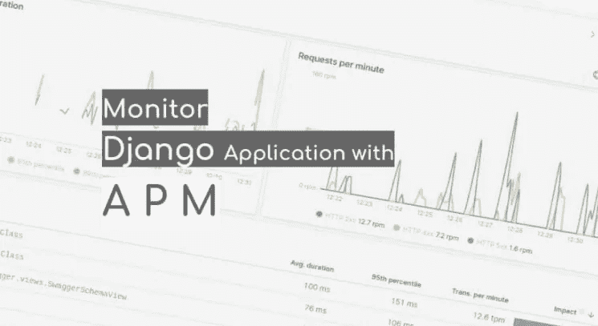
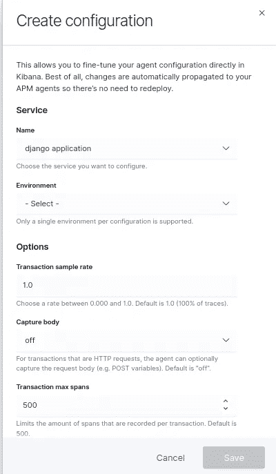
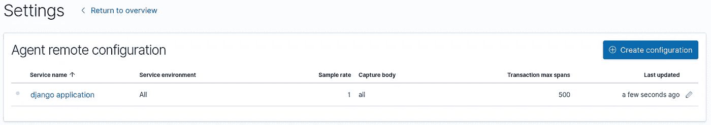
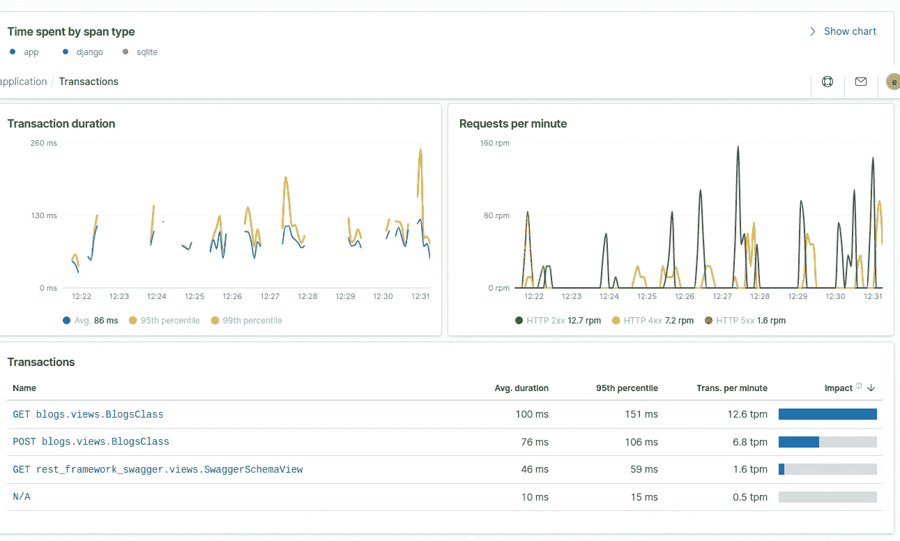
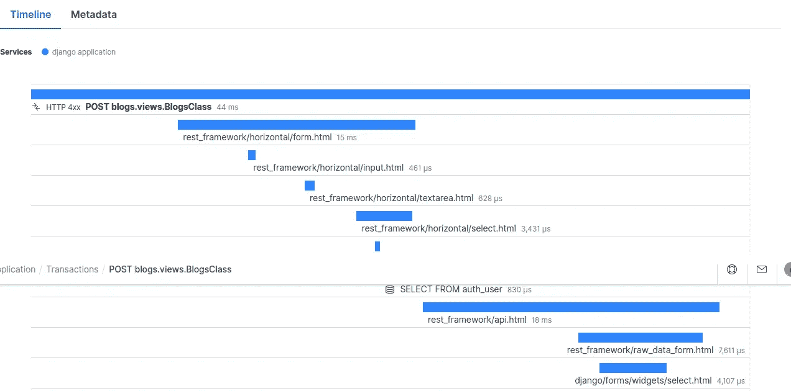

# 使用弹性 APM 的监控应用

> 原文：<https://levelup.gitconnected.com/monitoring-application-using-elastic-apm-7e2d8548b983>

在之前的博客“用弹性 APM 配置 Django 应用程序”中，我已经介绍了如何用 Django 博客应用程序配置 APM 代理。现在，在 Django 应用程序中完成配置更改后，我们应该转到 Kibana 接口，看看如何完成 APM 接口配置，以查看应用程序指标。要在 Kibana 中设置 APM 接口，我们需要执行以下操作:

1)打开 Kibana URL，并在左侧菜单中单击“APM”链接。这将打开 APM 默认页面。

2)现在单击页面左上方的“设置”链接。这将打开“代理远程配置”页面，并显示一条消息“未找到配置”，因为我们是第一次配置它。

3)单击“创建配置”按钮，这将打开“创建配置”弹出窗口，我们可以在其中选择应用程序的名称、环境和其他设置。请参考下面的截图:

4)保存配置后，我们可以看到带有应用程序名称的列表页面。这个应用程序名称与我们在 Django 设置中的 APM 代理配置中给出的名称相同。请参考下面的截图:

> *如果想知道如何用 Django 应用程序配置 APM 代理，请参考之前的博客:“* [*用弹性 APM 配置 Django 应用程序*](https://bqstack.com/b/detail/108/Configuring-Django-application-with-Elastic-APM)*”*

5)现在我们需要再次进入 Kibana 的 APM 页面，点击“设置说明”链接。

6)在此页面中，我们需要转到 APM 代理部分，并单击“检查代理状态”按钮，以查看代理是否正常工作并发送数据。如果我们没有得到数据，那么我们需要再次检查是否一切都配置正确。

7)现在点击“加载 Kibana 对象”按钮，创建 APM 索引模式。

8)之后，单击“启动 APM”按钮打开 APM 页面。这将打开带有 APM 应用程序名称的页面。

9)单击 APM 应用程序名称，这将打开一个显示不同指标的仪表板，如“按 span 类型划分的时间”、“事务持续时间”、“每分钟请求数”和“事务数”等。请参考以下屏幕:

10)在事务下，我们可以看到不同类型的事务，如获取、发布和 N/A 等。我们可以单击任何交易链接来获得进一步的深入细节。因此，在这里，我将单击“POST blogs.views.BlogsClass”链接来查看交易详细信息。

11)同样，我们可以看到一些指标，如“事务持续时间”、“每分钟请求数”、“事务持续时间分布”和“跟踪样本”。

12)跟踪样本在这里非常重要，因为它提供了关于应用程序的一些重要信息。它有一个时间轴和元数据。

13)在时间线下，我们可以获得关于如何完成请求的详细信息。它显示了各种活动完成请求所花费的时间。请参考下面的截图:

14)在元数据下，我们可以获得各种详细信息，如事务 id、HTTP 详细信息、主机详细信息、服务详细信息、进程详细信息、代理详细信息、URL 详细信息和用户代理详细信息等。

通过这种方式，我们可以使用 APM 获取应用程序的重要信息。

[如何创建 Elasticsearch 集群
Elastic Search 中的桶聚合](https://bqstack.com/b/detail/90/Bucket-Aggregation-in-Elasticsearch)
[Elastic Search 中的度量聚合](https://bqstack.com/b/detail/89/Metrics-Aggregation-in-Elasticsearch)
[配置 Logstash 将 MySQL 数据推入 Elastic Search](https://bqstack.com/b/detail/76/Configure-Logstash-to-push-MySQL-data-into-Elasticsearch)
[Elastic Search 中的通配符和布尔搜索](https://bqstack.com/b/detail/87/Wildcard-and-Boolean-Search-in-Elasticsearch)
[Elastic Search Rest API](https://bqstack.com/b/detail/83/Elasticsearch-Rest-API)
[Elastic Search 中数据搜索的基础知识](https://bqstack.com/b/detail/84/Basics-of-Data-Search-in-Elasticsearch)
[Elastic Search Rest API](https://bqstack.com/b/detail/83/Elasticsearch-Rest-API)  

**Learning Kibana 7** 本书被评为最佳新弹性搜索书籍

我很高兴地宣布，我的书《学习 Kibana 7:用 Kibana 的数据可视化功能构建强大的弹性仪表板，第二版》获得了 https://bookauthority.org/books/new-elasticsearch-books?[book authority 的最佳新弹性搜索书籍](https://bookauthority.org/books/new-elasticsearch-books?t=11vp86&s=award&book=1838550364) :
[t = 11vp 86&s = award&book = 1838550364](https://bookauthority.org/books/new-elasticsearch-books?t=11vp86&s=award&book=1838550364)
book authority 收集并排名世界上最好的书籍，能得到这种认可是莫大的荣幸。谢谢大家的支持！这本书在亚马逊上[有售。](https://www.amazon.com/dp/1838550364?tag=uuid10-20)

如有任何疑问，请留下您的意见。你也可以在推特上关注我:[https://twitter.com/anubioinfo](https://twitter.com/anubioinfo)

*如果你觉得这篇文章很有趣，那么你可以探索一下“* [*掌握基巴纳 6.0*](https://www.amazon.com/Mastering-Kibana-6-x-Visualize-histograms/dp/1788831039/ref=olp_product_details?_encoding=UTF8&me=) *”、“* [*基巴纳 7 快速入门指南*](https://www.amazon.com/Kibana-Quick-Start-Guide-Elasticsearch/dp/1789804035) *”、“* [*学习基巴纳 7*](https://www.amazon.com/Learning-Kibana-dashboards-visualization-capabilities-ebook/dp/B07V4SQR6T) *”、* [*Elasticsearch 7 快速入门指南*](https://www.amazon.com/gp/product/1789803322?pf_rd_p=2d1ab404-3b11-4c97-b3db-48081e145e35)

**最初发表于*[*https://bqstack.com*](https://bqstack.com/b/detail/109/Monitoring-Application-using-Elastic-APM)T43。*