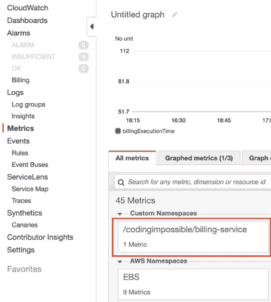
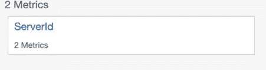
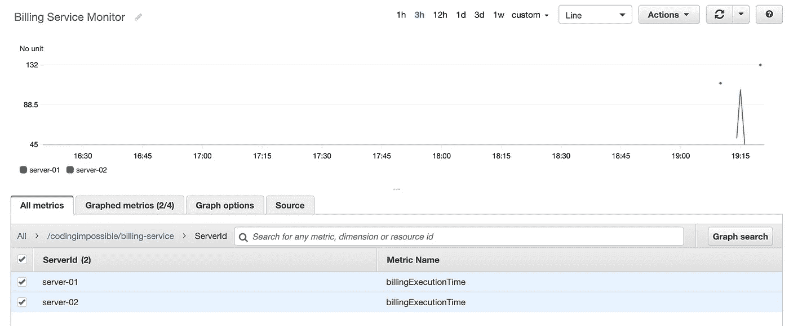

# 监控自定义 Spring Boot 应用程序日志

> 原文：<https://levelup.gitconnected.com/monitoring-custom-spring-boot-application-logs-7cb54a27b323>

## 使用 AWS 云观察

卢克·切瑟在 [Unsplash](https://unsplash.com?utm_source=medium&utm_medium=referral) 上的照片

当您的应用程序准备在生产中推出时，监视与之相关的每一项活动都会对其性能产生重大影响。您可能需要分析服务器的 CPU 利用率、网络带宽、它同时服务的连接数等等。

AWS 提供了一个名为 CloudWatch 的监控服务，它使您能够监控应用程序所在的服务器的不同指标，并存储这些指标以供以后分析。但是，您的应用程序可能会生成与不同业务事件相关的定制内部日志:它们是否按预期执行，每个业务事件运行了多长时间，等等。您希望通过将每个日志推送到同一个监视器来集中日志监视过程，并聚合数据以供进一步分析。

为了演示 CloudWatch 的这一功能，我将利用 AWS Java SDK 来构建一个简单的 Spring Boot 应用程序，该应用程序将测量执行一个操作所需的时间，并将这些度量发布到 CloudWatch。请注意，这些指标将作为时间序列提供给 CloudWatch，供您进一步分析。当您正在设计一个微服务解决方案，并且您想要测量一个涉及到多个对其他服务的调用的业务事件所花费的时间时，这个用例可能是有用的。

值得注意的是，默认情况下，我们有权通过 AWS CLI 或 API 发布指标。为了演示这一点，我创建了一个自定义策略，该策略将明确拒绝向 CloudWatch 发布指标的权限，如下所示，如果我将该策略分配给 IAM 用户，我将无法通过 CLI 或 SDK 发布自定义指标数据。

我最初创建了一个具有 EC2 权限的 IAM 用户(因为我也从 EC2 实例中收集指标，但不会在本文中展示)。我还创建了一个简单的 Spring Boot 应用程序，具有 AWS CloudWatch 依赖项，并将使用 [AOP](https://docs.spring.io/spring/docs/2.5.x/reference/aop.html) 原则将日志记录行为添加到现有代码中。演示服务和指标日志功能的完整源代码可在[这个](https://github.com/njofce/cloudwatch-logs)链接中获得。

上面提到的额外行为将测量执行一个业务功能所需的时间，在我们的例子中，是一个计费功能的模拟，并将该度量发布到 CloudWatch。

CloudWatch 指标按名称空间分组，所有 AWS 服务都在名称空间`/aws`下发布它们的指标(例如，EC2 实例在名称空间`/aws/ec2`下发布指标)，因此我们不能将该名称空间用于我们的定制日志。相反，我们将使用一个自定义的账单服务:`/APP_NAME/billing-service`。注意，在这个场景中，我们可以拥有一个包含多个服务的应用程序，并将每个服务生成的所有指标分组到同一个名称空间下——应用程序的名称，`APP_NAME`。

下面截取的代码显示了自定义指标的日志记录过程。我将尝试详细解释代码的每个部分。

`PutMetricData`请求是在前面解释的名称空间下发出的。该请求需要`MetricDatum`对象，它将包含度量数据——它的名称和值。现在，对于每个指标数据对象，我们需要提供一个或多个`Dimension`，其中也包含键值数据，以进一步对指标进行分类。这可能是运行服务的`Server Id`(因为我们讨论的是微服务架构，所以该服务可以水平扩展到多个服务器以实现高可用性)。

下面的代码显示了一个简单的测试，该测试使用随机数据调用 log 方法。

在 CloudWatch UI 上，如下面的图片所示，在左侧的`Metrics`菜单下，我们可以注意到一个只有一个指标的自定义名称空间，它将是`ServerId`，并将包含每个服务器记录的数据。

正如我前面提到的，具有不同 id 的多个服务器可以将 metric 发布到同一个名称空间。下图显示了一个 CloudWatch 仪表板，该仪表板监视两个计费服务实例。

感谢您阅读本文，希望您觉得有用。

保重

资源

[云观察](https://docs.aws.amazon.com/AmazonCloudWatch/latest/monitoring/WhatIsCloudWatch.html) — AWS

[CloudWatch Java SDK](https://docs.aws.amazon.com/sdk-for-java/v1/developer-guide/examples-cloudwatch.html) — AWS

[CloudWatch 定制指标](https://docs.aws.amazon.com/AmazonCloudWatch/latest/monitoring/publishingMetrics.html) — AWS