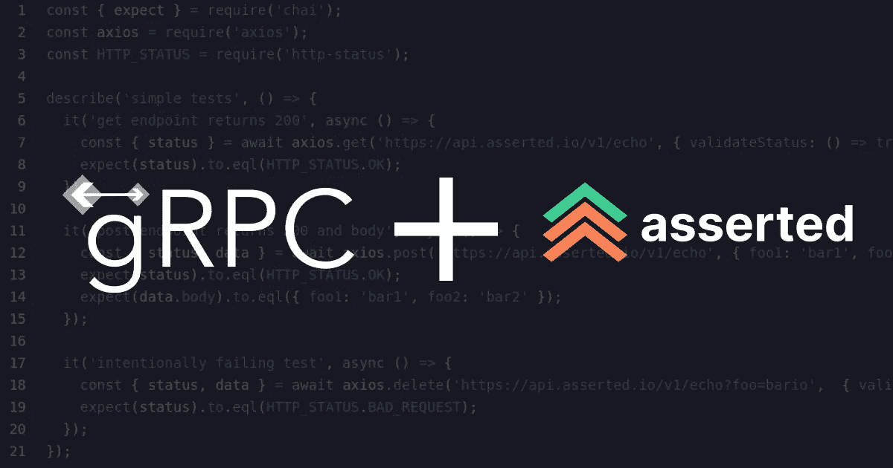

# 监控 gRPC 正常运行时间

> 原文：<https://levelup.gitconnected.com/monitoring-grpc-uptime-89f6d49e3c34>

gRPC 的正常运行时间监控不能用传统的 HTTP 检查来完成。随着[断言](https://asserted.io)，您可以使用 gRPC 客户端和 Mocha 编写复杂的外部健康检查。

> *上的例子* [上的 *GitHub* 上的](https://github.com/assertedio/grpc-uptime)

gRPC 是一个开源的高性能 RPC 框架，它使用协议缓冲区在服务器和客户端之间高效地序列化数十种语言的结构化数据。

专用的交换格式使它具有很高的性能，这也意味着 gRPC 服务器通常需要专用的客户机来进行通信，因为常规的 HTTP 库无法工作。因此，Asserted 非常适合提供外部监控 gRPC 正常运行时间和稳定性所需的定制环境。

本演练中使用的示例代码主要基于此处[提供的节点示例](https://github.com/grpc/grpc/tree/v1.30.0/examples/node)。

# 示例服务器

该服务器将使用的原型定义如下所示，直接取自上面提到的官方 gRPC 节点示例。

示例测试将运行的 gRPC 服务器在[文件](https://github.com/assertedio/grpc-uptime/blob/master/route_guide/route_guide_server.js)中有描述。它太大了，无法在这里完整地展示，但是我将总结主要的元素。

服务器公开四个 RPC:

*   获取单个对象的简单 RPC
*   用于检索列表的服务器端流式 RPC
*   记录一系列事件的客户端流式 RPC
*   和一个双向 RPC 来提供简单的聊天功能

# 常规配置

**routine.json** 利用了[自定义依赖关系](https://docs.asserted.io/reference/included-dependencies#custom-dependencies)。付费计划中提供了自定义依赖项，这里我们使用该选项来包含套接字。我们测试中的 IO 客户端库。

# 例程包. json

例程的 **package.json** (在。asserted directory)在这种情况下与缺省值略有不同。在这种情况下，我们添加了一些方便的库以及 **@grpc/proto-loader** 、 **google-protobuf** 和 **grpc** 。

# 持续集成测试

首先，我们基于与服务器相同的原型创建一个 gRPC 客户机。

然后，我们使用该客户端对我们之前定义的四个 RPC 中的每一个执行测试。

简单的 RPC 只是检索单个对象，并断言它与预期的相匹配。

从客户端来看，list RPC(服务器端的流)看起来非常类似于上面的简单 RPC。

客户端流 RPC 向服务器发送许多点，并断言结果。

最后，双向 RPC 向服务器发送一系列通知，一旦呼叫结束，服务器就做出响应。

# 后续步骤

虽然这里显示的示例[可以在没有帐户的情况下在本地克隆和运行，但是如果您想要创建自己的断言例程来在生产中集成测试您的 API，您将需要执行一些额外的步骤。](https://github.com/assertedio/grpc-uptime)

1.  创建一个 [**断言账户**](https://asserted.io) 。很洒脱。
2.  完成 2 分钟的入职培训，确保您的环境准备就绪。也可以在 这里引用 [**的单据。**](https://docs.asserted.io/)
3.  开始在 prod 中编写和运行测试！