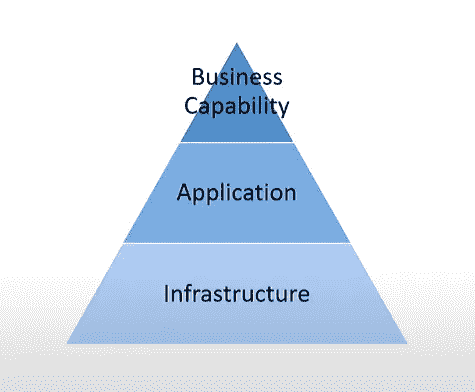
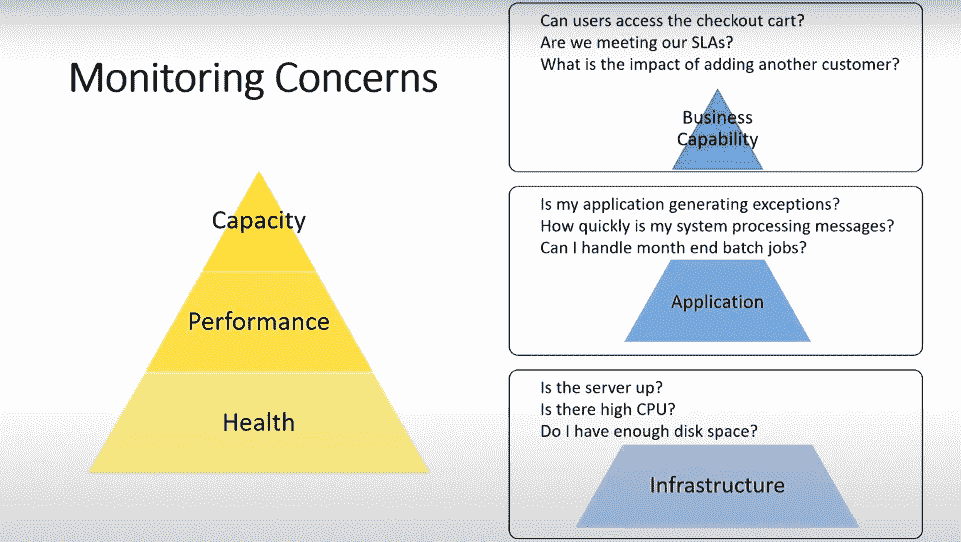
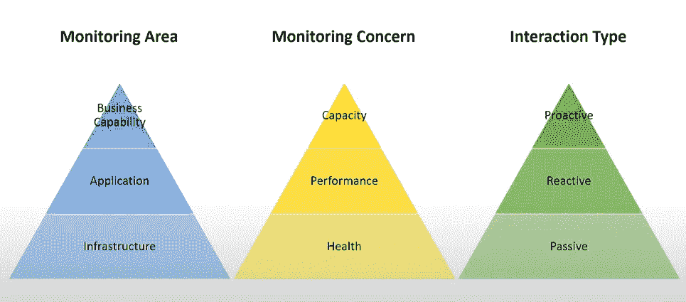
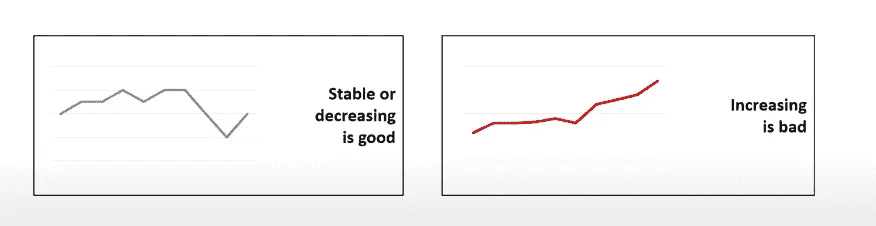
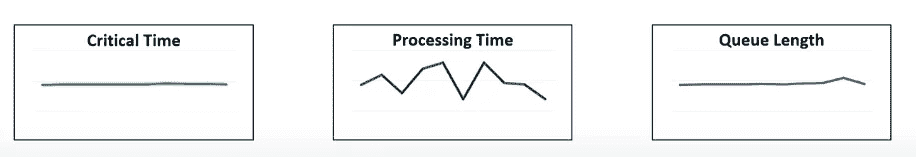
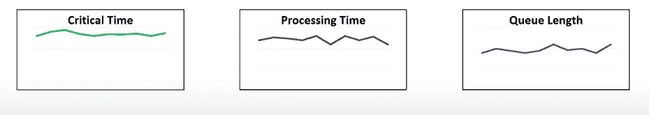
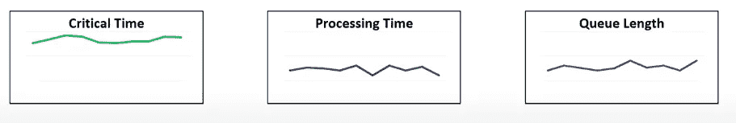
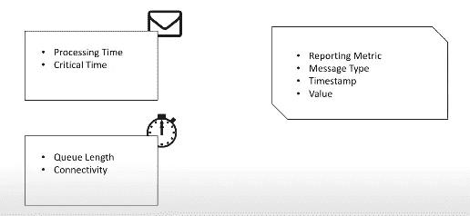

# 监控微服务技术

> 原文：<https://levelup.gitconnected.com/monitoring-microservices-techniques-f554e32e5101>

监控是任何软件开发生命周期(SLDC)的关键部分，随着微服务架构和 DevOps 实践的兴起，它变得更加重要和复杂。为了了解如何监控微服务，我们必须回顾一下 monolith 传统应用程序以及我们过去是如何监控它的。

## **三座金字塔监控哲学**

在 monolith 环境中，我们过去常常获得一些指标，这些指标可以告诉我们应用程序的状态如何。我们通常从基础架构开始，即承载我的应用程序的物理硬件，例如:
我的服务器启动了吗？
我的数据库启动了吗？
网络服务器能和数据库对话吗？

然后，我们转到另一个步骤，询问我们的应用程序本身，并问一个不同的问题:
我的应用程序进程正在运行吗？

然后，我们向上移动另一个级别，我们监控功能和业务能力，这导致询问不同的问题，如:用户可以下订单吗？

过去的 3 级基础设施、应用和业务能力称为 ***监控领域***

监控区域金字塔

让我们换个角度，稍微改变一下问题
让我们通过询问
我的服务器是否启动来检查应用程序的运行状况？
并通过询问
是否有高 CPU 来检查应用程序性能？
通过询问
我是否有足够的磁盘空间来检查容量？
通过回答这 3 个问题，我得到了关于系统运行状况、性能和容量的另一个指标，这称为 ***监控问题*** *。*

在 ***监控区域*** 和 ***监控关注点*** 之间存在多对多关系，这取决于我们提出的一个问题的组合，例如:
我的服务器启动了吗？是有高 CPU 吗？我有足够的磁盘空间吗？
在这里，我的目标是基础设施的运行状况、性能和容量
，如果我问:
我的应用程序是否会产生异常？系统处理消息的速度有多快？我可以处理月末批处理作业吗？
这里，我的目标是应用层的运行状况、性能和容量，如果我再次改变问题并提问:
用户可以访问收银台吗？我们满足服务水平协议吗？添加另一个客户会有什么影响？
我们以业务能力层的健康、性能和容量为目标。

监控区域和监控问题之间的关系

还有第三个许可我想介绍一下 ***交互类型*** ，它显示了我如何监控系统 ***-*** 被动监控:您可以访问系统仪表板并查看当前和过去的值
-被动监控:当发生某些情况时，监控系统会向我发出警报，例如当队列长度达到 50 时系统会发送电子邮件
-主动监控:当队列长度达到 50 时，监控系统会自动采取措施修复系统自动扩展另一个实例以解决问题

3 金字塔监控理念

同样，这 3 个监控金字塔之间存在多对多的关系，所以如果我问文章开头的前 3 个问题:
我的服务器启动了吗？
我的数据库启动了吗？
web 服务器能与数据库对话吗？
然后，我监控该时间点的基础架构运行状况，这当然是被动监控。

**这 3 个金字塔是一种思考你正在监控什么的方式，并询问它是对你有用的整体系统还是分布式系统。**

*****当我们处理分布式系统时会发生什么？
它全部消耗一个输入队列或者也可能是分布式队列，监视队列长度是否有意义。 这有点棘手，可能是，你应该监控，也可能不是。随着你可以运行的系统的动态性质增加，情况会变得更加复杂，我们可以收集大量信息，但我们没有必要关注每一件事。*****

**让我们来看看分布式系统的组件，看看我们如何监控它。**

****对于我们的金字塔，我们监控基础架构性能，但这并不能让我们清楚地了解情况，因此我们在这里寻找另一个重要指标。
***消息处理*** ***时间*** 因此，我们应该获取消息在队列前面直到完成任务的时间，无论它是通过 FTP 上传文件还是在数据库上执行一些查询并完成它，然后从队列中删除消息
-处理时间是成功处理消息
所需的时间-处理时间不包括错误处理时间
-它取决于队列 等待时间
此处成功完成流程很重要，因为如果在处理过程中出现错误，这意味着不应该删除错误，如果错误稳定或减少，或者有一些尖峰，这可能是好事，但如果每次都增加，这就是问题****

********

****这就引出了一个新的概念 ***关键时刻到了。*由此我们可以得到一个描述临界时间的公式。******

******关键时间=排队时间+处理时间+重试时间+网络等待时间******

****与其他指标非常相似，如果它是稳定的或下降的，或者有一些峰值，这可能是好的，但如果它每次都在上升，这就是问题了****

****让我们把所有的放在一起****

*   ****这些指标中的每一个都代表了谜题的一部分。****
*   ****从端点的角度来看，而不是每条消息。****
*   ****将它们放在一起看，可以更好地了解您系统。****

****让我们展示一些案例并进行分析****

******案例 1:******

********

****我们这里有什么？稳定的临界时间一段时间内的尖峰处理时间和稳定的队列长度。这告诉我们什么是系统？系统在某种程度上与所有进来的消息保持同步，我们也在处理它们，因为队列长度没有增加，但是为什么处理时间不稳定？可能有多种原因导致跳来跳去，可能是存在资源争用，也可能是存在锁定机制，当处理程序收到消息时，它会锁定消息，直到它更新一些资源；也可能是一些消息在该端点之前处理得很快，而其他消息则没有，您可以使用该信息将较慢的消息隔离到它们的端点，并独立地扩展新端点。****

******案例二:******

********

****这里我们有高关键时间、高处理时间和中等队列长度，但一切都很稳定。这告诉我们什么？系统正在跟上容量，但我们已经到了极限，所以一旦出现任何流量高峰，队列长度将会直线上升，关键时间也会如此。因此，这可能是扩展这些资源的一个很好的指示。****

******案例三:******

********

****这里我们有高关键时间、低处理时间和低队列长度。这是什么意思？
可能是网络存在问题，因为如果您记得关键时间的等式，包括网络延迟时间，在处理消息时也可能有许多重试，我们只测量成功处理的消息的处理时间，因此连接或重试的问题。
***那么如果监控分布式系统怎么会出现通信故障呢？*** 实际上，如果您监控分布式系统，最简单的方法是进行健康检查，如果您的服务回复 200 状态，这意味着它已启动，但与分布式系统的通信通常使用代理完成，当实例向代理发送消息时，它不知道该消息是否到达其目的地，这里最简单的选项是当消息到达其目的地时，发送回已读回执。这是个好主意吗？！！不是为什么？我们把我们的解耦系统变成了 req/res 系统:(并且我们得到了通过系统发送的双倍消息。
这里的解决方案是点对点连接，它告诉我们一个端点是否正在处理来自另一个端点的消息。****

*******使用什么工具？*** 我们有一堆工具可以为我们收集指标，splunk、kibana、D3 和 Grafana 都适合监控。****

*******我们将如何收集我们发给*** 的所有这些信息？
如果我们谈论 ***关键时间或处理时间*** 当我们发送一条消息时，它将是每条消息的度量，该消息将具有与其相关联的处理时间和关键时间。
***队列长度和连通性*** 你可以每 5 分钟或者每 5 分钟定期检查一次****

********

*******我们如何存储这个*** ？
一个好的存储模式是:度量类型、消息类型、时间戳和值。但这是一种非常昂贵的存储度量的方法，有不同的技术可以做到这一点，但这超出了本课程的范围。****

*******我们如何显示指标？*** 我们可以使用 ELK stack 来做到这一点，这将是合适的用例。****

******结论:******

****监控分布式系统不是一个简单的过程，它与系统的动态程度成正比，但需要理解监控的原理，并选择正确的指标来帮助分析系统并保持其健康:)****