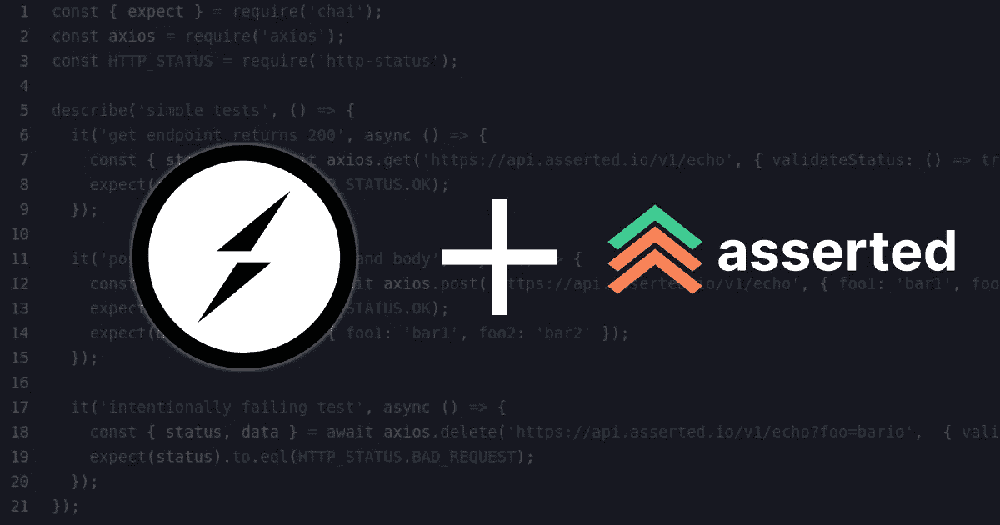

# 监控插座。IO 正常运行时间

> 原文：<https://levelup.gitconnected.com/monitoring-socket-io-uptime-40006289d158>

监控套接字的健康和可用性。IO APIs 可能很复杂。随着[断言](https://asserted.io)，你可以使用套接字编写[复杂的正常运行时间测试](https://asserted.io/features/uptime-as-code)。IO 客户端库。

> *上的例子* [*GitHub*](https://github.com/assertedio/socketio-uptime)

插座。IO 是一个利用 websockets 和标准 HTTP 来实现实时双向通信的库。根据您的使用情况，插座。IO 通常比原始 websockets 实现得更快，更不容易出错，因为它支持广播和协议后备等现成的东西。

我将要使用的示例是这里的[提供的演示的修改版本](https://github.com/socketio/socket.io/tree/master/examples/chat)。这是一个非常简单的使用 Socket.IO 的聊天应用程序的例子。

# 示例服务器

断言测试将运行的服务器包含两个主要文件。

首先是插座。处理新连接并响应客户端发出的消息的 IO 逻辑。

这允许用户加入和断开连接，以及向其他用户广播消息。

第二个文件是套接字所在的位置。IO 逻辑连接到服务器。

# 常规配置

这次 **routine.json** 略有不同，只是它使用了[自定义依赖项](https://docs.asserted.io/reference/included-dependencies#custom-dependencies)。付费计划中提供了自定义依赖项，这里我们使用该选项来包含套接字。我们测试中的 IO 客户端库。

# 例程包. json

例程的 **package.json** (在。asserted directory)在这种情况下与缺省值略有不同。除了添加 **socket.io-client** 之外，我们还可以删除所有其他不需要的依赖项。

# 持续集成测试

在本例中，我们创建了两个不同的客户端。一个作为新用户加入聊天并发送消息，另一个客户端观察新用户的加入和消息。

为每个测试用例重新创建新的用户客户端。

before 和 after 挂钩确保事情被适当地清理，如果这在生产或登台中连续运行，这是很重要的。

测试本身检查当新用户加入时，以及当他们发送消息时，适当的事件被发送到适当的客户机。

通过类似的测试，您可以持续监控生产中的 SocketIO APIs，并准确跟踪正常运行时间。

# 后续步骤

虽然这里显示的示例[可以在没有帐户的情况下在本地克隆和运行，但是如果您想要创建自己的断言例程来在生产中集成测试您的 API，您将需要执行一些额外的步骤。](https://github.com/assertedio/socketio-uptime)

1.  创建一个 [**断言账户**](https://app.asserted.io/) 。很洒脱。
2.  完成 2 分钟的入职培训，确保您的环境准备就绪。也可以在 这里引用 [**的单据。**](https://docs.asserted.io/)
3.  开始在 prod 中编写和运行测试！