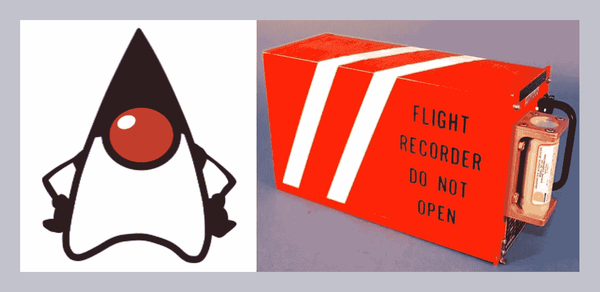
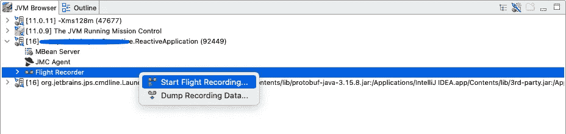
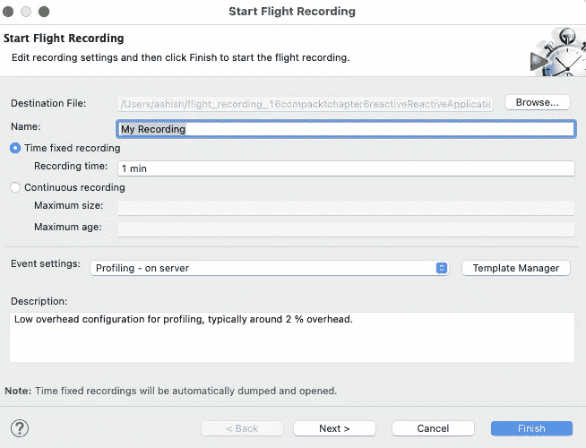
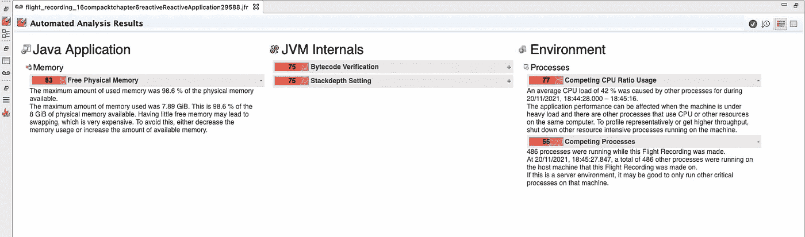
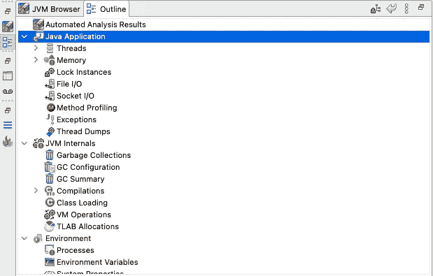
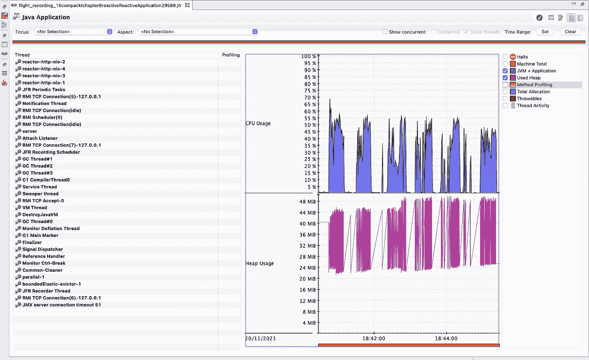

# 监控 Spring Boot 应用程序:第 1 部分

> 原文：<https://levelup.gitconnected.com/monitoring-spring-boot-applications-part-1-b3fc6d14cedc>

> 在本系列的第 1 部分中，我们将了解 JDK 飞行记录器，以及如何使用它来监控 Spring Boot 应用程序。



JDK 飞行记录器

应用程序监控是我们作为开发人员不能忽视的一件事。无论您运行的是整体应用还是微服务应用，都没有关系，因为应用监控是生产工作负载了解应用运行情况的必要条件。如果您正在使用 Spring Boot，有不同的方法来监控应用程序。监控 Spring Boot 应用程序最流行的方法是启用[弹簧靴致动器](https://github.com/spring-projects/spring-boot/tree/v2.6.0/spring-boot-project/spring-boot-actuator)模块来实现所需的结果。

大多数情况下，我们依赖第三方工具，如 Appdynamics、Dynatrace、Prometheus 和 Grafana 来监控我们的工作负载。但是，如果我告诉您，您可以使用 JDK 附带的工具来监控您的 Spring Boot 应用程序，那会怎么样呢？你还不相信我吗？让我在本文中向您介绍 JDK 飞行记录器，我们将使用它来监控 Spring Boot 应用程序。

## 什么是 JDK 飞行记录器？

> JDK 飞行记录器是一个诊断工具，收集运行的 Java 应用程序，JVM 和 OS 的事件。

JFR 早期是一个商业特性，但它已经开源，并从 OpenJDK 11 开始做 GA。看到这个 [JEP](https://openjdk.java.net/jeps/328) 。如果你像其他人一样被困在 JDK 8 上，那么不要担心，这项工作已经完成[回移植](https://bugs.openjdk.java.net/browse/JDK-8239140)到 OpenJDK 8。没有必要单独下载，因为 JFR 与您的 JDK 捆绑在一起。

## JDK 飞行记录器的特点

1.  你可以离线分析录像。
2.  查看关于内存使用、垃圾收集、热方法和类、线程、Java 锁等的详细信息。
3.  对性能的影响最小(< 1%)。
4.  它可以在磁盘和内存上存储事件。
5.  使用 API 根据您的需要创建自定义事件。
6.  从 OpenJDK 14 开始支持事件流。

## 启用 JDK 飞行记录器

1.  使用命令行
2.  使用 jcmd 工具
3.  使用 JMC

我们来详细了解一下这些选项。

## 使用命令行

如果您使用的是 OpenJDK 11 或更高版本，您可以在启动 Spring Boot 或 Java 应用程序时通过传递标志`-XX:StartFlightRecording`来启用飞行记录器。因为您可以在应用程序启动时传递该标志，所以依靠 JFR 来监控应用程序是很好的。下面是一个例子:

```
java -XX:StartFlightRecording:filename=myrecording.jfr,duration=60s -jar myapp.jar
```

在本例中，启用 JFR 后，数据被转储到`myrecording.jfr`文件，并使用客户端工具 JDK 任务控制进行分析。JMC 必须单独下载，因为它不属于你的 JDK。可以从[这里](https://github.com/openjdk/jmc#downloading-builds)下载。

## 使用 jcmd 工具

假设您不像第一个选项中讨论的那样总是希望 JFR 监控您的应用程序，而只想在出现任何问题时进行诊断。在这种情况下，`jcmd`是一个方便的选项，因为它将向正在运行的 Java 应用程序发送诊断命令。您必须传递正在运行的 java 进程或主类的 PID 和实际命令。

```
jcmd 24597 JFR.start duration=60s filename=myapprecording.jfr
```

在上面的例子中，我们用 PID 24597 在正在运行的 Java 进程上启动了 60 秒的 JFR 记录，并将其保存到当前目录下的`myapprecording.jfr`文件中。要查看一个正在运行的 Java 应用程序的所有可用命令，请指定`jcmd <pid> help.`以下是我们可以与 jcmd 一起使用的一些命令。

```
jcmd 24597 help24597:The following commands are available:**JFR.check****JFR.configure****JFR.dump****JFR.start****JFR.stop**
```

以下是这些命令的摘要。

## 使用 JMC

JDK 任务控制又名 JMC 是一个 GUI 工具，用于检查由 JFR 创建的记录。不仅仅是因为有了 JMC，你可以开始记录一个正在运行的 java 进程的事件。如下面 JMC 左侧导航栏的截图所示，首先您必须选择一个正在运行的 java 进程。然后右键选择**开始飞行记录**。



开始飞行记录

在下一个窗口中，您可以使用默认选项或根据您的需要进行调整。然后点击**完成**开始记录 Spring Boot 应用程序的事件。



记录完成后，将显示自动分析结果。



自动化分析结果

如下面的截图所示，您还可以查看 Java 应用程序线程、堆和 CPU 相关的详细信息。此外，您还可以查看 JVM 内部和环境相关的详细信息。



按不同类别查看结果的选项



Java 应用程序线程、CPU 和堆使用情况

就这样，我们结束了。

## 结论

在本文中，我们只讨论了如何启用和使用 JDK 飞行记录器来监控 Spring Boot 应用程序。JDK 飞行记录器是监控应用程序性能的合理工具。

在本系列的第 2 部分中，我们将尝试使用 JFR 监控简单的 spring boot 应用程序启动事件。我们还将了解如何使用 JFR 事件流来持续监控 Spring Boot 应用程序。