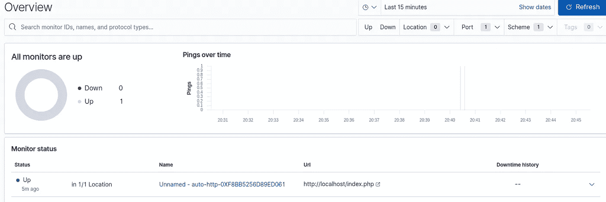

# 使用 Kibana 监控网站正常运行时间

> 原文：<https://levelup.gitconnected.com/monitoring-website-uptime-using-kibana-cf9701c86b5d>


Kibana 为我们提供了各种数据可视化和分析功能，我们将在这篇博客中讨论的功能之一是正常运行时间。使用 Kibana Uptime，我们可以使用不同的协议(如 HTTP、HTTPS、TCP 等)监控网络端点。我将解释一个非常基本的用例来解释正常运行时间，那就是监控基于 web 的应用程序的正常运行时间。目的是如果一个或多个基于 web 的应用程序运行正常，就在仪表板中获取状态。它还为我们提供了历史数据来了解应用程序是否运行良好。

我将使用 Kibana 正常运行时间来监控 bqstack.com 网站。我们可以添加多个网站进行正常运行时间监控。但是在监控网站正常运行时间之前，我们需要做一些安装和配置。因此，请在我们为正常运行时间监控搭建平台时查看一下。我们需要做到以下几点:

我们首先需要下载并安装 Heartbeat，这里我正在一个基于 Ubuntu 的操作系统上进行配置。我们需要执行以下命令:

```
curl -L -O [https://artifacts.elastic.co/downloads/beats/heartbeat/heartbeat-7.6.2-amd64.deb](https://artifacts.elastic.co/downloads/beats/heartbeat/heartbeat-7.6.2-amd64.deb)
sudo dpkg -i heartbeat-7.6.2-amd64.deb
```

现在安装完成后，我们需要修改/etc/heartbeat/heartbeat.yml 文件，以设置连接信息:

```
output.elasticsearch:
 hosts: ["<elaticsearch_url>"]
 username: "elastic"
 password: "<password>"
setup.kibana:
 host: "<kibana_url>"
```

在上面的心跳配置文件片段中，我们需要更新 Elasticsearch URL、elastic 用户的密码和 Kibana URL。

在添加了 Elasticsearch 和 Kibana 细节之后，我们需要添加用于监视 URL 的监视器。为了进行测试，我将监控本地主机上 index.php 文件的正常运行时间。这个 PHP 脚本只是在屏幕上显示一条 hello 消息，请参考 index.php 的以下代码:

我们需要编辑以下代码片段来监视本地主机上的 index.php 文件:

```
heartbeat.monitors:
- type: http
 urls: ["http://localhost/index.php"]
 schedule: "@every 10s"
```

更新这些细节后，我们需要保存心跳配置文件。在修改心跳配置文件之后，我们需要执行 setup 命令来加载 Kibana 索引模式。

```
sudo heartbeat setup
```

执行 setup 命令后，我们需要启动 Heartbeat 服务。

```
sudo service heartbeat-elastic start
```

我们可以通过执行以下命令来验证心跳服务是否正在运行:

```
sudo service heartbeat-elastic status
```

现在，我们可以通过点击左侧菜单中的正常运行时间链接来打开 Kibana 的正常运行时间屏幕。它将打开以下屏幕:



在上面的正常运行时间概览屏幕中，我们可以看到正常运行时间的详细信息，如网站/服务是打开还是关闭，一段时间内的 pings，监视器状态等。我们可以单击监视器状态名称来查看正常运行时间监视的详细信息。它不仅有助于我们监控网站/服务的当前状态，还使我们能够查看历史数据，如果有任何中断，我们可以很容易地找到这些数据。

这样，我们可以为正常运行时间监控配置不同的 URL。它帮助我们跟踪不同的服务或 web 应用程序的正常运行时间。

[配置 Logstash 将 MongoDB 数据推送到 Elasticsearch](https://bqstack.com/b/detail/76/Configure-Logstash-to-push-MySQL-data-into-Elasticsearch)
[将 CSV 数据加载到 Elastic Search](https://bqstack.com/b/detail/96/Load-csv-Data-into-Elasticsearch) [Elastic Search 简介](https://bqstack.com/b/detail/31/Introduction-to-Elasticsearch)
[Elasticsearch 在 Ubuntu 14.04 上的安装和配置](http://bqstack.com/b/detail/52/Elasticsearch-Installation-and-Configuration-on-Ubuntu-14.04)
[带弹性栈的日志分析](http://bqstack.com/b/detail/1/Log-analysis-with-Elastic-stack) [Elastic Search Rest API](https://bqstack.com/b/detail/83/Elasticsearch-Rest-API)
[Elastic Search 中数据搜索的基础知识](https://bqstack.com/b/detail/84/Basics-of-Data-Search-in-Elasticsearch)
[Elasticsearch](https://bqstack.com/b/detail/83/Elasticsearch-Rest-API)

《学习基巴纳 7》被评为最佳新弹性搜索书籍


我很高兴地宣布，我的书《学习 Kibana 7:用 Kibana 的数据可视化功能构建强大的弹性仪表板，第二版》获得了 https://bookauthority.org/books/new-elasticsearch-books?[book authority 的最佳新弹性搜索书籍](https://bookauthority.org/books/new-elasticsearch-books?t=11vp86&s=award&book=1838550364) :
[t = 11vp 86&s = award&book = 1838550364](https://bookauthority.org/books/new-elasticsearch-books?t=11vp86&s=award&book=1838550364)
book authority 收集并排名世界上最好的书籍，能得到这种认可是莫大的荣幸。谢谢大家的支持！这本书在亚马逊上[有售。](https://www.amazon.com/dp/1838550364?tag=uuid10-20)

如有任何疑问，请留下您的意见。你也可以在推特上关注我:[https://twitter.com/anu4udilse](https://twitter.com/anu4udilse)

*如果你觉得这篇文章很有趣，那么你可以探索一下“* [*掌握基巴纳 6.0*](https://www.amazon.com/Mastering-Kibana-6-x-Visualize-histograms/dp/1788831039/ref=olp_product_details?_encoding=UTF8&me=) *”、“* [*基巴纳 7 快速入门指南*](https://www.amazon.com/Kibana-Quick-Start-Guide-Elasticsearch/dp/1789804035) *”、“* [*学习基巴纳 7*](https://www.amazon.com/Learning-Kibana-dashboards-visualization-capabilities-ebook/dp/B07V4SQR6T) *”、* [*Elasticsearch 7 快速入门指南*](https://www.amazon.com/gp/product/1789803322?pf_rd_p=2d1ab404-3b11-4c97-b3db-48081e145e35)

**最初发表于*[*https://bqstack.com*](https://bqstack.com/b/detail/176/Monitoring-website-uptime-using-Kibana)T43。*