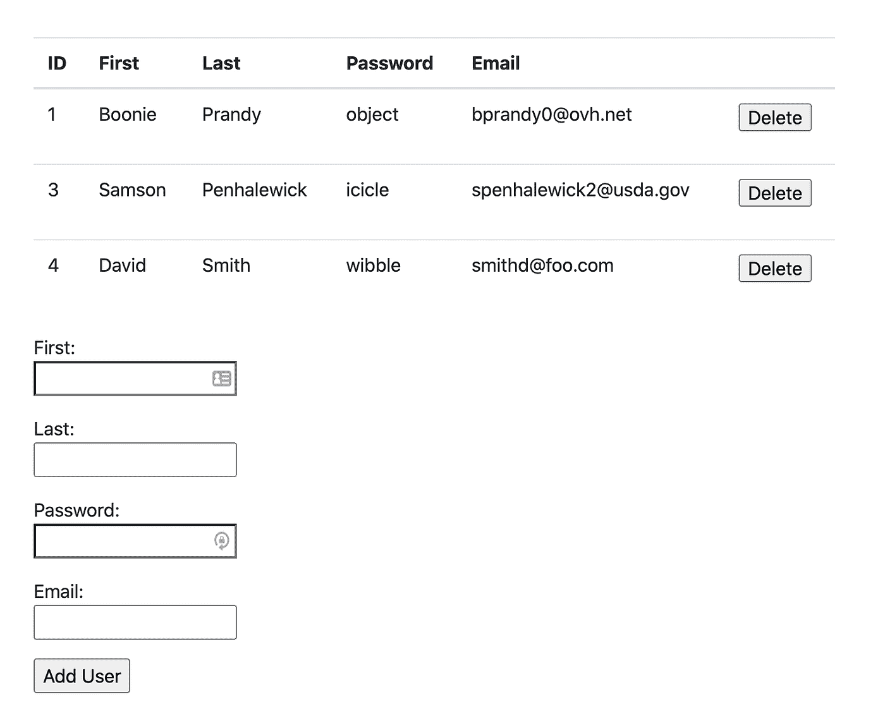
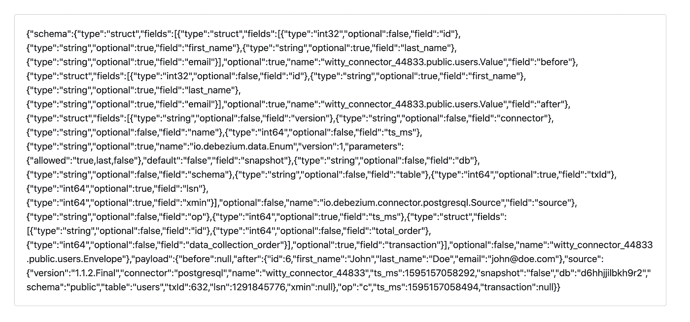
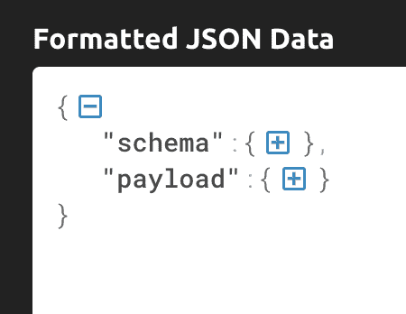
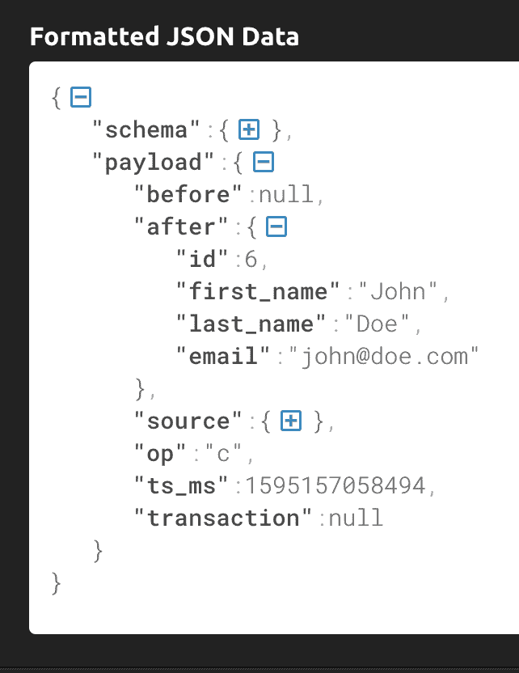

# 整体到微服务，带 Kafka 流数据连接器

> 原文：<https://levelup.gitconnected.com/monolith-to-microservices-with-kafka-streaming-data-connector-89714e809b7c>

如果你是一个开发和维护软件的团队 [monolith](https://en.wikipedia.org/wiki/Monolithic_application) ，很有可能你正在考虑或计划迁移到一个基于[微服务](https://en.wikipedia.org/wiki/Microservices)的架构。在本文中，我不会深入讨论该决策中涉及的各种权衡；相反，我将重点介绍一种可能帮助您实现这种转变的特定技术:[变更数据捕获](https://en.wikipedia.org/wiki/Change_data_capture) (CDC)

如果你从零开始，围绕微服务构建一个系统是相对简单的。然而，很难规划和管理从现有整体结构的过渡。所涉及的变化可能是实质性的，当您从根本上改变系统的工作方式时，很难保持一个活跃的系统平稳运行。

这是一个很大的转变，从一个符合 [ACID](https://en.wikipedia.org/wiki/ACID) 的数据库到一个基于[最终一致性](https://en.wikipedia.org/wiki/Eventual_consistency)的分布式架构，并且在漫长的迁移过程中保持数据的一致性*，当不同的信息保存在系统的不同部分时，可能会特别具有挑战性。*

变更数据捕获(CDC)使您能够首先对生产系统进行最小的更改(如果有的话)。相反，您建立一个系统来观察您的数据库，并在关键数据发生变化时创建事件，您的“新架构”系统对这些事件做出响应。

# 变更数据捕获

让我们看一个例子。假设您想在应用程序中添加一个入职电子邮件流，以便新用户在创建帐户后的几天内可以收到有用的电子邮件。使用 CDC，您可以将这个新流程创建为微服务。每当一个新的用户记录被添加到主`users`表中时，就会创建一个新的事件。然后，您的新微服务将使用该事件并管理入职流程，而不需要对您的主要遗留应用程序做任何进一步的更改。另一个例子是，在用户删除他们的帐户后，向他们发送一份离职调查，以获取关于为什么您的服务不再满足他们的要求的数据。

我将通过一种技术来实现这一点，它不需要对“主”应用程序做任何改动；Heroku 最近推出的[流数据连接器测试版](https://blog.heroku.com/streaming-data-connectors-beta)。

其工作方式是向 Heroku 应用程序添加一个托管的 [Kafka](https://kafka.apache.org/) 和一个“数据连接器”,定义变更应该生成事件的表和列。然后，您可以设置新的微服务来使用 Kafka 主题中的事件。

在本文的其余部分，我将带您了解如何设置它。我们将使用一个普通的数据库支持的 web 应用程序来表示我们的 monolith，以及一个订阅了 Kafka 主题的独立应用程序，它将通过更改我们的数据库来消费我们生成的事件。

> *流媒体数据连接器 Beta 目前只对*[*Heroku Enterprise*](https://devcenter.heroku.com/categories/heroku-enterprise)*用户可用，因为它只在 Heroku* [*私有空间*](https://www.heroku.com/private-spaces) *(这是一个企业功能)中工作。*

让我们看一些代码。

> *我在一台 Mac 笔记本电脑上工作，但是这些命令应该在任何 posix 兼容的终端环境下都能正常工作。*

# 清除

我们将要使用的一些命令会在你的 Heroku 帐户中创建资源，这会产生费用。完成后，请不要忘记删除您的应用程序，否则您可能会被收取这些服务的费用。

你可以通过在`sinatra-postgres-demo`目录和`kafka-consumer`目录中运行`make clean`来实现。您也可以使用 Heroku web 界面删除应用程序。

要验证所有内容都已成功删除，您可以运行:

`heroku apps --space ${HEROKU_PRIVATE_SPACE}`

请在上面的命令中使用您的 Heroku 私人空间的名称。

# 用户应用程序

我们将使用一个简单的 web 应用程序来管理 Postgres 数据库中的“用户”记录。我在 Sinatra 中写了这个，这是一个轻量级 web 应用程序的 ruby 库。

该应用程序有几个 HTTP 端点:

```
get "/" doredirect "/users"endget "/users" do
  erb :users, locals: { users: get_users }
endpost "/users" do
  add_user(params)  redirect "/users"
endpost "/delete_user" do
  delete_user(params["id"])  redirect "/users"
end
```

对“/users”的 HTTP GET 呈现数据库中的用户列表，对“/users”的 POST 添加新用户，对“/delete_user”的 POST 将删除用户。

这是数据库代码的实现:

```
def connection
  PG.connect(ENV.fetch("DATABASE_URL"))
enddef get_users
  connection.exec( "SELECT * FROM users" )
enddef add_user(u)
  addsql = %[ INSERT INTO users (first_name, last_name, password, email) VALUES ($1, $2, $3, $4) ]  connection.exec_params(addsql, [ u["first_name"], u["last_name"], u["password"], u["email"] ])
enddef delete_user(id)
  connection.exec_params("DELETE FROM users WHERE id=$1", [ id ])
end
```

完整的应用程序可从[这里](https://github.com/digitalronin/sinatra-postgres-demo)获得。让我们开始吧。

我正在使用一个名为`devspotlight-private`的私人空间。请在下面的代码中替换您的私人空间的名称:

```
git clone [https://github.com/digitalronin/sinatra-postgres-demo](https://github.com/digitalronin/sinatra-postgres-demo)cd sinatra-postgres-demoexport HEROKU_PRIVATE_SPACE=devspotlight-privateheroku apps:create --space ${HEROKU_PRIVATE_SPACE}
```

这将创建一个随机命名的应用程序。为了保持代码样本的一致性，我将读取名称并将其存储在环境变量`APP`中。

```
export APP=$(heroku apps:info | head -1 | sed 's/=== //')echo ${APP}
```

我们的应用程序需要一个数据库，为了使用流数据连接器测试版，您需要使用特定版本的 Heroku Postgres 插件:

`heroku addons:create heroku-postgresql:private-7 --as DATABASE --app ${APP}`

> *请注意，运行此命令将在您的 Heroku 帐户上产生费用。*

`heroku addons:wait`

创建数据库可能需要几分钟时间，所以上面的`wait`命令会告诉您何时可以继续下一步:

```
git push heroku masterheroku run make setup-db
```

这将部署我们的应用程序，并使用`users`表和一些样本记录建立数据库。

一旦这个过程完成，您应该能够运行`heroku open`并看到如下所示的网页:



现在我们有了一个示例 web 应用程序，由 Postgres 数据库支持，我们可以在其中添加和删除`users`表中的记录。这代表我们的 monolith 应用程序。现在，让我们添加流数据连接器测试版，看看如何使用 CDC 添加微服务，而不改变我们的应用。

# 添加卡夫卡

我们需要 Kafka 作为我们连接的应用程序的消息传递主干，因此我们需要 Kafka 附加组件。同样，您需要使用特定的版本:

`heroku addons:create heroku-kafka:private-extended-2 --as KAFKA --app ${APP}`

> *请注意，运行此命令将在您的 Heroku 帐户上产生费用。*

`heroku kafka:wait`

同样，这可能需要一些时间。

# 添加数据库连接器

一旦我们有了 Kafka 附加组件，我们就可以设置连接器，每当 Postgres 数据库中的表发生变化时，就生成 Kafka 事件。

我们需要安装一个插件来添加数据库连接器:

`heroku plugins:install @heroku-cli/plugin-data-connectors`

一旦完成，创建数据库连接器的语法如下所示:

```
heroku data:connectors:create \--source [postgres identifier] \--store [kafka identifier] \--table [table name]...
```

要获取 Postgres 标识符，请运行以下命令:

`heroku addons:info heroku-postgresql`

您应该会看到如下所示的输出(您的值会有所不同):

```
=== postgresql-tapered-49814Attachments:  lit-bastion-67140::DATABASEInstalled at: Sun Jul 19 2020 10:26:20 GMT+0100 (British Summer Time)Owning app:   lit-bastion-67140Plan:         heroku-postgresql:private-7Price:        $7000/monthState:        created
```

我们需要的标识符在第一行。在这种情况下，`postgresql-tapered-49814`

获取 Kafka 标识符的过程类似，标识符出现在输出的第一行:

`heroku addons:info heroku-kafka`

现在我们有了 Postgres 数据库和 Kafka 实例的标识符，我们可以创建数据库连接器了。我正在使用我的应用程序中的标识符，所以在运行这个命令时，您需要用您自己的标识符替换适当的值:

```
heroku data:connectors:create \ --source postgresql-tapered-49814 \ --store kafka-octagonal-83137 \ --table public.users \ --exclude public.users.password
```

我已经将该表指定为`public.users`。在创建我的`users`表时，我使用了 Postgres 数据库的默认`public`模式。如果您使用了不同的模式，您将需要指定它。

还要注意，我使用了`--exclude public.users.password.`，这意味着在生成的 Kafka 事件中不会有任何关于`password`字段值的信息。这是一个非常有用的功能，可以确保您不会意外地将敏感的用户信息从您的主应用程序发送到不需要它的微服务。

创建数据库连接器可能需要一段时间，而`create`命令的输出将告诉您可以使用什么命令来等待数据库连接器被提供。

`heroku data:connectors:wait [connector name]`

# 消费卡夫卡事件

现在我们有了原始的数据库支持的应用程序，并且我们添加了流数据连接器测试版，所以每当我们对`users`表进行更改时，我们应该会在 Kafka 服务上看到一个事件。

下一步是设置另一个应用程序来使用这些事件。在真实的场景中，您可能希望对这些事件做一些有用的事情。然而，对于本文，我们要做的只是在一个非常简单的 web 界面中显示事件。

# 创建 Web 应用程序

我写了一个非常简单的“kafka-consumer”应用程序，也使用了 Ruby 和 Sinatra，你可以在这里看到。在创建这个的过程中，我从这个 [heroku-kafka-demo-ruby](https://github.com/heroku/heroku-kafka-demo-ruby) 应用程序中获取了一些代码。

让我们部署它，并将其连接到我们的 Kafka 实例。启动一个新的终端会话并运行这些命令。

`export HEROKU_PRIVATE_SPACE=devspotlight-private`

替换你自己的 Heroku 私人空间的名字。

```
git clone [https://github.com/digitalronin/kafka-consumer.git](https://github.com/digitalronin/kafka-consumer.git)cd kafka-consumerheroku apps:create --space ${HEROKU_PRIVATE_SPACE}export APP=$(heroku apps:info | head -1 | sed 's/=== //')
```

在部署我们的应用程序之前，我们需要做一些设置，使这个应用程序能够读取在我们设置数据库连接器时创建的 Kafka 主题。

为了让您的新应用程序能够访问 Kafka 实例，我们需要运行如下命令:

`heroku addons:attach [app with kafka]::KAFKA -a [app that wants to access kafka]`

`[app with kafka]`是您的`sinatra-postgres-demo`应用程序实例的名称，如果您在另一个终端会话中运行`heroku apps:info`，就会看到这个实例。

`[app that wants to access kafka]`是我们现在正在创建的应用程序`kafka-consumer`的实例。

最初创建 Kafka 实例时，我们使用了`KAFKA`标签。

在我的例子中，我需要的命令如下所示(用您的应用程序替换这些值):

`heroku addons:attach lit-bastion-67140::KAFKA -a boiling-sierra-18761`

> *注意在* `*KAFKA*` *前加两个*冒号，否则会得 `*Couldn't find that add-on.*`

输出应该如下所示:

```
Attaching kafka-octagonal-83137 to ⬢ boiling-sierra-18761... doneSetting KAFKA config vars and restarting ⬢ boiling-sierra-18761... done, v3
```

如果您运行`heroku config`，您将看到我们的新应用程序现在已经设置了几个`KAFKA*`环境变量，这将使我们能够连接到 Kafka 实例。

然而，我们还需要一件事:我们需要知道我们的事件将要发布的卡夫卡主题。这个主题是在我们添加数据库连接器时自动创建的。要找出它是什么，返回到您的`sinatra-postgres-demo`目录并运行这个命令:

`heroku kafka:topics`

输出应该如下所示:

```
=== Kafka Topics on KAFKA_URLName                                                  Messages  Traffic ────────────────────────────────────────────────────  ────────  ────────────connect-configs-311cea8b-0d94-4b02-baca-026dc3e345e0  0/sec     0 bytes/secconnect-offsets-311cea8b-0d94-4b02-baca-026dc3e345e0  0/sec     7 bytes/secconnect-status-311cea8b-0d94-4b02-baca-026dc3e345e0   0/sec     0 bytes/sec heartbeat.witty_connector_44833                       0/sec     12 bytes/sec witty_connector_44833.public.users                    0/sec     0 bytes/sec
```

我们希望主题以`public.users`结尾。对我来说，那就是`witty_connector_44833.public.users`。如果在创建数据连接器时指定了多个表，您将看到每个表的主题。

我们的演示`kafka-consumer`应用程序只使用了一个主题，它是从`KAFKA_TOPIC`环境变量中获得的。所以，我们现在可以设置它了。

回到您的`kafka-consumer`终端会话，运行这个命令(替换您自己的主题名):

`heroku config:set KAFKA_TOPIC=witty_connector_44833.public.users`

现在我们可以部署我们的应用程序了:

`git push heroku master`

与`sinatra-postgres-demo`应用程序一样，您可能需要等待几分钟才能完成 DNS 更改。

# 疾控中心在行动

现在，我们已经准备好了所有的东西:

*   用户列表—我们数据库支持的虚拟平台，`sinatra-postgres-demo`
*   流数据连接器 Beta，每当我们的`users`表改变时，它发布事件到 Kafka 主题
*   消息列表——让我们看到卡夫卡事件的`kafka-consumer`应用程序

在浏览器中，使用表单添加新用户。几秒钟后，您应该会在消息列表应用程序中看到一条 JSON 消息。



# 报文结构

你能看到的 JSON 就是卡夫卡事件的“价值”。事件中还有其他元数据，您可以通过调整 kafka-consumer 应用程序来查看，但是现在让我们只看 JSON 数据。

你可以使用 [jq](https://stedolan.github.io/jq/) 之类的工具来检查 JSON，或者粘贴到[这个](https://jsonformatter.curiousconcept.com/)之类的在线 JSON 工具中。

向下折叠到顶层，您可以看到消息有一个“模式”和一个“有效负载”:



“模式”部分有很多元数据，但大多数时候您可能对“有效负载”更感兴趣，它有“之前”和“之后”部分。这将向您显示数据库记录在报告的更改之前和之后的值。在关于流数据连接器测试版的[最佳实践](https://devcenter.heroku.com/articles/best-practices-for-heroku-data-connectors#usage)文档中，有一些关于“之前”的重要警告。



请注意“after”部分不包括用户记录的“password”字段。这是因为我们在创建数据连接器时排除了它。

# 结论

让我们回顾一下我们已经讲过的内容。

*   我们从一个数据库支持的 web 应用程序开始，管理一个`users`表。
*   我们添加了 Kafka 和流数据连接器测试版，将对`users`表的更改作为 Kafka 事件发布。
*   我们创建了一个单独的应用程序，并将其连接到 Kafka 主题，并查看数据库更改所生成的消息。

值得强调的是，我们根本不需要对我们的“monolith”应用程序代码进行任何更改就可以实现这一点。

# 清除

完成后，不要忘记删除您的应用程序，否则您可能最终要为这些服务付费。

您可以通过在`sinatra-postgres-demo`目录和`kafka-consumer`目录中运行`make clean`来实现。您也可以使用 Heroku web 界面删除应用程序。

要验证所有内容都已成功删除，您可以运行:

`heroku apps --space ${HEROKU_PRIVATE_SPACE`