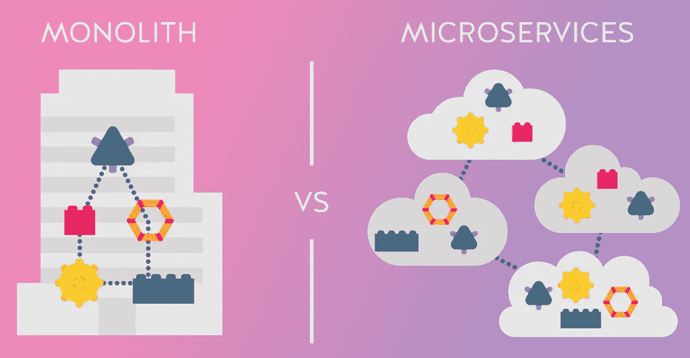
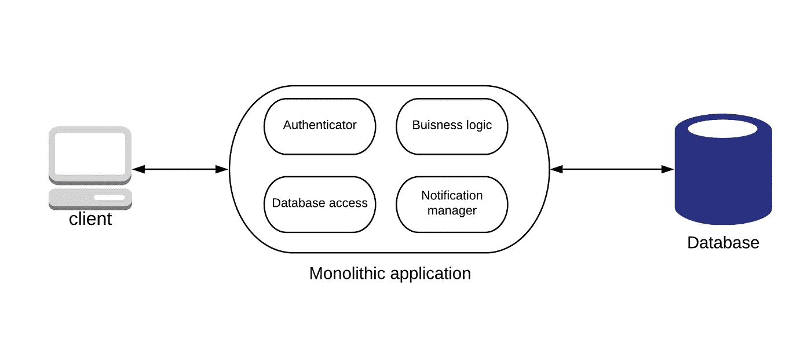
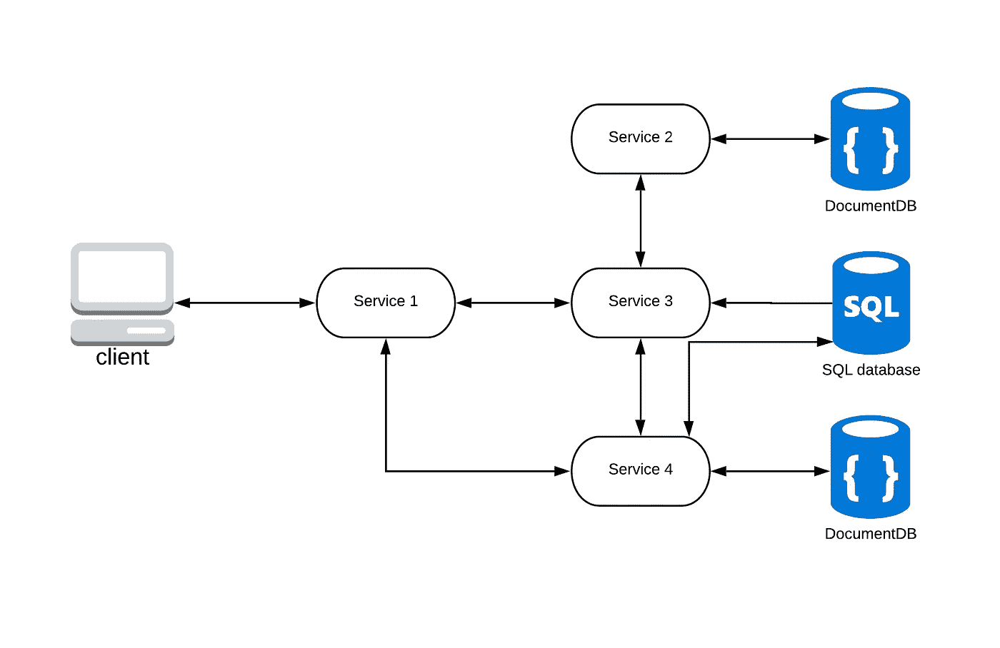

# 单片与微服务架构

> 原文：<https://levelup.gitconnected.com/monolithic-vs-microservices-architecture-b333c8754187>

## 讨论整体架构和基于微服务的架构及其优缺点

图片鸣谢:[https://19 yw4b 240 VB 03 ws 8 QM 25h 366-WP engine . net DNA-SSL . com/WP-content/uploads/Monolith-vs-micro services . png](https://19yw4b240vb03ws8qm25h366-wpengine.netdna-ssl.com/wp-content/uploads/Monolith-vs-Microservices.png)

在本文中，我将讨论单片和基于微服务的架构及其优缺点。

在实习期间，我有机会开发一个基于微服务架构的应用程序。我参与了一些现有的微服务，也参与了一个新添加的用于身份验证的微服务。你可以从下面的链接中参考我从认证服务中得到的一些经验。

 [## 使用 JSON Web 令牌进行身份验证(第二部分)

### 在上一篇文章中，我介绍了 JSON web 令牌以及如何使用它进行身份验证。我更喜欢…

medium.com](https://medium.com/@bhanuka.16/authentication-using-json-web-tokens-part-ii-b21455692a0b) 

根据我从这些工作中获得的经验，我对微服务架构以及整体(传统)架构进行了一些挖掘。

## 什么是单片应用？

首先，我们看看单词“*单片*是什么。

> 在信息技术中，Monolithic 指的是非常大(可能很大)或由一整块组成，这取决于特定的上下文；该术语以不同的方式用于描述集成电路、组织、应用程序和存储系统等。

在单个软件应用程序中，可能有许多组件与之相关联。举个例子，

*   数据库层，负责应用程序的数据库访问。
*   负责认证用户的认证组件。
*   可以有一个组件来定义应用程序的业务逻辑。
*   用于处理所有通知的通知管理器。等等..

因此，在这种架构中，所有组件都被组合到来自单个平台的单个程序中。

作者图片

## 为什么是单片？

在项目开始时，采用这种架构要容易得多，因为开发很容易。它易于测试，部署也非常简单。但是这种简单的方法在大小和复杂性方面有限制。

## 单片架构的缺点

当应用程序的规模变大时，会有很多缺点。应用程序的大小可能会减慢启动时间。您必须在每次更新时重新部署整个应用程序，而且连续部署也很困难。

就可靠性而言，单片应用存在重大问题。如果任何组件有一个错误，那么它会导致整个应用程序停止整个过程。

随着技术的快速发展和新技术的发明，这些应用程序采用它们有很大的障碍。由于框架或语言的变化会影响整个应用程序，因此在时间和成本上都非常昂贵。

## 什么是微服务？

不是将不同的软件组件保存在一个单一的应用程序中，而是将所有的组件分割成互连的小块，称之为微服务。

每个微服务都是一个小应用程序，并有其六边形架构，由业务逻辑和各种适配器组成。根据应用程序和数据库之间的关系，每个服务都有自己的数据库模式，而不是与其他服务共享一个数据库模式。

这些微服务可以暴露给 REST API、RPC 或基于消息的 API，大多数服务都使用其他服务提供的 API。其他微服务可能会实现 web UI。

作者图片

## 为什么选择微服务？

在软件开发中使用微服务架构有很多好处。

微服务架构提供每个微服务的独立部署。不需要在每次更新时重新部署整个应用程序，而且对于复杂的应用程序，连续部署也是可能的。

就开发而言，每个微服务都可以由专注于该服务的团队独立开发。分解应用程序使得快速开发、理解和维护应用程序变得更加容易。

适应新技术非常容易，因为开发人员可以独立选择对他们的服务有意义的技术，而不受项目开始时所做选择的约束。

## 微服务架构的缺点

应用程序组件的分发也产生了一些缺点。开发人员在创建分布式系统时不得不面对一些额外的复杂性。

基于微服务的应用中的分区数据库架构有时会给开发人员带来挑战。更新多个业务实体的业务事务需要更新不同服务拥有的多个数据库。

当出现跨越多个微服务的变更时，比单片应用更难解决。我们需要仔细地计划和协调每个服务的变更。

整体应用程序的部署比基于微服务的应用程序更容易。它不像单一的应用程序，因为它有大量的服务，并且每个服务都需要配置、部署、扩展和监控。微服务应用的成功部署需要高度的自动化。

## 哪个更好？

所以，我想你已经了解了什么是单片应用和基于微服务的应用。对于简单、轻量级的应用程序，最好使用单片架构。如果你的目标是微服务架构，不要从单片开始。微服务架构是复杂、不断发展的应用的更好选择。

感谢您的阅读！

## 参考

[1]玛格利特·劳斯，[国防单片](https://whatis.techtarget.com/definition/monolithic) (2016)，whatis.techtarget.com

[2] Anton Kharenko，[单片与微服务架构](https://articles.microservices.com/monolithic-vs-microservices-architecture-5c4848858f59) (2015)，articles.microservices.com