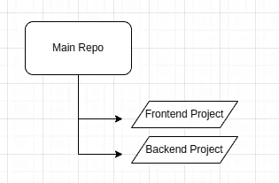
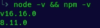
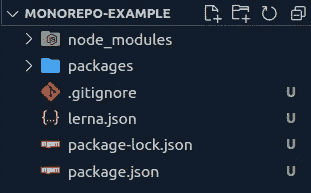
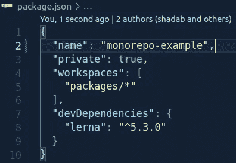
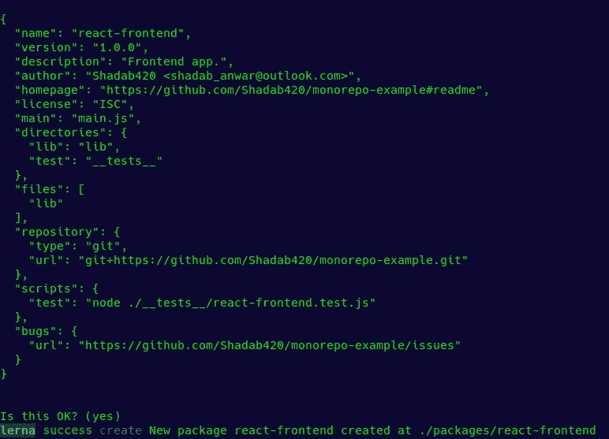
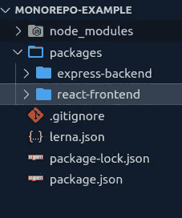
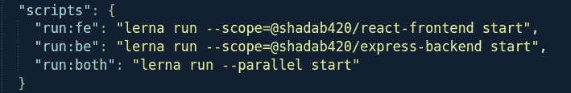
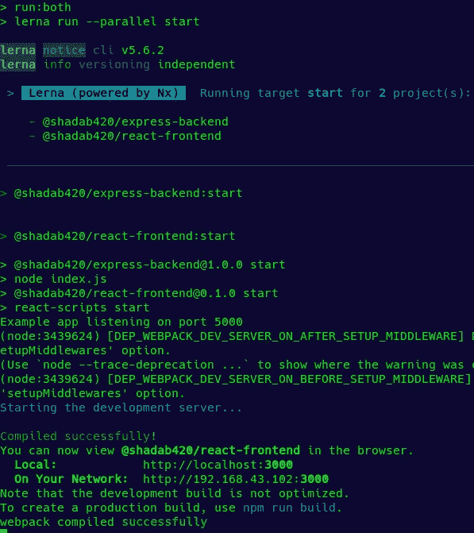

# Monorepo 架构:简单的例子。

> 原文：<https://levelup.gitconnected.com/monorepo-architecture-with-simple-example-484ca725bf2c>

今天，我们将学习单边回购，以及如何设置单边回购和一些基础知识。听起来很棒，对吧？好吧！让我们直接开始吧。

## 什么是 Monorepo 或单存储库架构？

单库(Mono-Repository)是管理代码的一个架构概念。这个架构的目的是将你所有的项目或者项目的所有部分放在一个单一的存储库中。这些项目或代码可以是相关的，也可以是独立的，可以归不同的团队所有。因此，我们的想法是，我们不想为所有的项目管理多个存储库，而是只管理一个真实的来源。我们来讲一个例子，让大家更清楚。比方说，我们开发了一个 web 应用程序。它有一个将在浏览器中运行的前端应用程序，有一个将在服务器上运行的后端应用程序。对于这两个项目，我们在 github 中有如下的独立存储库:
 *https://github.com/user/be-project* 现在，如果我们想使用 monorepo 架构，这意味着，我们有一个 github repo，如:
*【https://github.com/user/our-project* ，这个 repo 将包含我们所有的前端和后端代码，如下所示:



图 1: Monorepo 架构图

## 这种架构的优势:

让我们来谈谈这种架构的几个好处。
1。在单个 package.json 文件中管理所有项目依赖项。
2。使 npm 包发布更容易。
3。在独立的包中共享代码。
4。单一 CI/CD 工作流，因为它是单一存储库。
5。它使得为所有项目定义通用规则成为可能。
6。易于重构代码。
7。使团队协作更好。

## 单一回购的缺点:

我们在这个架构中可能面临的问题是。限制访问的限制。
2。如果在大规模项目上工作，Git 表现很差。
3。构建时间变得更长。
4。新开发人员的学习曲线更高。

## 到底该不该用 Monorepo？

这取决于我们的用例以及我们想要如何构建我们的项目。如果为正确的场景选择了 Monorepo 架构，就可以正确地利用它。除此之外，为了获得动力，我们可以看看使用 monorepo 架构的大公司。

*   **谷歌**用的是单边回购。不相信我？见[本](https://blog.bitsrc.io/why-go-monorepo-413dac00ce7d)。
*   现代前端框架像**反应**、**流星**、**余烬**等。使用 monorepo。
*   Babel 是一种流行的 JavaScript 语言 transpiler，它使用 monorepo 来保存它的代码和所有插件。
*   [**Laravel，**](https://laravel.com/) 这是一个用于 Web 后端开发的 PHP 框架，使用 monorepo。
*   [**NixOS**](https://github.com/NixOS/nixpkgs/) ，一款流行的 linux 发行版。它使用 monorepo 来发布包。
*   [**Symfony**](https://symfony.com/) ，一个用 PHP 写的 MVC 框架，用的是 monorepo。

我们会发现越来越多的公司在软件开发工作流程中使用 monorepo。

# 让我们创建一个 monorepo:

对于这个例子，我们将创建一个包含两个项目(一个 React 项目和一个 Express 项目)的 monorepo。此外，我们将看到基础知识。

## 工具作业

我们将使用 [Lerna](https://lerna.js.org/) 来创建和管理 monorepo，我们还需要 node 和 npm/yarn。

## 步骤 01

首先，我们需要在我们的计算机上安装 node & npm。通过在 terminal/cmd 中给出以下命令来检查这一点。

```
node -v && npm -v
```

如果已经安装了，您将获得这些版本。



图 2:节点和 npm 版本检查。

## 步骤 02

我们需要通过发出以下命令来全局安装 Lerna:

```
npm install -g lerna
```

## 步骤 03

现在，我们将创建一个本地 git 存储库，然后在存储库中启动 lerna。它将搭建样板代码，并在根目录下的 package.json 文件中添加一些包。在终端中发出以下命令

```
git init monorepo-example && cd monorepo-example
lerna init
```

## 步骤 04

此时，我们需要创建一个远程 git 存储库，并将其链接到本地存储库。此外，我们将添加一个. gitignore 文件，以避免在 node_modules 文件夹中查找更改。最后，我们需要安装软件包。

```
git remote add origin https://github.com/Shadab420/monorepo-example.gittouch .gitignore
npm install
```

**注意**同时在根目录下创建一个空的 **LICENSE.md** 文件，以避免与许可证相关的错误。

完成所有这些步骤后，我们的项目结构将如下所示:



图 3:使用 Lerna(样板)的项目结构。

我们将深入这个结构的细节，但在此之前，让我们做第一次提交和推送代码。

```
git add .
git commit -m "Scaffolded project."
git push -u origin main
```

## 关于项目结构:

1.  **Packages-** 该文件夹实际上负责保存我们希望成为此回购一部分的所有项目/代码。当然，我们可以给它重新命名。
2.  这个文件包含了这个 monorepo 的所有必要配置。我们可以指定项目路径。此外，我们可以定义这些项目是否将独立版本化。在我们的例子中，我们的配置如下:


图 4: lerna 配置文件。

3.根目录中的 package.json 将如下所示:



图 5:根目录中的 Package.json。

## 创建或添加项目/包:

我们可以直接将现有的项目复制粘贴到 packages 文件夹中，或者使用“lerna create”命令创建一个新的包。它会问一些问题，我们必须回答，该项目将被添加。

我们将首先创建 React(前端)项目。

```
lerna create react-frontend
```

我们的前端项目文件夹已经创建，如下图所示:



图 6:使用 lerna 命令创建项目。

但是 IMO 最简单的方法是使用命令行进入 packages 文件夹，并使用它们自己的命令创建各自的项目。例如，我们可以使用 create-react-app 创建一个 React 项目。所以让我们做以下事情:

```
cd packages
npx create-react-app react-frontend
```

由于这不是一个反应教程，我不会去详细。但是现在我们的 React 应用程序已经准备好并正在运行。

同样，我们将为后端创建一个快速项目。现在我们有两个项目准备好了。



图 6:项目就绪。

## 处理项目相关性:

现在，看看魔法吧！如果我们打开这两个项目，我们可能看不到 node_modules 文件夹，或者可能看到它带有一些缓存。这是为什么呢？因为如果我们转到根文件夹并打开 node_modules 文件夹，我们会发现前端和后端应用程序的所有依赖项都安装在这里。Lerna 已经承担了处理所有依赖项的责任。

## 从存储库根目录管理项目:

因为这是一个 monorepo，我们可以从根文件夹管理所有的项目。例如，我们可以通过编写一些脚本，从 root package.json 文件中逐个或同时并行运行这些项目。



图 7:管理项目

如您所见，我们的 react 和 express 项目都是从回购的根开始运行的。我们不需要在项目之间切换并运行它们。



图 8:从根存储库管理项目。

我们可以使用 monorepo 做更多的事情，我们将在以后的文章中学习。在本文中，我们试图理解这种架构。

回购环节:[https://github.com/Shadab420/monorepo-example](https://github.com/Shadab420/monorepo-example)

## 结论

Monorepo 只是一种在同一间房子里整理东西的策略。本文的重点是介绍这些体系结构，并给你一些信心，这样你就可以开始使用这些体系结构，并开始在你即将到来的项目中使用它。