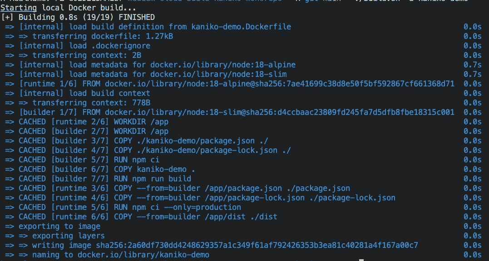

# Monorepo:使用 Kaniko +云构建的动态多级 Docker 层缓存

> 原文：<https://levelup.gitconnected.com/monorepo-dynamic-multi-stage-docker-layer-caching-using-kaniko-cloud-build-7e201035b30b>

在这篇简明的教程中，我将向您展示一种在 monorepo 中共享您的应用程序的 Docker 文件的好方法，并使用 Kaniko 和 Cloud Build 来缓存所有多阶段 Docker 层。


# 追踪

这篇文章是我之前的一篇文章的后续，你可以在这里找到。

[](/multi-stage-docker-layer-caching-using-kaniko-cloud-build-7e46395fb2c2) [## 使用 Kaniko +云构建的多级 Docker 层缓存

### 简要介绍如何在云构建中使用 Kaniko，并验证多阶段 Docker 映像是否被正确缓存。

levelup.gitconnected.com](/multi-stage-docker-layer-caching-using-kaniko-cloud-build-7e46395fb2c2) 

您可以将本文视为一个“高级”版本，它是在 monorepo 用例的基础上创建的，其中几个服务共享同一个 Dockerfile，这至少在我的工作环境中是常见的。

需要注意的是，我不会在本教程中遍历每一行代码，而只会遍历与这个高级版本相关的代码。因此，请务必检查之前的文章。

# GitHub 知识库

要查看使用的代码，请查看我为本文创建的 [GitHub 库](https://github.com/mr-pascal/medium-cloud-build-kaniko-monorepo)。

[](https://github.com/mr-pascal/medium-cloud-build-kaniko-monorepo) [## GitHub-Mr-Pascal/medium-cloud-build-kaniko-mono repo

### 此时您不能执行该操作。您已使用另一个标签页或窗口登录。您已在另一个选项卡中注销，或者…

github.com](https://github.com/mr-pascal/medium-cloud-build-kaniko-monorepo) 

# 文件夹结构

因此，让我们首先浏览一下我们的文件夹结构和我们将在本文中讨论的单个文件

```
|- kaniko-demo/
|- kaniko-demo2/
|- build.sh
|- cloudbuild.yaml
|- Dockerfile
```

*   我们的演示应用程序。只是一个新的 Nest.js 应用。
*   `kaniko-demo2` —另一个演示应用。只是一个新的 Nest.js 应用。
*   `build.sh` —一个带有参数的小型 shell 脚本，有助于简化我们的构建，以构建本地 Docker 映像或将构建提交到云构建。
*   `Dockerfile` —两个演示应用程序使用的 Dockerfile 文件。

# 代码

为了使之前的[教程](/multi-stage-docker-layer-caching-using-kaniko-cloud-build-7e46395fb2c2)中的示例为 monorepo 设置中的流线型构建步骤做好准备，我们必须调整`Dockerfile`、`cloudbuild.yaml`并提供一种通过 shell 脚本构建映像的动态方式。

## Dockerfile 文件

一般来说，你的`Dockerfile`在你的应用程序的文件夹里。有了 monorepo，你仍然可以走这条路。即使您经常想要共享 Docker 构建配置，而不是为每一个服务复制&粘贴它。

为此，您的`Dockerfile`需要更加通用，并且位于您的服务文件夹之外。

我们来看下面的`Dockerfile`。该文件与上一篇文章中的文件几乎相同，尽管有四行代码是新的，并标有`## NEW!!`注释，所以您更容易发现。

我们到底在那里做了什么？

由于 Docker 文件在实际的服务文件夹之外，我们必须为 Docker 提供一个指向源代码的路径，因为它可能在任何地方。为此，我们添加了一个名为`SRC_DIR`的构建参数。这个参数稍后将被设置为我们的服务的文件夹名，例如`kaniko-demo2`。使用这个参数，我们可以动态地构建到`package.json`、`package-lock.json`和剩余源文件的文件路径。

对于`Dockerfile`，我们没有什么需要改变的了。

## cloudbuild.yaml

当然，我们还必须告诉云构建配置，它现在必须构建 Docker 映像。这里我们还必须更改三行代码

使用`--dockerfile=${_DOCKER_FILE}`参数，我们告诉 Cloud Build 和 Kaniko，将有一个`_DOCKER_FILE`参数传递给 Cloud Build 命令，Kaniko 应该使用这个参数作为到`Dockerfile`的路径。

`--build-arg=SRC_DIR=${_APP}`表示将传递一个`_APP`参数，Kaniko 应将该参数用作 Docker 构建参数`SRC_DIR`的值，该参数在`Dockerfile`中定义。

最后但同样重要的是，我们必须调整`--destination`参数的值。我们需要使用`${_APP}`而不是硬编码的`kaniko-demo`。

所以你看，`cloudbuild.yaml`的变化也是毫不费力和直接的。

## build.sh

但是现在，让我们通过设置定制构建脚本来进入更激动人心的部分。

在下面的`build.sh`文件中，我将向您展示如何通过共享的`Dockerfile`动态构建您的应用程序，而不会增加构建上下文。

首先，您可能会忽略前 35 行代码，因为它们更像是“辅助代码”，而不是重要的逻辑。但简而言之，这段代码为您的 shell 脚本提供了接受一个`-c`标志和一个`-a $APP`参数的可能性。

最后，您可以通过这些命令运行以下构建脚本:

```
# Build "kaniko-demo" app on your local machine
./build.sh -a kaniko-demo# Build "kaniko-demo" app on Cloud Build
./build.sh -c -a kaniko-demo
```

我试图在 shell 脚本的重要部分添加一些有意义的命令，但是让我们一起来看一下它的几个部分:

首先，我们为什么需要专用的 Dockerfile 和。dockerignore？

你可能认为你不需要一个专用的`Dockerfile`,因为无论如何都是相同的命令，对吗？但是有一个技巧，为什么它仍然是必需的，当我们将参数传递给`docker build`命令时，您将在本文的后面找到这个技巧。

另一方面，`*.dockerignore`非常重要。我认为构建文件夹`dist`和`node_modules`文件夹应该总是被排除在外，这是很清楚的常识。但是为什么我们首先忽略一切，然后显式启用我们想要构建的应用程序的源文件夹呢？

Docker，还有云构建，总是接受构建上下文。在脚本中，通过`.`获取当前文件夹，其中包含所有文件和服务。当然，这不是您想要的，因为您只想构建一个服务。为了实现这一点，我们首先忽略所有内容，然后将实际的服务源代码放回去。

## 添加参数

现在临时的`Dockerfile`和`.dockerignore`文件已经创建，我们可以提供`gcloud builds submit`和`docker build`命令服务名以及它们应该使用的`Dockerfile`。

```
## Build via Cloud Build
gcloud builds submit --region europe-west2 \
            --config cloudbuild.yaml \
            --ignore-file $DOCKER_IGNORE_FILE \
            --substitutions _DOCKER_FILE=$DOCKER_FILE,_APP=$APP \
            .# Build via local Docker
docker build -t $APP -f $DOCKER_FILE --build-arg SRC_DIR=$APP .
```

您可能会注意到没有为`docker build`命令定义特定的`.dockerignore`文件。但这不是问题。得益于 Docker v19.03 版本，Docker 足够聪明，可以根据提供的`Dockerfile`的名称加载自定义的`.dockerignore`文件:

> Docker 客户端首先尝试加载`<dockerfile-name>.dockerignore`，如果找不到，则退回到`.dockerignore`。所以`docker build -f Dockerfile.foo .`首先尝试加载`Dockerfile.foo.dockerignore`。

## 运行/构建它

现在我们完成了配置，可以使用`build.sh`脚本运行构建，如下所示:

```
./build.sh -a kaniko-demo
```



。/build.sh -a kaniko-demo

## 你想联系吗？

如果你想联系我，请在 LinkedIn 上联系我。

另外，可以随意查看[我的书籍推荐](https://medium.com/@mr-pascal/my-book-recommendations-4b9f73bf961b)📚。

[](https://mr-pascal.medium.com/my-book-recommendations-4b9f73bf961b) [## 我的书籍推荐

### 在接下来的章节中，你可以找到我对所有日常生活话题的书籍推荐，它们对我帮助很大。

mr-pascal.medium.com](https://mr-pascal.medium.com/my-book-recommendations-4b9f73bf961b) [](https://mr-pascal.medium.com/membership) [## 通过我的推荐链接加入 Medium—Pascal Zwikirsch

### 作为一个媒体会员，你的会员费的一部分会给你阅读的作家，你可以完全接触到每一个故事…

mr-pascal.medium.com](https://mr-pascal.medium.com/membership)