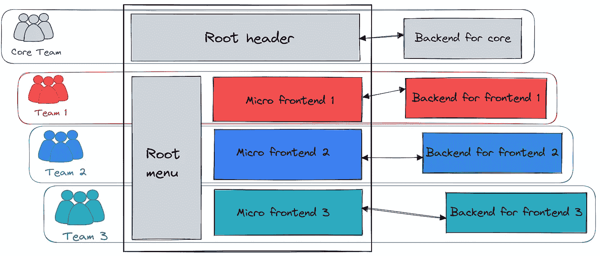
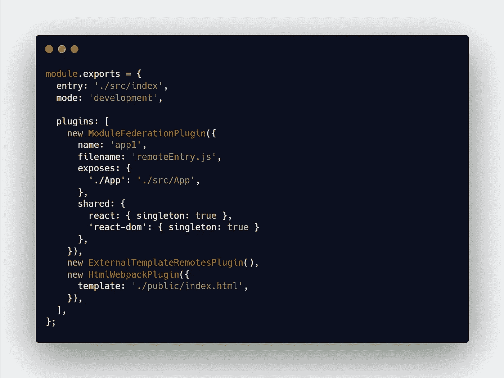
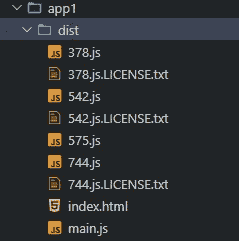
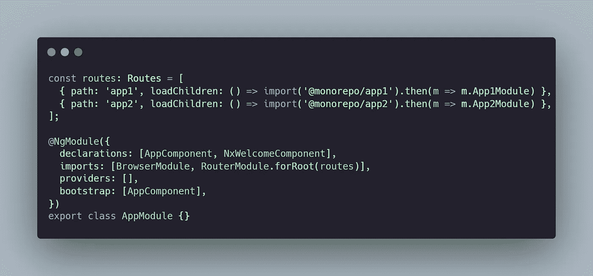
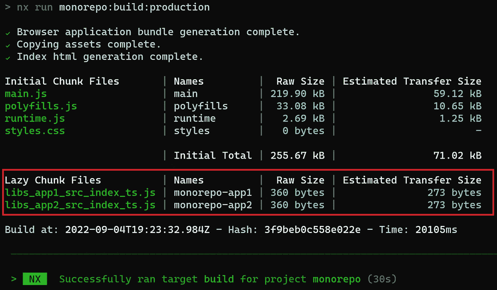
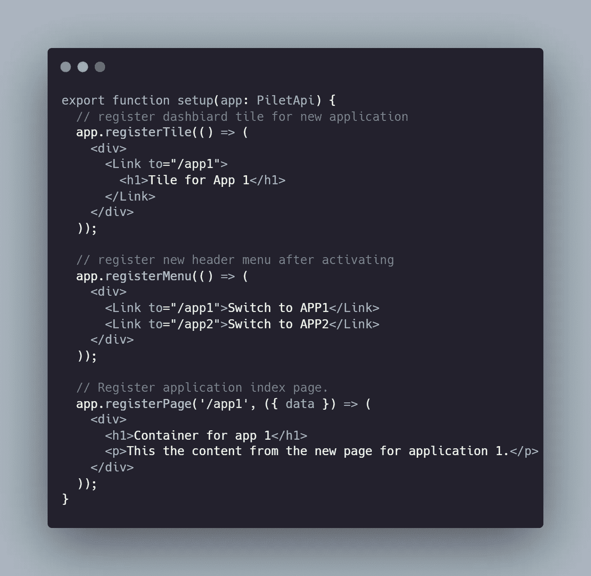
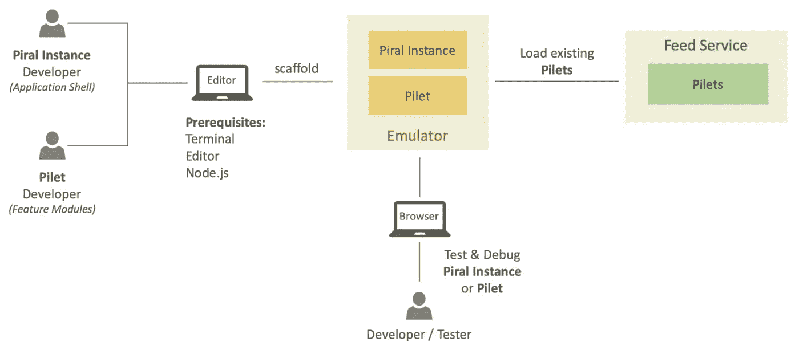

# 面向微前端的 Monorepo 从隔离到推广

> 原文：<https://levelup.gitconnected.com/monorepo-for-micro-frontends-from-isolation-to-generalization-68c62afd0c13>

> 当你读这篇文章的时候，我勇敢的祖国乌克兰正在和俄罗斯恐怖分子战斗。每个人都可以向支持基金捐款，并通过关注 21 世纪欧洲最大的战争来提供帮助。不要沉默。

作为一种设计模式，微前端继承了微服务领域最重要的架构特征——“团队分离和独立部署”。这意味着一个特定的 UI 页面可能由不同版本和生命周期的模块组成。

为什么这很重要？它在许多分布式团队之间共享对单个应用程序的支持方面提供了更大的灵活性，这些团队有自己的开发和部署规则和周期。

可独立部署和管理

但是真正的孤立不仅仅是利益的问题。有很多最终会对整体用户体验产生负面影响的“缺点”:

*   **一致性**:从最终用户行为的角度来看，确保由不同独立团队开发的不同应用程序部分看起来和感觉上完全相同始终是一个挑战。
*   **代码重用和开发速度**:避免在独立的团队之间重复实现相同的功能是另一个挑战。如何确保真正孤立的团队有足够的关于公共模块的共享信息，以避免重复实现轮子？
*   **性能**:在真正独立的开发模式下，相同的依赖项可能会在不同的包中重复，从而增加整体资源大小，进而影响整体负载和渲染性能
*   **冲突**:当在不同的包中使用相同依赖项的不同版本时，也存在冲突的风险

Monorepo 旨在完全解决或最大限度地减少这些障碍的影响。显然不是免费的，而是对开发过程施加了一些约束。

让我们通过约束开发过程的比率来回顾一下 mono repo 和微前端实现的一些组合

# 具有 Webpack 模块联盟的 Lerna

最经典的微前端实现使用 [Webpack module federation 插件](https://webpack.js.org/concepts/module-federation/)将单个 SPA 捆绑包分割成分别代表插件/应用程序的文件块。

[Lerna](https://lerna.js.org/) 是一个 monorepo 框架，有助于将许多不同的应用程序(单个前端)封装在一个可以共享公共数据的工作空间中(就像 monolith 项目中不同的模块共享一个代码库一样)。

因此，在应用程序开发中保持足够高的个性化，同时我们可以在它们之间共享公共部分，同时改善下一个特性:*一致性*和*代码重用*。同时，解决方案足够灵活，可以支持不同的前端应用程序的不同 UI 框架。

此操作的结果—应用程序包将被分割成一组文件，分别代表应用程序本身和核心可共享模块。

构建结果

到目前为止一切顺利。APP1 的下一次升级可能只包括更新特定的应用程序特定的文件，而不涉及核心。这使得“团队 1”在其交付周期中是独立的。

stackblitz 示例

## 设计特点:

✔️每个模块单独构建—每个模块团队分离是可能的

✔️隔离模块端到端验证(不涉及其他模块)

应用程序外壳的✔️独立构建(引用所有模块)—核心团队支持通用功能集，如启动时的身份验证

✔️框架不可知——团队可以足够灵活地使用不同的工具

🔴跨模块的一致性——该插件不强制任何约束或规则，只是提供基于配置的粒度

🔴配置层是分离的，在特性开发过程中需要额外的控制，因此存在混合依赖、版本冲突等风险。

🔴在低层次上操作，并且仅用于产生分离的构建工件，因此不能保证将所有模块自然集成到单个应用程序中(就像在加载后改变根容器行为一样)，因此需要额外的努力来改进模块化架构特性

# NX 和 Angular，带延迟加载模块

如果你能负担得起一个同质的解决方案(在 Angular 生态系统中)，Angular 本身可以足够有效地构建微前端。

对惰性加载模块的支持赋予了每个模块独立团队的能力，并“相对”独立地支持每个模块。

这种路由配置的构建结果将包括每个懒惰加载模块的单独的应用文件。

构建结果

使用单个框架设计微前端的所有部分，并封装在单个 monorepo 中，这允许连接的团队使用协作和组件重用的全部力量，从而立即积极影响许多特性:*一致性*、*代码重用*、*性能、*和*冲突解决*。

到目前为止一切顺利。APP1 的下一次升级可能包括仅更新特定的应用程序专用文件，而不触及核心。这使得“团队 1”在其交付周期中是独立的。

动手示例

## 设计特点:

✔️每个模块单独构建—每个模块团队分离是可能的

🔴不支持独立模块端到端验证(不涉及其他模块)，因为该模块是整体解决方案的一部分，并重复使用该解决方案的一部分。

应用程序外壳的✔️独立构建(引用所有模块)—核心团队支持通用功能集，如启动时的身份验证

🔴基于 Angular 框架，所以不推荐使用当前生态系统之外的插件

跨模块的✔️一致性—模块是单个复合解决方案的一部分，因此可以使用封闭环境中的所有功能

✔️构建过程是高度优化的，并产生一个保证干净的模块，没有冲突和版本不匹配

✔️自然地集成到生成的应用程序中，因此可以访问根容器特性或改变根行为(如加载后添加额外的菜单项等)。).

# 皮拉尔和勒纳

[Piral](https://piral.io/) 是下一代门户应用的框架。它允许构建遵循微前端架构的 web 应用程序。

该框架提供了构建独立应用程序并在沙箱环境中测试它的工具。稍后将其作为单独的页面包含到单个应用程序容器中。

新的应用程序需要实现所需的注册挂钩，以便自然地集成到现有的应用程序中。

`Setup`用于将编译好的模块加载到现有工作空间后，配置新的应用程序。已编译的应用程序—只不过是一个包含运行它所需的所有资源的 tarball 文件。

架构图

该框架支持在将微应用注入公共工作空间之前隔离开发和执行微应用。就绪时—应用程序在提要服务中注册，以动态下载它，在激活时进行配置(使用`setup`配置)，并在应用程序外壳内的客户机上运行。

这种方法提供了最大的开发隔离，同时它本质上是基于插件的。作为 monorepo 应用程序的一部分，可以同时使用核心特性和访问根模块，提高*一致性*和*可重用性*特性。

## 设计特点:

每个模块的✔️Separate 构建—每个模块的团队分离是可能的

✔️隔离模块端到端验证(不涉及其他模块)—是该框架的核心特性之一，它提供了一个沙箱来测试隔离的模块

应用程序外壳的✔️独立构建(引用所有模块)—核心团队支持通用功能集，如启动时的身份验证

✔️框架不可知——采用模块化有共同的规则可循，但模块本身并不要求使用特定的技术

跨模块的✔️一致性—模块是单个复合解决方案的一部分，因此可以使用封闭环境中的所有功能

✔️构建过程得到了足够的优化，并产生了一个自给自足的模块工件

✔️自然地集成到生成的应用程序中，因此可以访问根容器特性或改变根行为(如加载后添加额外的菜单项等)。)

## 摘要

真正的团队隔离是有代价的——从长期角度来看，一致性和代码重用受到影响，因为核心团队的控制有限。

与此同时，monorepo 模型锁定了一个特定的框架，这使得所有团队更加依赖于一个核心，这个核心通常会影响团队的速度和整个应用程序的发展速度。

在微前端解决方案中，每个应用程序都有独立的存储库，这带来了更好的开发速度，但也带来了应用程序之间更差的一致性和更差的代码重用实践。相反，Monorepo 增加了完整的应用程序控制，尤其是在应用最佳设计和代码重用实践的环境中。

## 进一步阅读

如果你喜欢阅读这篇文章，请看看其他基于 monorepo 解决方案经验撰写的帖子。

 [## 构建复杂的项目

### "简单是可靠的先决条件."埃德格·w·迪克斯特拉

levelup.gitconnected.com](/structuring-complex-projects-5a4cb3b80fe5)  [## 我做错了什么—依赖管理和 monorepo

### 在分布式架构中支持多重依赖是一个巨大的挑战，尤其是当康威定律…

medium.com](https://medium.com/codex/what-i-was-doing-wrong-dependency-management-and-monorepo-816c698ab9f)  [## 测试复杂的单声道项目

### 你不能强制要求生产力，你必须提供工具让人们成为最好的。

levelup.gitconnected.com](/testing-complex-mono-projects-ea06dc879f2)