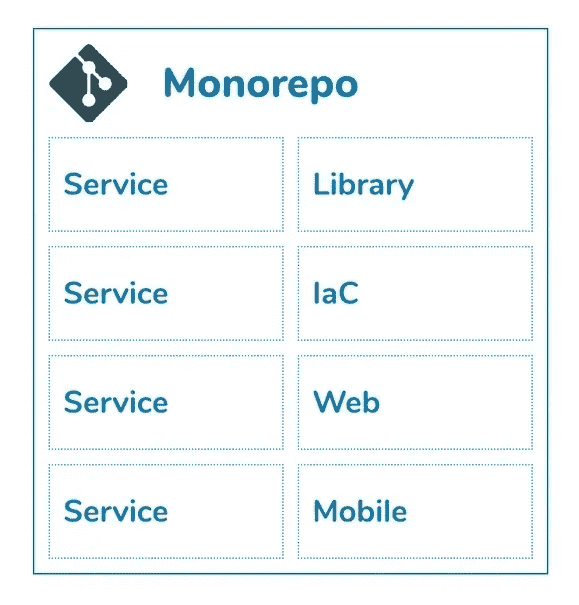
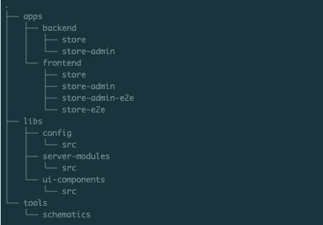
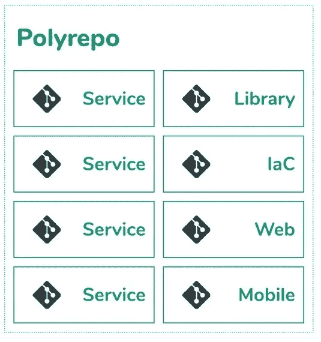
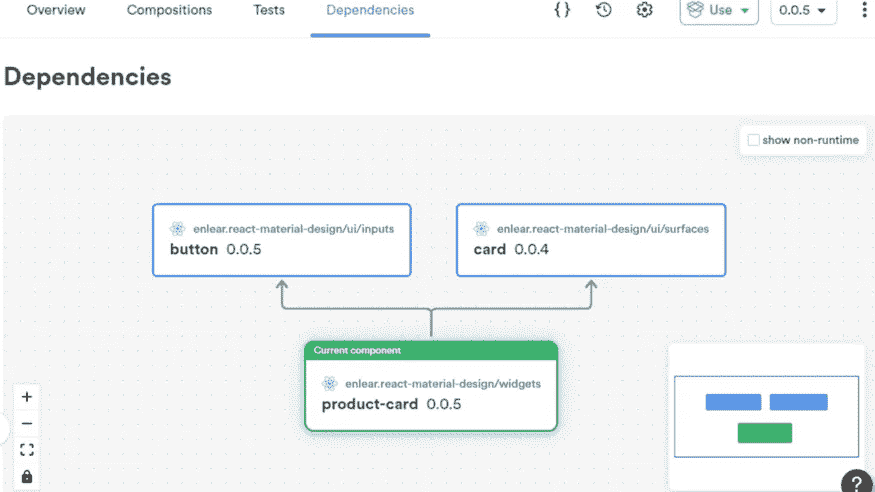

# Monorepo vs Polyrepo vs 独立组件

> 原文：<https://levelup.gitconnected.com/monorepo-vs-polyrepo-and-independent-components-ecc7c3b2676b>

## 为 JavaScript 项目选择 Monorepos vs Polyrepos vs 独立组件

作为开发人员，选择 Monorepo 还是 Polyrepo 方法是我们在项目开始时决定的。最后的决定是在考虑了范围、团队动态、模块的内聚性等因素后做出的。

如果我告诉你，你的决定可能会受到一种被称为独立组件的新兴技术的挑战，那该怎么办？

因此，本文将探讨 Monorepos、Polyrepos 和独立组件，以及帮助您选择正确的项目结构的好处。

# 单一回购 vs 多重回购

我们先从了解 Monorepos 和 Polyrepos 这两个模型开始。

## Monorepos

顾名思义，Monorepo 使用一个存储库来存储一个应用程序或整个应用程序套件的所有模块。

单报告表示

Monorepo 结构由一个代码存储库组成，该存储库具有包含几个项目的分层目录结构。例如，在同一个存储库中，您有后端、前端和共享模块，如下所示。

单回购的结构

## 聚 repos

Polyrepo 是一个术语，我们用它来表示我们使用不同的存储库来存储应用程序的不同部分，或者只是用于不同的应用程序。每个存储库边界背后的决策通常围绕着团队治理、发布范围、模块之间的内聚性等等。

例如，您可以使用不同的存储库来存储前端代码，而使用另一个存储库来存储后端代码。如果有共享代码，您甚至可以创建一个库项目，并将其放入包注册表中，供其他人重用。

聚合报告表示法

但是，正如您所看到的，拥有大量的存储库对任何团队都没有帮助。相反，它会增加协作、治理、共享代码、管理发布生命周期和测试的开销。

因此，在推进 Polyrepos 时，将存储库的数量保持在可管理的水平是至关重要的。

# 独立组件

> Monorepo 和 Polyrepo 都着眼于项目结构和源代码控制的宏观方法。但是，如果我们反过来看呢。

定义为一个单元有意义的项目结构的最小单元是什么？

1.  如果我们将一组文件表示为一个单元(例如，React 组件、节点模块)。
2.  具有独立于代码库其余部分的生命周期。
3.  能够在外部共享组件

我们有**独立元件**。

因此，这难道不类似于为每个组件创建一个 NPM 存储库并将它们存储在外面吗？**没有！**

众所周知，通过将每个组件保存在各自的库中来构建前端甚至后端是不现实的。随着组件数量的增加，这将增加如此多的开销，这将限制团队向前发展的生产力。

> 但是，如果我告诉你， [Bit](https://bit.dev/) 将使每个组件独立于我们，而我们可以像过去一样专注于开发应用程序。有趣吧？

 [## 独立组件:网络的新构件

### 为什么你所知道的关于微服务、微前端、monorepos 甚至普通的旧组件库的一切…

blog.bitsrc.io](https://blog.bitsrc.io/independent-components-the-webs-new-building-blocks-59c893ef0f65) 

使用 Bit，每个组件都被创建为一个独立的单元，可以导出(推送)到远程作用域。本质上，每个组件都有一个存储库。

这些独立的组件回购可以克隆到一个单一的位工作空间，在那里它们通过一个单一的配置文件进行管理，并组合在一起形成新的组件或应用程序。

具有依赖性的独立组件

为您的应用程序提供简单的构建块允许您共享代码、并行工作，并显著减少构建时间。

**但是，它与 Monorepos 和 Polyrepos 有什么关系？**要理解这一点，需要了解代码的位结构及其生命周期的细节。所以，我们先来看看细节。

## 以不同的方式理解位及其与结构代码的联系

假设您为单个按钮编写了一个具有独特样式和设计的 React 组件，并将其导入 React 应用程序的不同页面。

> 如果你想让网站的按钮风格一致呢？

您必须将应用程序中的组件复制并粘贴到您的网站代码中(假设它们都是使用 React 构建的)。如果你有一个独立的按钮组件，你可以把它导入到网站中。

使用 Bit，项目中的所有组件在设计上变得独立，并被导出到远程范围。所以它更像是云中的一个注册表，由 Bit 甚至是你来管理(你可以托管自己的版本，因为 Bit 是开源的)。

> 这是一个相当新颖的概念。最好的办法是[尝试一下](https://harmony-docs.bit.dev/getting-started/installing-bit/)来理解潜在的概念以及它在实践中是如何工作的。

您会惊讶地看到它提供的抽象，让您感觉您是在 Monorepo 上工作，但是提供了在外部共享组件的灵活性。

# 那么这些东西是怎么联系起来的呢？

如果您使用 Bit 将应用程序构建为独立组件的集合，它将在两个不同的级别上处理代码结构:工作区和远程范围。

## **位作为单报告**

*   使用 Bit，你可以创建一个工作空间，独立地创建属于多个项目的组件。(基本上，您的工作空间是用 Git 版本化的)
*   在工作区内，每个单独的组件都被 Bit 跟踪，并被导出到一个远程 Bit 范围，在这里对其进行版本控制。
*   因此，每个独立的组件被联网成为一个无限的虚拟 Monorepo，这是因为 bit 管理这些组件之间的依赖关系。
*   如果一个组件引用另一个组件，它将通过远程作用域，使它们实际上是独立的。
*   如果一个组件被修改和导出，它的所有依赖项将使用它们的 Ripple CI 逐位测试，确保整个依赖树按预期工作。

因此，独立组件提供了标准 Monorepo 的所有优势，并通过在更细粒度级别管理依赖关系时提供灵活性来扩展它。

## 作为聚合报告的位

*   您可以将您的应用程序(或套件)分成范围和工作区。
*   每个工作区都可以以 Polyrepo 风格存储在 Git 存储库中。
*   您还可以决定如何将它们分组到具有相关权限的位范围(组件的远程集合)中。
*   这使得组件可以跨多个工作区共享。

但是，使用 Bit 时有几个限制，值得一提。

## **使用位**的限制

*   Bit 支持前端开发目前主要支持 React 和 React Native 和 NodeJS。对于 Angular 或者 Vue，你得用他们之前的版本。
*   Bit 最适合 JavaScript 生态系统代码，比如节点、UI 框架和 Typescript。

作为参考，我还创建了一个表格来比较这些风格。

# Monorepo vs Polyrepo vs 独立组件

对照表

# 结论

简单地说，独立组件更像是 Polyrepo 和 Monorepo 的混合体，拥有两个世界的品质。

我希望您对不同的方法有一个基本的了解。如果你有任何问题，欢迎在下面评论。干杯！