# 带 R 的病态统计

> 原文：<https://levelup.gitconnected.com/morbid-statistics-with-r-6023684aa9bc>

从了解和使用一些 Google APIs 这个(相对)轻松的话题继续，我想做一些专注于一些真实世界数据的实际分析的事情。这就是本周的本周数据集的来源——由《华盛顿邮报》维护的警察杀人名单，可在此处获得。我会看一些有趣的(有趣？)数据的特征，并用 r 进行一些推理测试。我们想要回答的一些问题是“种族和致命的警察枪击之间有关系吗？”(是)以及“警察开枪致死的受害者的平均年龄是否因种族而异？”(也是)。让我们看看能找到什么。

我之前的帖子是用 Python 写的，所以我将用 r 做这个练习。第一步是实际获取数据:

```
library(readr) 
df <- fread("[https://raw.githubusercontent.com/washingtonpost/data-police-shootings/master/fatal-police-shootings-data.csv](https://raw.githubusercontent.com/washingtonpost/data-police-shootings/master/fatal-police-shootings-data.csv)")str(df) # should print the following
```

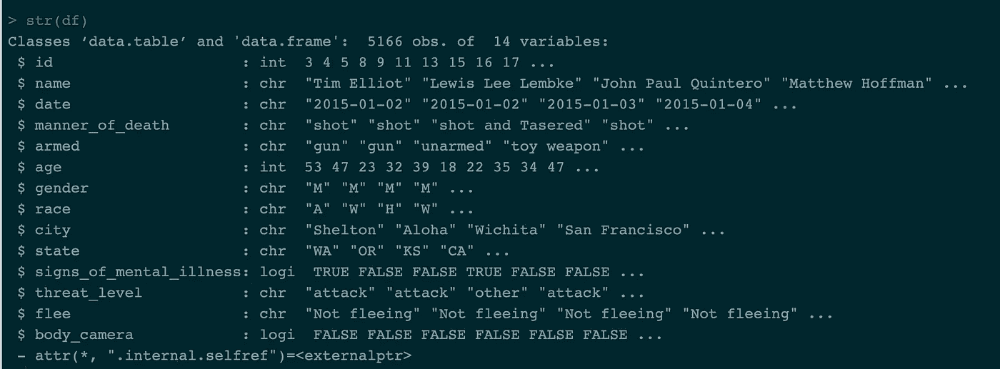

所以我们需要做一些清理工作。首先，让我们寻找 NAs 或缺失值。最简单的方法是在 df 中使用 is.na 函数。虽然这并没有显示 NAs，但是我们应该小心寻找实际上是*NA 的值，但是没有这样编码。*

我们应该确保清理的一个地方是`race`列，因为这将是我们感兴趣的主要列。如果我们用`table`命令查看值计数，我们会看到有许多没有被编码为 NA 的丢失值:

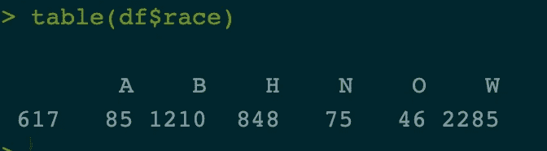

所以我们有 617 起枪击案受害者的种族是空白的。因为我们没有处理这些的好方法，我们可以丢弃这些观察。

```
library(dplyr) # install packages 
df <- (df %>% filter(race != '')) #remove rows w/o race
```

所以现在我们的数据已经为每一次观察进行了种族编码，这是我们可以利用的。我们需要对`gender`列做同样的事情，以确保我们只有“M”和“F”值。

接下来，我们需要考虑我们的变量。r 将这里的许多变量视为字符串(' chr '或 character)，而实际上它们是*因子*或分类变量。在这种情况下，我们将把`id, manner_of_death, armed, gender, race, city, state, signs_of_mental_illness, threat_level, flee`转换成因子。`body_camera`我们可以将保留为逻辑变量，将年龄保留为数值。我的代码很难看，一次只处理一个变量。进行大规模转换的更好方法是使用 dplyr:

```
cols <- c('id', 'manner_of_death', 'armed', 'gender', 'race', 'city', 'state', 'signs_of_mental_illness', 'threat_level', 'flee')df[cols] <- lapply(df[cols], factor) #lapply applies the function to all columns 
```

因此，现在我们应该有以下内容，每一列都应该是适当的数据类型，我们不应该有任何无关的因素变量级别:

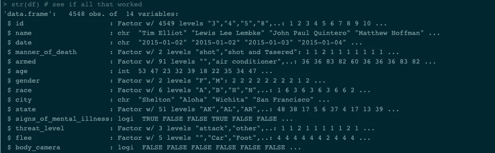

那我们开始看数据吧。

让我们看看文章开头提出的那些问题是否有什么意义。警察枪击受害者的年龄分布如何？

```
library(lattice) 
xyplot(age ~ race, jitter.x = T, data = df) #prints the following
```

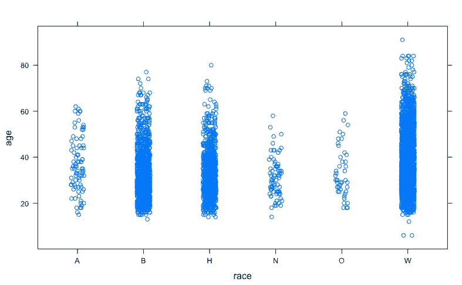

如果我们看同样的统计数据，但是包括性别呢？

```
xyplot(age ~ race | gender, jitter.x = T, data = df) #prints the following
```

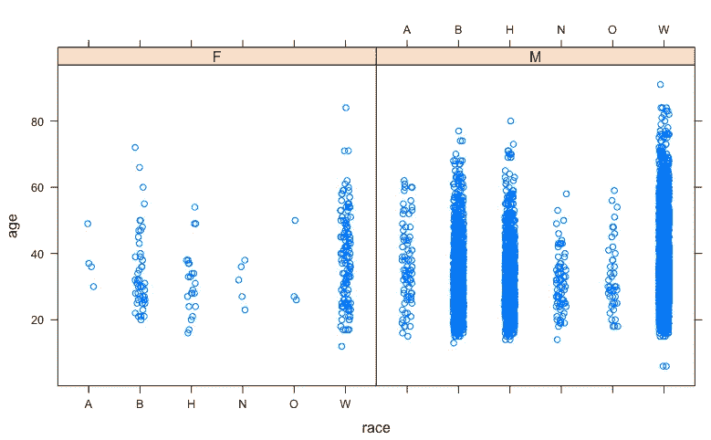

首先，我们可以看到，在这些枪击事件中，男性远远多于女性，但看起来不同种族之间的年龄差距也很大。白人似乎有最大的传播，而黑人和西班牙裔往往更集中在较年轻的年龄。

直方图将更清楚地显示分布情况。我们不应该期望有太大的差异:`summary(df$age)`显示我们数据的第三个四分位数是在 45 岁，所以我们的大多数观察结果会稍微偏年轻一些。为了说明直方图方法(并防止事情变得过于拥挤)，我将只使用白人和黑人受害者来绘制直方图。

```
library(ggplot2) # for plotting plt <- df[df$race == 'B' | df$race == 'W',] %>% ggplot( aes(x = age, fill = race)) + 
  geom_histogram( alpha = .6, position = 'identity') +
  labs(fill = '')
plt # prints the following:
```

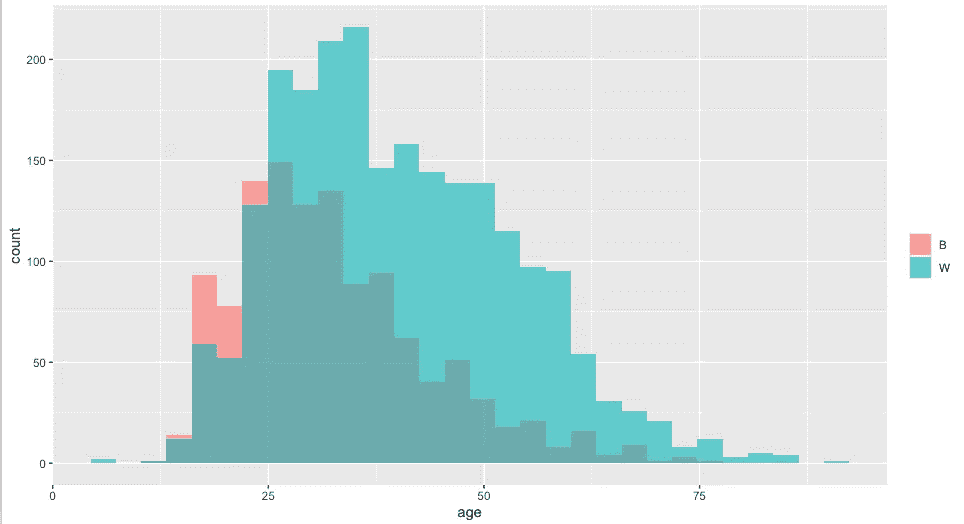

这里我们可以看到实际上白人受害者比黑人受害者多，但是黑人受害者的年龄偏年轻(尽管最年轻的受害者看起来是白人)。让我们继续添加每组的平均值和中值，这样我们就可以对差异有一个准确的感觉。

我们还可以使用面包裹一次获得六个直方图(这里我们将使用灰度级以提高可见性，因为默认的 ggplot 调色板对于我们这里的数据来说有点…亮):

```
plt <- df %>% ggplot( aes(x = age)) + 
  geom_histogram( alpha = .9, position = 'identity') +
  facet_wrap(~race)
# plt ## print to see chart -- prints the following: 
```

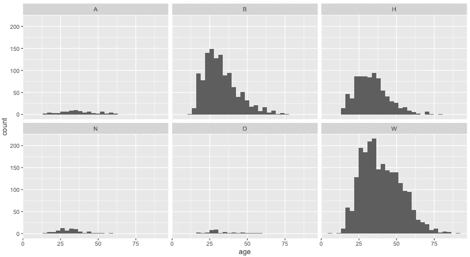

所以，看起来我们有很多白人受害者，但是黑人受害者更年轻；黑人、白人和西班牙裔受害者占我们样本的绝大多数。我们应该添加一些集中趋势的描述符。让我们添加代表每个种族受害者平均年龄的线。最简单的方法是在我们的原始数据框架中添加一个新列，其中包含每组的中间值。使用 dplyr，这相对简单:

```
df <- df %>% group_by(race) %>% mutate(med = median(age), 
mean = mean(age) # Adds columns for median and mean for each group
```

我们现在可以检查每个方面的中心趋势:

```
plt %+% geom_vline(aes(xintercept = med)) 
%+% geom_vline(aes(xintercept = mean), lintype = 'dotdash') 
# prints the following
```

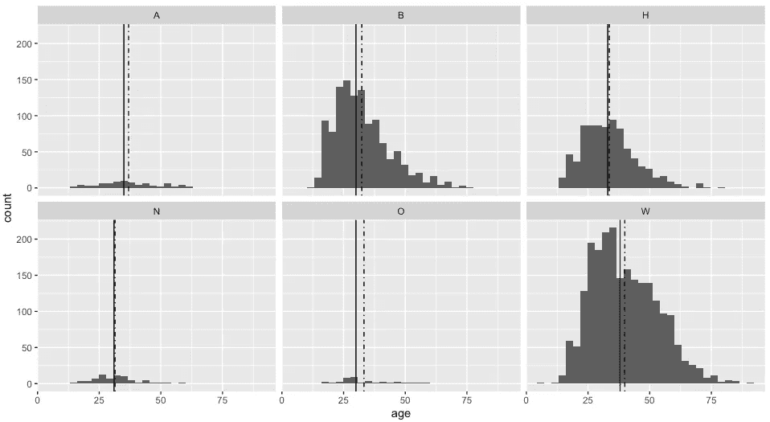

所以现在我们可以看到每个种族群体的中间值(实线)和平均值(点划线)。

这些方法之间有显著的不同吗？我们可以计算一些统计数据来检验均值之间的显著差异。首先，我们检查每个种族群体平均年龄的实际数值:

```
df %>% group_by(race) %>% summarize(mean_age = mean(age))
#prints the following
```

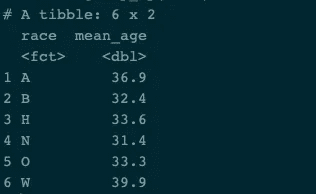

现在让我们来看看平均值之间的差异是否有统计学意义。我们将在这里做两个测试:t 测试和 Tukey 诚实显著差异测试。t 检验假设样本变量的分布(在我们的例子中是年龄)遵循正态分布，这在这种情况下可能是正确的(即我们可以假设在所有美国成年人中年龄遵循正态分布)，样本的方差是正确的。我还没有计算样本的方差，但是 R 允许我们改变一个参数，来表示方差是否为真。在这种情况下，我们不会做这样的假设，所以我们将执行一个版本的韦尔奇的 t 测试，而不是更熟悉的学生的 t 测试。既然我们在这种情况下仅限于比较两种方法，让我们比较黑人和白人受害者。

```
b_and_w <- df[df$race == 'B' | df$race == 'W',]
b_and_w$race <- droplevels(b_and_w$race) # can only have 2 levels
mod1 <-  t.test(b_and_w$age ~ b_and_w$race)
mod1#prints the following 
```

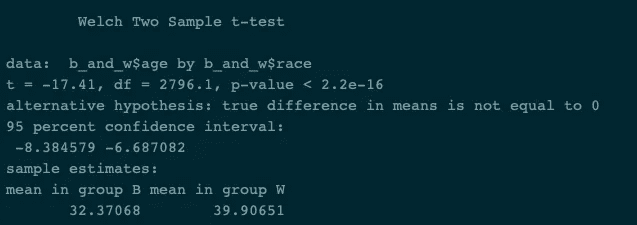

我们可以看到，事实上黑人和白人受害者的年龄有很大的差别；黑人受害者往往年轻 7 岁左右，这在 95%的水平上是显著的。

不是为每一对均值构建 t-检验(有六个不同的因子水平，我们必须构建 15 个不同的检验——尽管注意，R 确实通过在 t-检验函数中包含一个成对选项使这变得有些容易。这不是一个*双样本*测试，但将计算每对相关组之间的测试统计量)，我们可以生成一个 ANOVA 表，并使用 Tukey HSD 测试来检查每个种族的平均年龄和“大平均值”之间的差异，即所有受害者的平均值。通常我们在所谓的“[随机区组](https://en.wikipedia.org/wiki/Blocking_(statistics))实验中使用这种测试，但它在这里也应该有效。下面是如何构建它:

```
mod2 <- aov(age ~ race, df) tukey <- TukeyHSD(mod2)tukey #prints the following
```

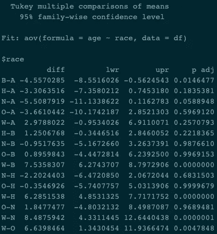

为了图形化地查看效果，我们可以调用`plot(tukey, las = 1)`。las 参数改变标签的方向以提高可读性—参见 DataCamp 的[文档](https://www.statmethods.net/advgraphs/axes.html)。我们从图中得到的是这个数字:

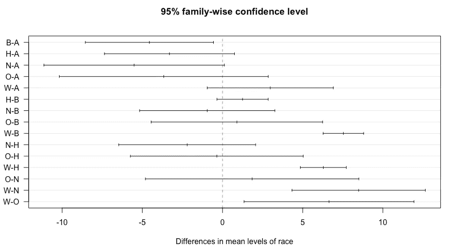

在这里，我们可以看到许多偏离 0 的配对，即在 95%的置信水平下彼此显著不同。这些配对是 B-A，W-B，W-H，W-N，W-O，其中主要包括白人受害者。(还要注意，W-B 和 W-H 受害者之间的置信区间和距 0 的距离最高。)

因此，我们已经确定，在这些受害者群体中，有些人的年龄在统计学上有显著差异。样本中种族的总体分布如何？因为我们在看分类数据，所以合适的测试是独立性的卡方检验。我们在这里测试的是种族独立于致命警察枪击的(无效)假设，即种族分布在枪击受害者样本中，因为我们希望它们基于整体人口的种族分布。

[这篇文章](https://mgimond.github.io/Stats-in-R/ChiSquare_test.html)很好地介绍了卡方分布，这是一种在各种情况下都很常见的分布——你可能在介绍生物或遗传学的课上熟悉卡方分布(反正我是在那里第一次遇到它们),卡方分布是将遗传结果与预期分布进行比较(有人知道是普内特分布吗？).但是在其他情况下，比如 T4 陪审团中的种族代表或者刑事司法中的种族代表也被证明是有用的。

首先，卡方分布是什么样的？我们可以自然地用`curve`函数在 R 中生成一条曲线。在我们的样本中有六个种族，所以我们知道我们将有 5 个自由度。让我们画出具有 5 个自由度的卡方分布曲线；我们还将对与检验统计的临界值相对应的区域进行着色(即检验统计允许我们拒绝零假设的区域)。

```
curve(dchisq(x, df = 5), from = 0, to = 50) # print the basic figure ## add shading for the critical values at 95% upper <- qchisq(.975, 5)upper_95 <- seq(upper, 50)
p_upper_95 <- dchisq(upper_95, df = 5)curve(dchisq(x, df = 5), from = 0, to = 50)polygon(c(upper_95, rev(upper_95)), c(p_upper_95, rep(0, length(p_upper_95))), 
        col = adjustcolor('red', alpha = .3), border = NA)## note: adapted from [https://www.statology.org/how-to-easily-plot-a-chi-square-distribution-in-r/](https://www.statology.org/how-to-easily-plot-a-chi-square-distribution-in-r/)
```

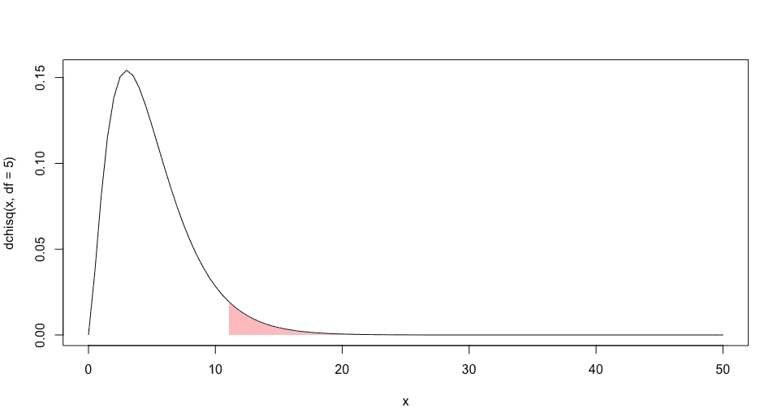

请注意，具有 5 个自由度的卡方的临界值由`qchisq(.975, 5)` = 12.8325 给出，因此我们知道，如果我们对我们的数据进行测试，并找到大于 12.8325 的测试统计，我们可以拒绝零假设，并得出结论，在我们的样本**中观察到的种族比例**与预期分布不匹配。

通常，当我们查看卡方检验时，我们会看到 2x2 矩阵— [本文](http://ismayc.github.io/teaching/sample_problems/test-of-indep.html)给出了一个查看政党认同和对特定税收政策的看法的好例子。虽然这里我们只有我们观察到的计数。我们需要通过观察这个国家的人口统计数据来建立预期的统计数据。幸运的是，我们需要的只是百分比。r 足够聪明，只要我们将包含预期百分比的向量与我们观察到的计数一起传递，就可以构建预期的计数，因此我们可以节省一些工作，并前往[维基百科关于美国人口统计的文章](https://en.wikipedia.org/wiki/Demographics_of_the_United_States)，以获得我们预期的种族分类。为了简单起见，我将假设每个受害者都是一个且只有一个种族，我将使用 2013-2017 年 ACS(美国社区调查-社会学和政治学研究的常见数据源)给出的比例。Wikipedia/ACS 的表格标题如下:

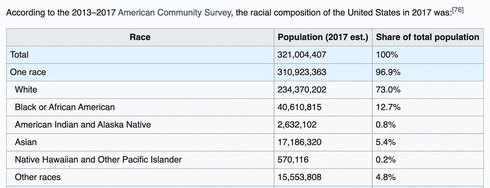

所以我们有了它；我们只需要加入我们期望的比例，然后计算测试统计量。如果我们的百分比加起来不等于 1，r 将抛出一个错误，但这没关系，因为我们可以重新调整我们传入的任何比例。为了生成统计数据，我们将首先按种族制作一个数据表:

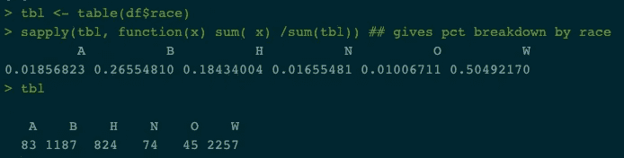

从第一行我们可以看到，我们观察到的比例与我们基于 ACS 结果的预期有很大不同。我们现在创建一个向量来存储预期比例:

```
props <- c(.0504, .127, .176, .008, .048, .615) 
# won't sum to 1 because of rounding errors, identification with two races, etc. 
```

最后，我们用以下公式计算数据的检验统计量

```
chi <- chisq.test(tbl, p = props, rescale.p = T)
chi
```

正如所料，我们的统计数据足够大，可以拒绝零假设:

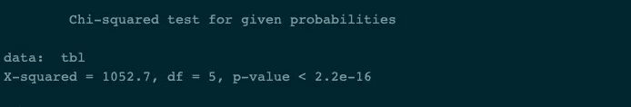

给定这么大的一个测试统计数据，结果的显著性没有太多疑问。基于这个样本，很明显，在致命的警察枪击事件中观察到的种族细分是**而不是**独立于种族的，并且考虑到美国整体的人口统计数据，观察到的分布明显偏离了**预期的分布。**

有多种方法可以扩展对该数据集的分析。我们可以看看人体摄像头，受害者是否有武器(如果有，用什么)，并看看地理。但是我将把进一步的调查留到以后的文章中。我最后要指出的是，随着冠状病毒感染和死亡的消息不断从底特律和新奥尔良等少数族裔人口众多的地方传来，我们看到了可以使用这种分析的其他场景。在这些地区，少数民族和穷人不成比例地遭受冠状病毒的折磨——我们需要做的只是查看一些卡方数据，以确定这不是一种死亡率成比例的病毒。