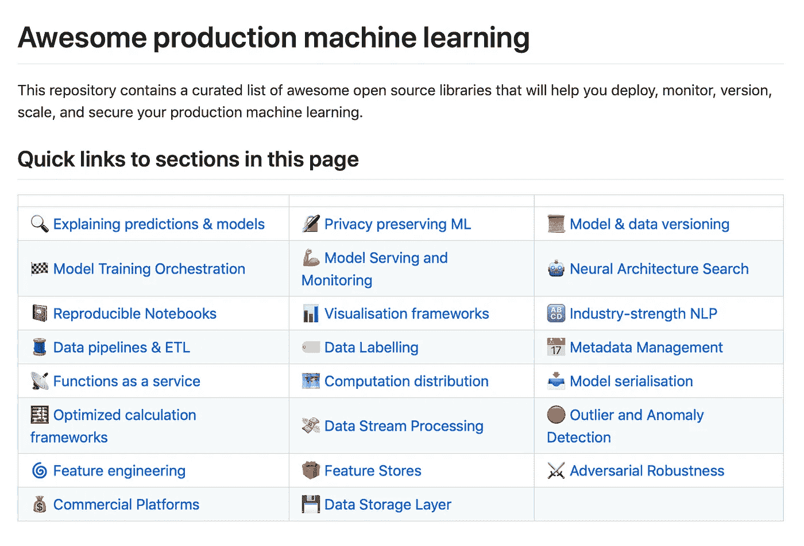

# 三十多个机器学习博客和时事通讯提高了我们的生产力。

> 原文：<https://levelup.gitconnected.com/more-than-thirty-machine-learning-blogs-and-newsletters-that-increased-our-productivity-3825b6b042e2>

## 这些是我和我的同事阅读的博客、网站和时事通讯。这些都是很好的总结，指导我们从机器学习研究到生产。

卢克·坦尼斯在 [Unsplash](https://unsplash.com/s/photos/libraries?utm_source=unsplash&utm_medium=referral&utm_content=creditCopyText) 拍摄的照片

# 研究论文工具

## [arxiv 理智保护者](http://www.arxiv-sanity.com/)和[门德利](https://www.mendeley.com/reference-management/web-importer)

我认为许多研究人员使用 arxiv 明哲保身，但它很少被提及。我使用 arxiv Sanity Preserver 只是为了找到感兴趣的文章。我使用 [Mendeley](https://www.mendeley.com/reference-management/web-importer) 来存储、阅读和标记我通过 arxiv Sanity Preserver 发现感兴趣的 PDF 格式的文章。

# 博客

在过去的八年里，一个更新的现象是博客网站的兴起，它们是 arxiv 的巨大补充。以下是我的“goto”博客网站:

*   谷歌有许多学习计算机科学主题的优秀博客:

1.  [TensorFlow 博客](https://blog.tensorflow.org/)目前有 TensorFlow 核心、TensorFlow js (javascript)、TensorFlow Lite、TFX、社区。
2.  [AI &机器学习](https://cloud.google.com/blog/products/ai-machine-learning)。
3.  Kubernetes 博客独立于 Google now，但是它是一个关于 Kubernetes 的很好的资源。

*   [*中型*](http://www.medium.com/) 是无数按阶级或类别划分的博客在线日报。这是我们的“goto”博客网站之一。此外，媒体出版物，如 *towardsdatascience* 、 *theStartup、机器学习、人工智能、*和 *programming* 解释和总结技术和论文，并向我们展示新的或领先的趋势。
*   蒸馏可能是我最喜欢的博客网站。吸引我的是正在讨论的话题的清晰性。第二画是照明图形。有大量的交互式图形，可能是用手工 JavaScript 完成的。我不得不说:您可以通过 HiPlot 和 Streamlit 的最新版本来接近这些视觉效果，这两个版本将在后面的博客中介绍。
*   [CMU 机器学习博客](https://blog.ml.cmu.edu/#)。CMU 大学的最新研究，主要是机器人技术。所有其他主要机构的人工智能研究博客都可以找到，比如[麻省理工](https://news.mit.edu/topic/artificial-intelligence2)，斯坦福，多伦多，华盛顿大学，哈佛，剑桥(ARM)，等等。此外，世界各地有许多博客网站，即欧盟国家和中国。然而，一些最好的博客文章是用母语写的，比如普通话、粤语、法语或德语。
*   Deeplearning.ai 博客网站是一个列出 Deeplearning.ai 制作的所有课程、不断增长的教程列表、“ *Pie & AI* ”注册和“ *Pie & AI* ”活动描述和日期的网站。我建议你每个月至少去一次 Deeplearning.ai 网站来复习新材料。
*   [NVIDIA 官方博客](https://blogs.nvidia.com/)是他们的深度学习、开发者、游戏、人工智能等主题门户。

# 位置

*   [伦理机器学习](https://github.com/EthicalML)s[awesome-production-Machine-Learning](https://github.com/EthicalML/awesome-production-machine-learning)和[awesome-artificial-intelligence-guidelines](https://github.com/EthicalML/awesome-artificial-intelligence-guidelines)网站。我从这里开始寻找机器学习生产或伦理类别中最新最棒的。

机器学习制作专题。来源:[https://github . com/ethical ml/awesome-production-machine-learning](https://github.com/EthicalML/awesome-production-machine-learning)

*   fast.ai 站点参考了博客、书籍、软件包、社区聊天小组，以及从初学者到 SOTA(最先进的)深度学习的三年课程。套餐和课程都是基于 Pytorch，除了第一门课程是基于 Tensorflow。我期待明年的另一个课程版本和 fast.ai 包的另一个版本。去年，他们在 Swift 上尝试了 Tensorflow。如果接下来的课程介绍朱莉娅，我不会感到惊讶。
*   [realpython](https://realpython.com/) 有我读过的关于高级 python 基础的最好的 Python 教程。Python 初学者以及有多年经验的 Python 软件工程师都可以从这个网站上的教程中学习。
*   [goggle.ai.hub](https://paperswithcode.com/about) 有组件(大部分是 docker 图片)、文档、教程、Jupyter 笔记本、代码、Tensorflow 示例、Kuberflow 管道示例代码等等，都以机器学习为中心。 [goggle.ai.hub](https://paperswithcode.com/about) 的内容可以在你的本地电脑和云端使用。它并不特定于谷歌云平台(GCP)。
*   Kaggle 是机器学习竞赛、与 Kaggle 竞赛相关的人工制品以及机器学习中各种真实世界领域数据集的网站。许多人已经使用 fast.ai 包来学习机器学习技术，将它们放在任何 Kaggle 竞赛的前 10%中。
*   [PapersWithCode](https://paperswithcode.com/about) 不会阻止你在 GitHub 中搜索 Python 包，但会帮助你获得与已发表的机器学习论文相关的源代码。更重要的是，这种社区努力既有*趋势*又有 *SOTA* 标签。PapersWithCode 是对 arxiv 明哲保身的极好补充。

> 《带代码的论文》的使命是用机器学习论文、代码和评估表创建一个免费开放的资源。—[https://paperswithcode.com/about](https://paperswithcode.com/about)

*   datasciencecentral.com 通常没有最好的博客，但这里可能有一些对你有价值的东西。

其他优秀的机器学习博客有:

*   [https://deepmind.com/blog](https://deepmind.com/blog)，
*   https://www.alibabacloud.com/blog[，](https://www.alibabacloud.com/blog)
*   [https://www . itworld Canada . com/blog/2020-the-rise-of-ai-in-the-enterprise/425479](https://www.itworldcanada.com/blog/2020-the-rise-of-ai-in-the-enterprise/425479)，
*   [https://openai.com/blog/](https://openai.com/blog/)
*   [https://blogs.microsoft.com/ai/](https://blogs.microsoft.com/ai/)，
*   h[ttps://research . FB . com/blog/](https://research.fb.com/blog/)(脸书)，
*   ht[TPS://www . IBM . com/blogs/journey-to-ai/](https://www.ibm.com/blogs/journey-to-ai/)，
*   https://ai.stanford.edu/blog/，
*   https://news.mit.edu/topic/artificial-intelligence2，
*   [https://www.csail.mit.edu](https://www.csail.mit.edu/)
*   [2021 年 80 大人工智能博客和网站，](https://blog.feedspot.com/ai_blogs/)
*   并添加您喜欢的企业博客。

# 时事通讯

*   [the sequence](https://thesequence.substack.com/p/the-introductory-post)*Scope*是免费订阅，而 *Edge 有 50 美元/年*订阅费。徽标和引言很好地陈述了他们的使命。

来源: [TheSequence 博客 logo](https://thesequence.substack.com/p/the-introductory-post)

> [这个序列](https://thesequence.substack.com/p/the-introductory-post)是一种不同寻常的方式来学习和强化你关于机器学习和人工智能的知识。

*   [来自麻省理工学院技术的算法](http://newsletters@technologyreview.com/)是一份总结最新机器学习新闻的每周时事通讯。

> 《算法》是为对人工智能世界好奇的人准备的时事通讯。我在这里帮助你穿过废话和行话，找出什么是真正重要的，所有这一切将走向何方。你会在每周五收到我关于最新人工智能新闻和研究的更新和想法(以及一些添加的魔法和迷因)。—郝凯伦，高级记者

*   [**批量**](http://thebatch@deeplearning.ai/) 是吴恩达教授撰写的每周简讯，是 [deeplearning.ai](https://www.deeplearning.ai/) 的几款产品之一。

# 多方面的

## [Datacamp 播客](https://www.datacamp.com/community/podcast)

这些都是很有帮助的播客，尤其是当你无法阅读的时候。

## [数据营备忘单](https://www.datacamp.com/community/data-science-cheatsheets)

我发现把这些打印出来很有帮助。我是守旧派，因为在大多数 Python ide(交互式代码环境——代码编辑器)中，只需一次击键就可以获得 Python 文档片段。

# 摘要

我列出并总结了 2021 年 6 月 8 日以来最有用的博客、网站和时事通讯。鉴于机器学习领域的快速增长，我有信心我已经错过了一些你的最爱，但你可以放心，到 2021 年底将会有新的博客和通讯。

我希望这些博客、时事通讯和存档工具对你来说是新的，也希望其中一些对你有所帮助。

编码快乐！