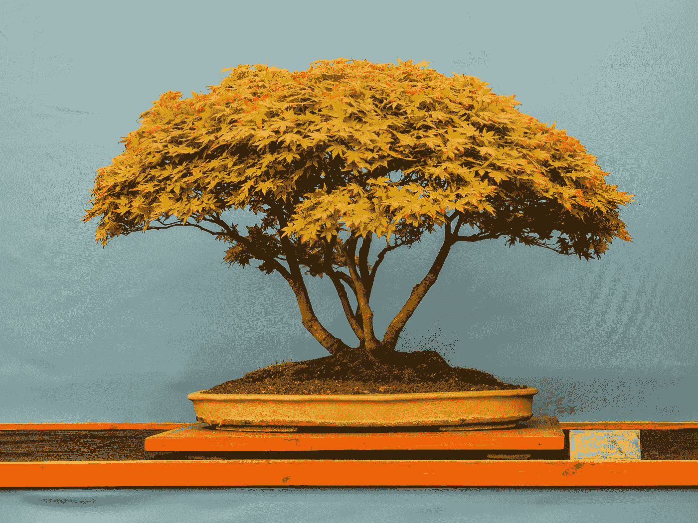
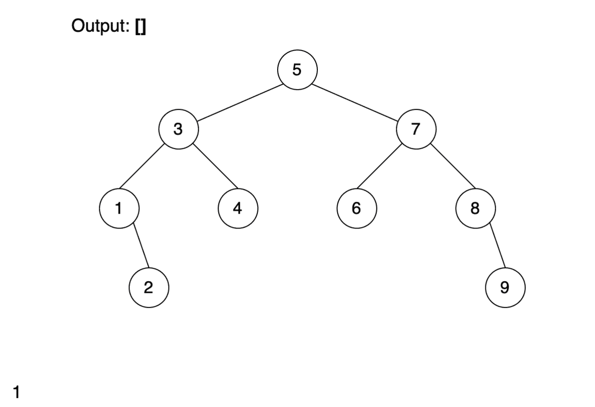

# 二叉树的 Morris 遍历

> 原文：<https://levelup.gitconnected.com/morris-traversal-for-binary-trees-e36e43a665cf>

宝琳·伯恩菲尔德在 [Unsplash](https://unsplash.com?utm_source=medium&utm_medium=referral) 上的照片

二叉树是求职面试中常见的问题，尤其是各种树的遍历。这里我们将讨论从左到右或从右到左的遍历。

## 深度优先搜索

如果我们需要以一种有序的方式遍历一棵二叉树，默认的解决方案是深度优先搜索，它使用一个堆栈。

它可以使用递归调用堆栈或显式使用集合(例如，Java 中的 Deque)。在这两种情况下，算法都具有 O(n)时间复杂度和 O(n)空间复杂度。

递归深度优先搜索

## 莫里斯遍历

我们能做得更好吗？在实际项目中，可能不会。但是如果我们谈论的是工作面试，那么是的。用于有序遍历的 Morris 算法允许你以 O(n)时间和 O(1)空间复杂度遍历一棵树。但是它需要在运行时改变树。

非动画幻灯片在这里是

关键是向左走之前要记住当前节点。当我们注意到已经创建了这样一个连接时，删除它并访问节点。

我们来计算一下复杂度。我们不使用任何其他集合，所以空间复杂度是 O(1)。并且每个节点最多被访问 3 次，所以具有 O(3n)=O(n)的时间复杂度。

很难用在实际项目中，应该是非常具体的案例。在大多数情况下，现有的集合更适合。但是在工作面试的时候可能会被问到。