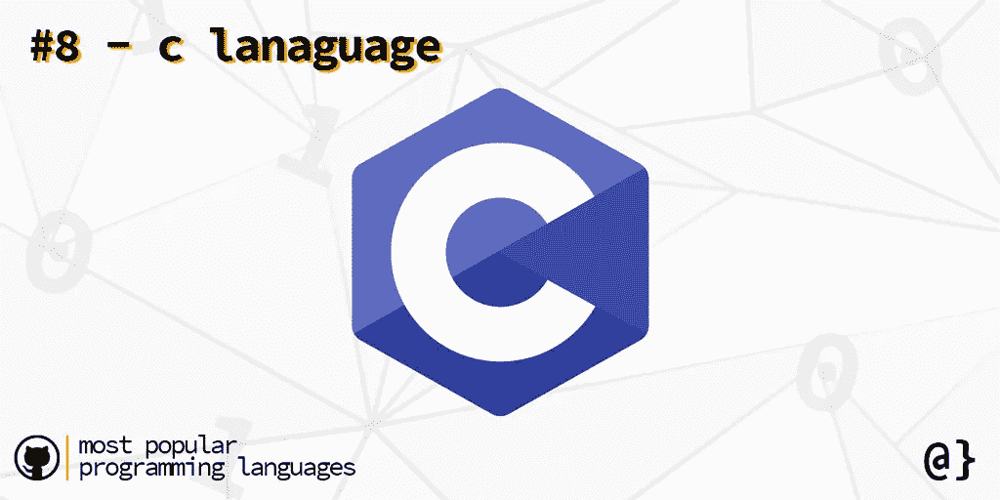

# 2020 年最流行的编程语言——从数字上看

> 原文：<https://levelup.gitconnected.com/most-popular-programming-languages-86c787cd3da1>

## 是什么让一门编程语言流行起来？它是可用的库、成熟度——语法糖吗？虽然这样的定性答案可能不容易回答，但来自 GitHub 的使用数据可以提供更具体的见解。

图片来自[过度编码](https://www.overcoded.net)

GitHub 每年都会发布[***octo verse***](https://octoverse.github.com/)(SOTO)的状态——对用户数据的全面分析。这份年度报告着眼于地理、性别、使用数据等等。说到收集编程语言的使用数据，还有什么比 GitHub 更好的来源呢？

# 最流行的编程语言

在 SOTO 报告中，列出了过去 6 年(2014-)最受欢迎的编程语言，这是由总存储库积累决定的。虽然有数百种语言，但以下是十大最流行的编程语言:

# 10.红宝石色/物镜-C(平局)

图像由[过度编码](https://www.overcoded.net)

并列第十的是**红宝石**和**目标 C** 。众所周知，Ruby 是一种因其数据科学库和 web 框架 Ruby on Rails(又名 *Rails* )而流行的语言。)

Objective-C 是 C 语言之上的一个瘦包装器，是用于 OSX 和 iOS 开发的主要语言。Objective-C 是 C 语言的超集，这意味着用 C 编写的任何代码都可以在 Objective-C 编译器中编译。

# 9.外壳(脚本)

图片来自[过度编码](https://www.overcoded.net)

Powershell、Ba$H、批处理文件——这些是属于 *Shell* 语言类别的代码类型。鉴于“语言”的广泛宁滨，毫不奇怪的是，使用数据将它牢牢地列在最受欢迎的语言名单中。

多年来,“shell”的变体几乎太多了，无法一一列举。Windows CMD 提供命令行界面，其 *Powershell* 为 Linux 用户提供了一个更熟悉的领域，新的 Windows 10 Linux 子系统提供了对*重生外壳* (BASH)界面的直接访问，OSX 用户可以访问几个界面，包括`*tcsh*`、`*ksh*`，还有`BASH`。

# 8.c 编程语言

图片来自[过度编码](https://www.overcoded.net)

编程世界的宠儿——C 语言从 20 世纪 70 年代早期就已经出现了。它提供对硬件的低级访问，服务于通用编程指令、递归、自定义数据类型，并为几乎所有与数字信息相关的领域的软件提供动力。

C 编程语言是许多其他语言的核心，如 Perl、C++、Python、PHP、Javascript、Ruby、Rust 和 Swift。没有 C 语言，现代编程语言将无法识别。虽然像 Java、C++和 Python 这样的现代高级语言越来越受欢迎，但 C 在每种语言中不可或缺的角色使它牢牢地占据了流行编程语言的榜单。

# 7.C++

来自[过度编码](https://www.overcoded.net)的图像

C++是作为 C 编程语言的扩展而创建的，作为一种提供类的手段。自诞生以来，C++已经有了很大的发展，现在提供了几乎所有的现代编程语言结构，如泛型和对象，同时仍然允许对内存的低级访问。

ISO 对 C++进行了标准化，最新的标准(C++20)已于 2020 年 12 月发布。C++是嵌入式系统、实时应用程序和游戏引擎等资源受限系统的行业标准。它有一个学习曲线，但是没有什么是这种语言做不到的。难怪它的受欢迎程度如此之高。

# 6.服务器端编程语言（Professional Hypertext Preprocessor 的缩写）

图片来自[过度编码](https://www.overcoded.net)

PHP 是作为一种 web 脚本语言开发的，用于连接服务器端处理和客户端(web 浏览器)呈现。流行的 web 框架 WordPress 是使用 PHP 构建的，它所产生的主题和插件的巨大生态系统无疑是 PHP 持续流行的一个贡献者。

PHP 最初将*个人主页*缩写成支持网站使用的声明。因此，PHP 的早期版本并不打算成为一种成熟的编程语言。现代 PHP 在 web 应用程序中仍然很受欢迎，并且在最近的版本中已经看到了相当大的性能增强。

# 5.C#

图像由[过度编码](https://www.overcoded.net)

C#是由微软在 21 世纪初开发的，作为他们的一部分。NET 程序。它是一个成熟的软件框架，运行在微软公共语言运行时软件接口中(类似于 Java 虚拟机)。它提供了泛型、面向对象的构造和函数式编程范例等特性。

C#旨在提供一种简单、现代的通用编程语言，具有强大的类型检查、自动垃圾收集功能，并支持企业级性能需求。编写 C#是为了提供高级编程支持，但如果需要，也可以提供对低级内存的访问。C#名字中的字母“C”与 C 或 C++都没有字面含义。

# 4.以打字打的文件

图像由[过度编码](https://www.overcoded.net)

TypeScript 是由微软开发的，目的是为大型 JavaScript 应用程序的开发提供一个更健壮的、经过类型检查的编程环境。TypeScript 是 JavaScript 的*超集*，因此所有有效的 JavaScript 也是有效的 TypeScript——其部分特征在于所有 TypeScript 都被翻译成 JavaScript。

TypeScript 是一种相对较新的编程语言，由微软在 2012 年发布，但此后被许多主要的 ide 大规模采用，包括 Eclipse、WebStorm (Jetbrains)和 Atom。它的流行可以说是与它和 JavaScript 的相关性紧密相连的。因此，可以将这两种语言与最流行的编程语言结合起来考虑。

# 3.Java 语言(一种计算机语言，尤用于创建网站)

图片来自[过度编码](https://www.overcoded.net)

Java 由 Sun Microsystems(现在的 Oracle)于 1995 年发布，是一种“一次编写，随处运行”的语言，由 Java 虚拟机提供支持。它采用基于类的面向对象设计，具有类似于 C 和 C#的强类型语法，但不能访问低级内存管理。Java 支持像 Spring 这样流行的 web 框架，但也适用于广泛的应用程序。

Java 出名的主要原因是它在保持高性能架构的同时，对可移植性的强大适应性。Java [编译成中间代码](https://www.overcoded.net/compilers-273022/)——字节码——由 JVM 执行，JVM 将代码翻译成机器本地代码。所有用户需要做的就是为他们的平台安装最新版本的 Java 运行时环境。

# 2.计算机编程语言

图片来自[过度编码](https://www.overcoded.net)

Python 是一种高级编程语言，它优先考虑代码可读性和快速应用程序开发(RAD)。它旨在用于一般用途，具有面向对象的设计(在 Python 中一切都是对象)，是动态类型的，具有垃圾收集，并且——与这里列出的许多其他语言不同——是一种*解释的*语言。Python 于 1991 年首次发布，从那以后已经有了很大的发展。

Python 是使用 C 编程语言构建的，提供了一个健壮的标准库。它有许多独特的语言特征，如列表理解。Python 受欢迎程度的激增可以部分解释为其庞大的成熟库生态系统，如 TensorFlow(机器学习)、Django (web 应用)、 [Requests (HTTP 请求)](https://www.overcoded.net/downloading-files-with-python-533513/)和 SQLAlchemy(数据库 ORM)。许多 Python 库是用 C 等低级语言编写的，并集成到高级 API 中，实现了性能和易用性的完美结合。

# 1.Java Script 语言

图片由[过度编码](https://www.overcoded.net)

JavaScript 是一种高级的、即时编译的、多范例语言，最初是在 ECMAScript 标准下开发的。它的名字*与 Java 没有任何关系，已经发展成为一种通用的基于网络的编程语言。历史上，JavaScript 一直是基于浏览器的语言，但最近的技术，如 Node.js，也看到了 JavaScript 向服务器端的迁移。*

JavaScript 是一种典型的语言，有很多奇怪的地方，最初是由 Brenden Eich 用 10 天时间编写的，用来帮助 Netscape 网络浏览器。今天，它为动态 web 应用程序提供了动力，拥有一个满足所有兴趣的图书馆生态系统，并获得了无与伦比的商业支持——如微软的 TypeScript。JavaScript 甚至有一个由[游戏引擎组成的生态系统(有些可以更好地理解为仅仅是*框架* )](https://www.overcoded.net/best-javascript-game-engines-171722/) 用于开发健壮的游戏应用。

# 回顾

没有明确的方法来限定什么是“最好的”编程语言。用例、特定于应用程序的需求和开发人员的知识在决定应该用哪种语言来处理新任务时都起着重要的作用。

另一方面，语言的流行性是 GitHub 等以代码为中心的资源所能提供的。这里列出的编程语言是通过参考 GitHub 托管的语言标记库的总数来确定的。当然不能全信——但考虑起来肯定很有趣！

*文章*[2020 年最佳编程语言](https://www.overcoded.net/most-popular-programming-languages-184015/) *最初发表在*[OverCoded](https://www.overcoded.net)**网站上，经允许在此转载。**