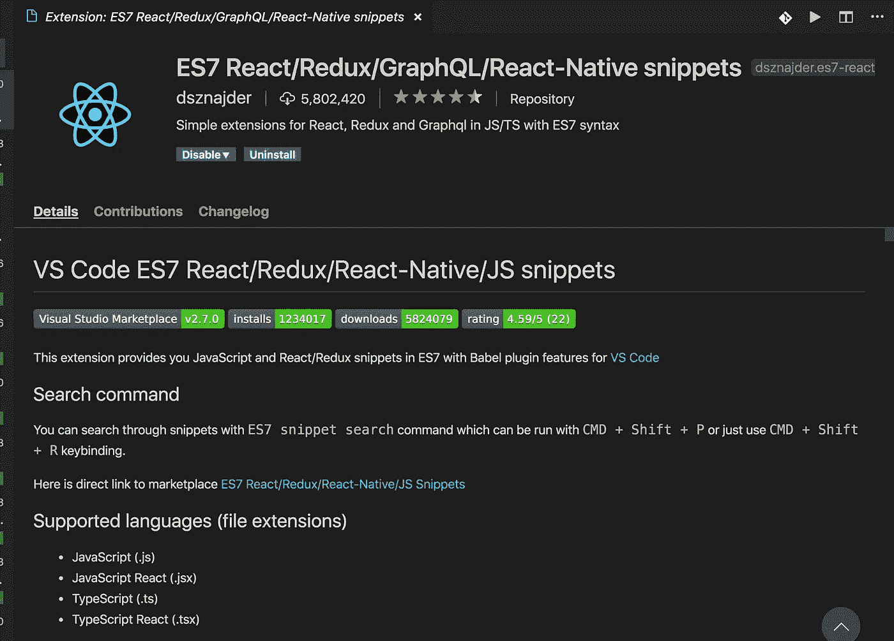

# 在 VS 代码中使用 JavaScript 和 React 代码片段——提高您的生产力

> 原文：<https://levelup.gitconnected.com/most-popular-visual-studio-code-extension-when-working-with-react-997d04691cc7>

## 使用这个非常流行的 React 和 JavaScript 扩展来提高您的工作效率

[Yancy Min](https://unsplash.com/@yancymin?utm_source=medium&utm_medium=referral) 在 [Unsplash](https://unsplash.com?utm_source=medium&utm_medium=referral) 上拍照

今天，我们将看到一个非常有用和流行的 Visual Studio 代码扩展，它将减少您的键入工作量和键入错误，从而提高您的生产率。

我说的扩展是:`ES7 React/Redux/GraphQL/React-Native snippets`

它允许我们在使用 React 时快速地将代码片段添加到代码中。

**您只需要在文件中键入初始字符，然后按回车键来完成该代码片段。**

以下是一些最广泛使用的前缀，允许我们添加代码片段:

1.imr : `import React from 'react'`
2。imrd:`import ReactDOM from 'react-dom'`3。imrc: `import React, { Component } from 'react'`
4。rcc: `add react class based component code`
5。rfc: `add react functional component code`
6。est: `add state to the component`
7。sst: `add this.setState call` 8。cdm: `adds componentDidMount lifecycle method` 9。cdu: `adds componentDidUpdate lifecycle method`

**更多前缀:**

1.rce:`add react class based component with export statement`2。impt:`add proptypes import`3。clg: `add console.log statement`

这里有很多非常方便的前缀，你可以在这里找到

今天到此为止。希望你今天学到了新东西。

**别忘了订阅我的每周时事通讯，里面有惊人的技巧、窍门和文章，直接在这里的收件箱** [**里。**](https://yogeshchavan.dev/)