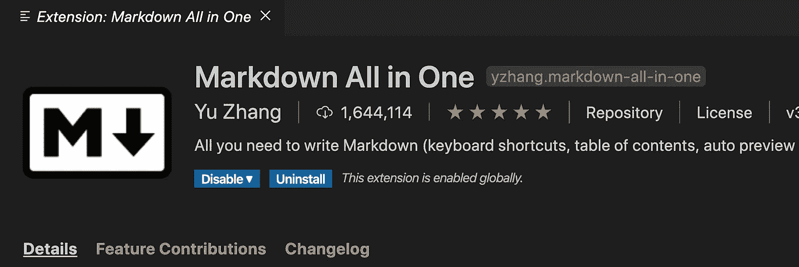

# 提高生产力的最有用的 VS 代码扩展

> 原文：<https://levelup.gitconnected.com/most-useful-vs-code-extensions-to-improve-your-productivity-cb018d9b6a87>

## 您应该使用的一些最有用和最流行的 VS 代码扩展

照片由[陆](https://unsplash.com/@riku?utm_source=medium&utm_medium=referral)在 [Unsplash](https://unsplash.com?utm_source=medium&utm_medium=referral) 上拍摄

Visual Studio Code (VS Code)是目前最受开发人员欢迎的 IDE，因为它的简单性和广泛扩展的可用性。

在本文中，我们将看到 VS 代码中一些最有用和最流行的扩展。

# 1.相对路径

相对路径与代码扩展

这是我最喜欢的扩展之一。这个扩展允许我们使用搜索功能快速添加任何文件的导入，即使它是深度嵌套的。

只需按下`Ctrl+Shift+H`或`Cmd+Shift+H (Mac)`即可激活并搜索您想要导入的文件。

相对路径与代码扩展

# 2.ES7 React/Redux/graph QL/React-本机代码片段

代码片段与代码扩展

如果你是 React.js 开发者，这是一个必备的扩展。

它提供了大量的前缀，我们可以使用这些前缀快速添加代码片段，而不必浪费时间一遍又一遍地重写相同的代码。

查看我以前的文章[这里](/most-popular-visual-studio-code-extension-when-working-with-react-997d04691cc7?source=friends_link&sk=6f188a0ad7830ed9836117b25bad1de0)了解更多细节。

# 3.GraphQL

GraphQL 与代码扩展

这个扩展有助于在`.graphql`或`.prisma`文件中添加语法高亮显示，以便快速识别模式文件中的错误(如果有的话)。

# 4.较美丽

漂亮 VS 代码扩展

**这是每个开发人员必备的扩展，不管你使用的是 HTML 还是 JavaScript 或 React 或任何其他框架或库。**

它避免了在每行代码后进行格式化的需要，从而节省了您的大量时间。当您保存文件时，它会自动格式化您的代码。它还有助于捕捉代码中的错误，因为如果有错误，例如缺少括号或语法无效，它不会格式化代码。

查看我以前的文章[这里](/automatically-format-code-in-visual-studio-code-when-working-with-react-c48674a12dc5?source=friends_link&sk=6e94e6bc54bf43fe4ad90c66f8a82b18)了解它令人敬畏的特性并学习如何使用它。

# 5.图像预览

图像预览与代码扩展

这个扩展允许我们在图片 URL 的左侧或者鼠标悬停时快速查看 CSS 文件中任何图片的预览。

# 6.美化 JSON

美化 JSON VS 代码扩展

如果您需要快速格式化 JSON 数据，那么您可以创建一个包含 JSON 数据的`.json`文件，并从 VS 代码命令面板中按下`Ctrl+Shift+P`或`Cmd+Shift+P (Mac)`并键入`Prettify JSON`来格式化文件的内容。

# 7.微妙的匹配括号

微妙的匹配括号与代码扩展

这个扩展对于通过显示匹配括号的下划线来快速找到匹配括号非常有用。

# 8.vs code-styled-组件

VS Code-styled-组件 VS 代码扩展

如果你在 React 中使用`styled-components`,那么这个扩展将为样式化的组件代码提供语法高亮，这使得编写和调试变得容易。

# 9.自动重命名标签

自动重命名标记与代码扩展

这个扩展自动重命名结束 HTML 标签，同时重命名开始标签，反之亦然。

# 10.自动关闭标签

自动结束标记与代码扩展

这个扩展在添加新的 HTML 标签时自动关闭结束的 HTML 标签，这有助于避免丢失标签的问题。

# 11.一次降价

Markdown All in One VS 代码扩展

该扩展提供了在 markdown( **)中使用的快捷命令。md** )文件，就像选择文本并按下`Ctrl+B`或`Cmd+B (Mac)`使文本加粗。它还允许我们轻松预览降价文件。

# 12.Git 历史

Git History 扩展允许我们查看存储库中的 Git 历史，与以前的版本进行比较，创建新的分支等等。

只需右击添加到 git 的 VS 代码中的任何文件/文件夹，并选择`Git: View File History`选项来查看该文件/文件夹的所有 Git 历史记录。

今天到此为止。我希望你学到了新东西。

**别忘了订阅我的每周简讯，里面有惊人的技巧、诀窍和文章，直接在这里的收件箱** [**中订阅。**](https://yogeshchavan.dev/)