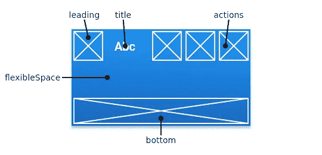
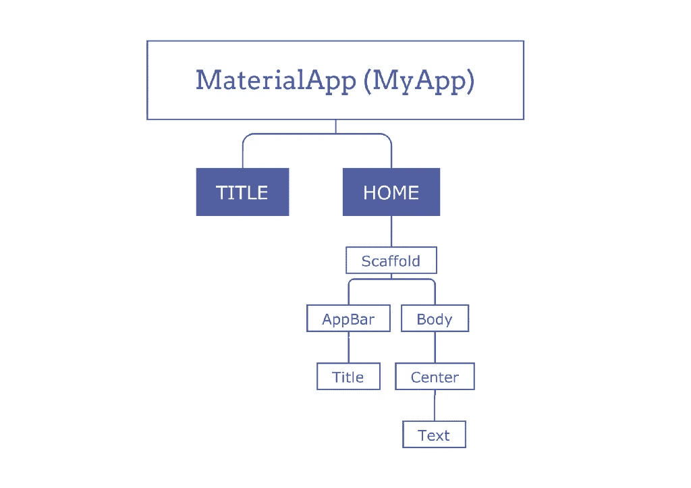
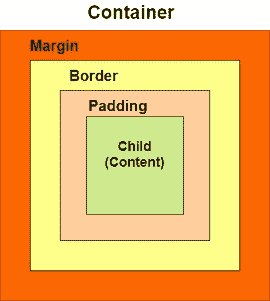
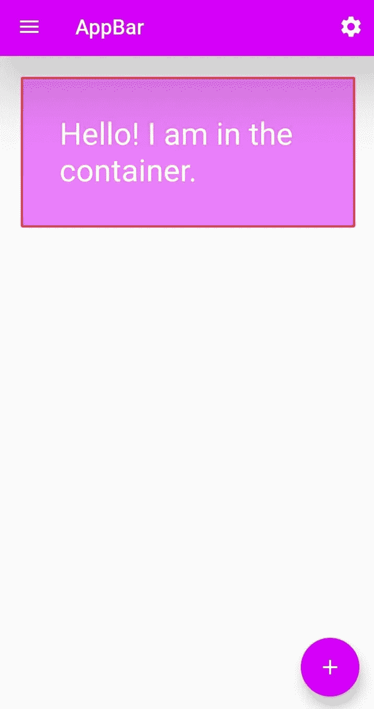

# 对你的第一个 Flutter 应用程序最有用的部件

> 原文：<https://levelup.gitconnected.com/most-useful-widgets-for-your-first-flutter-app-3b9ad1fe91c5>

> Flutter 是 Google 创建的一个新的开源框架，专注于跨平台应用程序的创建。Flutter 主要面向 iOS 和 Android，但也逐渐增加了对桌面平台的支持。

丹尼斯·切尔卡申在 [Unsplash](https://unsplash.com/?utm_source=medium&utm_medium=referral) 上拍摄的照片

在这篇文章中，我将讨论我们在开发一个 flutter 应用程序时需要的最有用的小部件。

1.  AppBar 类
2.  脚手架等级
3.  集装箱等级

# 1.AppBar 类

***AppBar*** 通常是应用程序最顶层的组件(或者有时是最底层)，它包含工具栏和一些其他常见的动作按钮。flutter 应用程序中的所有组件都是一个小部件或小部件的组合。 ***AppBar*** 小部件基于 *Material DesignAppBar* 类，非常灵活，可以轻松定制，我们也可以使用***silver AppBar****小部件，为应用栏提供滚动功能。*

**

*https://api.flutter.dev/*

# *Appbar 的主要属性:*

*   ***标题:**接受主窗口小部件作为参数显示在 AppBar 中。*
*   ***动作:如果*应用栏*是一行*，则***接受一个小部件列表作为参数显示在标题之后。*
*   ***backgroundColor:** 给 *Appbar 的背景添加颜色。**
*   ***elevation:** 用于设置此应用程序栏相对于其父应用程序栏的 z 坐标。*
*   ***shape:** 该属性用于给 *Appbar* 赋予形状并管理其阴影。*

# *2.脚手架等级*

****Scaffold*** 提供了很多小部件，或者我们可以说[API](https://www.geeksforgeeks.org/introduction-to-apis/)比如 Drawer、SnackBar、BottomNavigationBar、FloatingActionButton、AppBar 等等。*****脚手架*** 将展开或占据整个设备屏幕。它会占用可用空间。 ***支架*** 将提供一个框架来实现应用的基本材料设计布局。***

******

***图:一个简单的 flutter 应用程序的通用布局***

# ***支架的关键特性:***

*   *****body:** 显示支架中的主要或主要内容。它在 ***应用栏*** 的下方，在 ***浮动动作按钮*** 的下方。***

> ****默认情况下，主体内的小部件在左下角。****

# ***3.集装箱等级***

******容器*** 是一个父 widget，可以包含多个子 widget，通过宽度、高度、填充、背景颜色等进行高效管理。它也是一个类，用来存储一个或多个小部件，并根据我们的需要将它们放置在屏幕上。一般来说，它类似于一个用于存储内容的盒子。它允许用户使用许多属性来装饰其子部件，比如使用 **margin** ，将容器与其他内容分开。***

******

***图:容器布局***

# ***容器的关键属性:***

*   *****child:** 用于存储容器的子 widget。如果我们想添加 ***文本*** 小部件作为其子小部件，如下例所示。***
*   *****颜色:**用于设置整个**容器的背景颜色。*****
*   *****高度和宽度:**用于根据我们的需要设置集装箱的高度和宽度。***
*   *****边距:**用于围住 ***容器周围的空白空间。我们可以通过查看容器周围的空白来观察这一点。假设我们已经使用了 **EdgeInsets.all(20)** 在所有四个方向上设置相等的边距，如下例所示。******
*   *****填充:**用于设置容器边框之间的距离。这里，我使用了一个 **EdgeInsets.all(35)** 来设置文本和所有四个容器方向之间的间距。***
*   *****对齐:**用于设置子容器在容器内的位置。我们可以用各种方式对齐元素，比如居中、下对齐、下居中、上左对齐、中右对齐、左对齐、右对齐等等。***
*   *****装饰:**这个属性允许开发者给小部件添加装饰。它装饰或绘制子对象后面的小部件。如果我们想在一个孩子面前装饰或绘画，我们需要使用前景装饰参数。***

***让我们深入一个基本的 flutter 代码，了解这些小部件是如何使用的。***

# ***示例:***

# ***结果:***

******

# ***结论***

***现在是你练习这些部件的时候了。这将是你飘忽旅程中的一大步。让我们来看看另一篇有趣的文章，其中介绍了主要在 Flutter 开发中使用的小部件。***

***感谢您的阅读🤗***

# ***参考***

***[https://api.flutter.dev/](https://api.flutter.dev/)***

***[https://www . geeks forgeeks . org/flutter-app bar-widget/#:~:text = app bar % 20 is % 20 通常%20the%20topmost，或% 20a % 20 combination % 20 of % 20 widgets](https://www.geeksforgeeks.org/flutter-appbar-widget/#:~:text=AppBar%20is%20usually%20the%20topmost,or%20a%20combination%20of%20widgets)。***