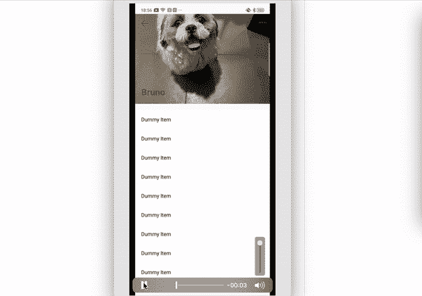
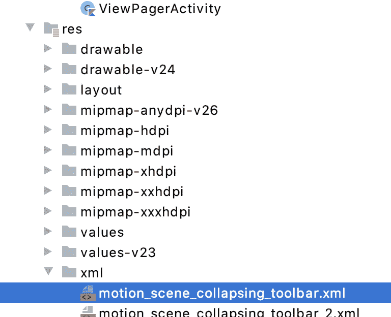

# 运动布局和运动场景

> 原文：<https://levelup.gitconnected.com/motion-layout-and-motion-scene-ecd88e3ad499>

运动布局是一种帮助您管理视图对象的运动或创建动画的布局。`MotionLayout`弥合了布局过渡和复杂动作处理之间的差距，提供了[属性动画框架](https://developer.android.com/guide/topics/graphics/prop-animation)、`[TransitionManager](https://developer.android.com/training/transitions)`和`[CoordinatorLayout](https://developer.android.com/reference/androidx/coordinatorlayout/widget/CoordinatorLayout)`之间的混合功能。

在本文中，我将讨论如何通过 *MotionLayout* **实现 *CollapsingToolBar* 行为。**如何创建 *MotionScene* 以及每个属性的使用。

你可以使用任何一种简单的运动布局来实现复杂的动画。

# 折叠工具栏垂直/垂直运动布局

**折叠工具栏:**这是材料设计库的一部分。


什么是应用简介

下面是设计这种东西的示例代码:

现在，如果我们想改变工具栏的颜色并隐藏任何视图，我们必须在类文件中手动编写代码。

运行应用程序，当你滚动视图时，它会将工具栏颜色变为绿色，并将大图折叠到工具栏中。

现在让我们使用*运动布局*做同样的行为。

# 运动布局:

它是约束布局的一部分。



1.  **添加** `**ConstraintLayout**` **依赖:**在你的 build.gradle 文件中添加 Constraint 2.0，支持运动布局。

2.**创建一个** `**MotionLayout**` **文件:**

将父布局从 ConstraintLayout 替换为 MotionLayout，所有属性将保持不变。在我们的布局 XML 文件中，我们将为我们希望在动画开始前看到的初始屏幕编写代码。

3.**创建一个运动场景:**在之前的运动布局 XML 文件中我们有一个属性`app:layoutDescription`，我们在那里添加了运动场景文件。



运动场景文件的路径

*   **ConstraintSet** :在这个部分，我们定义一个布局的约束，比如宽度、高度和对齐。在本例中,`app:layout_constraintEnd_toEndOf=”parent”, app:layout_constraintStart_toStartOf=”parent”, app:layout_constraintTop_toTopOf=”parent”`属性正在改变。
*   **转换**:包含运动的基本定义。`motion:constraintSetStart`和`motion:constraintSetEnd`是运动的起点和终点。正如你在关于文件中看到的`motion:constraintSetStart`包含了 id`<ConstraintSet android:id=”@+id/expand”>`，这意味着它是动画的开始状态。`motion:constraintSetEnd`包含了`<ConstraintSet android:id=”@+id/collapsed”>`的 id，这意味着当你滚动布局时，它会选择这个布局状态。还有一个属性`motion:duration`指定运动完成所需的毫秒数。
*   **OnSwipe** :可以通过触摸来控制动作。
    `motion:touchAnchorId`指可以滑动拖动的视图。
    `motion:touchAnchorSide`表示我们从各自的侧面拖动视图。
    的`motion:dragDirection`指的是*前进方向的*拖动。例如，`motion:dragDirection="dragUp"`表示进度随着您向上拖动而增加。
*   **CustomAttribute** :我们在`Constraint`内部使用这个属性。这用于翻译与位置或视图属性无关的属性，如背景颜色、文本大小、文本颜色。

```
<CustomAttribute
    motion:attributeName="textColor"
    motion:customColorValue="#FFFFFF" />
```

您必须提供的另一个属性基于值类型。从以下支持的类型中选择:

*   `motion:customColorValue`对于颜色
*   `motion:customIntegerValue`为整数
*   `motion:customFloatValue`用于浮动
*   `motion:customStringValue`用于字符串
*   `motion:customDimension`尺寸
*   `motion:customBoolean`用于布尔值

使用运动布局，你可以在 MotionScene 文件中定义所有的动画，我们不需要在类文件中提供任何数据。它使得创建复杂的动画变得容易。

它有一些其他插值属性，如缩放，阿尔法，可见性，海拔，旋转，平移。

感谢您的阅读。👏我希望这篇文章对你有所帮助。如果你有任何反馈，请给我回信，地址是 karishma.agr1996@gmail.com。非常感谢你的鼓掌帮助其他人找到这篇文章😃。

