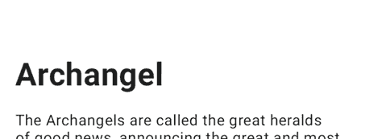
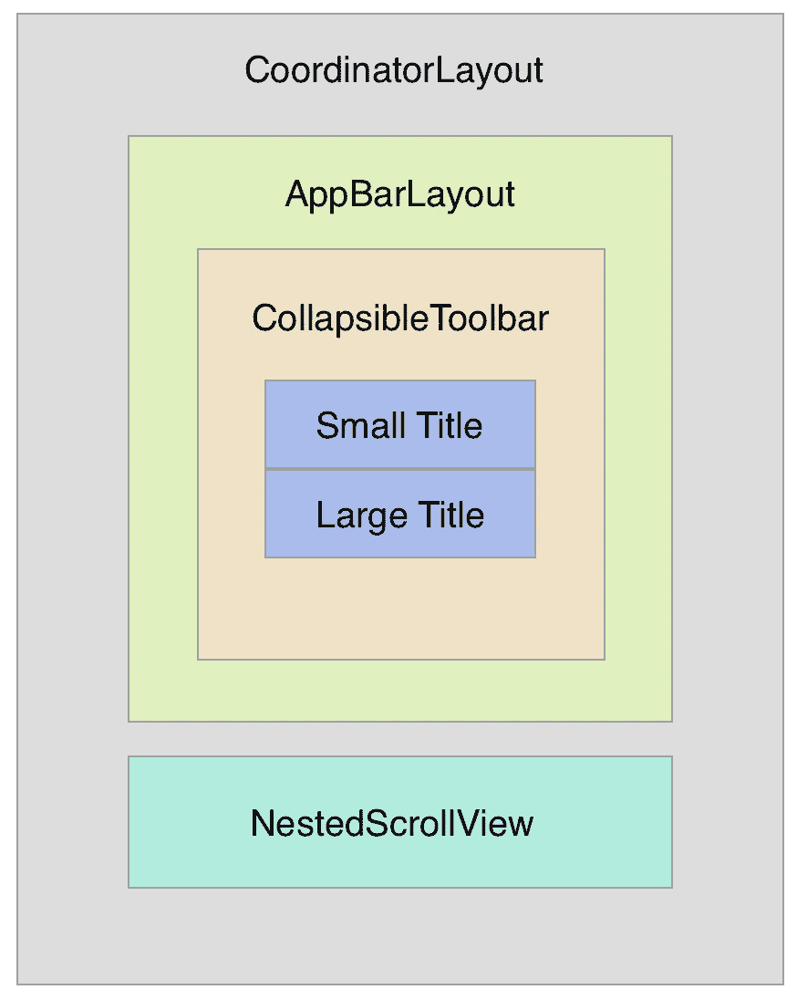
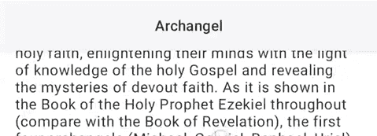
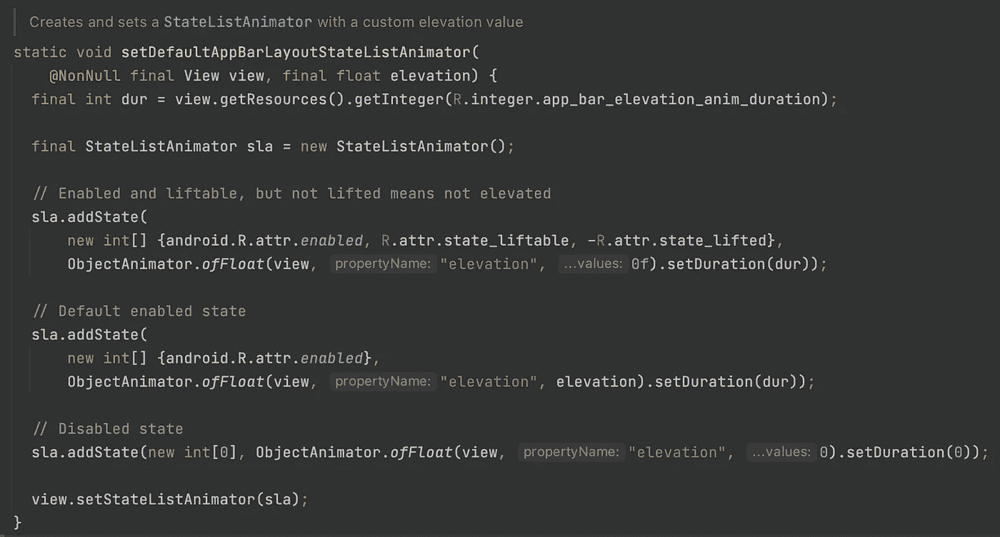
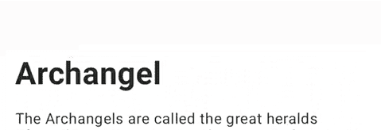
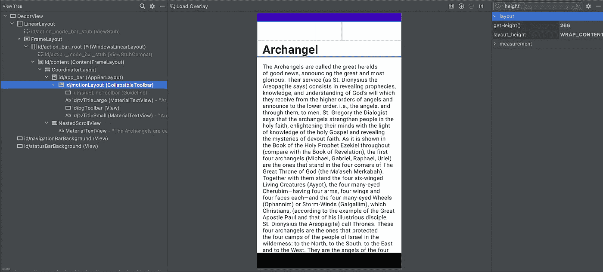
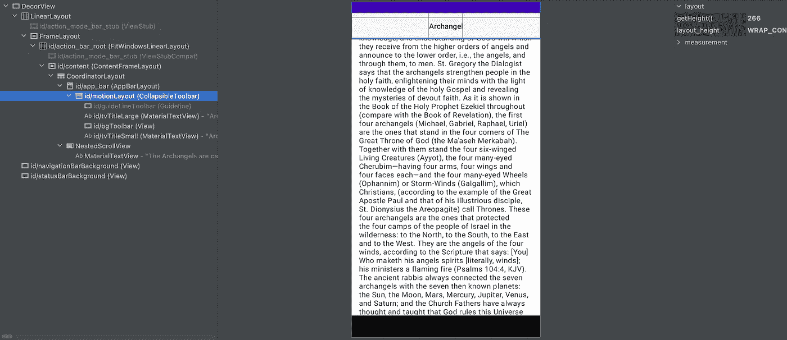

# MotionLayout —折叠工具栏

> 原文：<https://levelup.gitconnected.com/motionlayout-collapsing-toolbar-d0ce8dd874b6>

照片由[阿什利·里奇](https://unsplash.com/@a5hleyrich?utm_source=medium&utm_medium=referral)在 [Unsplash](https://unsplash.com?utm_source=medium&utm_medium=referral) 上拍摄

## 如何使用 MotionLayout 创建折叠工具栏

# 介绍

在本文中，我们将学习如何使用 MotionLayout 创建一个折叠工具栏。

MotionLayout 是 ConstraintLayout 的子类，而建立在其丰富的布局功能之上。MotionLayout 提供了更大的灵活性，并且在不了解 Android 动画框架的情况下，提供了一条更简单的途径来实现你想要的东西。用一个额外的 XML 文件实现复杂的动画非常容易。

我们开始吧！🥰

# 编码部分

我将编码部分分为 3 个步骤，如下所示。

*   [项目设置。](#ee71)
*   [在布局 XML 中创建工具栏。](#2b1f)
*   创建一个运动场景。

# 步骤 1:项目设置

要使用 MotionLayout，您应该将依赖关系添加到`app/build.gradle`文件:

# 步骤 2:在布局 XML 中创建工具栏

下图将更清楚地描述视图树。

Android `CollapsibleToolbar`是一个 MotionLayout 的包装器，它通过监听 AppBarLayout 的偏移量变化并更新 MotionLayout 的进度来实现折叠应用栏。

以下代码片段显示了如何实现折叠工具栏:

`CollapsibleAppbar`是 AppBarLayout 的定制版。当使用 AppBarLayout 时，它类似于下面的内容:

使用 AppBarLayout

正如我们所看到的，当快速滚动时，在图像中间的半秒钟内会有一个阴影。这是由于`StateListAnimator`，默认设置为 AppBarLayout。让我们看看代码实现:

动画提升时有一个持续时间，这就是原因。

`CollapsibleAppbar`移除仰角动画，并根据应用程序栏的垂直滚动自动设置仰角。下面是实现过程:

使用*可折叠工具栏*

到目前为止，一切顺利！🥰

请注意以下几点:

*   `AppBarLayout` 的默认背景是原色，所以我把它改成表面色，实际上是白色。
*   `CollapsibleToolbar`的`minHeight` 为工具栏折叠时的高度。
*   `bgToolbar`视图有一个纯色背景来隐藏向下滚动时展开的标题。
*   将折叠的标题及其背景分成两个视图，id 分别为`collapsedTitle`和`bgToolbar`，这是必要的。背景需要保持纯色，而折叠的标题可以淡入/淡出，所以它们不能放在一起。

# 第三步:创建一个运动场景

在前面的 XML 中，`app:layoutDescription`属性引用了一个运动场景。让我们创造它。

我们的运动有两个终点:起点和终点。我们通过 constraintSets 设置对起点和终点的引用。

## a.制作折叠标题的动画

我们要制作动画的第一个视图是折叠的标题。

*   在开始端点:我们希望它停留在工具栏的顶部。
*   int end endpoint:我们希望它停留在工具栏的底部。

为什么在工具栏的底部而不是顶部？

那么，让我们通过 Android Studio 中的**传统布局检查器**工具来检查工具栏的高度。

在起点:高度为 266

在终点:高度仍然是 266

这意味着工具栏的高度不会改变。因此，为了使折叠的标题保持静止，我们需要将约束从父对象的顶部改为底部。`ConstraintSet`是定义描述运动的各种约束的地方。

## b.为折叠标题的背景色制作动画

接下来，我们需要动画显示折叠标题的背景色。通过`CustomAttribute`改变背景色很容易，其中`attributeName`是背景色，`customColorValue`是我们想要改变的颜色:

## c.制作折叠标题的 alpha 动画

我们希望制作折叠标题的 alpha 动画，如下所示:

请注意，当展开的标题到达特定点的四分之三处时，折叠的标题开始出现。`[KeyAttribute](https://developer.android.com/training/constraint-layout/motionlayout/ref/keyattribute)` 用于指定运动序列中特定时刻的视图属性。

## d.这是一个总结！

以下是描述运动场景的完整代码:

如果您在执行代码片段时发现问题，请查看 GitHub repo[collapsing toolbar](https://github.com/PhongHuynh93/CollapingToolbar/tree/main)寻求帮助。

 [## phonghuynh 93/折叠工具栏

### 用 MotionLayout 创建 CollapsingToolbar 创建 CollapsingToolbar…

github.com](https://github.com/PhongHuynh93/CollapingToolbar/tree/main) 

正如你所看到的，使用 MotionLayout 可以减少为了获得漂亮的动画而需要编写的代码量。非常感谢你阅读我的文章。*如果你喜欢这个故事，请* ***点击*** 👏 ***按钮，分享*** *它来帮助别人！*关注我的 [Medium](https://mr-umbrella.medium.com/) *获取更多牛逼安卓小技巧*。也可以在 [LinkedIn](https://www.linkedin.com/in/huynh-phong-3649a7131/) 上找到我。祝您愉快！😄

# 继续读 Android 的东西

[如何在 Android 中创建 like 按钮动画](/how-to-create-like-button-animation-in-android-part-1-f99e2792143d)

[Android 中使用 MaterialContainerTransform 的共享元素](/shared-element-using-materialcontainertransform-in-android-6d420e74b122)

[安卓按钮变形动画](/android-button-morphing-animation-bc3bed740501)

# Jetpack 撰写

[在 Jetpack Compose 中实现 snack bar](/implement-android-snackbar-in-jetpack-compose-d83df5ff5b47)

[在 Jetpack Compose 中实现 tab layout](/implement-android-tablayout-in-jetpack-compose-e61c113add79)

[在 Jetpack Compose 中用 ViewPager 实现 talayout](/implement-tablayout-with-viewpager-in-android-jetpack-compose-d509fc6e2d8e)

[在 Jetpack Compose 中创建一个带有变形和 ken burns 效果的自动滚动浏览器](/create-an-auto-scroll-viewpager-with-transformation-and-ken-burns-effect-in-android-jetpack-compose-efdf46f2e8ed)