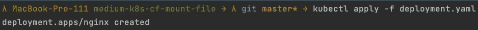
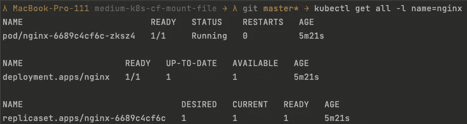
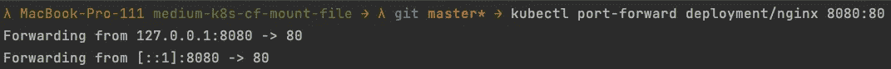
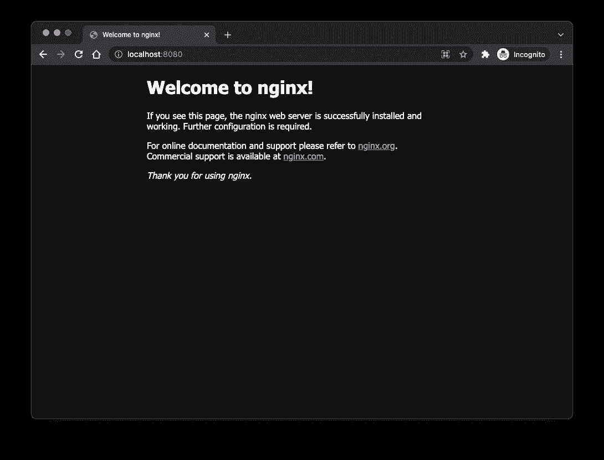
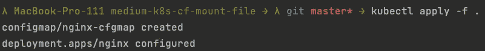
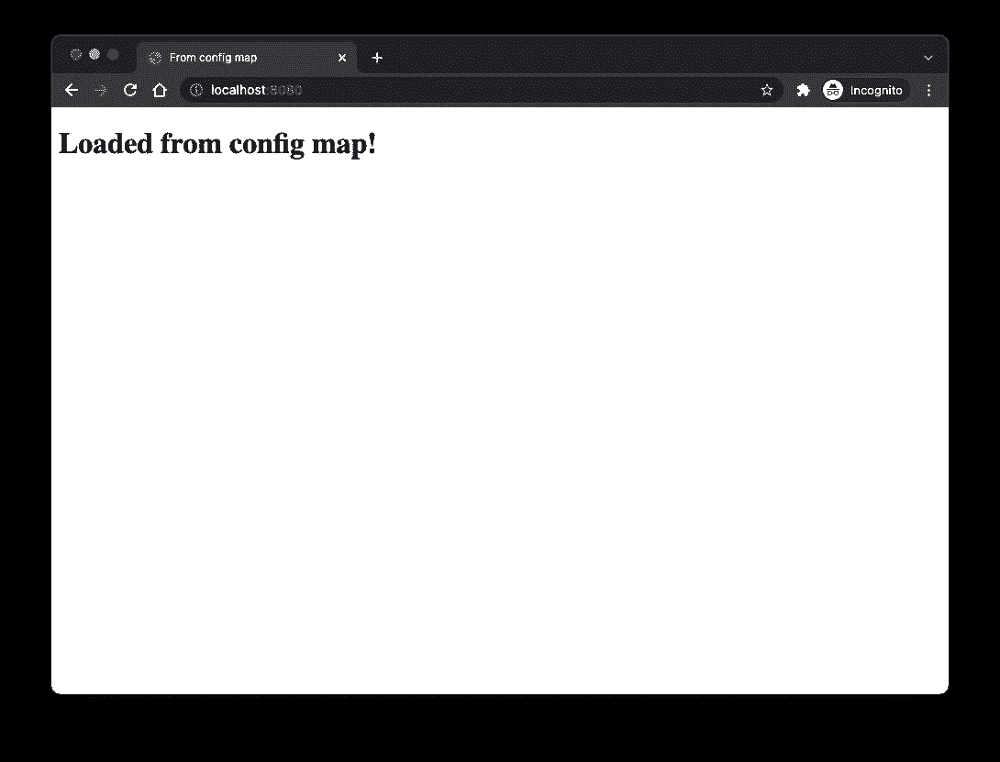

# 通过配置映射将文件挂载到 Kubernetes 部署中

> 原文：<https://levelup.gitconnected.com/mount-files-into-your-kubernetes-deployment-via-configmaps-bedfe5350e25>

使用 ConfigMaps 将文件装入 Kubernetes 部署的简短指南。


## 要求

*   准备使用 Kubernetes 设置(例如，[本地设置](/local-kubernetes-development-using-vagrant-and-k3s-547bd5687a7f))
*   [kubectl](https://kubernetes.io/docs/tasks/tools/) 已安装

## 你将学到什么

在本教程中，您将学习如何将一个简单的 NGINX 容器部署到 Kubernetes，并使用 ConfigMap 资源将一个 HTML 页面注入到容器中，该页面将覆盖 NGINX 提供的默认`index.html`。

像往常一样，我准备了一个 [GitHub 库](https://github.com/Abszissex/medium-k8s-cf-mount-file)供您查看完成的代码库，并遵循本文中描述的步骤。

[](https://github.com/Abszissex/medium-k8s-cf-mount-file) [## abszisex/medium-k8s-cf-mount-file

### 此时您不能执行该操作。您已使用另一个标签页或窗口登录。您已在另一个选项卡中注销，或者…

github.com](https://github.com/Abszissex/medium-k8s-cf-mount-file) 

## 一般设置

```
/
|- deployment.yaml
|- configmap.yaml
```

在这个例子的最后，将会有两个 YAML 文件。定义 NGINX 部署的`deployment.yaml`和定义包含定制 HTML 页面的配置映射的`configmap.yaml`。

但是让我们一步一步来。

## NGINX 部署

首先，我们定义 NGINX 部署，并验证它是否按预期工作。

正如您所看到的，我们使用了`nginx:1.21.6-alpine` Docker 图像并暴露了端口 80。端口 80 是 NGINX 运行的默认端口。

您现在可以使用`kubectl apply -f deployment.yaml`将部署应用到 Kubernetes 集群。



## 验证 NGINX 部署

为了验证部署的创建是否按预期工作，让我们通过`kubectl get all -l name=nginx`获取集群上所有正在运行的资源。在下图中，您可以看到 NGINX Pod 的一个副本是如何启动和就绪的，以及 NGINX 部署和副本集资源。



上面的`-l name=nginx`通过将`name`标签定义为`nginx`的所有资源来过滤`get all`命令的输出。如果您没有在部署 YAML 文件`nginx`中命名所有内容，它可能会打印出不同的输出。

当您不确定时，您总是可以退回到`kubectl get all`而不进行标签过滤，并在默认名称空间中获取所有正在运行的 Kubernetes 资源。

## 访问 NGINX 部署

为了验证 Pod 是否准备好并工作，我们可以将资源的端口转发到本地机器。您可以在不同的资源上通过`kubectl`使用端口转发。因此，您可以直接从 Pod 转发端口，转发整个部署，或者在服务资源上转发(我们在本例中没有使用)。

对于这个展示，我决定在部署级别进行转发。

使用命令`kubectl port-forward deployment/nginx 8080:80`将把部署的端口`80`转发到端口`8080`上的本地机器。该命令的一般语法如下:

`kubectl port-forward RESOURCE_TYPE/RESOURCE_NAME LOCAL_PORT/RESOURCE_PORT`



使用`port-forwarding`命令，终端被阻塞，如果不停止进程，端口转发将可用。

要最终验证 NGINX Pod 是否按预期工作，请打开浏览器并导航到`localhost:8080`。如果一切正常，您应该会在 NGINX Docker 映像中看到默认的`index.html`。



## 创建配置图

顾名思义，Kubernetes 中的 ConfigMaps 用于以键值方式提供配置，例如，服务的环境变量，并使它们可被部署和其他资源访问。

但是除了引用配置映射并仅提取其值并将其推入环境变量之外，配置映射还可以作为卷挂载。

在下面的代码片段中，您可以看到我们将使用的 ConfigMap 定义。

在`data`部分，我们定义了任意键`file-from-cfgmap`并为其赋值。该值是通过管道操作符`|`指示的多行字符串。该字符串包含我们希望注入到部署中的 HTML 内容，以覆盖 NGINX Docker 容器中的默认 HTML 文件。

## 在部署中装入配置图

既然已经定义了 ConfigMap，就需要在部署配置中挂载它。我们将从本文开始扩展部署文件。在下面的代码片段中，我用注释标记了我添加的部分。评论上面的部分和之前一样。

让我们一步一步来，但让我们从底部的`volumes`部分开始。在`volumes`部分，我们定义了可能的卷以及我们希望如何命名它们。在这种情况下，我们创建一个名为`mnt`的新卷，我们可以在以后使用它来引用这个卷。此外，我们定义卷内容应该基于名为`nginx-cfmap`的配置图，指向我们定义的`configmap.yaml`的`metadata.name`属性。

在定义卷之后，我们可以通过使用`volumeMounts`部分将它安装到容器中。我们定义的`volumeMounts`条目的`name`必须与我们在`volumes`部分→ `mnt`中描述的名称相同。用`mountPath`我们定义 Kubernetes 应该把我们挂载的内容放在哪里。这种情况下是`/usr/share/nginx/html/index.html`。这是默认`index.html` NGINX 服务的位置。最后但同样重要的是，我们将`subPath`定义为`file-from-cfgmap`。因为我们正在挂载一个配置映射，所以我们必须在配置映射中指定我们想要获取其值的键的名称。部署中的`volumeMounts.subPath`需要等于配置图的`data[subPath]`。

## 把它放在一起

既然配置图和部署已经定义并准备好使用，如果两个文件都在您的目录中，我们可以通过`kubectl apply -f .`应用两个更改/创建，或者使用单独的文件名代替`.`。



NGINX 容器重启可能需要几秒钟。

接下来，我们可以通过`kubectl port-forward deployment/nginx 8080:80`再次启动端口转发，并在浏览器中验证结果。



而且成功了！😊

**边注**

请记住，当您更改配置图的内容并将新的配置图应用到您的集群时，它**不会**影响您已经运行的 NGINX Pods。

这里的原因是，pod 一旦启动就装载配置图的内容。之后，对配置图的更改不再影响窗格。

如果您不希望对您的部署进行更改来触发您的 pods 重启以获取新的 ConfigMap 内容，您绝对不应该这样做，您可以通过`kubectl rollout`命令轻松地重启容器。

例如，要重新启动本教程中 NGINX 部署的 Pod，您可以使用:

```
kubectl rollout restart deployment/nginx
```

# 摘要

在这个简短的教程中，您应该已经学会了如何将 ConfigMaps 中的值作为卷注入到您的部署中，以(重写)您的应用程序所使用的文件。

## 你想联系吗？

如果你想联系我，请在 [LinkedIn](https://www.linkedin.com/in/pascal-zwikirsch-3a95a1177/) 联系我。

另外，可以随时查看[我的书籍推荐](https://medium.com/@mr-pascal/my-book-recommendations-4b9f73bf961b)📚。

[](https://mr-pascal.medium.com/my-book-recommendations-4b9f73bf961b) [## 我的书籍推荐

### 在接下来的章节中，你可以找到我对所有日常生活话题的书籍推荐，它们对我帮助很大。

mr-pascal.medium.com](https://mr-pascal.medium.com/my-book-recommendations-4b9f73bf961b) [](https://mr-pascal.medium.com/membership) [## 通过我的推荐链接加入 Medium—Pascal Zwikirsch

### 作为一个媒体会员，你的会员费的一部分会给你阅读的作家，你可以完全接触到每一个故事…

mr-pascal.medium.com](https://mr-pascal.medium.com/membership)