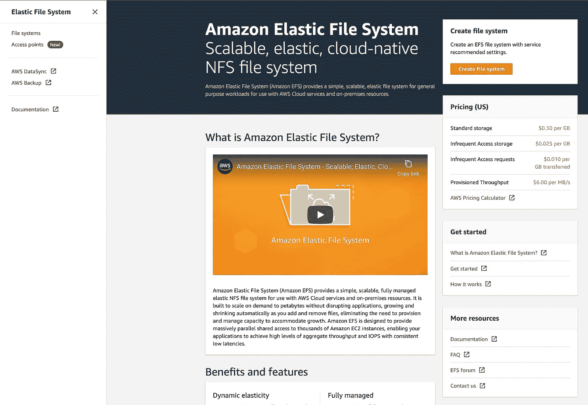
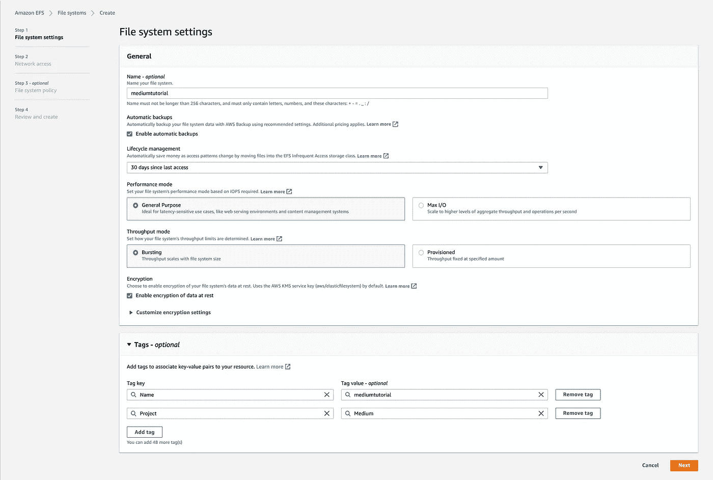

# 使用弹性文件系统在 AWS EC2 上装载 NFS(EFS)

> 原文：<https://levelup.gitconnected.com/mount-nfs-on-aws-ec2-using-elastic-file-system-efs-57282d3c27eb>

## 将额外的云存储附加到 AWS EC2 实例


如果您有多个 Amazon EC2 实例，并且希望在它们之间 NFS 挂载一些共享存储，这是一件相当快速和容易的事情。你会想要使用[亚马逊弹性文件系统(EFS)](http://console.aws.amazon.com/efs) 。

在 AWS 控制台中打开“[**(EFS)**](http://console.aws.amazon.com/efs)”，点击“**创建文件系统**”按钮。



可选地，给你的文件系统起一个名字，在我的例子中是“ **mediumtutorial** ”，并选择它将被供应到的 VPC。然后点击**自定义**。您会看到，您可能只需点击“**创建**”即可，因为几乎所有的默认选项都符合目的，但为了完整起见，我将通过定制选项向您展示。


我个人喜欢在我提供的所有内容中包含一个“**名称**”标签和“**项目**”标签。“**项目**标签特别有用，因为你可以用它来分组账单条目。



您也可以将这里的大多数选项保留为默认值。


我没有申请保单，但这是您可以附加保单的地方。


最后一页只是配置摘要。如您所见，您实际上并不需要点击“**自定义**按钮。您可以使用“ **Create** ”来完成，因为大多数默认选项都是合适的。


单击“**创建**”，这将带您返回 EFS 页面，在这里您将看到正在调配您的存储。


单击您的存储名称，在我的例子中是“**媒体教程**”，然后打开“**网络**”选项卡。


在这里，您需要获取两条重要的信息。第一个是您的 NFS 份额的 IP，第二个是保护 NFS 份额的安全组。

您可能会注意到，默认情况下，VPC 安全组附属于您的 NFS 共享，这很可能是完全开放的。您需要点击页面上的**编辑**来替换安全组。

这有点令人沮丧，但是你不能在 EFS 创建一个新的安全组织。我们需要返回到 [EC2](http://console.aws.amazon.com/ec2) ，然后是“**安全组**，并在那里创建它。我在 VPC 创建了一个名为“ **efs-nfs-in** ”的新安全组，“ **vpc-a55faccc** ”。NFS 已经被预填充为一个“**类型**”，所以不需要记住端口。您需要限制只能从您的 EC2 内部 IP 地址或范围访问您的 NFS 共享。在我的例子中，我只使用了“ **172.16.0.0/24** ”，假设我的服务器位于这个 VPC 子网中。现在点击**创建安全组**。


我们现在想回到我们创建的 [EFS](http://console.aws.amazon.com/efs) 文件系统，并用我们新创建的安全组替换默认的开放 VPC 安全组。然后点击**保存**。


现在，您需要再次打开您的 EFS 文件系统，并单击右上角的“ **Attach** ”按钮，这将为您提供如何将该文件系统附加到 EC2 实例的说明。


我试着使用“**通过 DNS** 挂载”选项，但没用，所以不用麻烦了。EC2 实例无法解析文件系统的 FQDN。我不得不使用“**通过 IP 挂载**”选项。


*   指令说我应该在我的 EC2 实例上运行“**sudo mount-t NFS 4-o NFS vers = 4.1，rsize=1048576，wsize=1048576，hard，timeo=600，retrans=2，nores port 172 . 31 . 8 . 243:/EFS**”。这太简单了，因为它不是那样工作的。
*   您首先需要在 EC2 实例上安装“ **nfs-utils** ”。

```
**# Redhat or CentOS**
[root@ip-172-16-0-10 ]# **sudo yum update -y**
[root@ip-172-16-0-10 ]# **sudo yum upgrade -y**
[root@ip-172-16-0-10 ]# **sudo yum install nfs-utils -y****# Ubuntu**
[root@ip-172-16-0-10 ]# **apt-get update -y**
[root@ip-172-16-0-10 ]# **apt-get upgrade -y**
[root@ip-172-16-0-10 ]# **sudo apt-get install nfs-utils -y**
```

然后您需要为自己创建一个挂载点。例如，“ **/mnt/mediumtutorial** ”或者无论你想怎么称呼它。

```
[root@ip-172-16-0-10 ]$ **sudo su -**[root@ip-172-16-0-10 ]# **mkdir /mnt/mediumtutorial**[root@ip-172-16-0-10 ]# **mount -t nfs4 -o nfsvers=4.1,rsize=1048576,wsize=1048576,hard,timeo=600,retrans=2,noresvport 172.31.8.243:/ /mnt/mediumtutorial**
```

“ **172.31.8.243** 是我们的[亚马逊 EFS](https://console.aws.amazon.com/efs) 文件系统中一个网络接口的 IP 地址。你应该使用分配给你的 IP 地址。“ **/mnt/mediumtutorial** ”是我的 EC2 实例文件系统上的任意空目录。该目录只需要存在并且为空。

如果您想确认装载成功，您可以运行以下命令。

```
[root@ip-172-16-0-10 ]# **df -T -h**
Filesystem     Type      Size  Used Avail Use% Mounted on
devtmpfs       devtmpfs  1.9G     0  1.9G   0% /dev
tmpfs          tmpfs     1.9G     0  1.9G   0% /dev/shm
tmpfs          tmpfs     1.9G   25M  1.9G   2% /run
tmpfs          tmpfs     1.9G     0  1.9G   0% /sys/fs/cgroup
/dev/xvda2     xfs        30G   23G  7.4G  76% /
tmpfs          tmpfs     378M     0  378M   0% /run/user/1000
**172.31.8.243**:/ nfs4      8.0E  1.0M  8.0E   1% **/mnt/mediumtutorial**
```

如果您在同一个 VPC 内的第二个 EC2 实例上挂载这个相同的[亚马逊 EFS](https://console.aws.amazon.com/efs) 文件系统，如果您在“ **/mnt/mediumtutorial** ”中创建一个文件，您将在另一个。

这里有一个警告。这些挂载在启动时不是持久的。如果您重启 EC2 实例，您将需要重新挂载亚马逊 EFS 文件系统。

在引导时保持这一点的方法是编辑“ **/etc/fstab** ”文件，并添加以下行，根据您的配置替换相关字段。“ **fsmt-c8500000** ”是**文件系统 ID** ，可以在[亚马逊 EFS](https://console.aws.amazon.com/efs) 找到。

```
**fsmt-c8500000** **/var/SP/ccp-shared** efs _netdev,tls,accesspoint=**172.31.8.243** 0 0
```

我希望你觉得这篇文章有趣并且有用。如果您想随时了解情况，请不要忘记关注我并注册我的[电子邮件通知](https://whittle.medium.com/subscribe)。

# 迈克尔·惠特尔

*   ***如果你喜欢这个，请*** [***跟我上媒***](https://whittle.medium.com/)
*   ***更多有趣的文章，请*** [***关注我的刊物***](https://medium.com/trading-data-analysis)
*   ***有兴趣合作吗？*** [***我们上 LinkedIn***](https://www.linkedin.com/in/miwhittle/) 连线吧
*   ***支持我和其他媒体作者*** [***在此报名***](https://whittle.medium.com/membership)
*   ***请别忘了为文章鼓掌:)←谢谢！***