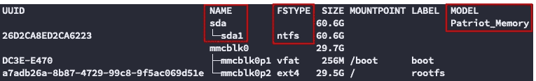
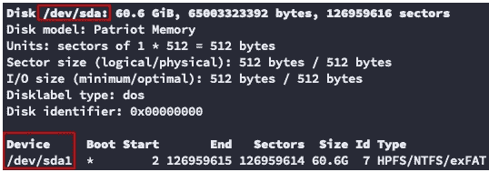
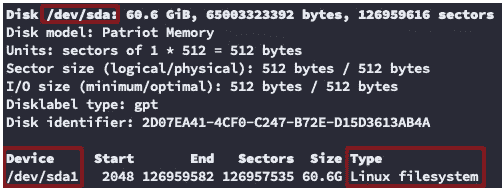
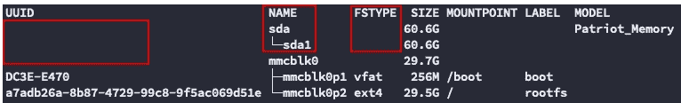
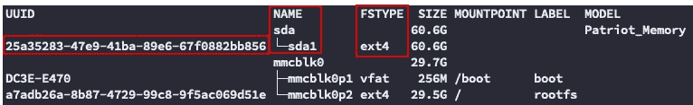
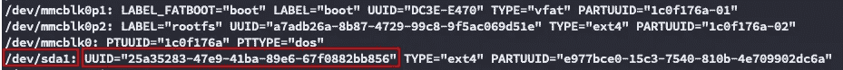

# 将存储卷装载到 Linux 操作系统上

> 原文：<https://levelup.gitconnected.com/mount-storage-volumes-onto-linux-operating-systems-24283d9a676e>


了解如何将外部存储设备连接到基于 Linux 的操作系统。从分区和格式化到自动挂载。

[外部存储设备](#4e33)
∘ [Linux 设备命名](#1480)
∘ [分区&格式](#80b0)
∘ [挂载卷](#1c08)
[高级主题](#f36a)
∘ [自动挂载](#12db)
[摘要](#83f4)

# 外部存储设备

这些说明涵盖了将外部存储设备连接到 Linux 操作系统的必要步骤。

## Linux 设备命名

**什么是** `**/dev/sda1**` **？**

Linux 中的外部卷带有前缀`sd`，代表 **S** CSI **D** isk。
`SCSI`是**S**mall**C**computer**S**system**I**interface 的缩写。

`sd`的后缀为`sda`、`sdb`、`sdc`是指第一/第二/第三`SCSI`安装的设备。每个已安装设备的数值，即`sda1`、`sda2`是每个磁盘内的分区。

## 分区和格式

在这个例子中，我将使用 USB 驱动器作为外部卷，并将其连接到名为`kmaster`的 Raspberry Pi 板，这些说明与每个 Linux 发行版相关，如果与您无关，请跳过第一步。

1.  **(可选)**:将外部存储设备连接到一个 Raspberry Pi 节点，并 SSH 到其中

```
ssh pi@kmaster
```

2.列出 RPi 服务器上的所有磁盘分区

```
sudo lsblk -o UUID,NAME,FSTYPE,SIZE,MOUNTPOINT,LABEL,MODEL
```



3.列出 RPi 服务器上的当前设备

```
sudo fdisk -l
```



4.验证外部存储设备的`sdX`名称，并创建新的分区表

```
sudo fdisk /dev/sda

*# m - print commands menu (for visibility)*
*# g - create a new empty GPT partition table*
*# n - add a new partition*
*# Press enter x3 for defaults (Partition number, First sector, Last sector)*
*# w - write table to disk and exit*
```

> **重要提示:**确保您正在当前的`sdX`设备上工作，外部存储设备上的所有数据即将被擦除，将表写入磁盘后将无法恢复！

5.检查外部存储设备是否在 Linux 文件系统下正确分区

**fdisk**



**lsblk**



6.将外部存储设备格式化为`ext4`文件系统

```
sudo mkfs.ext4 /dev/sda1
```

7.验证外部存储设备是否正确格式化为`ext4`文件系统



## 装载卷

1.  找到存储设备磁盘分区的`UUID`

```
sudo blkid
```



2.创建一个目标文件夹作为存储设备的挂载点(在本例中为`container-registry`)

```
sudo mkdir /mnt/container-registry
```

3.在挂载点`/mnt/container-registry`挂载存储设备分区`/dev/sda1`

```
sudo mount /dev/sda1 /mnt/container-registry
```

4.验证存储设备是否已成功装载

```
ls -lah /mnt/container-registry
```

5.**(可选)**:卸载存储设备

```
sudo umount /mnt/container-registry
```

> **重要提示:**从树莓 Pi 板上拔下存储设备之前，记得先卸载！

# 高级主题

这些说明适用于任何 Linux 发行版操作系统。该部分的方向将围绕`Debian OS`展开，这是正在使用的树莓 Pi 操作系统。请按照[设置树莓 Pi 集群](/setting-up-a-raspberry-pi-cluster-b0fda1ee44ba)帖子获取更多信息。

## 自动安装

我们将编辑 OS 文件系统表`fstab`以便在 Raspberry Pi 服务器启动时自动挂载外部存储设备。

1.  找到存储设备磁盘分区的`UUID`和`TYPE`

```
sudo blkid
```


2.编辑操作系统文件系统表`fstab`

```
*# Open fstab for editing*
sudo vi /etc/fstab
```

3.将下面一行附加到文件末尾

```
*# Append to end of file*
UUID**=**<value-from-step-1> /mnt/container-registry ext4 defaults,auto,users,rw,nofail,x-systemd.device-timeout**=**30 0 0
```

> **注意:**我们已经用`ext4`文件系统设置了一个挂载点`/mnt/container-registry`，并为 RPi 板定义了一个`30 sec`超时，如果 RPi 启动时存储磁盘断开。

# 摘要

完成这篇文章后，你应该熟悉如何识别外部存储设备并将其连接到 Linux 操作系统💾

**现在怎么办？直接从 CLI 分区、格式化并挂载你需要的任何外部存储设备到你的 Linux 发行版操作系统上！**

请在下面的讨论中留下您的评论、建议或任何其他您认为与本文相关的意见。

**喜欢这个帖子？**
您可以通过以下方式了解更多信息:

查看我的博客:[https://blog.zachinachshon.com](https://blog.zachinachshon.com/)
在推特上关注我: [@zachinachshon](https://twitter.com/zachinachshon)

感谢阅读！❤️