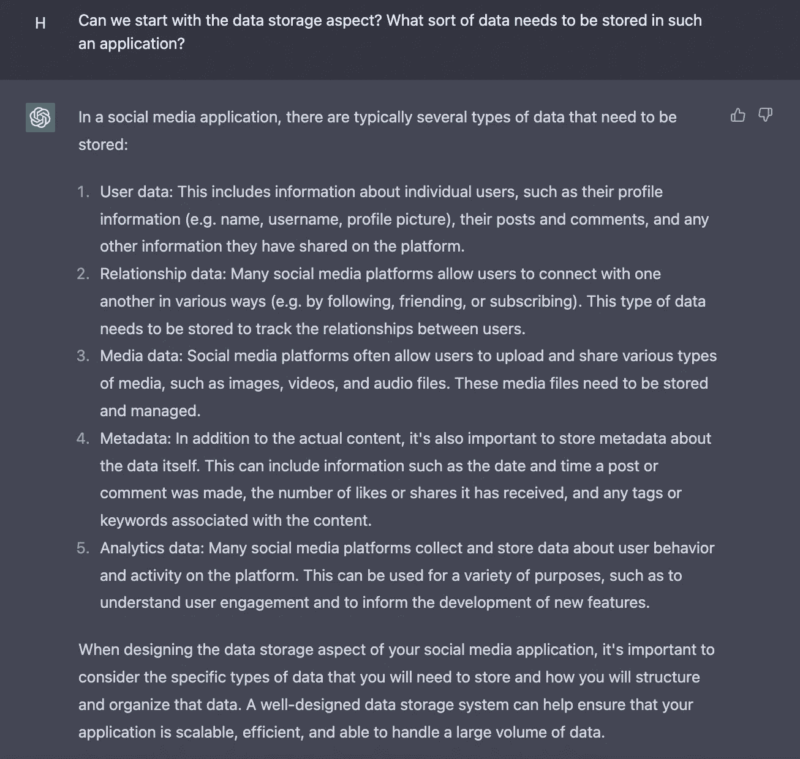
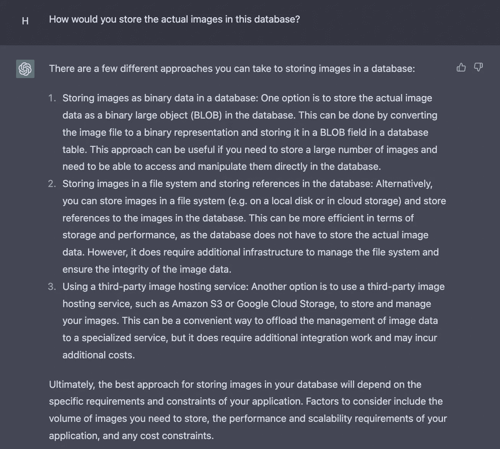
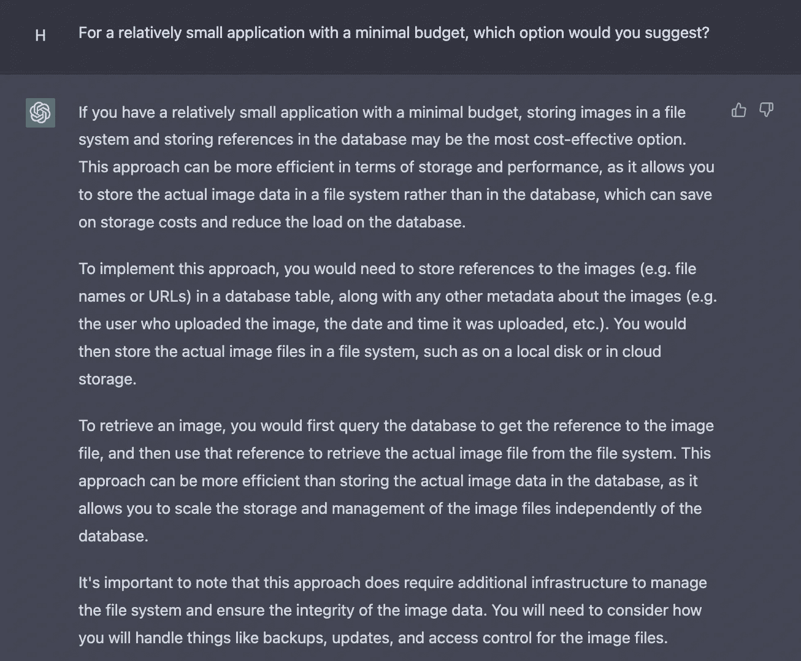
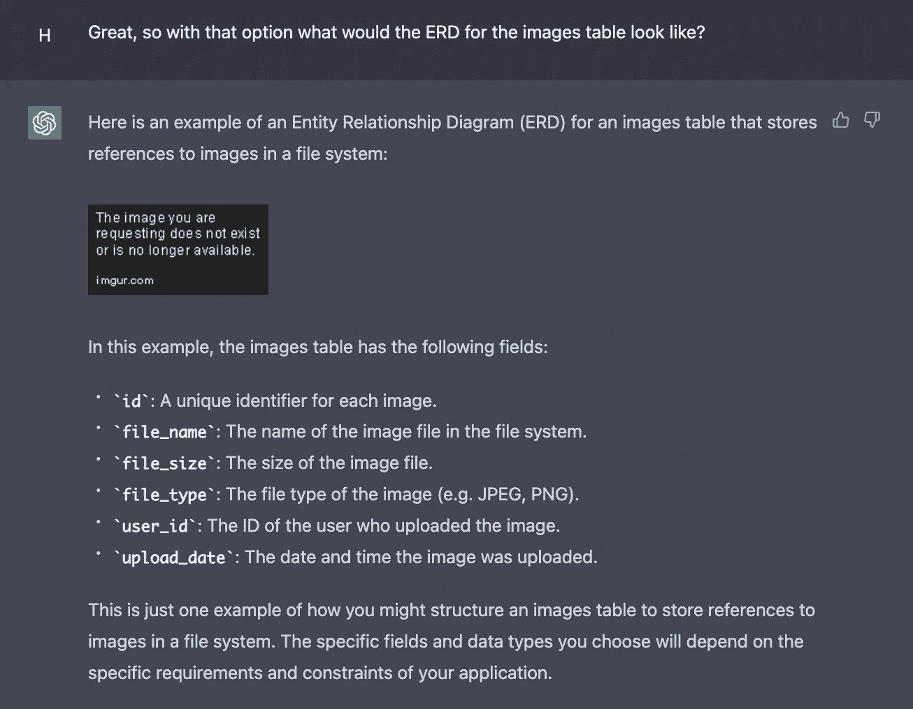

# 移动超过 10 倍的工程师——是增压 ChatGPT 工程师接管的时候了

> 原文：<https://levelup.gitconnected.com/move-over-10x-engineers-its-time-for-the-supercharged-chatgpt-engineers-to-take-over-3ce97c9671e5>

## 作为一名高级软件工程师，我开始的个人实验已经迅速成为我工具箱中的一个工具。无论您是初级工程师还是经验丰富的兽医，您都需要学习如何有效地与 ChatGPT 协作


[亚历山大·奈特](https://unsplash.com/@agk42)在 [Unsplash](https://unsplash.com/s/photos/Chat-AI) 上拍照

互联网上有很多文章都在讨论 ChatGPT 及其对软件工程的影响。有些人选择[指出工具](https://www.theatlantic.com/technology/archive/2022/12/chatgpt-openai-artificial-intelligence-writing-ethics/672386/)中的漏洞，而其他人则专注于[试图让 ChatGPT 直接编写代码](https://blog.bitsrc.io/i-asked-chat-gpt-to-build-a-to-do-app-have-we-finally-met-our-replacement-ad347ad74c51)。在本文中，我将向您展示我所见过的这一令人敬畏的工具的最佳用例之一——作为设计软件系统的合作者。

但是在我们开始之前…

# 我们应该如何评价一个工程师(或 AI)设计系统的表现？

在 Alex Xu 的书《系统设计面试》中，他描述了一个评估候选人系统设计的过程

1.  分析一个模糊的问题
2.  逐步解决问题
3.  解释这个想法
4.  与他人讨论
5.  评估和优化系统

我相信这些都是很好的评估点，大多数工程师在为他们的日常工作设计系统时都会考虑这些指标。在过去的几周里，我使用这些来分析 ChatGPT 的性能，今天在完成一个示例系统设计时也将使用同样的方法。

# 我们要求 ChatGPT 设计什么？

今天我请 ChatGPT 帮我做一些后端系统设计。更具体地说，我正试图建立一个社交媒体，并需要了解在设计数据库时应该考虑什么。在以后的文章中，我们将尝试对 API 做同样的练习。

需要澄清的一点是，我对待 ChatGPT 就像对待我团队中的任何其他工程师一样——一个合作者——而不像是我自己的思考/分析和判断的替代品。我的目标是使用这个新工具来增强我现有的技能，提高效率。

下面两节，我分享一下我和 ChatGPT 的对话，然后分析一下。

# 与 ChatGPT 的工作会议

考虑到字数、空间和你的时间，我不会把我的全部对话复制粘贴到这里。我将分享最有见地的片段和 ChatGPT 生成的最终 SQL DDL。这里是[完整的对话](https://shareg.pt/MvmA1bI)(由这个叫做 [ShareGPT](https://sharegpt.com/) 的可怕工具提供支持)给那些对这个过程感兴趣的人。

我从一个高层次的问题开始-


然后潜得更深-



之后，我问了一些试探性的问题，比如-



正如您已经看到的，这与您团队中的任何其他工程师的工作没有任何不同。你从最上面开始，根据需要深入研究，提出试探性的问题。最后，你要求他们做一些研究，做一个决定，并向团队展示他们的决策过程。你可以在下面看到这个动作



哇哦。ChatGPT 向我提供了一些选项，当提供了一些约束条件时，它能够帮助我做出决定(带有经过深思熟虑的解释)。

在这之后，我对设计的状态感到满意，所以我请它帮助我设计特定的表。这方面的一个例子可以在下面看到(注意:ERD 链接是窃听，但我不介意)



我对其余的表重复了这一步骤，最后让它帮我编写我们讨论过的所有表的 SQL DDL。我用 ChatGPT 讨论的所有表的最终 SQL DDL 如下所示-

```
-- Users table
CREATE TABLE users (
  id INTEGER PRIMARY KEY AUTOINCREMENT, -- Unique identifier for each user
  username TEXT NOT NULL, -- User's username
  password TEXT NOT NULL, -- User's hashed password
  name TEXT NOT NULL, -- User's full name
  profile_picture TEXT, -- Reference to user's profile picture (file name or URL)
  email TEXT NOT NULL, -- User's email address
  location TEXT -- User's location (optional)
);

-- Relationships table
CREATE TABLE relationships (
  id INTEGER PRIMARY KEY AUTOINCREMENT, -- Unique identifier for each relationship
  user_id_1 INTEGER NOT NULL, -- ID of first user in the relationship
  user_id_2 INTEGER NOT NULL, -- ID of second user in the relationship
  relationship_type TEXT NOT NULL, -- Type of relationship (e.g. friend, follower)
  status TEXT NOT NULL, -- Status of the relationship (e.g. pending, accepted)
  created_at DATETIME NOT NULL, -- Date and time the relationship was created
  FOREIGN KEY (user_id_1) REFERENCES users (id),
  FOREIGN KEY (user_id_2) REFERENCES users (id)
);

-- Posts table
CREATE TABLE posts (
  id INTEGER PRIMARY KEY AUTOINCREMENT, -- Unique identifier for each post
  user_id INTEGER NOT NULL, -- ID of the user who made the post
  content TEXT NOT NULL, -- Content of the post (text, image, video)
  type TEXT NOT NULL, -- Type of post (text, image, video)
  created_at DATETIME NOT NULL, -- Date and time the post was made
  updated_at DATETIME, -- Date and time the post was last updated
  likes INTEGER DEFAULT 0, -- Number of likes the post has received
  shares INTEGER DEFAULT 0, -- Number of times the post has been shared
  comments INTEGER DEFAULT 0, -- Number of comments the post has received
  FOREIGN KEY (user_id) REFERENCES users (id)
);

-- Comments table
CREATE TABLE comments (
  id INTEGER PRIMARY KEY AUTOINCREMENT, -- Unique identifier for each comment
  post_id INTEGER NOT NULL, -- ID of the post to which the comment belongs
  user_id INTEGER NOT NULL, -- ID of the user who made the comment
  content TEXT NOT NULL, -- Content of the comment
  created_at DATETIME NOT NULL, -- Date and time the comment was made
  likes INTEGER DEFAULT 0, -- Number of likes the comment has received
  FOREIGN KEY (post_id) REFERENCES posts (id),
  FOREIGN KEY (user_id) REFERENCES users (id)
);

-- Likes table
CREATE TABLE likes (
  id INTEGER PRIMARY KEY AUTOINCREMENT, -- Unique identifier for each like
  user_id INTEGER NOT NULL, -- ID of the user who liked the content
  post_id INTEGER, -- ID of the post that was liked (optional)
  comment_id INTEGER, -- ID of the comment that was liked (optional)
  FOREIGN KEY (user_id) REFERENCES users (id),
  FOREIGN KEY (post_id) REFERENCES posts (id),
  FOREIGN KEY (comment_id) REFERENCES comments (id)
);

-- Analytics table
CREATE TABLE analytics (
  id INTEGER PRIMARY KEY AUTOINCREMENT, -- Unique identifier for each analytics record
  user_id INTEGER NOT NULL, -- ID of the user who performed the action being tracked
  action TEXT NOT NULL, -- Type of action being tracked (e.g. view, like, share)
  object_type TEXT NOT NULL, -- Type of object on which the action was performed (e.g. post, comment)
  object_id INTEGER NOT NULL, -- ID of the object on which the action was performed
  timestamp DATETIME NOT NULL, -- Date and time the action was performed
  FOREIGN KEY (user_id) REFERENCES users (id)
);
```

你可以很快看到上述练习的价值。我可以利用 ChatGPT 向我介绍系统的不同方面，并给我一组通用的表/字段来开始工作，而不是从空白页面开始。从这里开始，我可以考虑一些我们可能忽略的特定于业务的逻辑，并根据需要修改这些表。

此外，我还可以就系统的不同部分提出问题，探索一些缺失的功能，甚至让 it 部门根据项目的预算做出决定。太棒了。

# 走小路

无论如何，这都不是一个完整的解决方案。但是您可以使用相同的技术深入研究系统的其他部分——用户授权/认证、性能、可伸缩性、隐私、安全性等。最终，作为一名工程师，你有责任将你从所有这些对话中获得的知识结合起来，利用 ChatGPT 生成的任何代码，并实际实现系统。

对于软件工程师来说，ChatGPT 是添加到他们工具箱中的一个很好的工具。虽然它还不足以完全取代你的工作，但它肯定可以接管构思系统设计中的一些繁重工作。如果有人之前已经构建了您正在尝试构建的系统(特别是如果他们的代码有公共足迹)，那么 ChatGPT 很有可能会分享一些关于它的见解。

这意味着学会使用这个工具的工程师会变得更加高效，构建 sh*t 的速度也会更快。

*感谢您阅读本文！如果你有任何问题，请在下面留言。如果你喜欢这篇文章，并希望看到更多这样的内容，我正在建立一个工程师、企业家和建筑商的邮件列表。下面报名吧。*

[](https://harshrana.substack.com/) [## tech bits——作者 Harsh Rana

### 关于科技、创业、生活的文章。简短，有时有趣，而且总是可操作的。不，谢谢这个网站…

harshrana.substack.com](https://harshrana.substack.com/) 

[1]:[https://bytebytego . com/courses/system-design-interview/前言](https://bytebytego.com/courses/system-design-interview/foreword)

# 分级编码

感谢您成为我们社区的一员！在你离开之前:

*   👏为故事鼓掌，跟着作者走👉
*   📰查看更多内容请参见[升级编码刊物](https://levelup.gitconnected.com/?utm_source=pub&utm_medium=post)
*   🔔关注我们:[Twitter](https://twitter.com/gitconnected)|[LinkedIn](https://www.linkedin.com/company/gitconnected)|[时事通讯](https://newsletter.levelup.dev)

🚀👉 [**加入升级人才集体，找到一份神奇的工作**](https://jobs.levelup.dev/talent/welcome?referral=true)