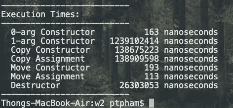

# 移动语义—高效的复制，更好的性能？

> 原文：<https://levelup.gitconnected.com/move-semantics-efficient-copy-better-performance-73b3cd854c33>

照片由[萨法尔·萨法罗夫](https://unsplash.com/@codestorm?utm_source=medium&utm_medium=referral)在 [Unsplash](https://unsplash.com?utm_source=medium&utm_medium=referral) 上拍摄

作为一个刚刚接触面向对象编程的 C++初学者，我只熟悉三条规则:如果我重新定义了复制构造函数、复制赋值操作符和析构函数(通常是为了资源管理)，不要忘记显式定义它们。然而，随着 C++11 中移动语义的出现，三的规则扩展到了五的规则，在我必须做的编码量中增加了移动赋值运算符和移动构造函数。除了堆积我的代码，他们还能带来什么？

## 移动语义——一个友好的介绍

move 语义背后的哲学一定是基于“一个人的垃圾是另一个人的宝”(我开玩笑的！).移动语义允许程序员通过交换每个对象资源的地址来重用接近生命周期终点的对象，从而避免了深度复制资源的开销。

移动构造函数和移动赋值操作符都接收一个右值引用作为参数。简而言之，右值引用标识了在内存中没有地址的东西，例如赋值表达式右边的值，或者任何即将在内存中被销毁的对象，例如一个*临时*对象或者一个到达 if 生命周期终点的对象。

## C++中的基准移动语义

为了真正证明它的性能，我编写了一个模块`TimedEvents`，用来计时一个类的每个特殊成员函数完成一项任务需要多长时间。

我还编写了另一个类`RecordSet`，来测试该类的 5 个特殊成员函数的执行时间。分配给他们的任务很简单:读取一个文本文件，并将其中的每个单词加载到它的一个数据成员中，`m_records`。只有当`RecordSet`类的一个实例将一个文本文件中的所有单词加载到动态分配的字符串数组`m_records`中时，它们才成功完成任务。

然后，我只需要写一个程序来测试那些特殊的成员函数。

这是我运行这个程序的结果:

移动语义比复制语义花费的时间少得多

毫无疑问，move 语义的引入可能是 C++发展的一小步，但对于内存管理的性能却是一个巨大的飞跃。