# Python 中的电影推荐系统

> 原文：<https://levelup.gitconnected.com/movie-recommendation-system-in-python-162b4d587c7b>


在本文中，我将介绍如何构建一个具有集成图形用户界面的基本电影推荐系统。

首先，我们需要数据。为了更好地了解推荐系统的实际表现，我们需要一个相当大的数据集。为此，我们将使用 MovieLens 25M 数据集，您可以从这里下载:

[](https://grouplens.org/datasets/movielens/25m/) [## MovieLens 25M 数据集

### 2500 万电影收视率。稳定的基准数据集。2500 万个评级和 100 万个标签应用程序适用于…

grouplens.org](https://grouplens.org/datasets/movielens/25m/) 

数据集由六个部分组成。csv 文件和解释数据集的自述文件。如果你愿意，请随意看一看。我们将只使用这 3:

movies.csv 评级. CSV；tags.csv

如果您还没有 python 库，还需要安装几个 python 库:

-numpy
-pandas
-progress(pip 安装进度)
-fuzzywuzzy (pip 安装 fuzzywuzzy & pip 安装 python-Levenshtein)
-easy GUI

我相信他们都可以 pip 安装，确切的命令将取决于操作系统。一旦我们安装了数据和库，我们就可以开始了。任何 python IDE 都可以工作，我用的是 Geany，它是 Raspbian 的一个轻量级 IDE。

快速浏览数据集:

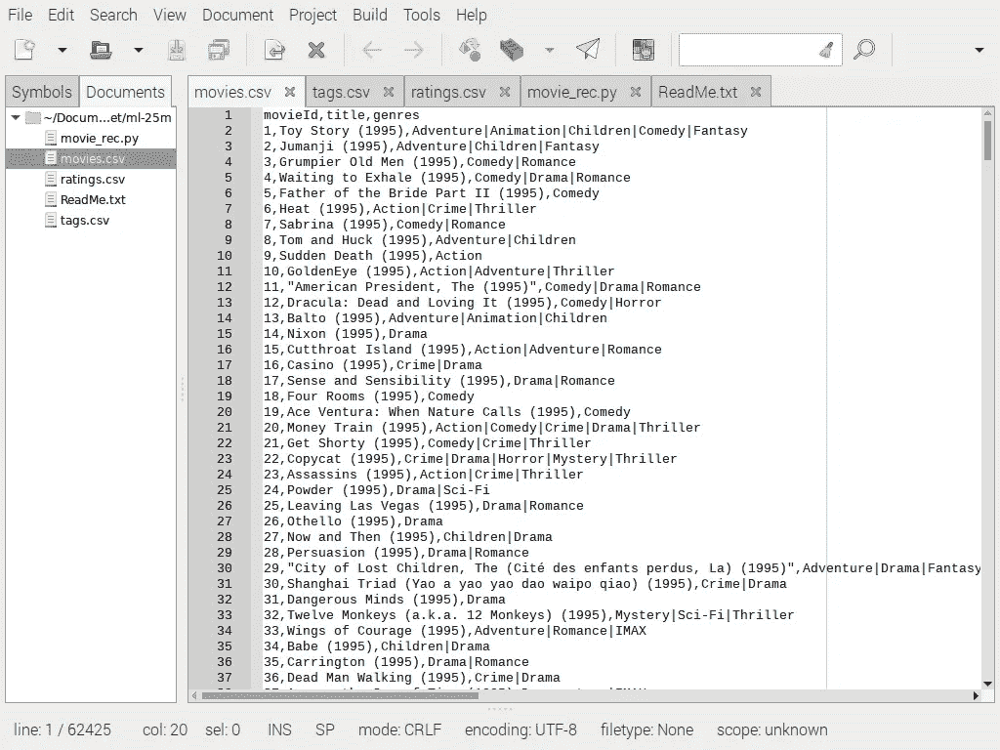

电影. csv

上面我们有 movies.csv 文件，它有 3 列，即:movieId、标题和类型。一切都非常方便和直接。我们将使用全部 3 个。

下面是 tags.csv 文件。在这里，我们将只使用“movieId”和“tag”列，这两个列将标记链接到 movieId 列，这两个列也可以在 movies.csv 和 ratings.csv 中找到

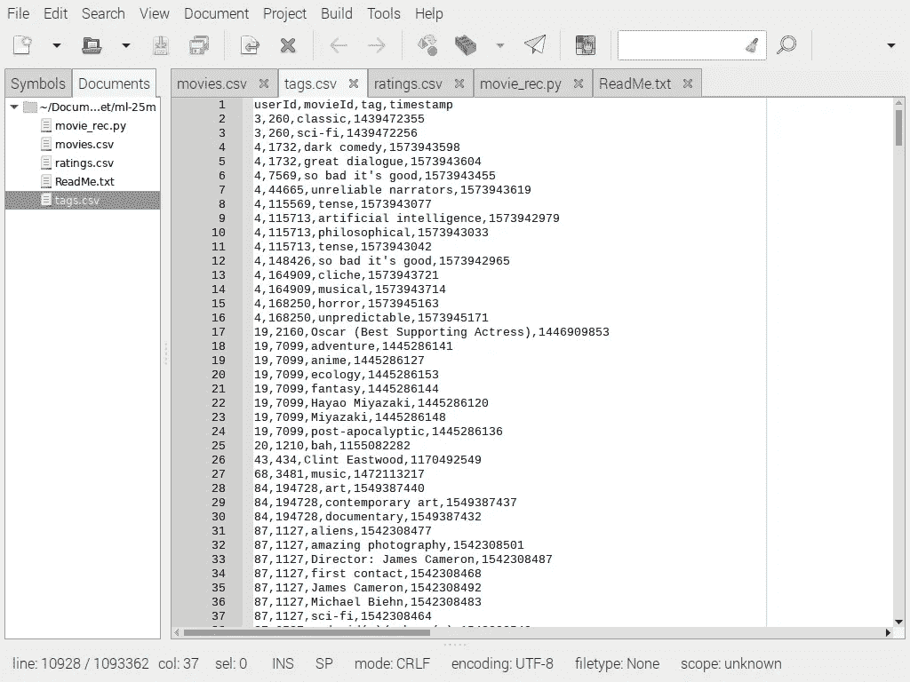

tags.csv

最后但同样重要的是，ratings.csv，从这个家伙，我们将使用“电影 Id”和“评级”列。

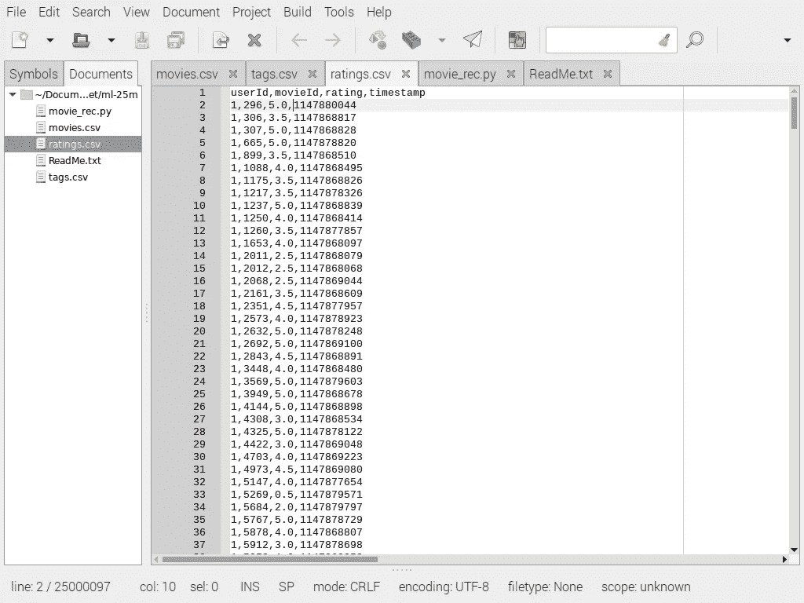

评级. csv

太棒了，现在让我们启动 IDE 开始吧。

从导入库开始，如下所示。熊猫和 numpy 在数据科学领域非常有名。据我所知，Fuzzywuzzy、easygui 和 progress library 不太为人所知，但你可能对它们很熟悉。我将在代码中添加大量的注释，尽可能使代码更加清晰。让我们直入主题吧。

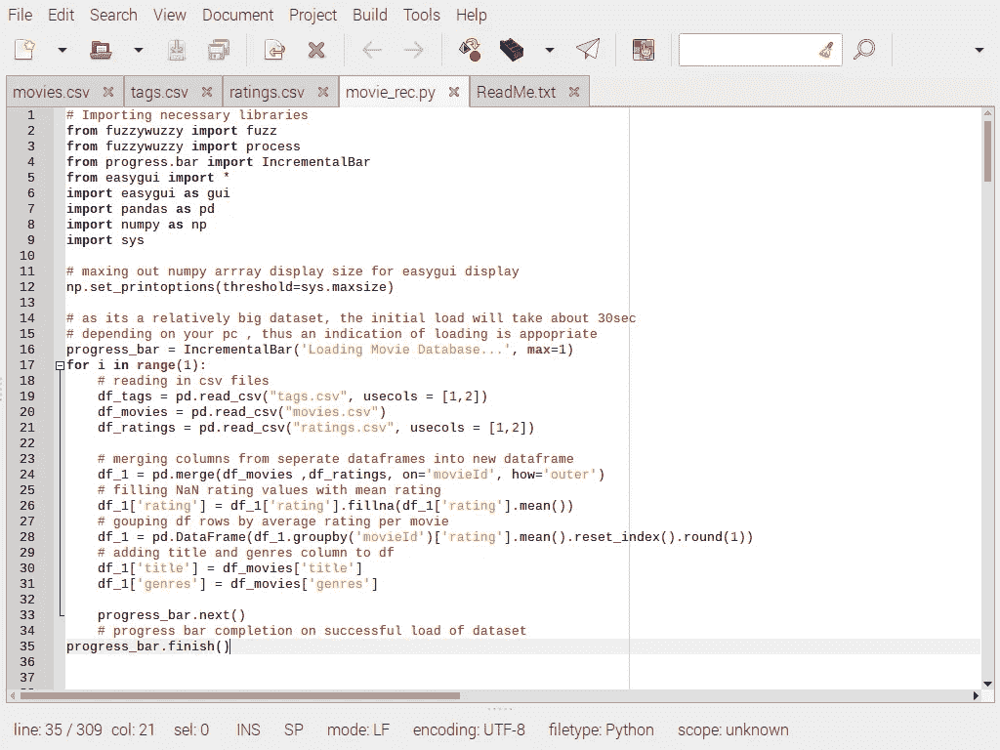

除了数据集的初始加载和 gui 的显示设置之外，该程序将主要由一系列函数组成，GUI 将被输入一个 numpy 数组。如果没有第 12 行的显示设置…如果推荐系统推荐的电影列表太长，我们会得到一个不太有用的截断表示。

有几种不同的方法可以让显示排序，例如循环遍历数组，将每一行追加到一个初始化为空列表的变量中，但是，这(第 12 行)是我们将使用的方法。

第 16、17、33 和 35 行基本上是 python progress 库中进度条的语法。循环只运行一次，并执行其中的代码块。一旦完成，进度条就完成了它的工作。数据集在我的系统上加载大约需要 30 秒，这就是为什么我们使用进度条来指示数据集在你启动程序后正在加载，如下所示。之后，我们就不必在浏览 GUI 时再次加载它了。

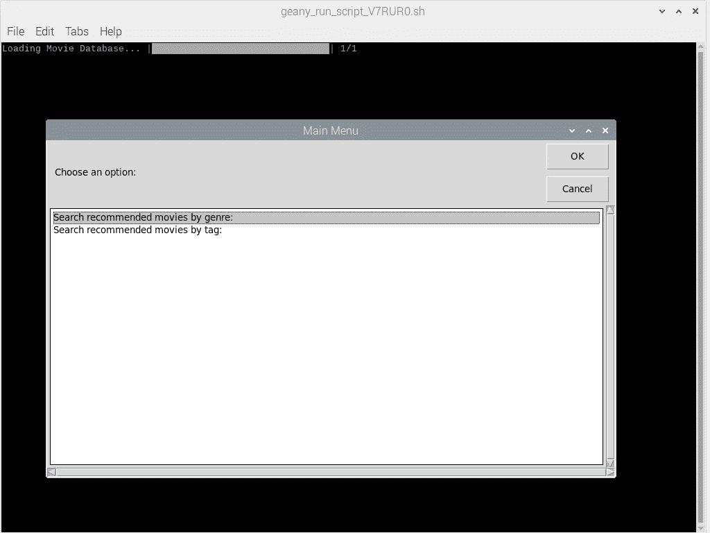

数据集加载&图形用户界面的主菜单

在循环内部，我们将数据集加载到 pandas 数据帧中，并对数据进行一些处理，以使其具有更理想的格式。我们首先将电影和收视率数据帧合并成 1。评级列有几个 NaN 值，我们将通过在整个评级列中计算出的平均评级来填充它。由于一些电影有数百个评级，我们希望获得每部电影的平均评级，并按照与电影名称相关联的 movieId 对它们进行分组。现在我们有了更容易接受的数据，是时候构建函数了。

第一个函数被称为 which_way()

这个函数产生 GUI 的主菜单，并提示用户做出选择。按类型或标签搜索电影。用户当然也可以按下取消键，根本不搜索电影，这完全由他们决定。

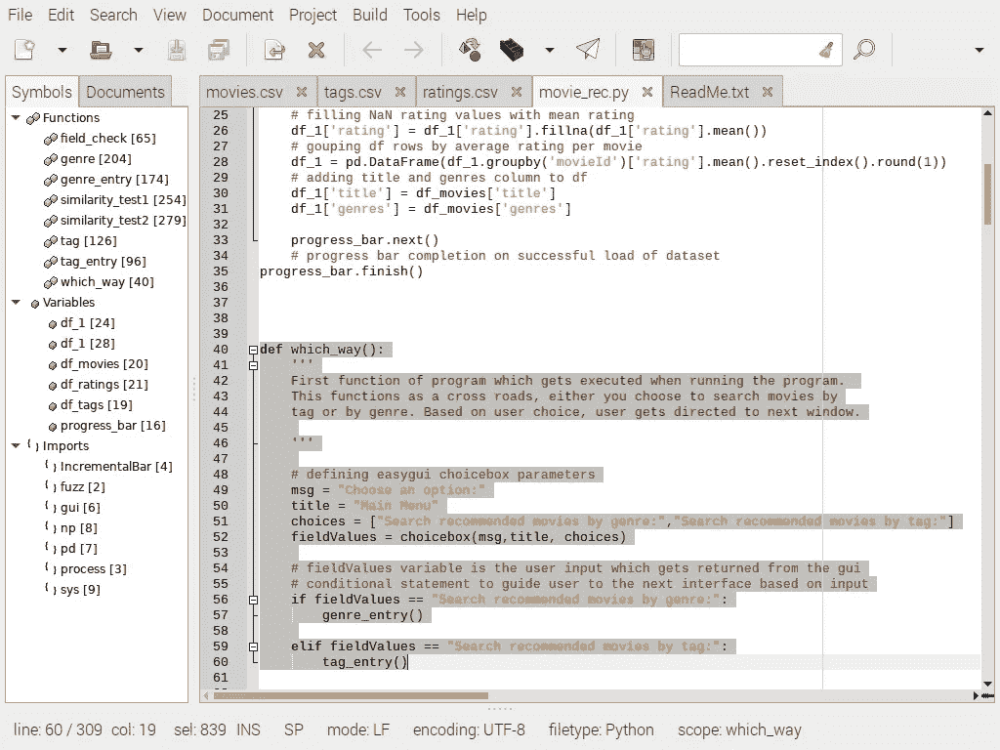

哪个方向()

在这个函数中，我们定义了显示给用户的 easygui chiocebox 的参数。用户单击的选项的文本(字符串)将被返回并存储在 fieldValues 变量中。然后，我们有一个条件语句，它根据用户的选择将用户引导到下一个功能/窗口。

如果用户点击取消，那么程序将会终止。但是，如果用户点击:按类型搜索电影或按标签搜索电影，那么函数 genre_entry()或 tag_entry()将被调用，一个被称为 easygui multenterbox 的东西将出现。

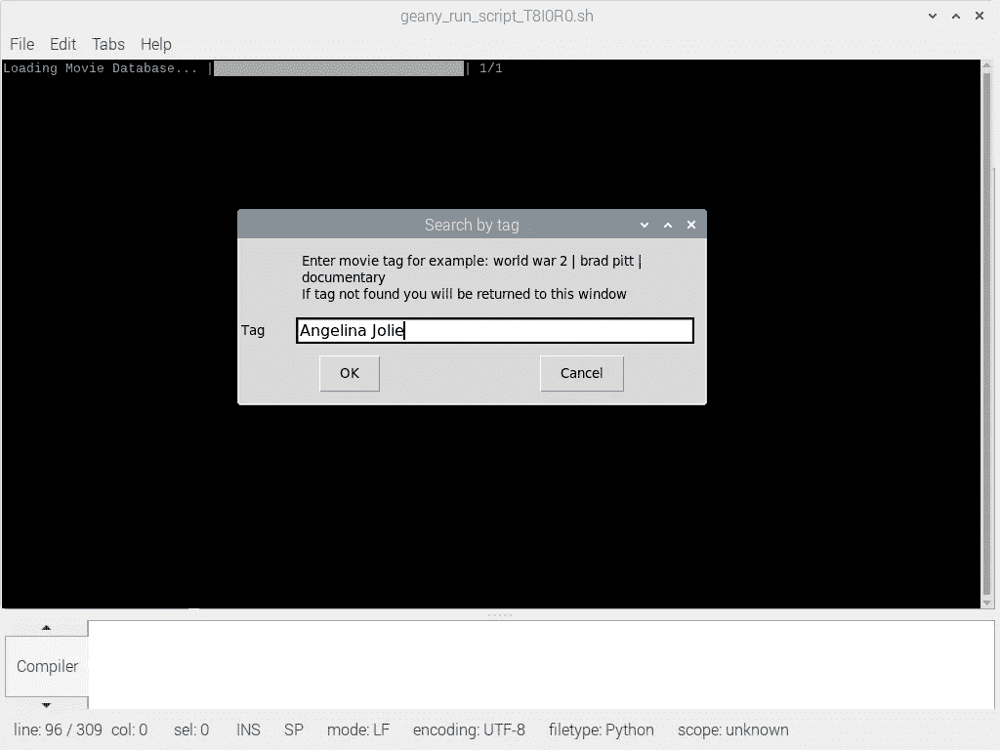

正如您可以从它的名字推断的那样，如果需要，这个输入框可以接受多个输入。genre_entry()和 tag_entry()函数都非常相似，所以我只解释 1，但我会在源代码中包含这两个函数。让我们看看 tag_entry()。

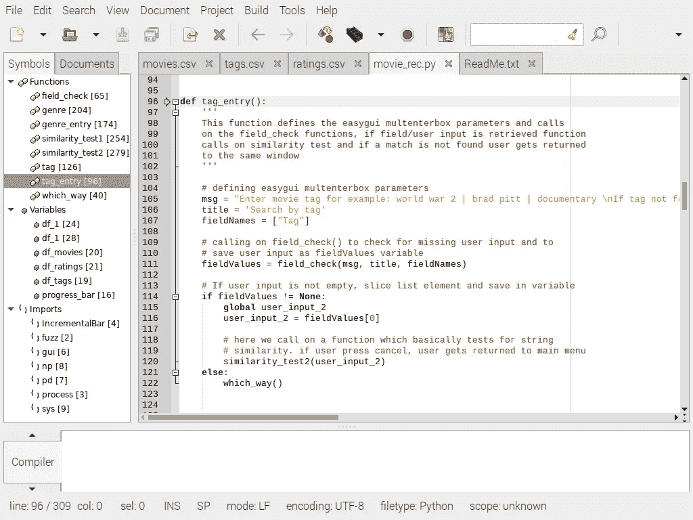

在将显示参数传递给 multenterbox 之后，我们调用另一个函数来检查用户输入。用户输入将从此 field_check 函数返回。让我们快速访问这个函数。

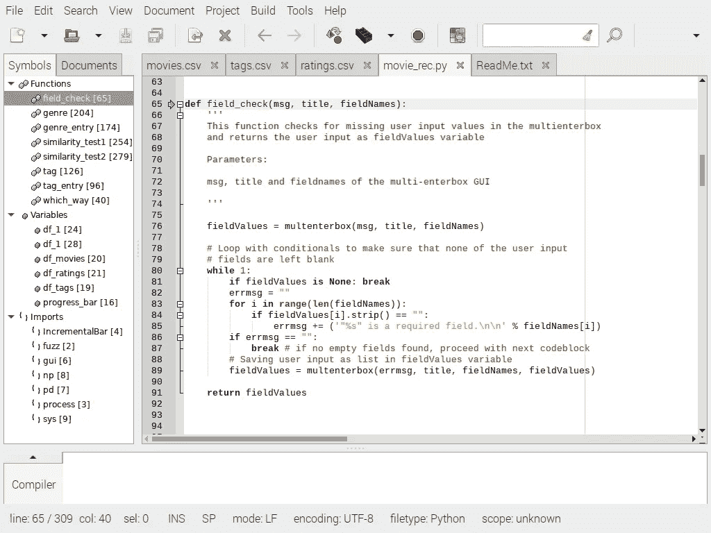

有时用户输入空白字段，可能是由于错误等。为了控制这种行为并使 gui 更加可靠，我们需要这样的函数。我在 easygui 文档页面上找到了这个特定的函数。基本上，只要你输入一个空字段，你就会被告知该字段是必填的，并陷入循环。

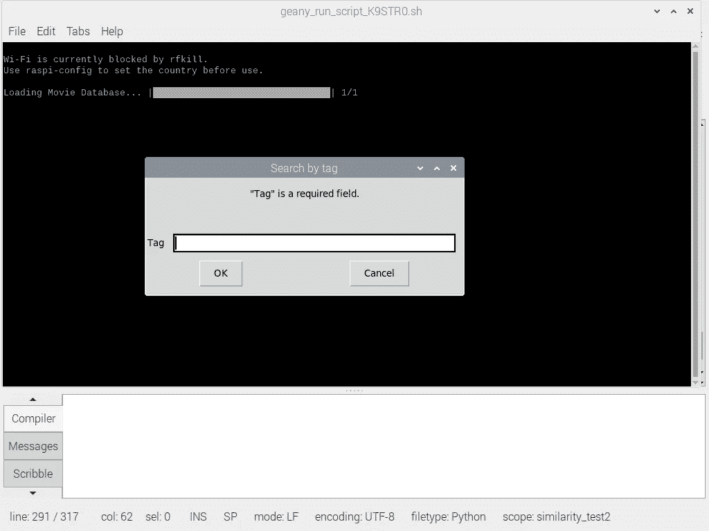

一旦用户输入内容，文本(字符串)将存储在 fieldValues 变量中，代码将在 tag_entry 函数的第 114 行继续。

来自 easygui 多输入框输入行的用户输入以列表形式返回。按下“取消”按钮时，返回“无”。为了在其他函数中使用这个用户输入，我们需要将变量声明为全局变量。

我们现在对从 multenterbox 返回的用户输入列表进行切片，并将其保存为变量 user_input_2。我们只对用户不按 cancel 时返回的文本感兴趣，因此有条件语句:

" if fieldValues！=无:"

如果用户好心地输入一些文本，我们继续使用 similarity_test2()函数，它基本上包含了这个推荐系统的主要内容，或者用户返回到主菜单。….similarity _ test1()& similarity _ test2()都非常相似，就像 genre_entry & tag_entry 共享相似性一样。这里我只涉及 similarity_test2()。让我们来看看:

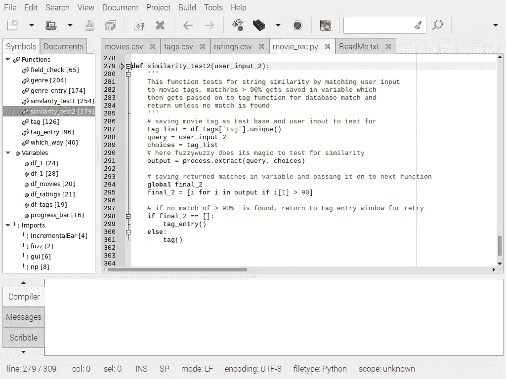

正如我们所看到的，它采用了一个参数，即 tag_entry()函数中的 user_input_2 变量。还记得我们在 tags.csv 文件的第 19 行创建的 dataframe 吗？因此，首先我们要从 tag 列中收集所有唯一的标记，并将其存储在一个变量中。

有许多方法可以利用 fuzzywuzzy 库，这取决于您想要实现的目标。对于这个应用程序，我们将使用以下语法:“output = process.extract(query，choices)”

我相信你可以在这里传递一个额外的参数来定义计分器的类型。我们将只使用默认语法。基本上 fuzzywuzzy 所做的是，它使用 Levenshtein 距离来计算序列之间的差异，并返回满分为 100 分的分数。

这个 fuzzywuzzy“process . extract(query，choices)”函数返回分数的方式是在一个列表中，每个字符串及其分数放在括号中，就像 so (string，95)作为列表元素。

在循环遍历整个标签列表并查找针对 user_input_2 变量的匹配后，我们循环遍历分数列表，只截取 90%以上的匹配，并将它们保存在变量“final_2”中。我们将它声明为全局的，这样我们可以在下一个函数中使用它。如果 fuzzywuzzy 没有为我们找到匹配，它将返回“[]”。所以我们创建了一个条件，如果没有找到匹配，就让用户返回 tag_entry()函数再试一次。或者，如果我们有 90%以上的匹配，我们现在可以把它们带到下一个名为“tag()”的函数，如下所示:

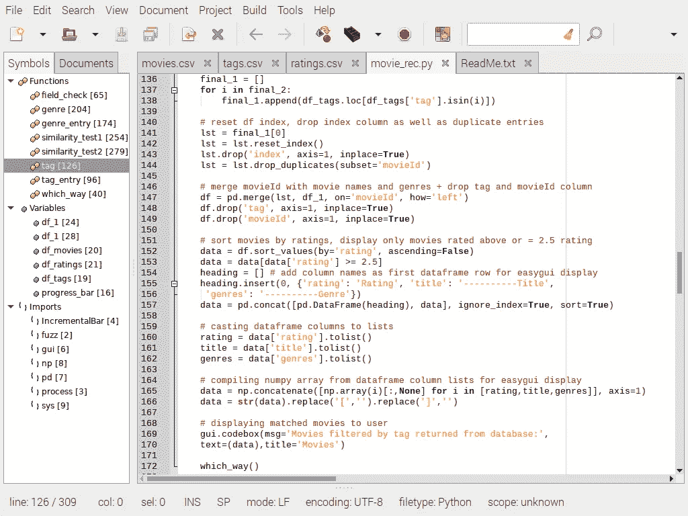

标签()

现在我们有了> 90%的匹配，我们循环遍历它们，查看“df_tags”数据帧“tag”列的每一行，看看哪些标记与我们从 fuzzywuzzy 返回的字符串匹配。现在，我们将 tag 列中的所有 tag 匹配项以及它们的 movieId 保存在一个名为“final_1”的变量中。为了清理附加的数据，我们对第一个元素进行切片，并重置数据帧索引。我们现在可以删除名为 index 的列，并从“movieId”列中删除所有重复项。

为了以降序方式首先显示评分最高的电影，我们相应地对数据帧进行排序，并删除评分低于 2.5/5.0 的所有电影

我们现在可以在数据框的顶部插入一个新行，基本上复制它们上面的列名。这仅用于 easygui 显示目的。Easygui codebox 不太喜欢你给它传递一个 pandas dataframe，所以我们需要把它改成一个更合适的格式。

我们的方法是将数据帧的每一列转换成一个列表，然后使用 numpy 重组它。好了，现在我们只需用稀薄的空气替换括号，并转到 easygui 代码框进行显示。就是这样！

让我们通过标签搜索电影:“黑客”，看看它返回什么…

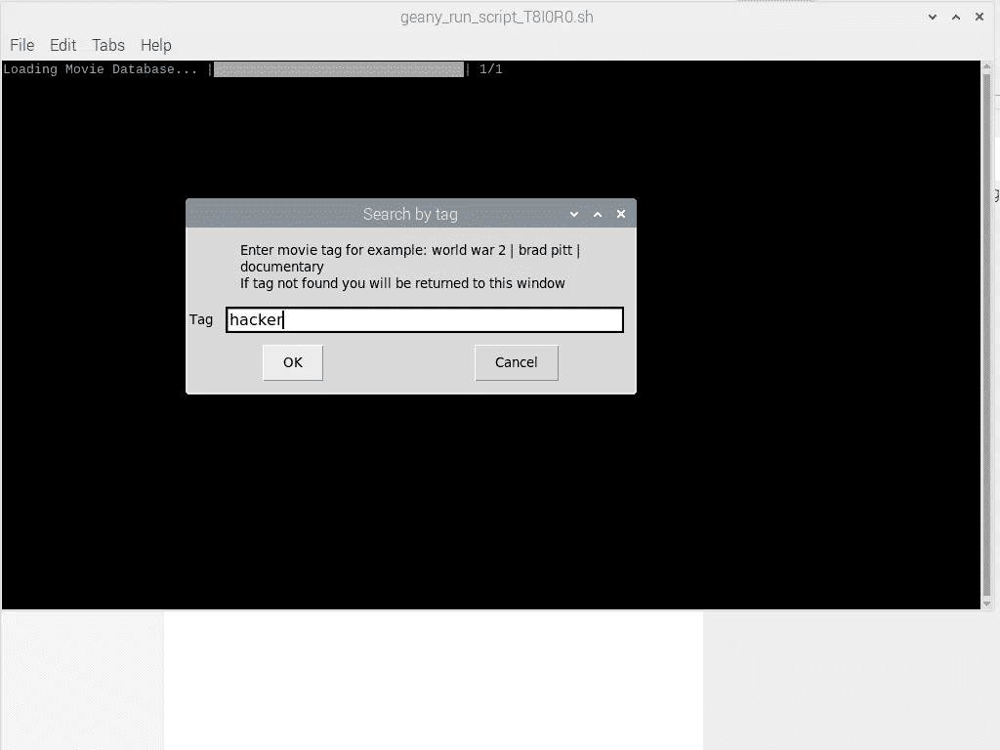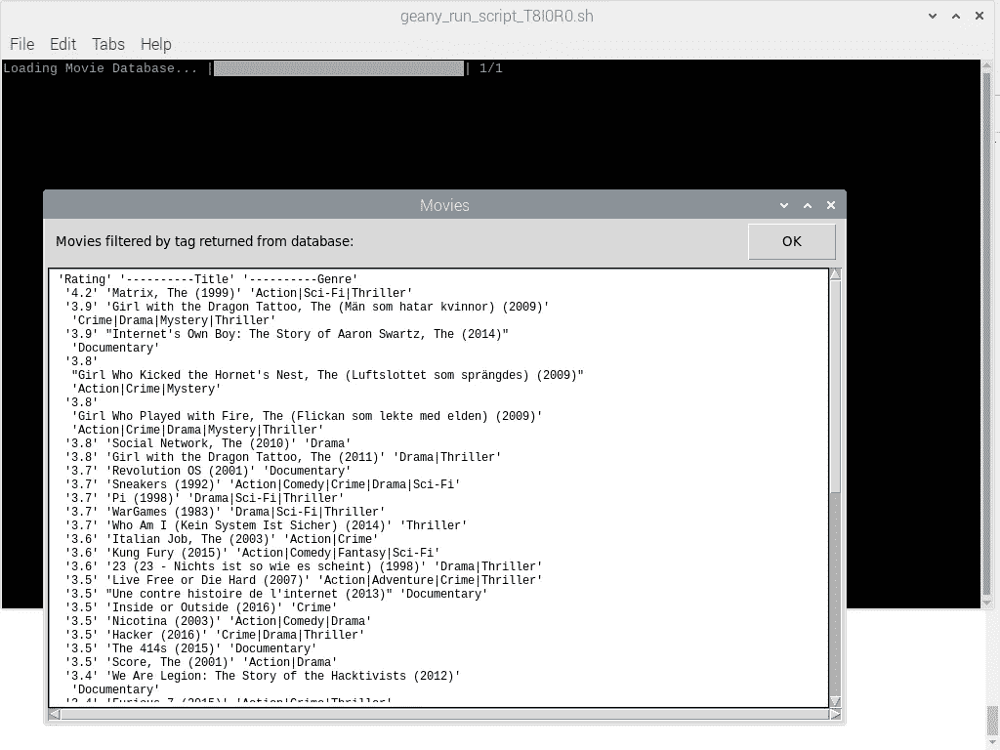

看起来它正在工作…请随意使用它，如果我在什么地方犯了错误，请告诉我！下面是源代码:

```
# Importing necessary libraries 
from fuzzywuzzy import fuzz 
from fuzzywuzzy import process
from progress.bar import IncrementalBar
from easygui import *
import easygui as gui
import pandas as pd
import numpy as np
import sys# maxing out numpy arrray display size for easygui display 
np.set_printoptions(threshold=sys.maxsize)# as its a relatively big dataset, the initial load will take about 30sec
# depending on your pc , thus an indication of loading is appopriate 
progress_bar = IncrementalBar('Loading Movie Database...', max=1)
for i in range(1):
    # reading in csv files
    df_tags = pd.read_csv("tags.csv", usecols = [1,2])
    df_movies = pd.read_csv("movies.csv")
    df_ratings = pd.read_csv("ratings.csv", usecols = [1,2])

    # merging columns from seperate dataframes into new dataframe
    df_1 = pd.merge(df_movies ,df_ratings, on='movieId', how='outer')
    # filling NaN rating values with mean rating
    df_1['rating'] = df_1['rating'].fillna(df_1['rating'].mean()) 
    # gouping df rows by average rating per movie
    df_1 = pd.DataFrame(df_1.groupby('movieId')['rating'].mean().reset_index().round(1))
    # adding title and genres column to df
    df_1['title'] = df_movies['title']
    df_1['genres'] = df_movies['genres']

    progress_bar.next()
    # progress bar completion on successful load of dataset 
progress_bar.finish()def which_way():
    '''
    First function of program which gets executed when running the program. 
    This functions as a cross roads, either you choose to search movies by
    tag or by genre. Based on user choice, user gets directed to next window.

    '''

    # defining easygui choicebox parameters
    msg = "Choose an option:"
    title = "Main Menu"
    choices = ["Search recommended movies by genre:","Search recommended movies by tag:"]
    fieldValues = choicebox(msg,title, choices)

    # fieldValues variable is the user input which gets returned from the gui
    # conditional statement to guide user to the next interface based on input
    if fieldValues == "Search recommended movies by genre:":
        genre_entry()

    elif fieldValues == "Search recommended movies by tag:":
        tag_entry()def field_check(msg, title, fieldNames):
    '''
    This function checks for missing user input values in the multienterbox
    and returns the user input as fieldValues variable

    Parameters:

    msg, title and fieldnames of the multi-enterbox GUI

    '''

    fieldValues = multenterbox(msg, title, fieldNames)

    # Loop with conditionals to make sure that none of the user input 
    # fields are left blank
    while 1:
        if fieldValues is None: break
        errmsg = ""
        for i in range(len(fieldNames)):
            if fieldValues[i].strip() == "":
                errmsg += ('"%s" is a required field.\n\n' % fieldNames[i])
        if errmsg == "":
            break # if no empty fields found, proceed with next codeblock
        # Saving user input as list in fieldValues variable
        fieldValues = multenterbox(errmsg, title, fieldNames, fieldValues)

    return fieldValuesdef tag_entry():
    ''' 
    This function defines the easygui multenterbox parameters and calls
    on the field_check functions, if field/user input is retrieved function
    calls on similarity test and if a match is not found user gets returned 
    to the same window  
    '''

    # defining easygui multenterbox parameters
    msg = "Enter movie tag for example: world war 2 | brad pitt | documentary \nIf tag not found you will be returned to this window"
    title = 'Search by tag'                        
    fieldNames = ["Tag"]

    # calling on field_check() to check for missing user input and to
    # save user input as fieldValues variable
    fieldValues = field_check(msg, title, fieldNames)

    # If user input is not empty, slice list element and save in variable
    if fieldValues != None:
        global user_input_2
        user_input_2 = fieldValues[0]

        # here we call on a function which basically tests for string
        # similarity. if user press cancel, user gets returned to main menu 
        similarity_test2(user_input_2)
    else:
        which_way()def tag():
    '''
    This function adds all tag-matched movies to pandas dataframe,
    alter the dataframe for correct easygui display by dropping some 
    columns, resetting df index, merging df's and sorting movies to display
    only movies rated >= 2.5 , it also casts the final df columns to lists
    and rearrange them in a numpy array for easygui display.  
    '''

    # append tag matched movies as dataframe object
    final_1 = []
    for i in final_2:
        final_1.append(df_tags.loc[df_tags['tag'].isin(i)])

    # reset df index, drop index column as well as duplicate entries
    lst = final_1[0]
    lst = lst.reset_index()
    lst.drop('index', axis=1, inplace=True)
    lst = lst.drop_duplicates(subset='movieId')# merge movieId with movie names and genres + drop tag and movieId column
    df = pd.merge(lst, df_1, on='movieId', how='left')
    df.drop('tag', axis=1, inplace=True)
    df.drop('movieId', axis=1, inplace=True)# sort movies by ratings, display only movies rated above or = 2.5 rating
    data = df.sort_values(by='rating', ascending=False)
    data = data[data['rating'] >= 2.5]
    heading = [] # add column names as first dataframe row for easygui display
    heading.insert(0, {'rating': 'Rating', 'title': '----------Title',
     'genres': '----------Genre'})
    data = pd.concat([pd.DataFrame(heading), data], ignore_index=True, sort=True)

    # casting dataframe columns to lists
    rating = data['rating'].tolist()
    title = data['title'].tolist()
    genres = data['genres'].tolist()

    # compiling numpy array from dataframe column lists for easygui display
    data = np.concatenate([np.array(i)[:,None] for i in [rating,title,genres]], axis=1)
    data = str(data).replace('[','').replace(']','')

    # displaying matched movies to user
    gui.codebox(msg='Movies filtered by tag returned from database:',
    text=(data),title='Movies')

    which_way()def genre_entry():
    ''' 
    This function defines the easygui multenterbox parameters and calls
    on the field_check functions, if field/user input is retrieved function
    calls on similarity test and if a match is not found user gets returned 
    to the same window  
    '''
    # defining easygui multenterbox parameters
    msg = "Enter movie genre for example: mystery | action comedy | war \nIf genre not found you will be returned to this window"
    title = "Search by genre"
    fieldNames = ["Genre"]

    # calling on field_check() to check for missing user input and to
    # save user input as fieldValues variable
    fieldValues = field_check(msg, title, fieldNames)

    # If user input is not empty, slice list element and save in variable
    if fieldValues != None:
        global user_input
        user_input = fieldValues[0]

    # here we call on a function which basically tests for string
    # similarity. if user press cancel, user gets returned to main menu 
        similarity_test1(user_input)
    else:
        which_way()def genre():
    '''
    This function adds all genre-matched movies to pandas dataframe,
    alter the dataframe for correct easygui display by dropping some 
    columns, resetting df index, merging df's and sorting movies to display
    only movies rated >= 2.5 , it also casts the final df columns to lists
    and rearrange them in a numpy array for easygui display.  
    '''

    # append genre matched movies as dataframe object
    final_1 = []
    for i in final:
        final_1.append(df_movies.loc[df_movies['genres'].isin(i)])

    # reset df index, drop index columns as well as duplicate entries
    lst = final_1[0]
    lst = lst.reset_index()
    lst.drop('index', axis=1, inplace=True)
    lst.drop('title', axis=1, inplace=True)
    lst.drop('genres', axis=1, inplace=True)
    lst = lst.drop_duplicates(subset='movieId')

    # merge movieId with movie names, rating and genres + drop index, title and genres column
    df = pd.merge(lst, df_1, on='movieId', how='left')

    # sort movies by ratings, display only movies rated above or = 2.5 rating
    data = df.sort_values(by='rating', ascending=False)
    data.drop('movieId', axis=1, inplace=True)
    data = data[data['rating'] >= 2.5]
    heading = [] # add column names as first dataframe row for easygui display
    heading.insert(0, {'rating': 'Rating', 'title': '----------Title',
     'genres': '----------Genre'})
    data = pd.concat([pd.DataFrame(heading), data], ignore_index=True, sort=True)

    # casting dataframe columns to lists
    rating = data['rating'].tolist()
    title = data['title'].tolist()
    genres = data['genres'].tolist()

    # compiling numpy array from dataframe column lists for easygui display
    data = np.concatenate([np.array(i)[:,None] for i in [rating,title,genres]], axis=1)
    data = str(data).replace('[','').replace(']','')

    # displaying matched movies to user
    gui.codebox(msg='Movies filtered by genre returned from database:',
    text=(data),title='Movies')

    which_way()def similarity_test1(user_input):
    '''
    This function tests for string similarity by matching user input
    to movies genres, match/es > 90% gets saved in variable which
    then gets passed on to genre function for database match and
    return unless no match is found
    '''
    # saving movie genre/s as test base and user input to test for 
    genre_list = df_movies['genres'].unique()
    query = user_input
    choices = genre_list 
    # here fuzzywuzzy does its magic to test for similarity
    output = process.extract(query, choices)

    # saving returned matches in variable and passing it on to next function
    global final
    final = [i for i in output if i[1] > 90]

    # if no match of > 90%  is found, return to genre entry window for retry
    if final == []:
        genre_entry()
    else:
        genre()def similarity_test2(user_input_2):
    '''
    This function tests for string similarity by matching user input
    to movie tags, match/es > 90% gets saved in variable which
    then gets passed on to tag function for database match and
    return unless no match is found
    '''
    # saving movie tag as test base and user input to test for
    tag_list = df_tags['tag'].unique()
    query = user_input_2
    choices = tag_list 
    # here fuzzywuzzy does its magic to test for similarity
    output = process.extract(query, choices)

    # saving returned matches in variable and passing it on to next function
    global final_2
    final_2 = [i for i in output if i[1] > 90]

    # if no match of > 90%  is found, return to tag entry window for retry
    if final_2 == []:
        tag_entry()
    else:
        tag()if __name__ == '__main__':
    which_way()
```