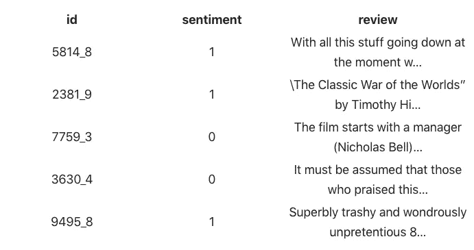
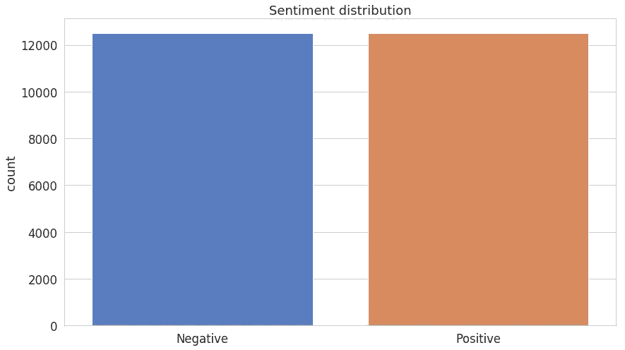
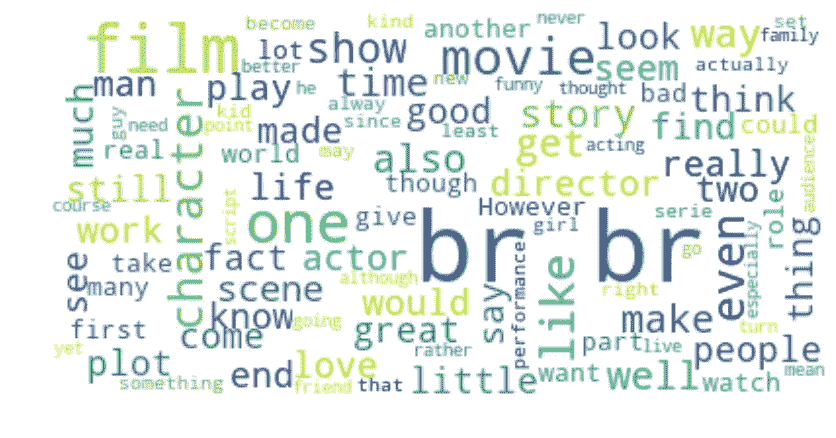
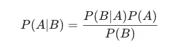
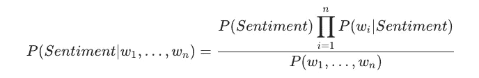
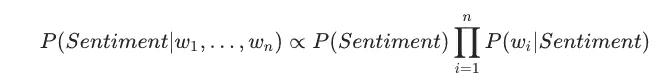
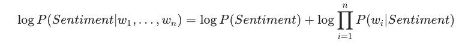
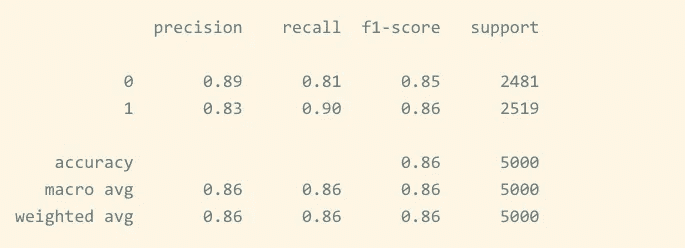
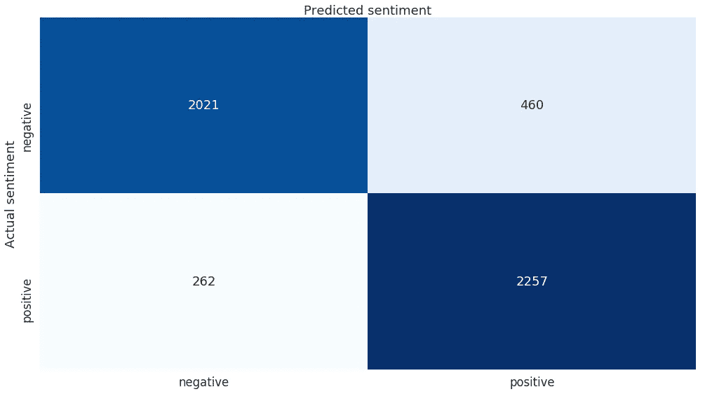

# 基于朴素贝叶斯的电影评论情感分析(五)

> 原文：<https://levelup.gitconnected.com/movie-review-sentiment-analysis-with-naive-bayes-machine-learning-from-scratch-part-v-7bb869391bab>

## 了解如何处理文本数据。创建通用文本分类器并预测 IMDB 电影评论的情感。


> *TL；DR 使用 Python 从头开始构建朴素贝叶斯文本分类模型。使用该模型将 IMDB 电影评论分为正面或负面。*

从你读到的推文到塞内卡的不朽著作，文本数据主宰着我们的世界。当我们越来越多地消费图片(看着你的 Instagram)和视频时，你仍然每天多次阅读谷歌搜索结果。

文本数据经常出现的一个问题是[情感分析](https://en.wikipedia.org/wiki/Sentiment_analysis)(分类)。想象一下你是一家很大的糖+水饮料公司。你想知道人们对你的产品的看法。您将搜索带有一些标签、徽标或名称的文本。然后，您可以使用情绪分析来判断意见是积极的还是消极的。当然，你会把那些消极的送到你在印度的报酬极低的支持中心去解决问题。

在这里，我们将构建一个通用的文本分类器，将电影评论文本分为两类——负面或正面情绪。我们将简要地看一下贝叶斯定理，并使用天真的假设放松它的要求。

[](https://colab.research.google.com/drive/1OPQDDJTKy0b40pziZWSsoBCmQV6HyXsm) [## 谷歌联合实验室

### 基于朴素贝叶斯的电影评论分析——colab.research.google.com](https://colab.research.google.com/drive/1OPQDDJTKy0b40pziZWSsoBCmQV6HyXsm) 

# **处理文字**

计算机不理解文本数据，尽管它们对数字处理得很好。[自然语言处理(NLP)](https://en.wikipedia.org/wiki/Natural_language_processing) 提供了一套解决文本相关问题的方法，并将文本表示为数字。虽然 NLP 是一个广阔的领域，但我们将使用一些简单的预处理技术和[单词包](https://en.wikipedia.org/wiki/Bag-of-words_model)模型。

## **数据**

我们的数据来自一个 Kaggle 挑战——“一袋文字遇上一袋爆米花”[。](https://www.kaggle.com/c/word2vec-nlp-tutorial)

我们有来自 IMDB 的 *25，000 条*电影评论，标记为正面或负面。您可能知道 IMDB 评级在*0–10*范围内。由数据集作者完成的附加预处理步骤将评级转换成二元情感(< 5 —负面)。当然，一部电影可以有多条评论，但不超过 *30 条*。

## **阅读评论**

让我们在 Pandas 数据框中加载训练和测试数据:

## **探索**

让我们感受一下我们的数据。以下是训练数据的前 5 行:



我们将重点关注情绪和评论专栏。id 列将电影 id 与一条评论的唯一编号相结合。这可能是现实世界场景中的一条重要信息，但我们将保持它的简单性。



积极和消极的情绪同样存在。不需要额外的噱头来解决这个问题！

以下是训练数据集评论中最常见的词:



嗯，那个 **br** 看起来怪怪的，对吧？

## **清洁**

真实世界的文本数据真的很乱。它可以包含过多的标点符号、HTML 标签(包括那个 **br** )、多个空格等等。我们将尝试移除/正常化大部分内容。

我们将使用[正则表达式](https://en . Wikipedia . org/wiki/Regular _ expression)进行大部分清理，但我们将使用两个库来处理 HTML 标签(令人惊讶地难以删除)和删除常用(停止)单词:

首先，我们使用 [BeautifulSoup](https://www.crummy.com/software/BeautifulSoup/bs4/doc/) 从文本中移除 HTML 标签。其次，我们删除所有不是字母或空格的内容(注意忽略了大写字符)。最后，我们用一个单独的间距替换多余的间距。

## **标记化**

既然我们的评论是“干净的”，我们可以进一步为我们的单词袋模型做准备。让我们把它们转换成小写字母，并把它们分解成单个的单词。这个过程被称为[标记化](https://en.wikipedia.org/wiki/Lexical_analysis#Tokenization):

我们预处理的最后一步是使用那些在 [NLTK](https://www.nltk.org/) 库中定义的移除[停止字](https://en.wikipedia.org/wiki/Stop_words)。停用词通常是频繁出现的词，可能不会显著影响文本的含义。英语中的一些例子有:“是”、“the”、“and”。

删除停用词的另一个好处是加快了我们的模型，因为我们删除了大量的训练/测试数据。但是，在现实世界中，您应该考虑删除停用词是否合理。

我们将把我们的 clean 和 tokenize 函数放在一个名为`*Tokenizer*`(也称为 Terminator)的类中。

# **朴素贝叶斯**

***朴素贝叶斯*** 模型是概率分类器，它使用[贝叶斯定理](https://en.wikipedia.org/wiki/Bayes%27_theorem)并强烈假设数据的特征是独立的。对于我们的例子，这意味着每个单词都是独立的。

直觉上，这听起来可能是个愚蠢的想法。你知道(甚至从阅读中)前一个单词会影响当前和下一个单词。然而，这个假设简化了数学运算，并且[在实践中非常有效](https://www.cc.gatech.edu/~isbell/reading/papers/Rish.pdf)！

贝叶斯定理被定义为:



其中 ***A*** 和 ***B*** 是一些事件和 ***P(。)*** 是一个概率。

这个等式给出了事件 ***A*** 发生的条件概率，假设 ***B*** 已经发生。为了找到这一点，我们需要计算*发生的概率，假设*已经发生，然后乘以*(称为*先于*)发生的概率。这一切除以 ***B*** 自行发生的概率。***

**这个天真的假设允许我们将我们例子中的贝叶斯定理重新表述为:**

****

**我们并不关心概率。我们只想知道一个给定的文本有积极的还是消极的情绪。我们可以完全跳过分母，因为它只是缩放分子:**

****

# ****实现多项式朴素贝叶斯****

**你可能已经猜到了，我们将文本分为两类——积极情绪和消极情绪。**

**多项式朴素贝叶斯允许我们将模型的特征表示为它们出现的频率(某个词在我们的评论中出现的频率)。换句话说，它告诉我们，我们使用的概率分布是[多项式](https://en.wikipedia.org/wiki/Multinomial_distribution)。**

## ****关于数值稳定性的说明****

**我们的模型依赖于许多概率的相乘。这些可能会变得越来越小，我们的计算机可能会将它们四舍五入为零。为了解决这个问题，我们将使用对数概率，在我们的等式中取每一边的 *log* :**

****

**注意，我们仍然可以使用我们的模型的最高分数来预测情绪，因为 log 是[单调的](https://en.wikipedia.org/wiki/Monotonic_function)。**

## ****建立我们的模型****

**最后，是时候用 Python 实现我们的模型了。让我们从定义一些变量开始，并按类对数据进行分组，这样我们的训练代码会更整洁一些:**

**我们将实现一个通用的文本分类器，它不假设类的数量。你可以用它来进行新闻分类预测、情感分析、垃圾邮件检测等。**

**对于每个类，我们将找到其中的例子数量和对数概率(先验)。我们还将记录每个单词的出现次数，并创建一个词汇表，即我们在训练数据中看到的所有单词的集合:**

**请注意，我们使用我们的`*Tokenizer*`和内置的类[计数器](https://docs.python.org/3/library/collections.html#collections.Counter)将评论转换为一袋单词。**

**如果你感兴趣，下面是`group_by_class`的工作方式:**

## ****做预测****

**为了从文本数据中预测情感，我们将使用我们的类别先验和词汇:**

**对于每个评论，我们使用正面和负面情绪的对数先验，并标记文本。对于每个单词，我们检查它是否在词汇表中，如果不在，就跳过它。然后我们计算每个类这个词的对数概率。我们将班级分数相加，选择分数最高的班级作为我们的预测。**

****拉普拉斯平滑****

**注意 *log(0)* 是 ***undefined*** (而且不，我们这里不用 JavaScript)。我们词汇中的一个单词完全有可能出现在一个类别中，而不在另一个类别中——在那个类别中找到这个单词的概率将是 0！我们可以使用[拉普拉斯平滑](https://en.wikipedia.org/wiki/Additive_smoothing)来修复这个问题。我们将简单地在分子上加 1，同时在分母上增加我们的词汇量:**

# ****预测情绪****

**既然你的模型可以被训练并做出预测，那么让我们用它来预测来自电影评论的情绪。**

## ****数据准备****

**如前所述，我们将只使用训练数据中的 review 和 perspective 列。让我们把它分成训练和测试两部分:**

## ****评估****

**我们将把我们的`fit`和`predict`函数打包成一个名为`MultinomialNaiveBayes`的类。让我们使用它:**

**我们的分类器接受一个可能的类列表和一个标记器作为参数。还有，API 也挺好看的(感谢 scikit-learn！)**

```
**0.8556**
```

**这看起来不错。我们在测试集上获得了大约 86%的准确率。**

**这是分类报告:**

****

**和混淆矩阵:**

****

**总的来说，我们的分类器做得很好。将预测提交给 Kaggle，并找出您在排行榜上的位置。**

# ****结论****

**干得好！您刚刚构建了一个多项式朴素贝叶斯分类器，它在情感预测方面做得非常好。您还学习了贝叶斯定理、文本处理和拉普拉斯平滑！另一种风格的朴素贝叶斯分类器性能会更好吗？**

**[](https://colab.research.google.com/drive/1OPQDDJTKy0b40pziZWSsoBCmQV6HyXsm) [## 谷歌联合实验室

### 基于朴素贝叶斯的电影评论分析——colab.research.google.com](https://colab.research.google.com/drive/1OPQDDJTKy0b40pziZWSsoBCmQV6HyXsm) 

接下来，您将从头开始构建一个推荐系统！** 

***最初发表于*[*【https://www.curiousily.com】*](https://www.curiousily.com/posts/movie-review-sentiment-analysis-with-naive-bayes/)*。***

**喜欢你读的吗？你想了解更多关于机器学习的知识吗？提升你对 ML 的理解:**

**[](https://leanpub.com/hmls) [## 从零开始实践机器学习

### “我不能创造的，我不理解”——理查德·费曼这本书将引导你走向更深的…

leanpub.com](https://leanpub.com/hmls)**