# 移动平均线、股票和 Python

> 原文：<https://levelup.gitconnected.com/moving-averages-stocks-and-python-ceec1db504d9>

## MACD 和算法交易如何帮助产生回报。


来源:来自 [Pexels](https://www.pexels.com/photo/blue-and-yellow-graph-on-stock-market-monitor-159888/) 的 energepic.com

本文将介绍 MACD 的基础知识，以及如何通过 Python 编程语言将其实现到一个简单的算法交易器中。然后，我们将对*(*澳新银行集团*)股票 12 个月的数据测试和评估其表现，并探索参数的改变如何影响最终回报。我希望你喜欢这篇文章，最重要的是，在这个过程中学习一些新的东西。*

*由技术分析师 Gerard Appel 于 1979 年开发的移动平均线趋同背离(MACD)是当今最受欢迎的交易指标之一，因为它优雅简单而强大，能够识别价格运动的趋势和动力。该指标的核心是一只股票的长期和短期指数移动平均线之间的差异。*

*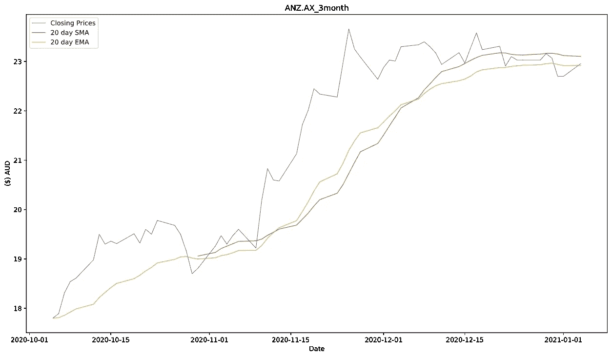*

*图 1:ANZ 的 20 天均线和 20 天均线。超过 3 个月的 AX。(*图片作者*)*

*移动平均线是在任何用户定义的时间段内股票平均价格的滚动计算。两种移动平均线是简单移动平均线和指数移动平均线。均线对价格变化的反应比均线更快，对最近观察到的股票价格赋予更高的权重。上面我们可以看到，当 *ANZ* 的股价上涨时，均线先于 SMA 线反应。同样，均线比 SMA 线更早反映价格曲线的平坦化(*图 1* )。*

*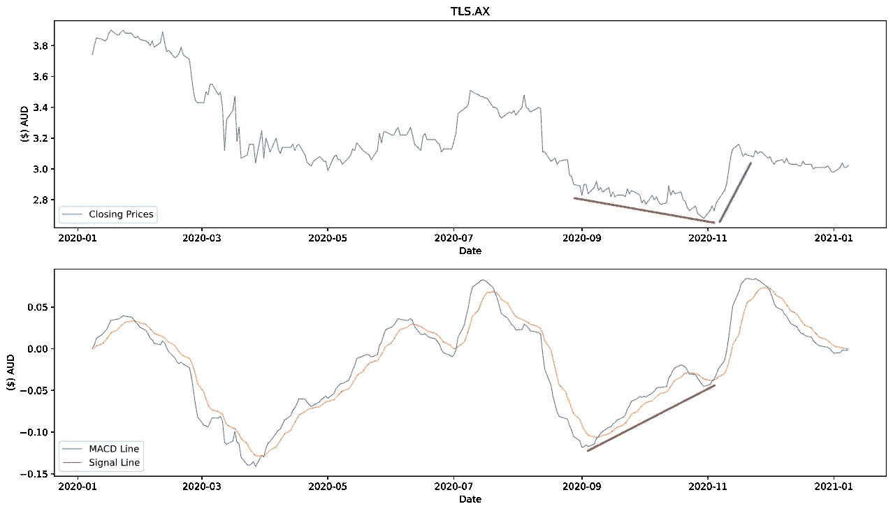*

*图 2:价格背离(红色)之后是价格反转(绿色)。(*作者图片*)*

*MACD 由三个部分组成，完全基于 EMAs 价格评估。当这些 EMA 被绘制在一起时，我们可以从实际股票价格的趋势中观察它们的“趋同”或“背离”，以找到未来价格运动的迹象(*图 2* )。此外，观察均线交叉的位置可以告诉我们趋势反转发生在哪里，最终可能是买入或卖出股票的进场点。让我们进一步研究后者。*

## *MACD 指标的三个组成部分*

***MACD 线***

*这是用 **12** 日均线减去 **26** 日均线计算出来的。*

*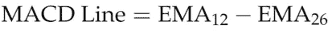*

*(*图片作者*)*

***信号线***

*信号线是 MACD 线的 **9** 日均线。*

*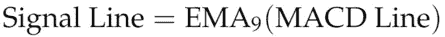*

*(*图片作者*)*

***直方图***

*这个直方图是一个可选的组件，它显示了股票的看涨或看跌势头。它是通过从 MACD 线中减去信号线计算出来的。*

*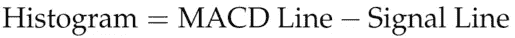*

*(*图片作者*)*

*在交易所或交易平台上，MACD 一般默认为时间段 **(12，26，9)** 。这些常数反映了用于计算 MACD 线和信号线的天数。较短的均线(12 天)是**快**，对价格波动反应更快，而较长的均线(26 天)是**慢**，对价格波动更有抵抗力。这些均线共同创造了一条在零线上下波动的线，以反映股价的变化趋势。(12，26，9)是当前的行业标准，但也存在其他组合(如(5，35，5))来满足交易者的独特要求。*

## *交叉*

*当 MACD 线和信号线相交时，这表明股价的趋势发生了变化。因为直方图等于 MACD 线和信号线之间的差值，所以当这些交叉发生时，我们可以预期直方图的值为 0。这对股价意味着什么？*

*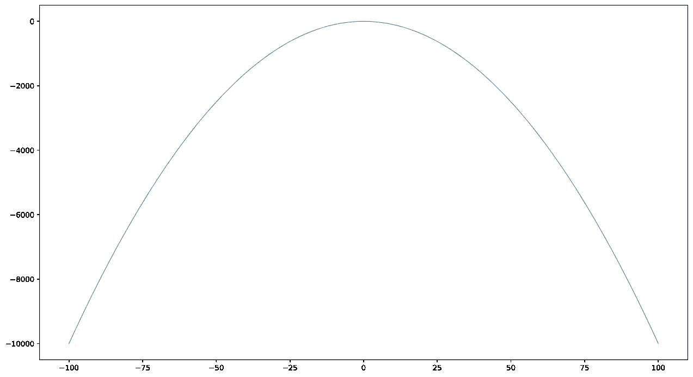*

*图 3: y = -(x)。(*图片作者*)*

*如果我们考虑一个负抛物线接近峰值时的梯度，我们会看到它从某个正值开始接近 0(*图 3* )。达到 0 时，梯度反转方向，并逐渐变负。让我们想象一下，这条抛物线代表一只股票在一段时间内的价格。在此期间，卖出我们的头寸并获得最佳利润的最佳时间是在斜率为 0 的抛物线的最高点。*

*这个概念类似于 MACD 交叉可以帮助我们进场交易。柱状图描述了股票价格的趋势，交易被安排在当它到达 0 并反转方向时，表明可能的高点或低点，分别进入空头或多头头寸。*

# *Python 实现*

*我的实现将侧重于从历史股票数据中创建买入和卖出信号。它可以分为四个部分:*

1.  *股票价格数据的接受*
2.  *EMAs 的计算*
3.  *返回 MACD 线、信号线和直方图*
4.  *买入/卖出信号的产生*

## *股票价格数据的接受*

*为了使算法运行，我们必须导入我们希望分析的股票的**收盘价**。有大量的在线资源致力于提供这些数据，每种资源都有不同的功能来满足用户的需求。我想到的一些是:*

*   *[Alpha Vantage](https://www.alphavantage.co/) —一个流行的 API，为股票、外汇和加密货币提供数据。*
*   *[BTC 市场 API v3](https://api.btcmarkets.net/doc/v3) —由澳大利亚领先的加密货币交易所之一开发的 API。*
*   *[polygon . io](https://polygon.io/)——另一个流行的金融 API，面向具有实时数据能力的开发者。*谷歌*和*罗宾汉*利用这项服务。*
*   *Quandl —金融、经济和公司数据的领先来源。受雇于全球领先的对冲基金、投资银行和资产管理公司。*
*   *[雅虎财经](https://au.finance.yahoo.com/) —提供对包括历史股价在内的基本公司财务数据的便捷访问。*

*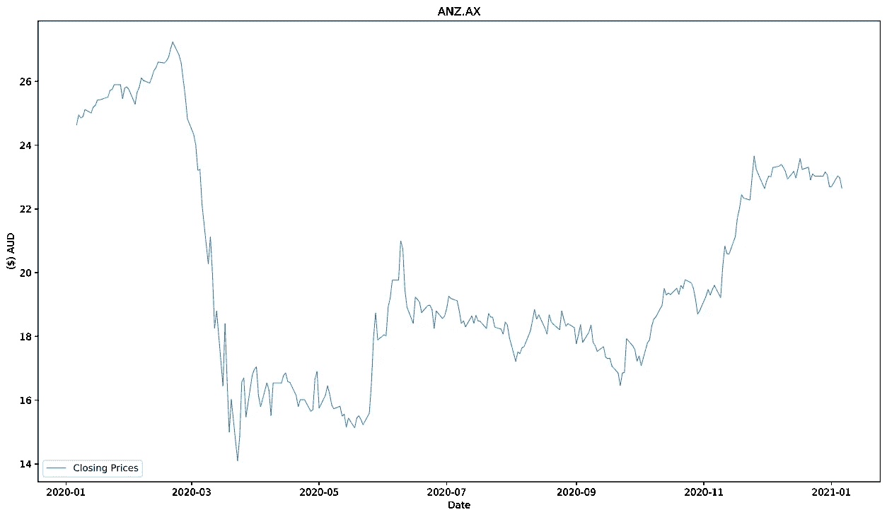*

*图 4: ANZ 前一年的收盘价。(*作者图片*)*

*对于这篇文章，我选择了 *ANZ* ( *图 4* )，因为这只股票在过去一年里走势积极和消极，同时在 3 月份的抛售中价格也大幅下跌(~=-50%)。这将是一个伟大的考验，看看 MACD 可以提供不同的迹象。*

*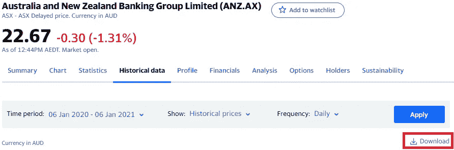*

*图 5:从[雅虎财经](https://au.finance.yahoo.com/quote/ANZ.AX/history?period1=1578268800&period2=1609891200&interval=1d&filter=history&frequency=1d&includeAdjustedClose=true)下载一年 *ANZ* 历史数据*

*使用 [*熊猫*](https://pandas.pydata.org/) ，我导入了。从*雅虎财经* ( *图 5* )下载到数据帧中的 csv 文件。因为数据频率是每天，所以每一行都对应一个唯一的日期。因此，日期被解析为数据帧的索引。*

*然后我将数据帧的频率设置为遵循一个**商业日历**，其中周末被排除在外，因为这几天没有交易。最后，通过用前一天的收盘价替换缺失的条目，对数据进行完整性处理。*

```
*import pandas as pd
import osDATA_DIR = ('X:\\MY_DIR\\ANZ.AX.csv')
STOCK_SYM = os.path.basename(DATA_DIR).split('.csv')[0]
df = pd.read_csv(
   DATA_DIR,
   index_col='Date', # dates parsed as index
   parse_dates=True,
   dayfirst=True # required as dates in csv are DD/MM/YYYY
)
df = df.asfreq('B') # B for Business calendar 
df = df.fillna(method='ffill') # fills any missing day's data with previous day's
closing_prices = df.Close # takes column labelled 'Close'*
```

*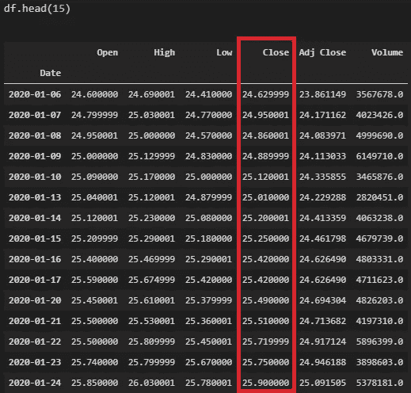*

*图 6:我们的数据帧的前 15 个条目。(*图片作者*)*

*执行上面的代码，我们存储包含已处理的。变量 *df* 中的 csv 数据及其自身变量中的收盘价等于标有“收盘”的列(*图 6* )。*

## *EMAs 的计算*

*计算 EMAs 的函数非常简单，因为我们将利用 *pandas* 的内置方法，特别是 [**ewm**](https://pandas.pydata.org/pandas-docs/stable/reference/api/pandas.DataFrame.ewm.html) 和 **mean** 方法。该实现将默认的平均长度设置为 50 天，并返回平均价格的数据框及其相应的日期索引。重要的是，我们保留与输入数据相同的索引，以便可以轻松地绘制结果。*

```
*def EMA(data, averaging_length=50):
    ret = data.ewm(
        span=averaging_length, 
        adjust=False).mean()
    return ret.rename(columns={'Close': 'EMA'})*
```

## *MACD 的返回组件*

*EMA 函数用于计算 MACD 线、信号线和直方图，如下所示。如前所述，默认平均常数为 **(12，26，9)** 。*

```
*def MACD(data, a=12, b=26, c=9):
    MACD_line = EMA(a) - EMA(b)
    signal_line = MACD_line.ewm(span=c, adjust=False).mean()
    histogram = MACD_line - signal_line
    return MACD_line, signal_line, histogram*
```

## *生成买入/卖出信号*

*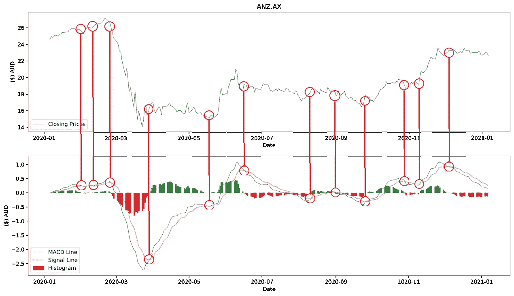*

*图 7:2020 年 ANZ 的所有 MACD 跨界车。(*图片作者*)*

*绘制生成的数据为我们提供了价格趋势及其幅度的漂亮概览。在观察周期内发生了 12 次交叉(*图 7* )，但并非所有交叉都等同于有效信号，因为我们尚未引入系统约束。*

*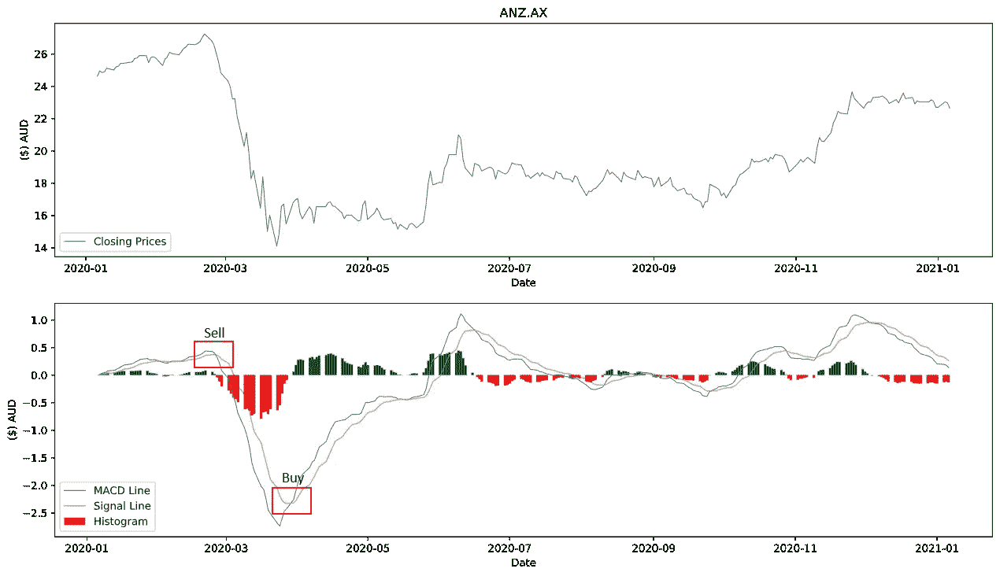*

*图 8:交叉指示买入和卖出。(*作者图片*)*

*如果从**底部**到顶部*在零线**和**MACD 线*下方**发生交叉，则产生**买入信号**。*****

*如果零线和 MACD 线从**顶部**到底部*与信号线交叉上方**发生交叉，则产生**卖出信号**。****

*我们可以通过反复比较 MACD 线和信号线的值并确定哪个更大来近似每个交叉点的位置。如果具有较大值的线型不同于前一次迭代的线型，则发生了交叉。记录数值较大的线的类型进一步让我们确定 MACD 线是从顶部到底部还是从底部到顶部。最后，该算法检查交叉是发生在零线之上还是之下。*

*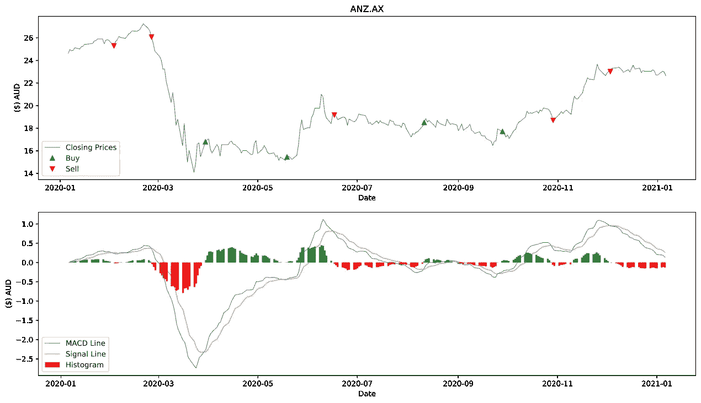*

*图 9:生成的买入和卖出信号。(*图片作者*)*

*将我们的*买入*和*卖出*点分别标为绿色和红色箭头，我们可以看到算法会在哪里进入或退出交易(*图 9* )！*

*下面是带有绘图的完整代码。*

# *测试样本策略*

*为了测试算法，我编写了一个简单的算法交易程序，它根据 MACD 指标生成的信号自动买卖股票。*

## *战略*

```
*# Initial variables
INITIAL_INVESTMENT = 5000 
net_portfolio = INITIAL_INVESTMENT
MAX_STOCK_PURCHASE = 1000 # maximum spent on each buy signal
BROKERAGE_FEE = 9.50 # Selfwealth brokerage fee
PROFIT_THRESHOLD = 1.2
COOLDOWN_PERIOD = 30 # number of elapsed days before another buy can be executed*
```

*当产生买入信号时，算法将以当前股价买入股票，花费由 *MAX_STOCK_PURCHASE* 定义的最大金额。这是为了通过防止算法在一次交易中花光我们所有的钱来最小化风险。*

*当卖出信号出现时，该算法将首先计算投资组合中当前持有的所有股票的平均价格。如果当前股价大于平均价格乘以*【利润 _ 阈值】*、，该算法将卖出投资组合中当前持有的所有股票。*

*由于这种算法不能预测未来的股价，因此它不会意识到自己是否购买了一只处于下跌趋势的股票。为了减轻这种情况下的损失，引入了一个可变的*冷却周期*，它规定了在执行新的购买之前必须经过的最小天数。*

*该算法还从每笔交易中扣除一笔*经纪费*。*

# *结果*

```
*>> MACD_strategy_ANZ.py
Portfolio value: $6345.989885\. Gain/Loss of 26.92%
   TYPE  Amount  ($) Price/Share  ($) Profit/Cost
0   BUY    59.0        16.780001      -999.520059 
1   BUY    64.0        15.440000      -997.660000 
2   BUY    54.0        18.490000     -1007.960000 
3   BUY    56.0        17.700001     -1000.700056 
4  SELL  -233.0        23.010000      5351.830000*
```

*在过去 12 个月的数据上运行该算法产生了非常有希望的结果。我最初的 5000 美元投资自动产生了 1346 美元的回报，实现了 26.92%的收益。*

```
*>> MACD_strategy_ANZ.py
Portfolio value: $5646.129943000001\. Gain/Loss of 12.92%     
   TYPE  Amount  ($) Price/Share  ($) Profit/Cost 
0   BUY    29.0        16.780001      -496.120029 
1   BUY    32.0        15.440000      -503.580000 
2   BUY    27.0        18.490000      -508.730000 
3   BUY    28.0        17.700001      -505.100028 
4  SELL  -116.0        23.010000      2659.660000*
```

*如果我们玩得更安全些，将我们的 *MAX_STOCK_PURCHASE* 减半至 500 美元，我们的利润就会减少到 12.92%。然而，全年银行里会有更多的可用资金，这可能是人们所希望的。*

```
*>> MACD_strategy_ANZ.py
Portfolio value: $5388.839995\. Gain/Loss of 7.78%     
   TYPE  Amount  ($) Price/Share  ($) Profit/Cost 
0   BUY    59.0        16.780001      -999.520059 
1   BUY    64.0        15.440000      -997.660000 
2  SELL  -123.0        19.160000      2347.180000 
3   BUY    54.0        18.490000     -1007.960000 
4   BUY    56.0        17.700001     -1000.700056 
5  SELL  -110.0        18.700001      2047.500110*
```

*如果我们将 *PROFIT_THRESHOLD* 设置为 1，使算法在收到第一个卖出信号时卖出，我们的利润将大幅下降至 7.78%。*

*因此，获得的回报与交易者设定的参数直接相关。例如，为科技股设定较高的利润门槛可能更有利可图，因为它们的平均增长率更高。当然，定得太高可能意味着价格永远达不到门槛，你的股票永远卖不出去！*

# *结论*

*MACD 是一个强有力的指标，用于识别趋势及其势头。趋势反转发生在每一个 MACD 交叉点，这表明是买入/卖出股票的好时机。使用 Python，我们实现了一个基本的算法交易器，在这些交叉发生时自动执行交易。*

*通过一个简单的策略，算法交易者能够获得一些不错的结果。微调参数可以帮助实现更高的回报，但是我们必须始终在风险和回报之间保持平衡。*

*现在 MACD 唾手可得，试着创建并实施你自己的策略，看看你能得到什么结果！如果您希望在[https://www.linkedin.com/in/steventienlam/](https://www.linkedin.com/in/steventienlam/)讨论概念或有任何进一步的问题，我很乐意听取您的意见。*

# *参考*

*[](https://www.investopedia.com/terms/m/macd.asp#:~:text=Moving%20average%20convergence%20divergence%20%28MACD%29%20is%20a%20trend%2Dfollowing,from%20the%2012%2Dperiod%20EMA.) [## 移动平均收敛发散(MACD)定义

### 移动平均收敛发散(MACD)是一个趋势跟踪动量指标，显示了…

www.investopedia.com](https://www.investopedia.com/terms/m/macd.asp#:~:text=Moving%20average%20convergence%20divergence%20%28MACD%29%20is%20a%20trend%2Dfollowing,from%20the%2012%2Dperiod%20EMA.) [](https://gist.github.com/kwisatzhaderac-h) [## kwisatzhaderac-h 的要点

### 此时您不能执行该操作。您已使用另一个标签页或窗口登录。您已在另一个选项卡中注销，或者…

gist.github.com](https://gist.github.com/kwisatzhaderac-h)*