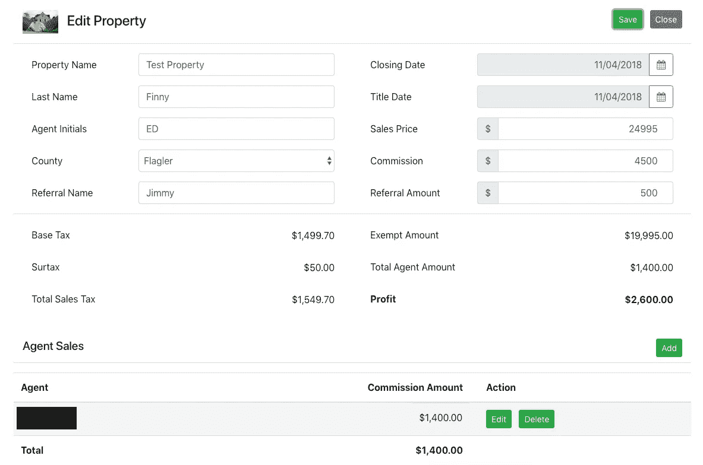

# 从 AWS 转移到 Heroku

> 原文：<https://levelup.gitconnected.com/moving-away-from-aws-and-onto-heroku-d84852b9884d>

2018 年秋天，我决定是时候运用我的应用程序设计和开发知识，为我岳母的小企业提供现代化的解决方案。她的业务旨在帮助那些搬迁到美国东南部的人找到住处。由于那里全年气候温暖，她的客户通常会为他们的退休生活寻找一个好气候。

她使用的原始应用程序的设计并不是最佳的，并且包括跟踪与房屋买卖相关的方面的字段。因为有房地产经纪人帮助完成交易，所以她在每个记录上都有字段来跟踪每个经纪人将收到的佣金。

以下是原始状态的屏幕截图，出于安全原因删除了内容:

除了缺乏外表吸引力之外，最大的挑战之一是每个代理的数据源中都有一列。随着新代理的添加，为每个代理创建了新的列。当代理转移到其他机会时，这些列会保留，但在表单视图中是隐藏的。当代理商的管理结构发生变化时，也需要做大量的工作。

# 新应用程序之旅

因为我想更熟悉在亚马逊网络服务生态系统中运行应用程序，所以我决定利用我岳母的需求来协助这项工作。

我的目标是利用以下框架:

*   角度/角度 CLI。
*   ng-自举。
*   棱角分明的字体太棒了。
*   jQuery。
*   Spring Boot (Java API)。
*   MySQL 数据库。
*   Okta。
*   GitLab。

作为免费试用的一部分，我计划使用以下 AWS 组件:

*   用于 Java API 和 MySQL 数据库的弹性 Beanstalk。
*   容纳静态角度客户端的 S3 容器。
*   AWS 证书管理器和 CloudFront。

在几个小时内，在我可以找到一些空闲时间(家里有一个蹒跚学步的孩子)的几个星期里，我能够完成 Java API 和 Angular 客户端的开发。我发现将 Okta 连接到解决方案中相对简单。一旦我了解了解决方案的工作原理。

在我最初的开发过程中，我已经在 AWS 中使用了 MySQL 数据库。我遇到的“问题”是，Elastic Beanstalk 喜欢同时创建应用程序和数据库实例。虽然可以利用现有的数据库，但我无法花太多时间来了解 AWS 服务集合中的安全性和配置概念。相反，我能够导出现有的数据并移入 AWS 创建的新实例。

更新后的应用程序主表单(包含测试数据)如下所示:

新的表单设计更好地对数据进行了分组，并引入了一个代理表。因此，只有参与适当销售的代理才会显示出来，从而获得更好的整体应用体验。

# 免费试用后的生活

AWS 很棒，因为它有持续一整年的免费试用。AWS 控制台很好地让你知道在最初的 12 个月里什么是合格的，什么不是“免费的”。

除了我在个人研究项目中遇到的一些额外的数据库使用之外，在免费试用期间，运行我岳母的应用程序的成本真的不算什么。当免费试用的最后一个季度开始时，我试图潜入控制台，以计算出正在使用的服务在第 13 个月及以后将花费我多少钱。我从来没有弄清楚如何计算所有的成本，但我没有想到我的新应用程序之旅会带来巨额发票。

自从免费试用结束后，我发现我每个月要花 25 美元给我婆婆买一个现代化的应用程序。一点也不差，即使我为她支付服务费用。

# 历史在重演

18 个月过去了，在新的申请旅程开始之前，我已经发现自己处于和我婆婆相似的境地。当需要对她的系统进行更新时，我需要查看一个 README.md 文件，以便对她的应用程序进行更新、验证和部署新功能和修复。由于我不是 DevOps 的专业人士，我的个人笔记对我来说非常有价值，因为在我看来，并非所有事情都是直截了当的。

当执行客户端更新时，我需要执行一些步骤，包括使用 Angular 框架和提供静态网站内容的 AWS S3 服务。在后端，当对运行在 Spring Boot 上的 Java API 进行更改时，我需要执行一些步骤。如果对安全层进行了更改，我也会记录这些更新是如何集成的。

我担心随着时间的推移，过程会随着 AWS 而改变，导致我的 README.md 文件不再有价值。当这种情况发生时，我可能会以一种混乱的模式结束—在我尝试确定需要处理这些 DevOps 操作的新方式时，更新正在等待。

# 更新的应用之旅

创新无疑是人生任何阶段成功的关键。职业运动员不断磨练自己的技能，以保持竞争力。精明的商务人士总是向前看两步，以便找到差异化优势，使他们的产品或服务保持高需求。软件工程师总是在寻找最好的方法来满足他们客户的需求，建立在从过去的努力中学到的基础上。

项目或应用程序的大小并不重要，因为我发现自己也处于同样的位置。虽然我需要为我岳母的应用程序做的积压项目数量很少，但我觉得这个项目背负着一些需要解决的技术债务:

*   我依靠一系列步骤来执行更新，这不是一个理想的情况。
*   我不知道与其他选择相比，我目前的成本如何。
*   我想要一个需要较少开发运维投资的解决方案。

# 考虑到 Heroku

通过进行一些分析，我能够为我的情况找到一些替代方案。虽然微软 Azure、谷歌云和其他“云”选项存在，但我想找到一种比 1:1 更好的替代方案。毕竟，在做出技术决策时，成本不应该是唯一的因素，这就是为什么如果我真的打算放弃使用 AWS，我至少还有另外两个项目(维护部署步骤的助手列表和需要 DevOps 技能)需要满足。

在项目的这个阶段，我真的很想考虑平台即服务(Paas)选项。尽管我对 CloudBees、Firebase 和 Engine Yard 有一些兴趣，但我决定专注于 Heroku，因为 Heroku 似乎是这个领域的领导者。老实说，这正是我在 2018 年末决定在最初的应用程序旅程中利用 AWS 的原因。

# 设定期望

根据我早期的研究，我能够总结出我的当前应用程序空间(AWS)和我的目标空间(Heroku)之间的以下差异:

这次练习让我了解并设定了我的更新应用程序之旅的期望。

我的练习和这一系列文章的目标不仅仅是理解从 AWS 到 Heroku 的转换，而是理解我能够开发的新环境。

如果我能够将时间集中在解决目标应用程序的业务需求上，而不必担心 DevOps 的特定任务，那么转换将被视为成功。如果每月的费用少于或等于我习惯支付的费用，那只会增加向 Heroku 过渡的好处。

# 展望未来

在本系列的下一篇文章中，我将开始我的更新应用程序之旅。

我计划了解的第一件事是，对于我当前的应用程序，是否存在“加州旅馆”的场景。虽然开始使用 AWS 和 Elastic Beanstalk 很容易，但是将现有的应用程序迁移到 Heroku 有多容易呢？

从那里，我计划创建一个新的容器化 API 用于 Heroku。在通往 Heroku 的新旅程中，我希望重构一些方面(记录为技术债务),不为别的，只为我个人的想法。与此同时，根据与我岳母的谈话，我也计划对客户做一些调整。

我还需要弄清楚静态文件(在 Angular 中)在 Heroku 中是如何处理的，因为我确实希望将所有东西都移动到目标位置。我完全期待应用一些安全更新。

万事俱备，我将在 Heroku 内部建立一个新的应用程序。虽然我的申请很小，但我真的希望这种经历可以转化为其他处于类似情况的候选人。

作为结论，我计划将这种新的应用程序体验与我所知道的过去 18 个月中使用 AWS 生态系统的正常情况进行比较。这些信息将有助于决定 Heroku 是否是一个有效的选择。

祝你今天过得愉快！