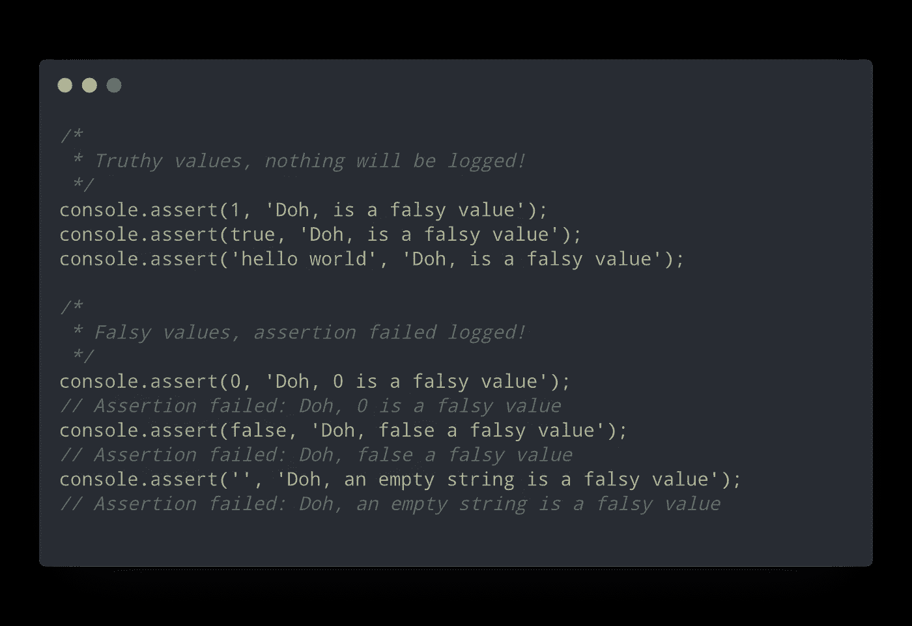
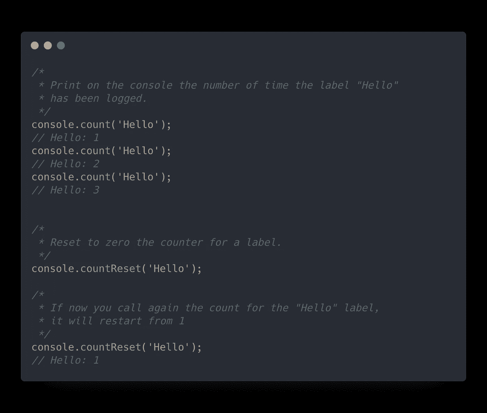
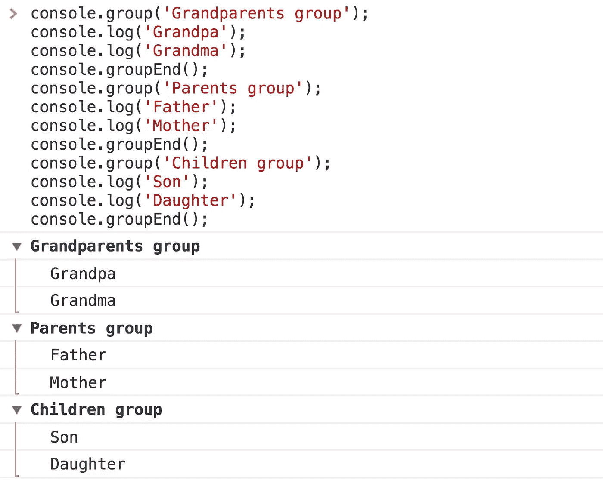
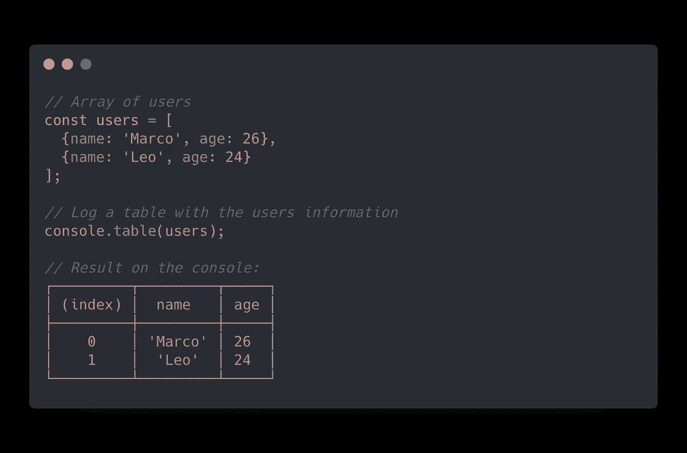
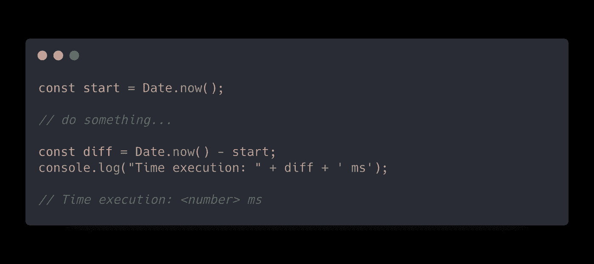
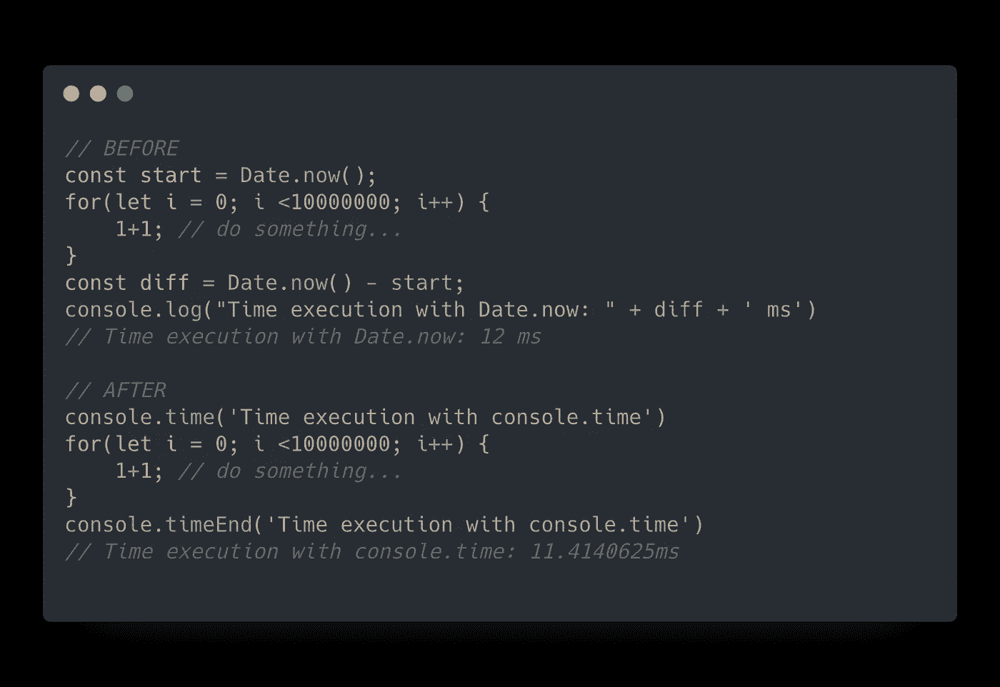

# 超越 console.log() —调试 JavaScript 和节点时应该使用的 8 种控制台方法

> 原文：<https://levelup.gitconnected.com/moving-beyond-console-log-8-console-methods-you-should-use-when-debugging-javascript-and-node-25f6ac840ada>

## 超越 console.log，学习从未用于调试的控制台函数！

# 控制台 API

**每个** JavaScript 开发者都用过`console.log(‘text’)`。`console`模块是 JavaScript 中最常见的实用工具之一，在 Node:

> 提供一个简单的调试控制台，类似于 web 浏览器提供的 JavaScript 控制台机制。

这是控制台模块的 [Node.js 文档](https://nodejs.org/dist/latest-v12.x/docs/api/console.html)页面中编写的定义😅。然而，初学者在开始使用新技术时，容易查阅在线教程而不是阅读文档，错过了学习如何正确使用这一新工具以 100%发挥其潜力的机会。

当谈到控制台 API 时，新手通常只使用一些函数，如👌`console.log()` *、⚠️* `console.warn()` *、*或❌ `console.error()` 来调试他们的应用程序，而往往还有许多其他方法可以完美地实现我们的要求，提高调试效率。

这篇文章通过我在[***Codeworks***](https://codeworks.me/?utm_source=medium&utm_medium=organic&utm_campaign=marco_ghiani_hackernoon_learning_nodejs_5_tips)***教学时使用的相关例子来揭示一些最有趣的`console`方法。*** 那么让我们来看看控制台模块的 8 个最佳功能列表吧！

**以下所有方法在全局实例**`**console**`***中都有，所以不需要控制台模块。***

## *1) [控制台.断言](https://nodejs.org/dist/latest-v12.x/docs/api/console.html#console_console_assert_value_message) ✅*

*`console.assert`函数用于测试传递的参数是 true 还是 falsey 值。在传递的值为 falsey 的情况下，该函数记录第一个参数之后传递的额外参数，否则，代码执行将在没有任何日志记录的情况下继续。*

**

*这两种情况都是真或假的断言。*

*assert 方法在您希望检查值的存在性同时保持控制台整洁(避免记录很长的属性列表等)时特别有用。).*

## *2) [控制台.计数器](https://nodejs.org/dist/latest-v12.x/docs/api/console.html#console_console_count_label)和[控制台.计数器设置](https://nodejs.org/dist/latest-v12.x/docs/api/console.html#console_console_countreset_label)💯*

*这两种方法用于设置和清除特定字符串在控制台中记录次数的计数器:*

**

*计数并重置“Hello”字符串的日志出现次数。*

## *3) [控制台.组](https://nodejs.org/dist/latest-v12.x/docs/api/console.html#console_console_group_label)和[控制台.组结束](https://nodejs.org/dist/latest-v12.x/docs/api/console.html#console_console_groupend)🎳*

*`.group`和`.groupEnd`在您的控制台中创建和结束一组日志。你可以通过一个标签作为`.group()`的第一个参数来描述它所关注的内容:*

**

*三组来描述家庭角色。*

## *4) [控制台.表](https://nodejs.org/dist/latest-v12.x/docs/api/console.html#console_console_table_tabulardata_properties)📋*

*这种特殊的方法对于在一个友好的表格中描述一个对象或数组内容非常有用:*

**

*用户对象列表的表。*

*`console.table`使检查和记录嵌套和复杂的数组/对象变得更加容易。*

## *5) [控制台.时间](https://nodejs.org/dist/latest-v12.x/docs/api/console.html#console_console_time_label)和[控制台.时间结束](https://nodejs.org/dist/latest-v12.x/docs/api/console.html#console_console_timeend_label)⏱*

*如果您想检查代码在执行时的性能，为了解决这个问题，您可以用`Date` API 创建一个开始时间戳，并用它来计算代码执行后的差异？大概是这样的:*

**

*嗯，使用`time`和`timeEnd`功能，没必要这么做。您只需执行以下操作即可创建计时报告:*

**

*如您所见，console.time 也返回了更准确的结果。*

# *摘要*

*只需 3 分钟的时间，您现在就可以更广泛地了解控制台 API 中的一些精彩工具。将它们与您的调试习惯结合起来，您的开发速度将会成倍增长！*

*下一章**学习 Node.js 见！🚀🎉***

> *关于这个话题的评论、分享和讨论总是被接受的，我很乐意回答你的任何问题！*

*感谢您阅读文章！*

* [## 组合 API -轻松发展您的编码事业| gitconnected

### 消除在每个单独位置手动更新您的详细信息的痛苦。只需在您的中更改一次数据…

gitconnected.com](https://gitconnected.com/portfolio-api)* * [## 重构复杂的 React 组件——编写高效可读组件的 5 个最佳实践

### 使用最佳实践编写高效可读的 React 组件的 5 条规则

levelup.gitconnected.com](/refactoring-a-complex-react-component-5-best-practices-to-write-efficient-and-readable-components-b0d06f4f22b4)  [## Javascript 技巧#4:数组平面和平面图实现

### 对新的 flat 和 flatMap 方法的潜力的有用介绍

medium.com](https://medium.com/better-programming/javascript-tips-4-array-flat-and-flatmap-implementation-2f81e618bde)  [## JavaScript 技巧#3:将错误优先回调函数转换为承诺

### JavaScript 异步概述和保证错误优先回调的实用程序

medium.com](https://medium.com/better-programming/javascript-tips-3-convert-error-first-callback-functions-to-promises-f2561d2aaefd)  [## JavaScript 技巧#2:对象/数组深度克隆实现

### JavaScript 中深度克隆方法的简单实现

medium.com](https://medium.com/better-programming/javascript-tips-2-object-array-deep-clone-implementation-2d6a43e43d2a)  [## JavaScript 技巧#1:对象属性的过滤方法

### 应用于对象属性的过滤器数组方法的简单 JavaScript 聚合填充

medium.com](https://medium.com/better-programming/javascript-tips-1-the-filter-method-for-object-properties-a2d6869b5127)*