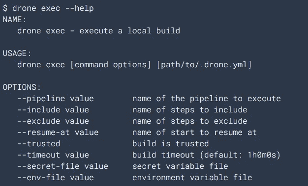

# 将 CI 从 Jenkins 转移到 Drone

> 原文：<https://levelup.gitconnected.com/moving-ci-from-jenkins-to-drone-deaf7b773583>

很长一段时间以来，我们一直使用 Jenkins 来做 CI，没有太多的考虑，它是免费的，它有一个不错的 UI 和看起来最大的社区。别再找了，对吗？

随着我们的代码库变得越来越复杂，CI 流程变得越来越难以维护，因为每一位代码都需要自己的代码保姆、测试、报告、归档等，特别是对于我们的单存储库架构，它包括用不同语言编写的各种模块，这些模块需要用自己的工具链来构建。

# 动机

我脑海中的一些痛点:

**1。环境变量。**

许多构建任务依赖于一些环境变量来正常工作，每当我看到一些与它们相关的错误时，我会检查主机的值和 Jenkins 的值，比较并更新它们，调用任务管理器来重新启动进程以使其生效。是啊，这让我想起了 98 号窗口的美好回忆。

**2。深度导航**

我知道 Jenkins 是一个无所不能的 CI 产品，花一些时间和精力来学习它是有意义的，但迷失在所有这些页面、选项卡和控件中令人沮丧。

**3。狂野外挂**

每个插件都有自己的 UI 组件、文档和问题，你必须经常去社区寻求帮助。

**4。詹金斯配置的迁移**

从开发人员的角度来看，CI 构建过程越快越好。在我们选择任何其他替代产品之前，我们试图将服务器移动到一台更强大的 PC 上，但 Jenkin 配置的迁移并没有带来愉快的回忆。

我试图寻找一些导出/导入按钮、配置文件或类似的东西，希望通过一些简单的点击来完成，但现实仍然很残酷，我按照文档中的工具备份和恢复其主文件夹，然后打开两个浏览器选项卡，比较我可能记得的配置项，以免不同的错误嘲笑我低估了任务。

**5。并行执行**

*   如何让一些步骤并行运行
*   我如何确保它们实际上是并行运行的

通读文档和摸索并行化的过程让我意识到让它们串行运行的想法并没有那么糟糕。

# 冒险

有一天我们遇到了无人机，它声称是忙碌开发者的 CI，听起来很酷，我总是很忙，至少在冠状病毒疫情期间，我以非常忙碌的方式工作。

首先，你需要对 docker 或 container 有一些基本的了解。**图像和容器的关系有点像可执行文件和进程**的关系，一个是静态文件，一个是动态运行的东西。使用相同映像创建的多个容器保证具有完全相同的环境(我指的是运行时库、命令等，当然不是 IP、主机名)。

## **服务器**

整个产品都是围绕容器的概念来设计的，甚至无人机服务器本身也是作为轻量级 Docker 映像来分发的。该映像是独立的，没有任何外部依赖性。

可以使用下面的命令启动服务器容器。容器是通过环境变量配置的。

## **亚军**

无人机运行者轮询服务器以获得要执行的工作负载。

## 管道

.无人机. yml

这只是一个简单的 YAML 文件。

您的配置可以有多个管道，一个管道有多个步骤，这些步骤有一系列命令来满足您的需求。

**每一步都在一个用您指定的映像**创建的隔离容器中运行，因此您不必再担心任何与环境相关的意外。Drone 会自动创建一个临时卷，称为您的**工作区**，在那里克隆您的存储库。工作区是管道中每个步骤的当前工作目录。

默认情况下，管道步骤按顺序执行。**您可以选择使用 depends_on** 将您的构建步骤描述为一个有向无环图。在上面的例子中，我们扇出以并行执行前两步，然后一旦完成，我们扇入以执行最后一步。

有了一流的容器支持和简单的并行语法，人们不得不设计它们并行运行，以尽可能榨出每一滴汁液。您可以在下面的 UI 部分轻松跟踪运行状态。

## **用户界面**

作业运行状态

如上图所示，这个提交有两个管道，js-code-coverage 和 CSharp-code-coverage，每个管道都有自己的步骤。

开发和测试管道并行运行

## 本地建造奖金

对于 Jenkins，如果不将结果提交给服务器并至少去喝一杯咖啡，你就无法知道最终结果，这不再是 Drone 的情况，因为**它带有一个命令行来运行本地构建**。想象一下，如果你从不打破任何东西，我是说，在公共场合，这会给你带来多少自信和骄傲。

因此，你可以在自己的电脑上犯任何愚蠢的错误，并在相对较短的时间内看到结果。

这个子命令执行本地构建。

# 高光

所有的环境变量和插件配置都保存在管道 YAML 文件中，这使得它易于维护。

足够简单的用户界面，没有太多的信息

借助一流的容器支持，轻松实现并行化

本地构建和快速反馈

如果你真的喜欢编程 CI 步骤，而不是使用声明性的 YAML 文件，Drone 也有适合你的东西，请查看 [Jsonnet](http://A data templating language) ，这是一种类似 javascript 的数据模板语言，用于生成配置数据。

# 已知问题

很难在其仪表板上搜索历史提交，没有搜索框，没有分页。

如果无人机本身或 GitHub 出现问题，无人机服务器可能会错过一些构建，用户无法在不调用其 API 端点或检入其他代码的情况下触发重建。

# 结论

我们对转向无人机的决定感到非常高兴。它使 CI 不再像以前那样沉重，并帮助我们充分利用容器技术，节省更多的头发在未来拔出。

# 参考

【https://docs.drone.io/ 号