# 从 Azure 应用服务转移到 Azure Kubernetes 服务(第 1 部分)

> 原文：<https://levelup.gitconnected.com/moving-from-azure-app-services-to-azure-kubernetes-service-part-1-e489857c6440>


*我建立 AKS 集群的经验，以及在 Kubernetes 和 App Services 上运行应用程序的比较。*

*给你一个警告——这篇文章很长！*

*我写这篇文章的主要动机是记录我自己学习 Azure Kubernetes 的旅程，以及命令的确切列表和它们运行的执行顺序，在可能的情况下，我需要提醒我做了什么来让我的 AKS 集群工作。*

如果你也开始使用 AKS，希望你会发现这也很有用！

我工作的前三家公司都使用 Azure 应用服务来托管他们的网络应用。这是一个非常好的平台，原因如下:

*   这非常容易设置
*   与 Azure DevOps 的内置集成
*   与用编写的应用程序完美配合。NET/。网络核心
*   没有管理开销(即不需要系统管理员活动)

因此，如果您有一个由一个前端和几个 API 组成的应用程序，这种设置工作得相当好。

但是，当环境开始扩展时，管理起来会非常麻烦:

*   越来越多的 API 开始出现(因为现在微服务风靡一时)。
*   每个 API 都需要自己的 Azure DevOps 管道设置、自己的 ARM/Terraform 模板定制模板、应用程序设置和机密设置。

将上述数字乘以 30 或更多，最终会变得相当麻烦。

由于 Kubernetes 现在非常受欢迎(我一直在业余时间摆弄它)，我决定做一个应用程序的基础设施和架构在 Kubernetes 和应用程序服务上运行时会有什么不同的比较。

具体来说，我想比较以下内容:

*   基础设施设计
*   CICD 管道有何不同
*   进行这种转换所需的代码更改
*   从一个平台转移到另一个平台的影响(好的或坏的)

请记住:我不是 Kubernetes 专家，所以本文中讨论的一些设置可能没有遵循“最佳实践”。

***如果您有任何意见或改进建议，请告诉我！***

# 设计差异

下图是我对托管在 App Services vs AKS 中的 web 应用程序设计的概念视图:

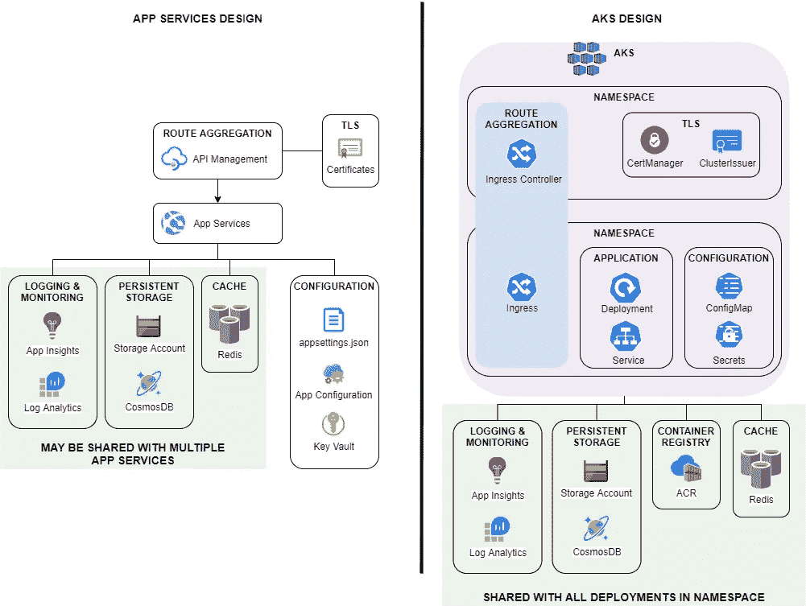

该图非常简单明了，但需要注意的关键点是:

*   对于最初的转变，我选择简单地用 AKS 替换应用服务。生态系统的其余部分基本保持原样。我会在未来尝试将更多的东西整合到 Kubernetes 中。
*   在应用服务平台中，每个应用都需要自己的基础架构代码(ARM / Terraform)来提供其应用服务实例。
    在 Kubernetes 中，每个应用都需要自己的部署和服务 yaml 我选择每个名称空间有一个入口。

# 设置 AKS

## 先决条件

安装以下工具:

*   az cli
*   [kubectl](https://kubernetes.io/docs/tasks/tools/#kubectl)
*   [舵](https://helm.sh/docs/intro/install/)

**注意:我将在 WSL2 (Ubuntu)** 中运行下面的其余命令

## 创建 AKS 集群

```
SUBSCRIPTION="Jordan's VSP Subscription"
RG="jordanaks"
AKSCLUSTER="myAKSCluster"# Login
az login
az account set -s $SUBSCRIPTION# Create resource group
az group create --name $RG --location australiaEast# Create AKS
az aks create --resource-group $RG --name $AKSCLUSTER --node-count 1 --enable-addons monitoring# Get the resource group of AKS cluster
az aks show --resource-group $RG --name $AKSCLUSTER --query nodeResourceGroup -o tsv# Create public IP address in AKS cluster resource group
az network public-ip create --resource-group MC_jordanaks_myAKSCluster_australiaeast --name jordanaksPublicIP --sku Standard --allocation-method static --query publicIp.ipAddress -o tsv# Get the public IP address
az network public-ip show --resource-group MC_jordanaks_myAKSCluster_australiaeast --name jordanaksPublicIP# Get access credentials for AKS; This configures kubectl for you!
az aks get-credentials --resource-group $RG --name $AKSCLUSTER
```

## 设置 nginx 入口控制器

为了使用入口资源，我们需要安装一个入口控制器。我选择使用 nginx，因为这是微软指南的建议。

```
# Create a namespace for ingress resources
kubectl create namespace ingress-basic# Add the ingress-nginx repository
helm repo add ingress-nginx [https://kubernetes.github.io/ingress-nginx](https://kubernetes.github.io/ingress-nginx)# Use Helm to deploy an NGINX ingress controller;
# Replace loadBalancerIP with the IP address set up in the previous 
# step
helm install nginx-ingress ingress-nginx/ingress-nginx \
    --namespace ingress-basic \
    --set controller.replicaCount=2 \
    --set controller.nodeSelector."beta\.kubernetes\.io/os"=linux \
    --set defaultBackend.nodeSelector."beta\.kubernetes\.io/os"=linux \
    --set controller.admissionWebhooks.patch.nodeSelector."beta\.kubernetes\.io/os"=linux \
    --set controller.service.loadBalancerIP="20.193.57.230" \
    --set controller.service.annotations."service\.beta\.kubernetes\.io/azure-dns-label-name"="jordan" \
    --set controller.service.externalTrafficPolicy=Local# Verify the external IP has been binded to the ingress controller
kubectl --namespace ingress-basic get services -o wide -w nginx-ingress-ingress-nginx-controller
```

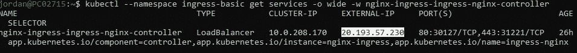

入口控制器应将上一步中创建的公共 IP 绑定到其外部 IP

如果您发现公共 IP 没有正确绑定，请查看 kubernetes 事件日志，了解发生了什么:
`kubectl get events --all-namespaces`

## 设置 DNS 记录

为您的域创建一个 A 记录，指向您刚刚创建的公共 IP。


在我的例子中，记录将允许我浏览到我在[https://dev.jordanlee.net](https://dev.jordanlee.net)的 AKS 实例。

这很重要，因为我们需要建立记录，以便为我们的 web 应用程序生成 TLS 证书。

## 安装证书管理器

[cert-manager](https://cert-manager.io/) 是一个本地的 Kubernetes 证书管理控制器。它可以帮助从各种来源颁发证书，如 Let's Encrypt、HashiCorp Vault、Venafi、简单签名密钥对或自签名。

```
# Label the cert-manager namespace to disable resource validation
kubectl label namespace ingress-basic cert-manager.io/disable-validation=true# Add the Jetstack Helm repository
helm repo add jetstack [https://charts.jetstack.io](https://charts.jetstack.io)# Update your local Helm chart repository cache
helm repo update# Install the cert-manager Helm chart
helm install \
  cert-manager \
  --namespace ingress-basic \
  --set installCRDs=true \
  --set nodeSelector."beta\.kubernetes\.io/os"=linux \
  jetstack/cert-manager
```

现在安装了 cert-manager，我们需要设置 ClusterIssuer 资源。这些将与外部 CA 交互，为我们生成证书。

我将为 LetsEncrypt 设置集群发行者。

创建以下文件(您需要更新电子邮件值):

```
# clusterissuers.yaml
apiVersion: cert-manager.io/v1alpha2
kind: ClusterIssuer
metadata:
  name: letsencrypt-staging
spec:
  acme:
    server: [https://acme-staging-v02.api.letsencrypt.org/directory](https://acme-staging-v02.api.letsencrypt.org/directory)
    email: [jordan@jordanlee.net](mailto:jordan@jordanlee.net)
    privateKeySecretRef:
      name: letsencrypt-staging
    solvers:
    - http01:
        ingress:
          class: nginx
          podTemplate:
            spec:
              nodeSelector:
                "kubernetes.io/os": linux---apiVersion: cert-manager.io/v1alpha2
kind: ClusterIssuer
metadata:
  name: letsencrypt-prod
  namespace: cert-manager
spec:
  acme:
    server: [https://acme-v02.api.letsencrypt.org/directory](https://acme-v02.api.letsencrypt.org/directory)
    email: [jordan@jordanlee.net](mailto:jordan@jordanlee.net)
    privateKeySecretRef:
      name: letsencrypt-prod
    solvers:
    - http01:
        ingress:
          class: nginx
```

然后用
和`kubectl create -f clusterissuers.yaml -n ingress-basic`创建发卡行

使用以下命令验证集群发行者是否准备就绪:
`kubectl get ClusterIssuer -n ingress-basic`

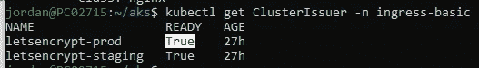

两个发行者都应该处于就绪状态

## 设置 Azure 容器注册表(ACR)

ACR 用于存储私有 Docker 容器映像(想想 Docker Hub 的 Azure 版本)。

这在技术上并不是必需的，但是我工作过的大多数企业都强制要求使用私有注册中心，而且因为 ACR 是由 AKS 支持的，所以我在这个例子中使用了它。

```
# Create ACR
MYACR=etherlabs
az acr create -n $MYACR -g $RG --sku basic# Attach ACR to AKS
az aks update -g $RG -n $AKSCLUSTER --attach-acr $MYACR
```

# 设置开发命名空间

AKS 现已设置为:

*   通过 nginx 入口服务传入的 web 请求
*   从 LetsEncrypt 获取 TLS 证书以保护 web 流量

现在，我将为我的开发环境设置一个名称空间，并添加一个“hello world”类型的服务来测试设置。

首先，创建一个新的名称空间:
`kubectl create ns development`

我们现在可以使用以下 yaml 为 helloworld 创建部署和服务:

```
# ingress-demo.yaml
apiVersion: apps/v1
kind: Deployment
metadata:
  name: ingress-demo
spec:
  replicas: 1
  selector:
    matchLabels:
      app: ingress-demo
  template:
    metadata:
      labels:
        app: ingress-demo
    spec:
      containers:
      - name: ingress-demo
        image: mcr.microsoft.com/azuredocs/aks-helloworld:v1
        ports:
        - containerPort: 80
        env:
        - name: TITLE
          value: "Welcome to jordanlee.net"
---
apiVersion: v1
kind: Service
metadata:
  name: ingress-demo
spec:
  type: ClusterIP
  ports:
  - port: 80
  selector:
    app: ingress-demo
```

部署应用:
`kubectl create -f ingress-demo.yaml -n development`

现在，向名称空间添加一个入口资源。这就是允许外部请求访问 helloworld 应用程序的原因:

```
# development-ingress.yaml
apiVersion: networking.k8s.io/v1beta1
kind: Ingress
metadata:
  name: development-ingress
  annotations:
    kubernetes.io/ingress.class: nginx
    cert-manager.io/cluster-issuer: letsencrypt-prod
    nginx.ingress.kubernetes.io/rewrite-target: /$2
    nginx.ingress.kubernetes.io/use-regex: "true"
spec:
  tls:
  - hosts:
    - dev.jordanlee.net
    secretName: tls-secret
  rules:
  - host: dev.jordanlee.net
    http:
      paths:
      - backend:
          serviceName: ingress-demo
          servicePort: 80
        path: /(.*)
```

使用
`kubectl create -f development-ingress.yaml -n development`创建入口资源

如果您在我们刚刚创建的入口上运行 kubectl describe，您应该会看到以下内容:

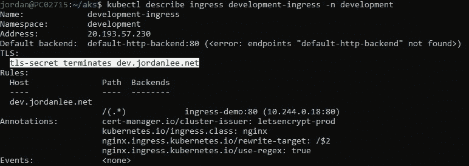

为了验证，我可以浏览到[https://dev.jordanlee.net](https://dev.jordanlee.net)，我应该得到以下内容:

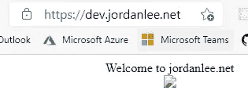

如果我检查证书，我可以看到 LetsEncrypt 颁发了一个有效的证书:

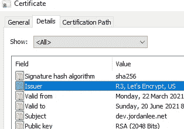

注意损坏的图像——这是由于图像 URL 指向/static，它没有在我的入口路由中定义。我现在不会为此烦恼，因为这只是为了验证:

*   外部流量可以通过入口到达 helloworld 应用程序
*   使用有效证书保护 Web 流量

# 部署 DemoApi

我的下一步是手动测试以下内容:

*   使用多阶段构建为此 API 创建 Docker 映像
*   标记图像并将其推送到我的 ACR 实例
*   为我的映像设置部署、服务和进入规则
*   推送我的映像的新版本时更新部署

对于这个例子，我写了一个简单的 ASP.NET 5 API(恰当地命名为“DemoApi”)。该代码可在 GitHub 上获得:

[](https://github.com/therealjordanlee/DemoApi) [## therealjordanlee/DemoApi

### 在 GitHub 上创建一个帐户，为 therealjordanlee/DemoApi 开发做贡献。

github.com](https://github.com/therealjordanlee/DemoApi) 

## 将我的代码归档

Visual Studio 2019 让这变得非常简单。创建新解决方案时，勾选“启用 Docker”复选框将自动为您生成 Docker 文件:

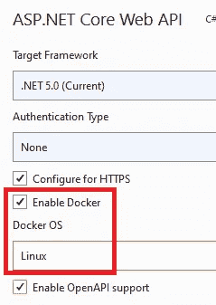

这是生成的结果:

```
FROM mcr.microsoft.com/dotnet/aspnet:5.0 AS base
WORKDIR /app
EXPOSE 80
EXPOSE 443FROM mcr.microsoft.com/dotnet/sdk:5.0 AS build
WORKDIR /src
COPY ["DemoApi/DemoApi.csproj", "DemoApi/"]
RUN dotnet restore "DemoApi/DemoApi.csproj"
COPY . .
WORKDIR "/src/DemoApi"
RUN dotnet build "DemoApi.csproj" -c Release -o /app/buildFROM build AS publish
RUN dotnet publish "DemoApi.csproj" -c Release -o /app/publishFROM base AS final
WORKDIR /app
COPY --from=publish /app/publish .
ENTRYPOINT ["dotnet", "DemoApi.dll"]
```

然后我可以使用

```
# Login to ACR
az acr login --name $MYACR# Build
docker build -f Dockerfile .. -t etherlabs.azurecr.io/demoapi:initial
```

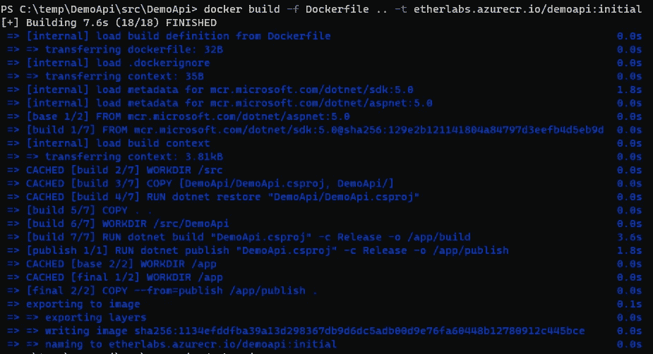

## 标记并推送至 ACR

```
# Add additional tag
docker tag etherlabs.azurecr.io/demoapi:initial etherlabs.azurecr.io/demoapi:development# Push the image to ACR
docker push etherlabs.azurecr.io/demoapi:development
docker push etherlabs.azurecr.io/demoapi:initial
```

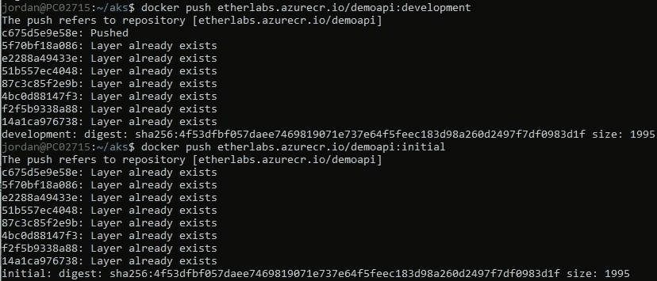

查看 Azure Portal 中的容器注册表，我可以看到图像已被推送:

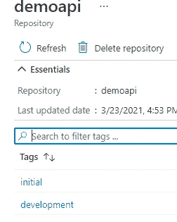

## 设置 DemoApi 配置变量

在为 DemoApi 添加部署和服务资源之前，我首先需要设置一些配置。

非常简单 API 从配置中读入两个字符串:`HelloMessage`和`SecretMessage`:

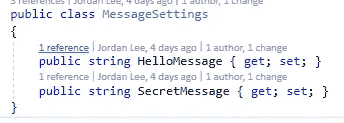

它有两个端点:

*   /message/normal —返回 MessageSettings。HelloMessage
*   /message/secret —返回消息设置。秘密信息

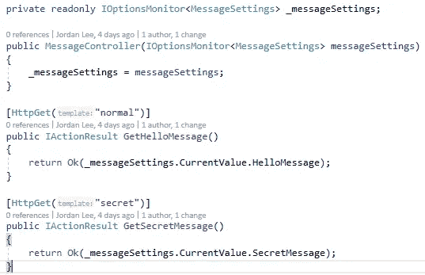

因此，我需要设置以下内容:

*   HelloMessage 的配置映射
*   秘密消息的秘密

这些将作为环境变量添加到部署中。

这非常简单:

```
# Create ConfigMap
kubectl create demoapi-env --from-literal=MessageSettings__HelloMessage="Hello Alinta" -n development# Create Secret
kubectl create secret generic demoapi-secret --from-literal=MessageSettings__SecretMessage='its a secret!' -n development
```

注意，因为这是 Linux，所以嵌套值是使用两个下划线而不是冒号来定义的。

## 将 DemoApi 添加到 AKS

我现在已经准备好为 DemoApi 设置部署、服务和入口规则。这是 yaml:

```
# demoapi.yaml
apiVersion: apps/v1
kind: Deployment
metadata:
  name: demo-api
spec:
  replicas: 1
  selector:
    matchLabels:
      app: demo-api
  template:
    metadata:
      labels:
        app: demo-api
    spec:
      containers:
      - name: demo-api
        image: etherlabs.azurecr.io/demoapi:development
        imagePullPolicy: Always
        ports:
        - containerPort: 80
        envFrom:
        - configMapRef:
            name: demoapi-env
        - secretRef:
            name: demoapi-secret---apiVersion: v1
kind: Service
metadata:
  name: demo-api
spec:
  type: ClusterIP
  ports:
  - port: 80
  selector:
    app: demo-api
```

用
创建资源:`kubectl create -f demoapi.yaml -n development`

现在部署了 DemoApi 之后，我可以更新入口规则，使它可以从外部访问。在`development-ingress.yaml`中，我将 DemoApi 的路径指定为`/demo(/|$)(.*)`:

```
# development-ingress.yaml
apiVersion: networking.k8s.io/v1beta1
kind: Ingress
metadata:
  name: development-ingress
  annotations:
    kubernetes.io/ingress.class: nginx
    cert-manager.io/cluster-issuer: letsencrypt-prod
    nginx.ingress.kubernetes.io/rewrite-target: /$2
    nginx.ingress.kubernetes.io/use-regex: "true"
spec:
  tls:
  - hosts:
    - dev.jordanlee.net
    secretName: tls-secret
  rules:
  - host: dev.jordanlee.net
    http:
      paths:
      - backend:
          serviceName: demo-api
          servicePort: 80
        path: /demo(/|$)(.*)
      - backend:
          serviceName: ingress-demo
          servicePort: 80
        path: /(.*)
```

然后我用
`kubectl replace -f development-ingress.yaml -n development`更新入口规则

浏览到 swagger 端点显示其可访问性:

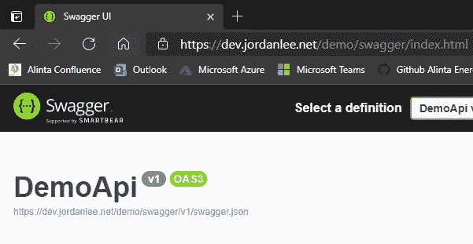

# 使用 Azure Devops 设置 CI/CD

现在我已经知道可以手动构建 DemoApi 并将其部署到 AKS，接下来我想做的是自动化这个过程。我的工作场所使用 Azure DevOps，这也是我最熟悉的工具，所以我将在 CI/CD 管道中使用它。

有许多不同的方法可以建立 CI/CD 流；下图显示了我的工作场所目前的设置情况:

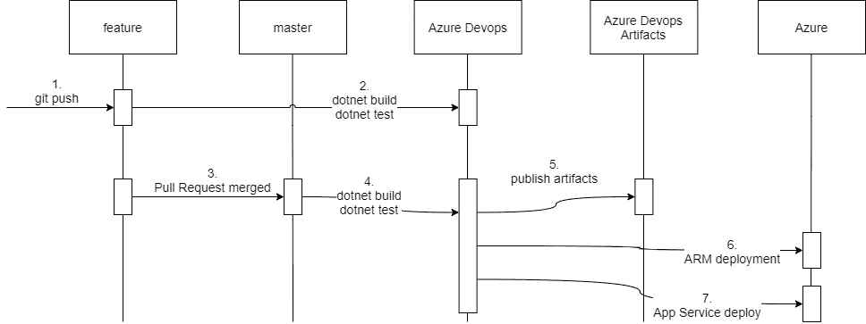

部署到 Azure 应用服务的 CI/CD 工作流

我几乎可以肯定有更好、更有效的方法来做到这一点。但是，对于这个概念验证，我选择简单地调整现有的 ak 流程:

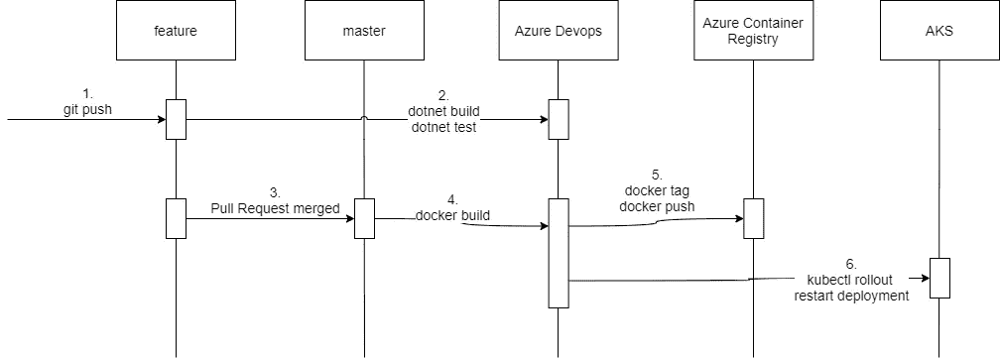

部署到 AKS 的 CI/CD 工作流

这是我为这个工作流创建的管道 yaml:

```
stages:
  - stage: BuildAndTest
    condition: ne(variables['Build.SourceBranch'], 'refs/heads/main')
    jobs:
      - job: BuildAndTest
        steps:
          - task: DotNetCoreCLI@2
            displayName: 'dotnet build'
            inputs:
              command: build
              projects: '**/*.sln'
              arguments: '--configuration Release'- task: DotNetCoreCLI@2
            inputs:
              command: 'test'
              projects: '**/*.sln'- stage: Containerize
    condition: eq(variables['Build.SourceBranch'], 'refs/heads/main')
    jobs:
      - job: Containerize
        steps:
          - task: Docker@2
            inputs:
              containerRegistry: 'Etherlabs'
              repository: 'demoapi'
              command: 'buildAndPush'
              Dockerfile: '**/Dockerfile'
              buildContext: 'src'
              tags: |
                $(Build.BuildNumber)
                development- task: Kubernetes@1
            inputs:
              connectionType: 'Kubernetes Service Connection'
              kubernetesServiceEndpoint: 'Jordan AKS'
              namespace: 'development'
              command: 'rollout'
              arguments: 'restart deployment demo-api'
              secretType: 'dockerRegistry'
              containerRegistryType: 'Azure Container Registry'
```

## 测试管道

我在代码中添加了另一个虚拟端点来测试管道:

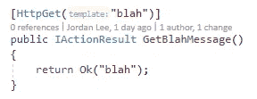

观察 Azure DevOps 管道，看起来部署已经成功完成:

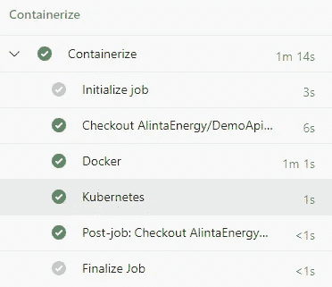

然后，为了仔细检查实际部署的更改，我尝试浏览到 blah 端点:

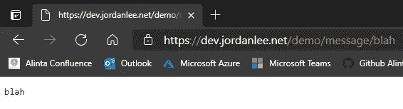

成功了！

# 结论

我最初做这个 PoC 是为了更好地理解 Kubernetes 环境中的开发与 App Services 环境中的开发有何不同。这些是我的想法:

## 基础设施设计

在我看来，就基础设施的简单性而言，AKS 比 App 服务有着巨大的优势。

考虑如下应用生态系统:

*   20 个 API
*   3 个环境:开发、用户验收测试、生产

这需要 60 个应用服务实例。如果 ARM 模板部署是 CI/CD 管道的一部分，那么运行 ARM 部署会花费大量时间。

Kubernetes 上运行的相同生态系统可以在单个 AKS 实例中运行，为每个环境设置单独的名称空间。

在这种设置中，不需要将 ARM 部署作为管道的一部分来运行。

**获胜者:AKS**

## CI/CD 管道

我在这个概念验证中使用的 AKS 管道与应用服务管道没有太大的不同。然而，我认为 AKS 相对于应用服务有两大优势:

*   不需要 ARM 模板部署。
*   AKS 的“首次展示”过程比应用服务中的 Web 部署过程要快得多。
    此外，借助滚动部署、就绪性和活性探测等功能，在 AKS 中实现“零停机”部署要简单得多。

**获胜者:AKS**

## AKS 所需的代码更改

不适用。

至少在 ASP.NET 核心解决方案利用选项和图标配置来获取应用程序设置的情况下，不需要 Kubernetes 特定的代码更改。

## AKS 与 App 服务的利弊

**缺点:**

*   对于不熟悉 Linux 或“sysadmin”类型活动的开发人员来说，这是一条陡峭的学习曲线
*   需要学习所有 Kubernetes 特有的术语和概念
*   实现“最佳实践”的 AKS 设置需要做更多的工作

**优点:**

*   更简单的 CI/CD
*   开启了服务网格架构的潜力
*   AKS 可以提供大多数现成的“实用程序”类型的功能(例如路由聚合和证书)

# //待办事项

关于 AKS，我还有很多未解决的问题要探索，我会在以后的帖子中尝试解决这些问题。即:

*   为名称空间实现适当的 RBAC
*   添加 Istio(服务网格)
*   用 Azure 应用网关替换 nginx 入口控制器
*   用于提供对 AKS 的内部访问的 VPN 解决方案
*   AKS 上的无服务器(功能即服务)

*如果你已经读到这里，那么恭喜你！你要么非常有耐心，要么真的对 Kubernetes 感兴趣。*

无论如何，感谢您的阅读，我希望这篇文章对您有用！