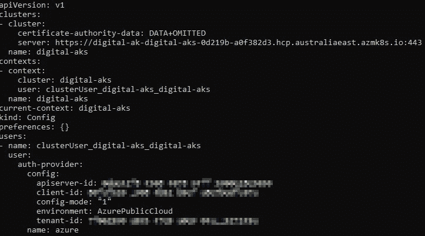

# 从 Azure 应用服务转移到 Azure Kubernetes 服务(第 2 部分)

> 原文：<https://levelup.gitconnected.com/moving-from-azure-app-services-to-azure-kubernetes-service-part-2-9a76439a0640>


**使用 Azure Active Directory 管理 Kubernetes 访问**

*这是我上一篇文章的后续:*

[](/moving-from-azure-app-services-to-azure-kubernetes-service-part-1-e489857c6440) [## 从 Azure 应用服务转移到 Azure Kubernetes 服务(第 1 部分)

### 我建立 AKS 集群的经验，以及在 Kubernetes 和 App Services 上运行应用程序的比较。

levelup.gitconnected.com](/moving-from-azure-app-services-to-azure-kubernetes-service-part-1-e489857c6440) 

在我工作的公司，任何种类的 PaaS 或 SaaS 解决方案的集中认证都是投入生产的必要条件。对于 Azure 应用服务，这是默认内置于平台中的——为了访问任何应用服务基础设施(例如，应用设置、Kudu、配置)，你需要登录 Azure 门户或 Azure CLI。

不幸的是，对于 AKS，情况并非如此——如果您使用默认设置，AKS 将使用客户端证书来控制通过 *kubectl* 的访问。

为了让我更进一步，让 AKS 成为我们运行 web 应用程序的首选平台，我需要确保它与 Azure Active Directory 集成。

在这篇文章中，我将介绍认证过程的具体情况，以及如何进行设置。

# AKS 管理的 Azure 活动目录集成

所需工具:

*   [az cli](https://docs.microsoft.com/en-us/cli/azure/) :用于设置 kubectl 的配置
*   kubectl :与 kubernetes 交互的 cli

正如您将在下面看到的，设置 kubectl 的过程与非 AAD 集成的 AKS 完全相同。然而，一个关键的区别是，集成 AAD 的集群强制您在运行任何 kubectl 命令之前执行 AAD 认证。

下面让我们来看看这是如何工作的:

我们首先表演一个`az login` …

```
PS C:\> az login
The default web browser has been opened at [https://login.microsoftonline.com/common/oauth2/authorize](https://login.microsoftonline.com/common/oauth2/authorize). Please continue the login in the web browser. If no web browser is available or if the web browser fails to open, use device code flow with `az login --use-device-code`.
You have logged in. Now let us find all the subscriptions to which you have access...
```

然后我们可以得到我们的 kubectl 凭证`az aks get-credentials`:


现在，当我第一次尝试运行 kubectl 命令时，系统提示我执行 AAD 登录:


只有在完成登录后，我才能从`kubectl`获得任何输出:


## kubectl AAD 凭证是什么样子的？

如果您想知道有 AAD 集成的 AKS 集群和没有 AAD 集成的 AKS 集群之间的 kubectl 凭证有什么不同，那就来吧！

*没有 AAD:您使用证书来认证 AKS*


不带 AAD

*使用 AAD:当您第一次运行* `*az aks get-credentials*` *时，kubectl config 最初会填充 AAD auth-provider 配置:*



带 AAD(在 AAD 认证之前)

*一旦您实际上通过了 AAD 的认证，kubectl 配置就会用一个访问令牌进行更新:*


使用 AAD(在成功的 AAD 认证之后)

这要好得多(从网络安全的角度来看)，因为如果有人离开公司，你不必担心他们会带走任何 Kubernetes 证书。

# 设置它

下面是使用 AAD 集成创建新的 AKS 实例的步骤。
*注意:所有这些步骤都可以从微软* [*文档*](https://docs.microsoft.com/en-us/azure/aks/managed-aad) 中获得

*   创建资源组
*   创建 AD 组(用于分配 AKS 权限)
*   创建 AKS 管理的 AD 群集

```
**# Login to Azure**
az login
az account set -s "Your Subscription Name"**# Set up variables**
$RG="digital-aks"
$AKSCLUSTER="digital-aks"
$AKSADMINGROUP="AKS Admins"**# Create an Azure AD group for cluster admins**
az ad group create --display-name $AKSADMINGROUP --mail-nickname digitalaksadmins**# Create resource groups for AKS**
az group create --name DefaultResourceGroup-EAU --location australiaEast az group create --name $RG --location australiaEast **# Create an AKS-managed Azure AD cluster**
$AKS_GROUP_ID=$(az ad group show -g $AKSADMINGROUP --query objectId -o tsv)az aks create -g $RG -n $AKSCLUSTER --enable-aad --aad-admin-group-object-ids $AKS_GROUP_ID**# Assign cluster admin role to AD group**
$AKS_ID=$(az aks show --resource-group $RG --name $AKSCLUSTER --query id -o tsv)az role assignment create --assignee $AKS_GROUP_ID --role "Azure Kubernetes Service Cluster Admin Role" --scope $AKS_ID**# Assign users to the AKS admin group**
$MEMBER_ID=$(az ad user show --id [jordan.lee@y](mailto:jordan.lee@alintaenergy.com.au)ourdomain.com --query objectId -o tsv)
az ad group member add --group $AKS_GROUP_ID --member-id $MEMBER_ID
```

# 结论

App Services 的一大优点是与 Azure AD 的集成内置于平台中(我特别指的是基础设施层)。获得像 Kudu 或应用服务设置这样的东西都需要通过 Azure 门户，这迫使你进行 AAD 认证。

默认情况下，AKS 使用证书管理身份验证——虽然这很方便，但它往往会引发网络安全危险信号(谁拥有证书副本，证书如何保存，当人们离开时证书如何轮换等)。

AAD 是许多运行在 Azure 上的企业的首选 IDP，所以如果你试图将 AKS 作为公司的首选平台，安全人员可能会希望你实现 AAD 集成。

幸运的是，微软已经使这变得非常容易，那么为什么不使用它呢？不用担心每次有人退出时都要轮换证书，这绝对是件好事！