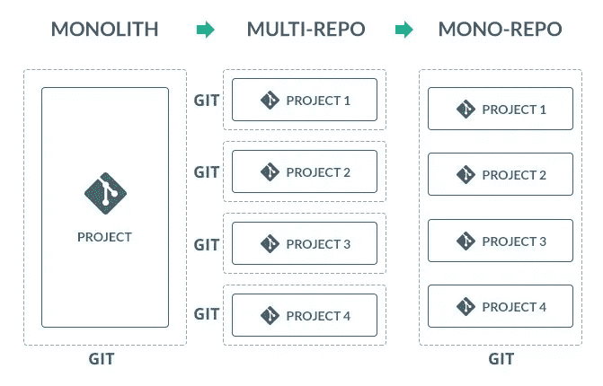

# 从多个存储库转移到一个 lerna-js 单一存储库

> 原文：<https://levelup.gitconnected.com/moving-from-multiple-repositories-to-a-lerna-js-mono-repo-faa97aeee35b>

## 在深入研究 Lerna、Bit 和其他单一回购工具之前，想想你在做什么，你在为谁做，为什么做。



在 [版本控制系统](https://en.wikipedia.org/wiki/Revision_control)中，一个 **monorepo** (一个*单片库*的[音节缩写](https://en.wikipedia.org/wiki/Syllabic_abbreviation))是一个软件开发策略，其中许多项目的代码被存储在同一个[库](https://en.wikipedia.org/wiki/Repository_(version_control))中。将大型代码库分割成单独的独立版本包对于代码共享非常有用。然而，跨许多存储库进行变更是很麻烦的，也很难跟踪，跨存储库的测试变得非常复杂。一些公司已经采用了这种策略，如谷歌、脸书、微软、优步、Airbnb 和 Twitter。

## **为什么要使用单边回购？**

*   **通过原子提交轻松重构全局特性。**不需要为每个 repo 做一个 pull 请求，弄清楚以什么顺序构建您的变更，您只需要做一个原子 pull 请求，它将包含与您正在处理的特性相关的所有提交。
*   **简化的包发布。**如果你计划在一个依赖于另一个共享代码包的包中实现一个新特性，你可以用一个命令来实现。这个功能需要一些额外的配置，这将在本文的工具回顾部分讨论。目前，有丰富的工具可供选择，包括 Lerna 和 Yarn 工作空间。
*   简化的依赖关系管理 —在多个项目依赖于第三方依赖关系的多存储库环境中，依赖关系可能会被下载或构建多次。在 monorepo 中，构建很容易优化，因为引用的依赖项都存在于同一个代码库中。
*   在共享包中重用代码，同时保持它们的隔离。Monorepo 允许你从其他包中重用你的包，同时保持它们之间的隔离。您可以使用对远程包的引用，并通过单个入口点使用它们。要使用本地版本，您可以使用本地符号链接。这个特性可以通过 bash 脚本或者引入一些额外的工具来实现，比如 Lerna 或者 Yarn。

有了 Lerna，我们现在可以管理所有软件包的单一存储库，其目录结构如下所示:

```
mylerna_repo/
  - node_modules
  - packages
    - client
      package.json
    - server
      package.json
    - docs
      package.json
  lerna.json
  package.json
```

# 工具评论

管理 monorepos 的工具集在不断增加，目前，很容易迷失在 monorepos 的各种建筑系统中。通过使用[本报告](https://github.com/despeauxz/codesandbox)，您可以随时了解流行的解决方案。但是现在，让我们快速地看一下现在大量使用 JavaScript 的工具:

*   [Yarn](https://yarnpkg.com/blog/2017/08/02/introducing-workspaces/) 是一个 JavaScript 依赖管理工具，通过工作区无提升支持 monorepos。
*   Lerna 是一个基于 Yarn 的工具，用于管理包含多个包的 JavaScript 项目。

# **纱线**

Yarn 是 NPM 包的依赖管理器，它最初不是为了支持 monorepos 而构建的。但是在 1.0 版本中， [Yarn 开发者](https://www.toptal.com/front-end)发布了一个名为 *Workspaces* 的功能。在发布时，它并不稳定，但是过了一段时间，它就可以用于生产项目了。

*工作空间*基本上是一个包，它有自己的 *package.json* 并且可以有一些特定的构建规则(例如，如果你在你的项目中使用 TypeScript，那么有一个单独的 *tsconfig.json* )。).实际上，您可以使用 bash 在没有 Yarn 工作空间的情况下进行管理，并拥有完全相同的设置，但是这个工具有助于简化每个包的安装和更新依赖关系的过程。

一眼看去，Yarn 及其工作区提供了以下有用的特性:

1.  所有包的根目录中的单个`node_modules`文件夹。例如，如果您有`packages/package_a`和`packages/package_b`——以及它们自己的`package.json`——所有的依赖项将只安装在根目录中。这是 Yarn 和 Lerna 工作方式的区别之一。
2.  允许本地包开发的依赖符号链接。
3.  所有依赖项的单一锁定文件。
4.  如果您只想为一个包重新安装依赖项，可以进行集中的依赖项更新。这可以通过使用`-focus`旗来完成。
5.  与 Lerna 整合。您可以轻松地让 Yarn 处理所有的安装/符号链接，并让 Lerna 负责发布和版本控制。这是到目前为止最流行的设置，因为它需要更少的努力，并且易于操作。

有用的链接:

*   [纱线工作区](https://yarnpkg.com/lang/en/docs/workspaces/)

# 莱尔纳

这个工具在处理语义版本、设置构建工作流、推送包等方面非常有用。Lerna 背后的主要思想是，您的项目有一个 packages 文件夹，其中包含所有独立的代码部分。除了包之外，还有主应用程序，例如，它可以位于 src 文件夹中。Lerna 中几乎所有的操作都遵循一个简单的规则——遍历所有的包，并对它们进行一些操作，例如，增加包的版本，更新所有包的依赖关系，构建所有包，等等。

使用 Lerna，您有两种选择来使用您的软件包:

1.  而不把他们推到偏远的(NPM)
2.  将您的包推送到远程

当使用第一种方法时，您可以对您的包使用本地引用，并且基本上不关心符号链接来解析它们。

但是如果您使用第二种方法，您将被迫从远程导入您的包。(例如，`import { something } from @name/packagename;`)，这意味着您将始终获得您的包的远程版本。对于本地开发，您必须在您的文件夹的根目录中创建符号链接，以使 bundler 解析本地包，而不是使用那些在您的`node_modules/`中的包。这就是为什么在启动 Webpack 或你最喜欢的 bundler 之前，你必须启动`[lerna bootstrap](https://lernajs.io/#command-bootstrap)`，它会自动链接所有的包。

# 结论

今天的“mono repo”通常意味着将一个存储库变成一个多包存储库，从这里可以发布多个包。这个存储库是多回购架构的一部分，存在于它的生态系统中。

像 Bit(它是为多回购代码库中的代码共享而构建的)、Lerna 和 Yarn workspaces 这样的工具有助于优化这个工作流，并促进代码共享，以加快开发和简化维护。

选择正确的工具意味着理解你要构建什么，你为什么要构建它，以及你期望其他人如何使用它。回答这些问题可以帮助你从一开始就做出正确的选择，这将使你以后的生活更加轻松。

别忘了:共享代码是关于工具和技术的，也是关于人和交流的。合适的工具可以帮助你分享和交流，但不会取代团队工作和协作。

感谢您的阅读，请随时与他人分享您的见解和经验！干杯。