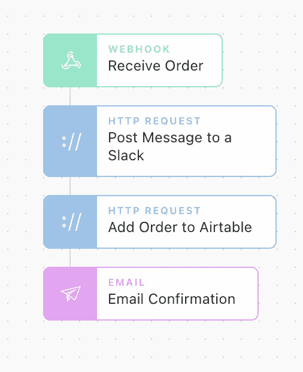
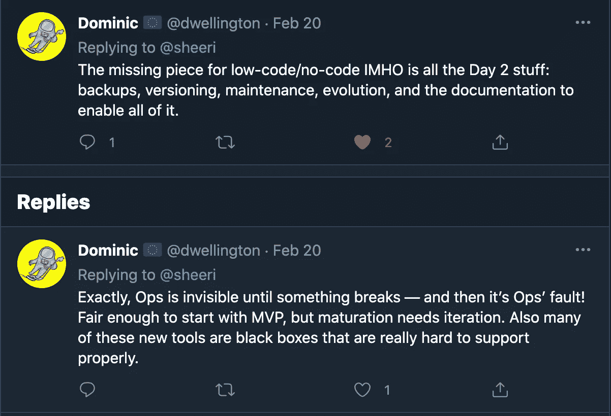
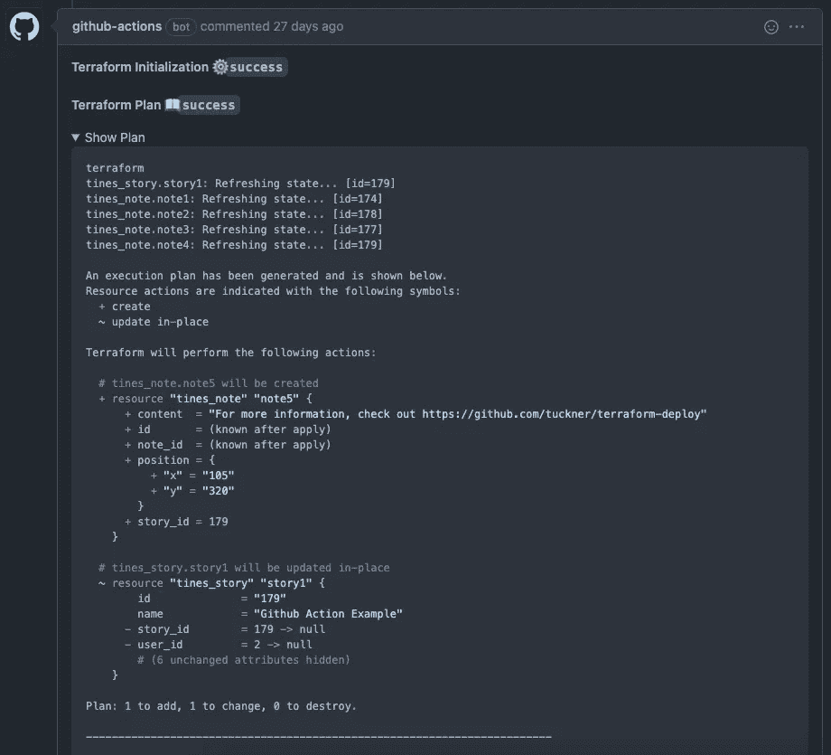

# 从无代码到有代码

> 原文：<https://levelup.gitconnected.com/moving-from-no-code-to-code-9d171a5927b0>

无代码工具正在蓬勃发展，让任何有想法的人都能快速创造出产品。不久之后，一旦一个想法变得足够大，工程师就可以被请来帮助运作一切。产品将需要变得比最初的 MVP 更加可靠和稳定。在这一点上，从无代码抽象回到基于代码的工具可能是具有挑战性和耗时的，因为实现它们的复杂性，这些工具最初被跳过了！

不久前，我加入了 [Tines](https://tines.com) ，这是一个低代码/无代码平台，使任何人都可以创建复杂的网络安全工作流，包括任何有 API 的工具，甚至一些没有 API 的工具。虽然大多数人不会每天使用网络安全工具，但安全分析师最终会花费大量时间使用非常常见的工具，如 Google Workspace、Slack 和 Zendesk 来执行日常任务。巧合的是，这些工具也是许多电子商务平台用来处理订单和与客户互动的工具。

在 Tines 中可以看到的一切也可以表示为代码，这里我将介绍如何制作故事板设计，将其转换为可以理解为代码的可靠部署，以及如何在此过程中利用常用的开发工具。

# 成为最有价值球员

无代码工具通常专注于提供创建和编辑工作流的奇妙用户体验。Tines 利用灵活的“故事板”来创建“故事”,这些故事是针对给定的一系列事件所采取的行动的可视化图表。像故事板这样的画布为快速原型化并最终实现业务逻辑提供了极好的机会。



在上面的示例中，工作流将在 webhook 上接收一个新订单，向 Slack 通道发布一条包含订单详细信息的消息，将该订单添加到 Airtable 中进行跟踪，并向购买者发送一封确认电子邮件。这个简短的例子本身可能不是一个企业(可能很接近！)，但它包含了许多业务只需几个小动作就能依赖的流程。

为了更好地理解每个图块的功能，我可以将任意图块复制到我的剪贴板，然后粘贴到文本编辑器中。

```
{
 "agents": [{
  "disabled": false,
  "name": "Add Order to Airtable",
  "options": "{\"url\":\"[https://api.airtable.com/v0/{{](https://api.airtable.com/v0/{{) .RESOURCE.airtable_orders }}/orders\",\"content_type\":\"json\",\"method\":\"post\",\"payload\":{\"records\":[{\"fields\":{\"Buyer\":\"{{ .receive_order.buyer }}\",\"Items\":\"{{ .receive_order.items }}\",\"Cost\":{{ receive_order.cost}}}}]},\"headers\":{\"Authorization\":\"Bearer {{ .CREDENTIAL.airtable }}\"}}",
  "position": {
   "x": 179,
   "y": 268
  },
  "type": "httpRequest"
 }],
 "links": [],
 "diagramNotes": []
}
```

上面的配置告诉 Tines 向 Airtable 发出一个 HTTP 请求，以便向 Airtable 数据库添加新的订单细节。通过将工作流中的操作链接在一起，我可以在整个流程中重用信息。例如，我可以使用我在`{{ .receive_order.buyer }}`中收到的电子邮件地址，并在向买家发送购买确认时在“电子邮件配置”标题中使用它。

# 将 MVP 转换成可部署的代码

有了这个流程，假设我们现在每月赚 1，000，000 美元，并且可以雇佣我们的第一个工程师。新业务的待办事项中可能已经有太多的事情要做，所以重新滚动无代码工作流可能不是优先列表中的重点(为什么要修复没有损坏的东西？).然而，它可能更符合工程师们习惯的工具。一个工程师可能会拿起他们最喜欢的工具之一，比如 Terraform，让一切变得稳定一些。所有类型的工程师都广泛使用 Terraform 来可靠地部署网站和服务。没有理由说 Terraform 不能进入无代码空间。

因为我们的无代码解决方案暴露了工作流每个部分的技术细节，所以我构建了一些工具来将这些技术细节转换成 Terraform 使用的规范，包括用于 Tines 的 Terraform 提供者([位于此处](https://github.com/tuckner/terraform-provider-tines))。

在我说得太远之前，我想提一下，我个人并没有看到许多无代码解决方案提供与已知工程工具的兼容性，但我可以看到未来，这是无代码的下一次迭代，我也不认为我是唯一的一个-



现在，我要做的事情可能很明显了，但是利用像 Github 这样的平台解决了其中的一些问题……稍后会有更多的介绍。

回到正题，让我们看看在 Terraform 中“向 Airtable 添加订单”的尖齿配置可能是什么样的:

```
resource "tines_agent" "add_order_to_airtable" {
 name = "Add Order to Airtable"
 agent_type = "Agents::HTTPRequestAgent"
 story_id = tines_story.ecommerce_orders.id 
 keep_events_for = 0
 source_ids = []
 receiver_ids = []
 position = {
  x = 180.0
  y = 270.0
 }
 agent_options = jsonencode({
  "content_type": "json",
  "headers": {
   "Authorization": "Bearer {{ .CREDENTIAL.airtable }}"
  },
  "method": "post",
  "payload": {
   "records": [{
    "fields": {
     "Buyer": "{{ .receive_order.buyer }}",
     "Cost": "{{ receive_order.cost}}",
     "Items": "{{ .receive_order.items }}"
    }
   }]
  },
  "url": "[https://api.airtable.com/v0/{{](https://api.airtable.com/v0/{{) .RESOURCE.airtable_orders }}/Orders"
 })
}
```

如果你精通地形，这应该看起来非常熟悉。令人惊讶的是，在这两种配置之间实际上并不需要太多的改变…只是一些语法的变动。为了使它变得更加简单，我创建了一组工具来将无代码配置的文本版本更改为 Terraform 配置，该配置包含在前面链接的 Terraform 提供程序的“scripts”目录中。

# 部署无代码代码

随着我们的尖齿配置转化为地形配置，我们可以开始谈论部署。直接进入 CLI 并运行类似于`terraform apply`的东西是很简单的，但是这不允许在任何更改上进行协作，保持当前的部署状态，或者执行配置的自动语法检查。

部署 Terraform 配置的通常做法是将它们存储在… dun dun dun… Github 中。当使用 Github 时，您开始使用大量开发人员都知道的工具来支持备份、版本控制、维护、演进和无代码配置的文档。

为了帮助实现这一点，我们可以在 Terraform 中使用 Github 动作。Github 动作是 Github 的一个特性，它允许以自动化的方式测试和部署代码。利用 [Github 流](https://guides.github.com/introduction/flow/)，我们可以在创建拉取请求时执行一个`terraform plan`，并在拉取请求上留下一个注释，其中包含如果成功将会发生的预期变化。



当 pull 请求被合并时，Github 动作将自动执行`terraform apply`来部署配置更改。这样，我们现在有了一个无代码工具的完整部署管道！

Github 的动作配置可以在[这里](https://github.com/tuckner/tines-deploy-actions)找到。

虽然这些都是针对 Tines 的，但是我很兴奋地等待其他类似的解决方案开始出现，以支持无代码工具，并使更多的人能够构建下一代产品。

*最初发布于*[*https://johntuckner . me*](https://johntuckner.me/posts/no-code-to-code)*。*