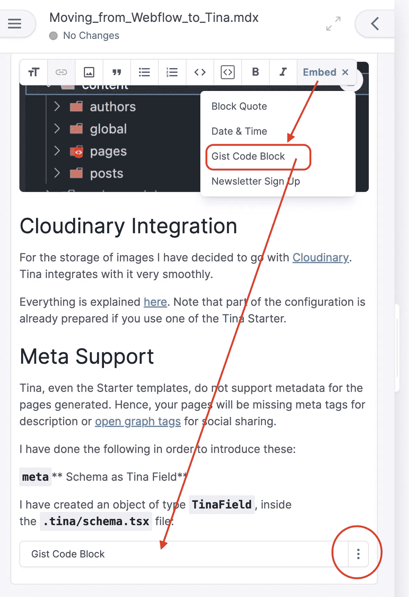

# 从 Webflow 迁移到 Tina

> 原文：<https://levelup.gitconnected.com/moving-from-webflow-to-tina-75204dcf4f2b>

## 我为什么以及如何从 Webflow 迁移到 Tina —提示和建议


图片由[大卫·马克](https://pixabay.com/users/12019-12019/?utm_source=link-attribution&amp;utm_medium=referral&amp;utm_campaign=image&amp;utm_content=1993704)从[皮克斯拜](https://pixabay.com//?utm_source=link-attribution&amp;utm_medium=referral&amp;utm_campaign=image&amp;utm_content=1993704)拍摄

# 介绍

这是一篇关于我如何将我的一个网站从 [Webflow](https://webflow.com/) 切换到 [Tina](https://tina.io/) 的帖子。我想和你们分享一下*为什么*和*如何*。

在这篇文章中你会发现:

*   开始使用 Tina 的最佳方式。
*   在哪里部署您的网站。
*   在部署到生产环境之前，在本地启动 Tina 并修改内容和代码。
*   与 Cloudinary 集成。
*   添加额外的元数据字段和 og 标签。
*   创建页面块。
*   自定义列表呈现。
*   自定义页脚。
*   自定义标题。
*   将字体嵌入页面。
*   使用上下文编辑进行编辑。
*   在文章和内容块中使用富文本组件。
*   嵌入 Github Gists。
*   生成 sitemap.xml

# 为什么

不要误解我。 [Webflow](https://webflow.com/) 是一个**奇妙的**，绝对**惊人的** CMS，可以在实现网站时大幅提升你的生产力。它们做得又漂亮又快！我强烈推荐。

但是，对我来说，唯一的问题是它不能编写开发者友好的内容，比如代码块。

例如，这是一个代码块:

```
puts 'Hello World!'
```

或者以代码风格`like this`编写部分短语的能力。

最重要的是，当你想要自己的自定义域名和一些基本的 CMS 功能时，它不是免费的。我不是说它很贵，但我只是说我有限的需求不值得这些钱。

这也是我决定转投[蒂娜](https://tina.io/)的原因。正如他们在自己的网站上声称的那样，这是

> 开发者至上的网站。

因此，如果你是一个像我一样的开发者，你想开发一个具有 CMS 功能的*开发者优先的网站*，那么你可能也想考虑一下 [Tina](https://tina.io/) 。

以下是我如何使用 Tina 开发我的第一个网站，并提供一些提示和建议。

**重要提示:**我已经在这里公开了网站[的代码。所以，你可以下载/克隆并使用它。你也可以用它来建立自己的网站。](https://github.com/pmatsinopoulos/wheel-run-web-site)

# 方法—提示和建议

## 使用快速启动器之一

我决定选择这里的一个快速启动者。


选择快速入门

事实上，我选择了`Tina Cloud Starter`，它有初始的营销布局页面，并且设置已经准备好与 [Tailwind CSS](https://tailwindcss.com/) 一起工作。

初学者的好处是他们使用 Tina Cloud，这是

1.  将您的站点部署到 Vercel，并且
2.  编辑内容并让您的更改自动与您站点的 Github repo 同步。

因此，Tina Cloud 让整个编辑和部署过程变得非常简单。

如果您遵循此流程:

1.  将创建一个 Github 存储库(如果没有)来存储您的网站代码和内容。
2.  Github 存储库将注册一个新的 webhook，将更改推送到 Tina Cloud。


Webhook 将 Github 库更改推送到 Tina Cloud

3.两个 Github 应用程序将与这个 Github 存储库集成:


Github 应用

*   Tina 云应用
*   韦尔塞尔

Tina 负责允许您在线编辑网站内容。鉴于，Vercel 负责构建和托管您的网站。

4.韦尔塞尔账户

您将拥有一个新的注册了该项目的 Vercel 帐户。像这样:


Vercel 仪表板

你将参加免费的`Hobby`计划。

注意:点击阅读更多关于 Vercel 定价[的信息。](https://vercel.com/pricing)

Vercel 与您的 Github repo 集成在一起，这意味着每次您推送 repo 时，Vercel 都会构建并部署您的项目。如果你推送一个除了`main`之外的分支，那么它会为你创建一个临时的分支特定的 URL 来查看你网站的内容。一旦你合并到`main`，它将部署到`Production`环境，这将推动该网站的网址

```
https://<project-name>.vercel.app
```

例如，我的项目是:`wheel-run-web-site`，这意味着当部署到生产时，它被发布到`[https://wheel-run-web-site.vercel.app](https://wheel-run-web-site.vercel.app.)` [。](https://wheel-run-web-site.vercel.app.)

## 在本地克隆回购，像开发人员一样工作

万事俱备，运转正常，但这不是你的*内容。这是 Tina 的入门内容。您仍然可以使用 Tina Cloud 进行编辑，但我认为在本地克隆 repo 并遵循标准开发流程对站点代码及其内容进行更改要合适得多。*

## 在本地启动服务器

在你之后

```
$ yarn install
```

然后，您可以在本地启动服务器:

```
$ yarn dev
```

然后你可以使用`[http://localhost:3000/admin](http://localhost:3000/admin)`来编辑你的站点内容并保存。

这将在本地更改您的站点，您可以通过`git diff`看到这些更改。

如果你很开心，创建一个分支，添加，提交，推送，创建一个 PR。

等待 Vercel 构建预览，并使用 Vercel 构建过程发布的 URL 访问最终预览。

如果一切正常，那么你合并你的 PR，Vercel 将接管发布到生产 URL。

## 阅读文件

Tina 文档非常好，你应该全部阅读。在你的项目中尝试他们的例子。然后，当你做你真正需要的改变时，我确信你会更容易找到出路。

## Tina 模式文件—使其成为 TSX

Tina 模式文件`.tina/schema.ts`，是一个类型脚本文件。我建议你把它变成一个`.tsx`，这样你就可以在里面添加 [React JSX](https://reactjs.org/docs/introducing-jsx.html) 语句。

如果这样做，请确保同时更新该文件:

```
.tina/components/TinaProvider.jsx
```

从正确的模式文件中导入`tinaConfig`。

此外，如果您最终在您的`.tina/schema.tsx`文件中添加了 JSX 代码，请确保这样做

```
import React from "react";
```

开始的时候。

## MD 和 MDX

您可以用不同的格式存储和编辑您的内容。最有用的两个是

*   MD，这是标准的减价格式内容
*   MDX，这是标准的降价格式内容，也可以包括嵌入的 React 组件。

初学者附带了两个例子。Tina 有能力将 MD 和 MDX 内容转换成 HTML，这真是太神奇了。

## 内容文件夹

保存内容的文件夹是`content`文件夹。对于内容模式中定义的每个*集合*，它都有一个子文件夹(文件:`.tina/schema.ts(x)`)。

在我的例子中，内容文件夹是这样配置的:


示例内容文件夹

## 云集成

对于图像的存储，我已经决定使用 [Cloudinary](https://cloudinary.com/) 。蒂娜很顺利地融入其中。

一切都在这里[说明](https://tina.io/docs/reference/media/cloudinary/)。请注意，如果您使用 Tina Starter 之一，那么部分配置已经准备好了。

## 元支持

Tina，甚至 Starter 模板，都不支持生成的页面的元数据。因此，您的页面将缺少用于描述的元标签或用于社交分享的[开放图标签](https://ogp.me/)。

为了介绍这些，我做了以下工作:

`**meta**` **模式为 Tina 字段**

我在`.tina/schema.tsx`文件中创建了一个类型为`TinaField`的对象:

元数据模式

这为一个字段声明了一个模式，我想将它包含在我的一些集合中。特别是，我包括了`page`系列和`post`系列。

下面是模式的`page`集合部分:


元数据架构作为字段附加到页面集合

这意味着帖子和页面都可以被配置为包含如下数据:

*   `meta.description`
*   `meta.og.type`
*   `meta.og.image`
*   `meta.og.namespace`

电子贸易公司

然后，我必须确保在 post 和页面 React 组件中使用这些数据。

**修改布局组件**

支持元数据和 og 图标签的更改始于布局组件:

```
components/layout/layout.tsx
```

我必须在组件实现的开始声明一些常量:

为元数据和 Og 标签准备局部变量

如您所见，我从`data.head`和`data.header`对象中获取元数据和 og 值。

然后我建立正确的标签:

利用元数据和 Og 标签的布局

最后，我要做的是通过为元数据传递正确的数据来确保文章和页面组件使用布局。

对于 post 案例，我必须更改的文件是:

```
pages/post/[filename].tsx
```

Post 组件的布局数据准备

您可以看到我是如何准备`layoutData`对象的，我将它传递给第 46 行的`Layout`组件实例。

对于页面案例，我必须更改的文件是:

```
pages/[filename].tsx
```

页面组件的布局数据准备

就这样。然后所有的页面和文章都有正确的 meta 和 og 标签，只要内容编辑器在代码库的内容部分有最新的信息。

## 创建页面块

蒂娜与*系列*合作，你将会推出一个特殊系列`page`系列。它保存了站点中所有页面的列表。一个页面由*个块*组成。我开始使用的 Tina Starter 包含以下块:

*   海罗（人名）；英雄（电影名）
*   特征
*   内容
*   证明书

但是如果你想在你的页面中使用不同的块呢？在这种情况下，您可以创建自己的。

例如，我创建了具有两列部分的块。我是这样做的:

**首先用 React 组件**创建文件

示例:

```
components/blocks/twoColumnsContent.tsx
```

该文件有两个主要部分:

1.  反应组分
2.  驱动 Tina 编辑器允许用户配置块内容的模式。

**阻塞反应元件**

我的两列内容 React 组件是这样的:

两列反应组件

`data`对象中的内容是块的可配置有效载荷，块的内容由块模式定义为结构，并在设置页面/块的内容时由内容编辑器填充。

**块模式**

如我所说，块文件的第二部分定义了块的模式/结构。以下是我在两个专栏中使用的内容:

两列内容块架构

**在块渲染器中注册块**

为了渲染块，需要在块渲染器中注册块:

```
components/blocks-renderer.tsx
```

这就是上面两个列块的情况:


在块渲染器中注册块

**使用块进入页面**

要在页面中使用该块，必须将它添加到定义页面集合结构的模式(`.tina.schema.ts(x)`)中页面的*模板*。


声明使用新块的能力

就是这样，然后 Tina 使用它的魔力，允许您使用类似这样的用户界面体验来编辑该块的内容:


用于编辑块内容的 Tina UI

## 自定义列表呈现

在使用块和页面时，我发现定制块在页面块列表中的显示方式非常有用。

在这里，作为示例，您可以看到[车轮运行](https://www.wheelrun.biz)主页中使用的块列表。


区块/部分列表

每个块/部分似乎都有自己的自定义标题，这一点非常有用，可以使用[自定义列表渲染](https://tina.io/docs/extending-tina/customize-list-ui/)来实现。

## 自定义页脚

这是要自定义页脚的文件:

```
components/layout/footer/footer.tsx
```

我不得不删除蒂娜图标，并替换为车轮运行标志。然后我还得把 Instagram 社交链接换成 LinkedIn 那个。

请注意，Tina Starter 已经包含了我可以立即使用的[反应图标](https://www.npmjs.com/package/react-icons)。

将 LinkedIn 社交链接添加到页脚

## 自定义标题

需要更改的文件是:

```
components/layout/header.tsx
```

我猜你需要用你自己的商标和品牌来替换它。

## 将 Typeform 表单嵌入到页面中

我知道 Tina 支持在页面中放置任何内容，包括表单。例如，Tina Starter 有一个时事通讯注册表单的例子。

另一方面，我需要一个[类型的表单](https://www.typeform.com/)嵌入到联系我们页面中。这很简单:

**新组件模块**

首先，我在自己的文件中创建了新的 React 组件:

```
components/blocks/contactUs.tsx
```

正如我前面解释的，我声明了 React 组件和块内容的数据模型的模式:

联系我们 React 组件和架构

这是最重要的部分:

在第 3 行:

```
import { Widget } from '@typeform/embed-react'
```

我从 [@typeform/embed-react](https://www.npmjs.com/package/@typeform/embed-react) 库中导入了`Widget` React 组件。

这使得在 Nextjs 生成的页面中嵌入 Typeform 表单成为可能。

**更新了块渲染器**

然后我更新了块渲染器

```
components/blocks-renderer.tsx
```

要了解新块并处理其渲染:


用于呈现联系我们块的块呈现器

**声明该块为可用模板**

然后，我将块`contactUsBlockSchema`声明为`page`集合的可用*模板*(在`.tina/schema.tsx`文件内)。


包含联系我们块页面集合模式

## 要使用上下文编辑进行编辑的页面

编辑页面内容时，您有两种选择:

1.  编辑它而不实际查看更改效果，或者
2.  编辑它并同时查看更改效果。

在第一种情况下，您会看到一些表单，用于键入影响内容的值，如下所示:


编辑页面内容，而不查看更改的效果

这不会让您看到更改所带来的影响。

在第二种情况下，左侧边栏显示编辑表单，中间显示实际的页面内容:


上下文编辑

第二种情况是*上下文编辑*，如果你想让你的页面拥有它，你需要将页面绑定到正确的路径。

这是在文件内部完成的:`.tina/schema.tsx`。您可以在底部定义 Tina 配置。


模式文件中的上下文编辑

## 帖子和内容块中的富文本组件

Tina Starter 具有动态连接不同组件的能力。但仅适用于`post`收藏项，即仅适用于帖子页。

可以使用的组件有:

*   `BlockQuote`
*   `DateTime`
*   `NewsletterSignup`

这些块可用于`post`对象的`rich-text`字段。查看模式:

富文本类型字段包含组件模板

当您克隆 Tina Starter 时，组件定义在`components/posts/post.tsx`中。

这里是你如何将它引入到一个`post`页面中。


将富文本组件引入页面

在`body`字段(属于`rich-text`类型)上，您可以看到一个`Embed`按钮，点击该按钮时，会展开到可用组件列表。这个列表也是在`.tina/schema.tsx`文件的`post`集合模式中定义的。

这种设置有一个缺点。它不允许在其他集合的其他块中使用这些组件。

因此，我所做的是将组件代码提取到它们自己的文件中，然后将它们导入到定义了`Content`组件的`components/posts/post.tsx`文件和`components/blocks/content.tsx`文件中。

最初，`components/blocks/content.tsx`文件对于`body`字段有一个非常简单的模式:

```
{
  type: "rich-text",
  label: "Body",
  name: "body",
},
```

现在，随着`components`被提取出来，我把它改成了这样:

```
{
  type: "rich-text",
  label: "Body",
  name: "body",
  isBody: true,
  templates: richTextTemplatesSchemas,
},
```

其中`richTextTemplatesSchemas`是所有可用组件的模式。

因此，我也能够在内容块中使用富文本组件，而不仅仅是在博客文章中

## Github Gist 富文本组件

虽然 Tina 给了你在文章和页面中使用代码块的能力，但是我缺少的是嵌入 [Github Gists](https://gist.github.com/) 的方法。比如这篇中等帖子里的。

我尝试过使用[脚本 Next.js](https://nextjs.org/docs/basic-features/script) 组件，但是这不能与 Github gist embed `src`一起使用，就像下面这样:


Github Gist 嵌入

但是后来，我谷歌了一下，找到了 [react-gist](https://github.com/tleunen/react-gist) ，一个无缝嵌入 Github gist 的 react 组件。

有了这个工具，我只需要创建一个新的富文本组件，并使它可供使用。以下是步骤:

**声明组件模式**


Gist 代码块的模式

我在文件中声明了模式

```
components/schemas/gistCodeBlockTemplateSchema.ts
```

正如您在模式中看到的，我声明了两个字段:

*   这个`gistId`将存储要点的 ID，你可以从它的 url 中得到它。
*   `gistFile`只对 gists 有用，因为他们有很多文件。

**使 Gist Clode 块可用**

为了使 Gist 代码块作为嵌入富文本块的一个选项，像块报价或日期时间或时事通讯注册，我们只是把它添加到模板数组`richtTextTemplateSchema`。

文件

```
components/schemas/richTextTemplatesSchemas.ts
```


将要点代码块架构添加到富文本模板中

**实现要点代码块组件**

然后，我们将 Gist 代码块实现为文件中的一个`Component`

```
components/util/components.tsx
```


在组件内部实现 GistCodeBlock

就是这样！

然后我就可以在编辑博客文章时通过 Tina UI 使用它了。它作为一个选项出现在`Embed`按钮上。



嵌入要点代码块

从上面可以看到，从`Embed`下拉菜单中嵌入 gist 代码块非常容易。然后你点击三个垂直的省略号按钮，你可以进入编辑，在这里你可以指定要点 id 和要点文件。


要点代码块编辑

重要提示:您的构建可能会失败，并出现以下错误:

```
Type error: 'Gist' cannot be used as a JSX component.
```

`Gist`与 Typescript 不兼容。确保它不包含在`"tsconfig.json"`文件内的`"include"`数组中。

# Sitemap.xml

为了让`sitemap.xml`自动生成，我依赖于奇妙的库 [next-sitemap](https://www.npmjs.com/package/next-sitemap) 。

请注意，我必须在文件中创建它的配置:

```
next-sitemap.config.mjs
```

注意文件扩展名`.mjs`。否则，将无法成功解析。

最重要的是，我必须像这样调用它作为一个`postbuild`:

```
"postbuild": "next-sitemap --config next-sitemap.config.mjs",
```

您可能希望调整配置，以便在站点地图中排除一些路径。例如，我已经排除了`/admin`路径。此外，我已经决定使用单个站点地图文件，而不是站点地图索引。但是，如果你的网站有大量的页面，你可能会更好地使用站点地图索引生成。

站点地图生成器配置

## 生产中的环境变量

如果您像我一样使用 Vercel，请确保为`Production`环境的环境变量设置了正确的值。

例如，站点地图生成器正在寻找`SITE_URL`环境变量。转到 Vercel 项目设置并设置正确的值:


设置生产环境变量

# 结束语

我已经从 Webflow 转到 Tina 了，不是因为 Webflow 不好，而是因为 Webflow 对开发者不友好。这篇博文解释了我使用 Tina 实例化一个网站的主要步骤。它包括一些提示和建议。

一如既往，我从你身上学到的比你从我身上学到的要多得多。因此，我们非常欢迎您在下面的评论中提出反馈。提前感谢。

*注:本帖也已发布到车轮跑博客* [*这里*](https://www.wheelrun.biz/post/Moving_from_Webflow_to_Tina) *。*