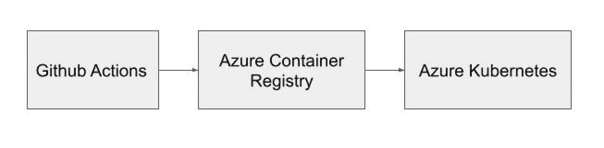
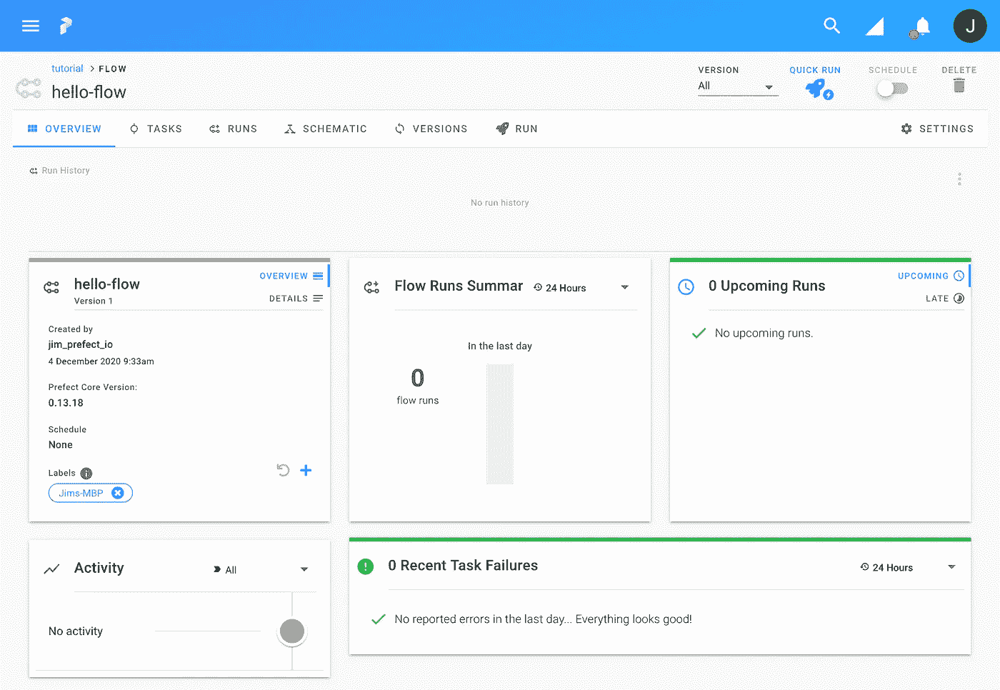

# 将您的完美流程从本地迁移到云。以下是方法。

> 原文：<https://levelup.gitconnected.com/moving-your-prefect-flow-from-local-to-the-cloud-heres-how-64ba140172ae>

从将测试从本地转移到云上的经验。


伯纳德·赫曼特在 [Unsplash](https://unsplash.com?utm_source=medium&utm_medium=referral) 上的照片

我可爱的读者们。几周前，我写了一篇[文章](https://blog.devgenius.io/airflow-theres-a-new-competitor-in-town-d59b48a642ff)，讲述了我是如何开始将 Prefect 视为我的工作流管理系统的。我没有意识到人们对 perfect 有多大兴趣，所以我决定继续展示我的进展，因为我正在开发从本地到生产的 perfect 工作流管理。在这篇特别的文章中，我将讨论我是如何从本地测试转向云中测试的。

# 什么是提督？

Prefect 是一个开源的工作流管理系统，用户可以在其中将任务组织成流。有两种方法来设置它——自托管或云托管。Prefect 的一个关键卖点是，它不需要访问您的代码，因为您将代码存储在存储中，无论是本地存储、云中的数据湖存储还是 docker 文件存储。

在 Prefect 支持的所有集成中，它集成了 dbt 和 great expectations，这两个非凡的工具将有助于提高数据质量。

# 我如何开始使用提督？

这是代码。我从 Infinite Lambda 创建的 [git repo](https://github.com/infinitelambda/prefect-pipeline) 开始；它将解释你将看到的相似之处。

我做的一些改变

1.  我把流程和任务放在一个文件夹里。
2.  添加了一个. pylintrc 来将标准应用到我的 python 代码中
3.  添加 virtualenv 和 requirements.txt

```
**Folder Structure**
.
|-- virtualenv/
|-- flows/
|   |-- pokemon1
|   |   |-- flow.py
|   |   `-- task.py
|   `-- utilities
|       |-- config.py 
|-- Dockerfile
|-- .pylintrc
`-- requirements.txt
```

这是我开始在本地测试的流程。我只在最后加了 flow.run()。

```
#flow.py
from datetime import timedelta
from prefect import Flow

from pokemon1.task import ExtractPokemon, TransformPokemon, LoadPokemon

extract_pokemon = ExtractPokemon()
transform_pokemon = TransformPokemon()
load_pokemon = LoadPokemon()

with Flow("PokeFlow") as flow:
     extracted_pokemon = extract_pokemon()
     transformed_pokemon = transform_pokemon.map(extracted_pokemon)
     loaded_pokemon = load_pokemon(transformed_pokemon)
     flow.run()
```

任务文件和[口袋妖怪任务](https://github.com/infinitelambda/prefect-pipeline/blob/master/tasks/pokemontasks.py)一模一样。

```
#task.py
import requests
import prefect
from prefect import Task

class ExtractPokemon(Task):
    def run(self, **kwargs):
        logger = prefect.context.get("logger")
        url = "https://pokeapi.co/api/v2/pokemon?limit=151"
        response = requests.get(url)
        if response.ok: 
            return response.json()
        logger.warning(
            "Could not load pokemon list! Error {}".format(response.status_code)
        )
        return {"results": []}

class TransformPokemon(Task):
    def run(self, pokemon):
        logger = prefect.context.get("logger")
        url = pokemon["url"]
        name = pokemon["name"].title()
        logger.info("Getting {} from {}".format(name, url))
        response = requests.get(url)
        if response.ok:
            return response.json()
        logger.warning(
            "Could not load pokemon {}! Error {}".format(name, response.status_code)
        )
        return {} 

class LoadPokemon(Task):
    def run(self, pokemon):
        logger = prefect.context.get("logger")
        logger.info(len(pokemon))
```

# **云部署**

**概述**

接下来，我设置我的代码来注册这个流，以便在 Prefect Cloud 中使用。下面是我打算如何从头到尾设置我的部署的简单概述。注意，我确实在微软 Azure 工作。不幸的是，我还没有接触到 Github Actions 和 Azure Kubernetes。然而，我确实设置了 Azure 容器注册中心，并且可以将图像推送到该注册中心。



作者已创建。

Github Actions 构建 Dockerfile 并将该图像推送到 Azure 容器注册中心。这张图片随后被用于 Kubernetes 的工作中。

**更新流程**

我使用了与上面相同的 flow.py，只是添加了 storage_config 变量，我用斜体显示了该变量。

```
#flow.py
from datetime import timedeltafrom prefect.run_configs import KubernetesRun
from prefect.storage import Docker
from prefect import Flow

from pokemon1.task import ExtractPokemon, TransformPokemon, LoadPokemon

*storage_config = Docker(registry_url****=****"*<registry name>.azurecr.io*", image_name****=****"flow_utilities")*extract_pokemon = ExtractPokemon()
transform_pokemon = TransformPokemon()
load_pokemon = LoadPokemon()

with Flow("PokeFlow",
storage = storage
) as flow:
     extracted_pokemon = extract_pokemon()
     transformed_pokemon = transform_pokemon.map(extracted_pokemon)
     loaded_pokemon = load_pokemon(transformed_pokemon)
     flow.run()
```

**将 Dockerfile 推送到 Azure 容器注册表**

```
#Dockerfile
FROM prefecthq/prefect:1.0.0-python3.8
RUN /usr/local/bin/python -m pip install --upgrade pip
WORKDIR /opt/prefect
COPY flows/ /opt/prefect/flow_utilities/
COPY requirements.txt .
RUN pip install -r requirements.txt
```

有了上面的 docker 文件，我需要确保它能够构建。

```
docker build -t flow_utilities .
```

确保映像成功运行

```
docker run --rm -it flow_utilities
```

接下来，让我们登录 Azure 容器注册中心。

```
az acr login --name <registry name> #--user <username> --password <password>
```

最后一步。标记并推送到注册表。

```
docker tag flow_utilities:latest <registry name>.azurecr.io/images/flow_utilities:latest
docker push <registry name>.azurecr.io/images/flow_utilities:latest
```

我们可以从蓝色的一面出发。

**设置提督云**

最后一步是从提督一方着手。

我们需要从 UI 中获取 API 密钥，方法是在 UI 中导航到帐户设置> API 密钥，然后单击“创建 API 密钥”。

```
prefect auth login --key **<**YOUR-KEY**>**
```

后端已经用云设置好了，所以我们不用担心这个。下一步是选择一个项目或使用 cli 创建一个新项目:

```
prefect create project "<your phenomenal project name>"
```

然后，我们需要启动本地代理。

```
prefect agent **local** start
```

您可以在 UI 中的“代理”下(在顶栏上)验证代理是否已向提督注册。然后，验证代理确实可以访问容器注册表。我们目前使用本地代理，所以你只需要确保你的计算机可以访问容器注册表。

接下来，我们将注册我们刚刚创建的流。

```
prefect register --project "<your phenomenal project name>" --path flows/pokemon1/flow.py --name "hello-flow"
```

你会在提督云 UI 看到这样的东西:



显示流程状态和日志记录的报告

让我们触发流程运行。

```
prefect run -n "hello-world" --watch
```

**事情我还想补充一下**

这只是实现提督的开始，所以下面是我的其他建议和/或我想实现的想法。

1.  我想实现我今天在 github actions CICD 管道中使用的许多命令。
2.  我想添加一个 registry.py 来注册一个目录中的所有流。
3.  获取要通过 UI 触发的流
4.  让流在 Kubernetes 集群上运行

随着我在这方面的进展，我将继续发帖。

```
**References** 1\. [https://docs.prefect.io/orchestration/getting-started/registering-and-running-a-flow.html#register-a-flow](https://docs.prefect.io/orchestration/getting-started/registering-and-running-a-flow.html#register-a-flow)
2\. [https://github.com/anna-geller/packaging-prefect-flows](https://github.com/anna-geller/packaging-prefect-flows)
```