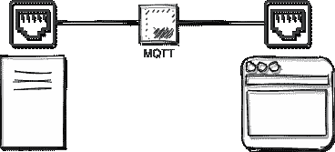

# React 应用程序中 WebSocket 上的 MQTT

> 原文：<https://levelup.gitconnected.com/mqtt-over-websocket-in-a-react-app-35ce96cd0844>



最近，我不得不在一个 React web 应用程序中使用 MQTT over WebSocket 从一个 API 获取实时位置。以下是我的解决方案。我试图让 MQTT 模块尽可能地具有功能性。


约翰·汤纳在 [Unsplash](https://unsplash.com?utm_source=medium&utm_medium=referral) 上拍摄的照片

# MQTT 服务模块

我用过 mqtt npm 包，你可以用 **npm install mqtt** 命令来安装。这是我创建的 MQTT 模块:

```
import mqtt from "mqtt";const websocketUrl = "wss://<SERVER-ADDRESS>:443/mqtt";
const apiEndpoint = "<API-ENDPOINT>/";function getClient(errorHandler) {
  const client = mqtt.connect(websocketUrl);
  client.stream.on("error", (err) => {
    errorHandler(`Connection to ${websocketUrl} failed`);
    client.end();
  });
  return client;
}function subscribe(client, topic, errorHandler) {
  const callBack = (err, granted) => {
    if (err) {
      errorHandler("Subscription request failed");
    }
  };
  return client.subscribe(apiEndpoint + topic, callBack);
}function onMessage(client, callBack) {
  client.on("message", (topic, message, packet) => {
    callBack(JSON.parse(new TextDecoder("utf-8").decode(message)));
  });
}function unsubscribe(client, topic) {
  client.unsubscribe(apiEndpoint + topic);
}function closeConnection(client) {
  client.end();
}const mqttService = {
  getClient,
  subscribe,
  onMessage,
  unsubscribe,
  closeConnection,
};export default mqttService;
```

# 开始连接

在app 中，我在 **useEffect** 钩子中启动 MQTT 连接，并将 MQTT 客户端保存在 Redux store 中。函数 **storeError** 来自我的 Redux reducer，它用于存储错误消息，我在创建客户端时将它作为回调函数传递。**回调**功能是将新收到的 mqtt 消息传递给消息处理程序。最后 **useEffect** 钩子返回组件卸载(关闭连接)时要调用的函数。

```
import mqttService from "./path/to/mqttWwebsocket";...
....useEffect(() => {
  const client = mqttService.getClient(storeError);
  storeMqttClient(client);
  const callBack = (mqttMessage) => handleMessage(mqttMessage);
  mqttService.onMessage(client, callBack);
  return () => mqttService.closeConnection(client);
}, []);
...
....
```

# **订阅和退订 MQTT 主题**

我有一个表，用户可以从这个表中选择跟随哪个位置(这将是 MQTT 术语中的主题)。当用户从表中选择不同的行时，应用程序取消订阅旧主题，并订阅新主题。

```
function rowSelectionHandler(newTopic) {
 const topicHasChanged = // Check if I the topic has changed
 const topic = // The current topic
 if (topicHasChanged) {
   mqttService.unsubscribe(mqttClient, topic);
 }
 mqttService.subscribe(mqttClient, newTopic, storeError);
}
```