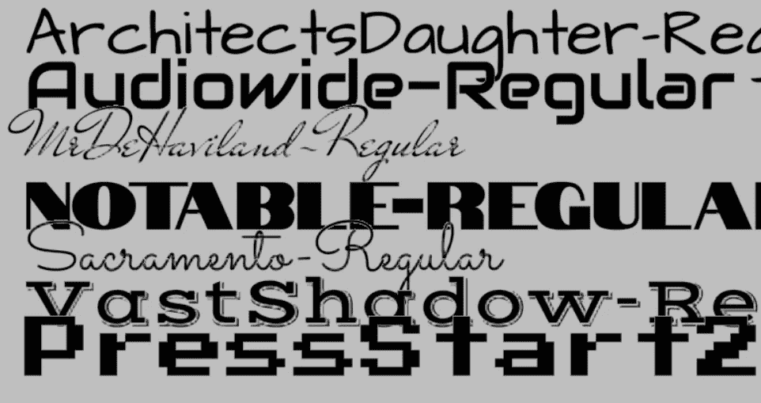
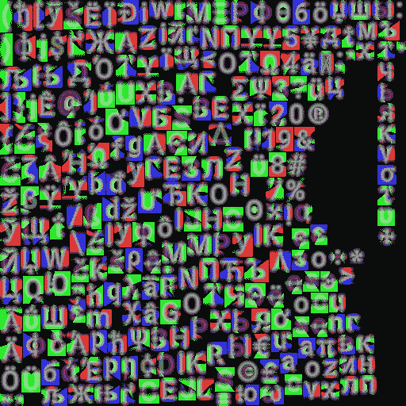
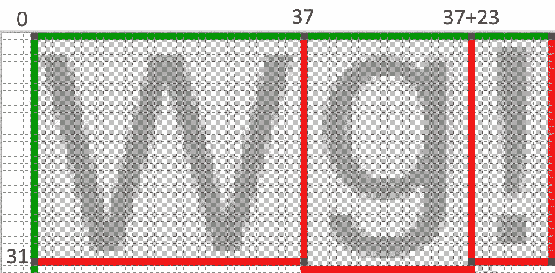
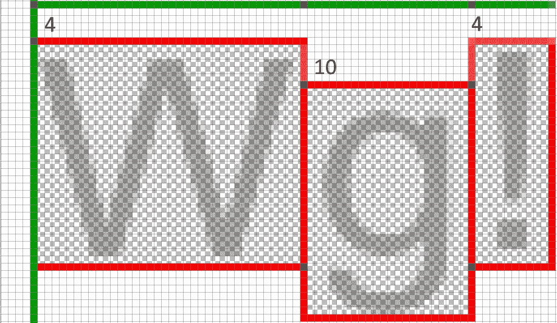
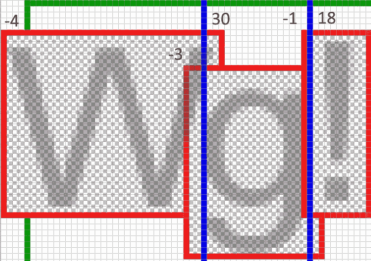
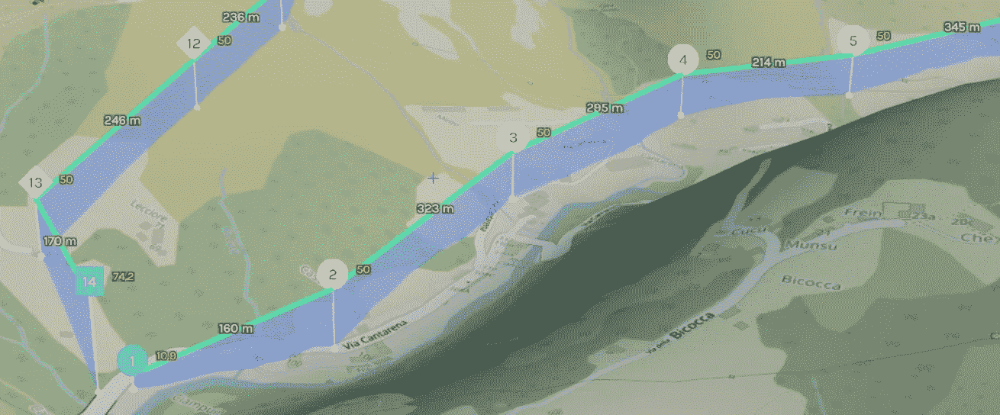

# 基于 msdf-bmfont-xml 的 web GL MSDF 文本渲染

> 原文：<https://levelup.gitconnected.com/msdf-font-rendering-in-webgl-91ce192d2bec>

[此处举例](https://openglobus.org/examples/fonts/fonts.html)

我使用 msdf-bmfont-xml 工具为 msdf 生成字体集和渲染纹理，这样标签看起来更漂亮！它得到了 [msdf-bmfont-xml](https://github.com/soimy/msdf-bmfont-xml) 工具的帮助，该工具用于生成字体图集和渲染多通道有符号距离场(msdf)纹理。



【https://openglobus.org/examples/fonts/fonts.html】例子链接:T4

[msdf-bmfont-xml](https://github.com/soimy/msdf-bmfont-xml) 允许你从 ttf 字体生成各种纹理图谱。在我们的例子中，atlas 纹理是一个多通道有符号距离场，与原始有符号距离场形成对比，它呈现字母的锐角。

在这篇文章中，我想告诉你什么是字母存储图集，以及如何使用 WebGL 显示文本。

## 纹理图谱 [msdf-bmfont-xml](https://github.com/soimy/msdf-bmfont-xml)

字体纹理图册是一种纹理，上面保存有符号图像。每张图片都有对应的纹理坐标。



roboto-512 x512 的常规字体图册图像

为了创建地图集，我使用了以下命令:

```
msdf-bmfont.cmd — reuse -i .\charset.txt -m 512,512 -f json -o %1.png -s 32 -r 8 -p 1 -t msdf %1
```

其中%1 —是 ttf 字体文件的名称，charset.txt —是一个包含一组符号的文件，地图集就是为这些符号构建的，其余的参数您可以在 [msdf-bmfont-xml](https://github.com/soimy/msdf-bmfont-xml) 的官方存储库页面上找到。

如果运行命令成功，将创建几个文件。我们对 png 图集纹理和 json 图集描述感兴趣。

在 [msdf-bmfont-xml](https://github.com/soimy/msdf-bmfont-xml) 中，符号的所有信息都存储在 chars 部分，例如字母***【q】*(上图中的**)的坐标为 ***x = 131，y = 356，宽度= 22，高度= 32，*** ，即左上角的坐标为***【131，356】***，右下角的坐标为所以，如果字体图像有 512×512 像素大小，那么纹理坐标中的***【q】***字母分别是***【131/512，356/512】***和***【153/512，388/512】***。如果我们将这些纹理坐标应用到绘制矩形的着色器，那么我们将在这个矩形中看到我们的符号。最重要的是，我们知道字形(或符号)的宽度和高度，这允许我们设置矩形的大小，使符号看起来比例正确。

```
*{
    id: 113,
    char: “q”,
    width: 22,
    height: 32,
    xoffset: -3,
    yoffset: 11,
    xadvance: 18,
    x: 131,
    y: 356,
    ...
}*
```

字符串中字符定位的其他重要参数有:

**xoffsеt** —字符的水平偏移量，以像素为单位

**yooffset**—字符垂直偏移，以像素为单位

**xadvance** —字形宽度；从字形的左边界到该行下一个字符开始的距离

此外，glyph 有 **id** ，它标识水平字距表中的一个字母。字距调整—是两个特定字母之间的距离。

# 示例:显示文本“Wg！”对于 Arial 字体

字形参数:

```
W: **width**: 37, **height**: 31, **xoffset**: -4, **yoffset**: 4, **xadvance**: 30g: **width**: 23, **height**: 32, **xoffset**: -3, **yoffset**: 10, **xadvance**: 18! : **width**: 11, **height**: 31, **xoffset**: -1, **yoffset**: 4, **xadvance**: 9
```

坐标原点在左上角，最初字形位于一条线上(下图中上方的绿线)，根据**宽度**参数，每个字形在该线上有自己的位置。



下图显示了根据 **yoffsset** 参数，字符相对于水平(中心)轴的垂直偏移。



蓝色线条显示 **xadvance** 参数(到该行下一个字符的距离)，每个字符也根据参数 **xoffset** 水平移动。



可以认为当前版本已经准备好了，但是，为了获得最佳质量，您应该应用字距调整选项，即两个特定字符相对于彼此的偏移量。在这个例子中，我没有显示字距调整；显示文本时， **xoffset** 参数会考虑字距调整。

## MSDF 文本渲染

通过调用 drawArrays 函数将每个字形绘制为正方形，其中输入缓冲区是数组的顶点缓冲区:

```
vec2 a_vertices = [0, 0, 0, -1, 1, -1, 1, -1, 1, 0, 0, 0]
```

构建字体集时，基本字符参数将被规范化:

```
**imageSize** = 512; //Atlas image texture size **nWidth** = **width** / imageSize; *//normalized glyph width*
**nHeight** = **height** / imageSize; *//normalized glyph height*
**nAdvance** = **xadvance** / imageSize; *//*normalized glyph size to the next character in the line
**nXOffset** = **xoffset** / imageSize; *//*normalized horizontal offset
**nYOffset** = 1.0 — **yoffset** / imageSize; *//*normalized vertical offset
```

## GLSL 片段着色器

[链接到源代码](https://github.com/openglobus/openglobus/blob/master/src/og/shaders/label.js)

```
**Vertex shader:***...*vec2 v = screenPos + (a_vertices * a_gliphParam.xy + a_gliphParam.zw + vec2(advanceOffset, 0.0)) * a_size;*Где:****screenPos*** *- screen space string coordinates* ***a_vertices*** *- quad vertices* ***a_gliphParam*** *- glyph metrics, where:* ***x*** *- nWidth,* ***y*** *- nHeight,* ***z*** *- nXOffset,* ***w*** *- nYOffset* ***advanceOffset*** *- total offset by nAdvance, for each next glyph in the string* ***a_size*** *- screen space font size in pixels***Fragment shader:**...const float imageSize = 512.0;
const float distanceRange = 8.0;layout(location = 0) out vec4 outScreen;float median(float r, float g, float b) {
    return max(min(r, g), min(max(r, g), b));
}float getDistance() {
    vec3 msdf = texture(fontTexture, v_uv).rgb;
    return median(msdf.r, msdf.g, msdf.b);
}void main () {
    vec2 dxdy = fwidth(v_uv) * vec2(imageSize);
    float dist = getDistance() + min(v_weight, 0.5 – 1.0 / DIST_RANGE) — 0.5;
    float opacity = clamp(dist * distanceRange / length(dxdy) + 0.5, 0.0, 1.0);

    outScreen = vec4(v_rgba.rgb, opacity * v_rgba.a);
}*Где:****fontTexture*** *- font atlas texture* ***v_weight*** *- glyph weight from 0 to 1, for outline. By default is 0\. Outline is rendered first pass with v_weight value.* ***v_uv*** *- texture coordinates of glyph in font atlas* ***v_rgba*** *- цвет символа или окантовки*...
```

我希望我已经足够清楚地解释了如何使用字体集，以及如何在我的项目中使用[**msdf-BM font-XML**](https://github.com/soimy/msdf-bmfont-xml)**。这种方法显著提高了地图上文本标注的质量。**

****

**使用 openglobus 库的 Microavia UAV 航路规划编辑器示例**

**请在评论中写下你用什么来渲染字体，以及你认为如何提高文本标签的质量？**

**有问题可以在 [**openglobus**](https://openglobus.org) 论坛[https://groups.google.com/forum/#!forum/openglobus](https://groups.google.com/forum/#!forum/openglobus)上提问，我一定会回答！**

**干杯！**

## **有用的来源:**

**[](https://github.com/Chlumsky/msdfgen) [## Chlumsky/msdfgen

### 这是一个用于从矢量形状和字体字形中生成带符号距离场的实用程序，用作纹理…

github.com](https://github.com/Chlumsky/msdfgen) [](https://github.com/soimy/msdf-bmfont-xml) [## soimy/msdf-bmfont-xml

### 将. ttf 字体文件转换为多通道有符号距离字段，然后输出打包的 spritesheets 和 xml(.fnt}或…

github.com](https://github.com/soimy/msdf-bmfont-xml) [](https://learnopengl.com/In-Practice/Text-Rendering) [## 文本渲染

### 在你的图形冒险的某个阶段，你会想要在 OpenGL 中绘制文本。与你可能期望的相反…

learnopengl.com](https://learnopengl.com/In-Practice/Text-Rendering) [](https://github.com/openglobus/openglobus) [## openglobus/openglobus

### OpenGlobus 是一个 javascript 库，用于显示交互式 3d 地图和行星，包括地图拼图、图像和…

github.com](https://github.com/openglobus/openglobus)**