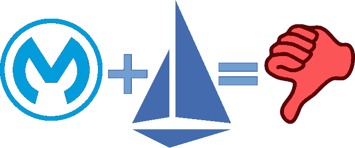
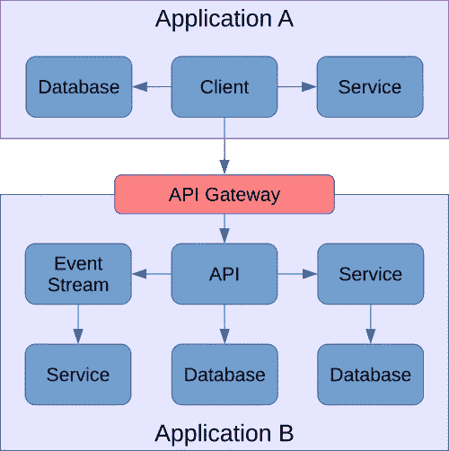
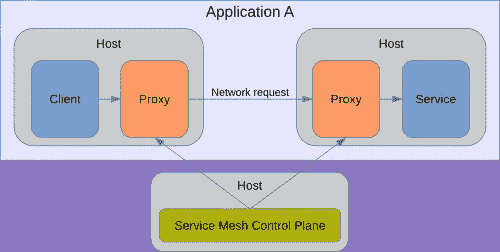

# MuleSoft 错过了任何一点服务网格的标志

> 原文：<https://levelup.gitconnected.com/mulesoft-misses-the-mark-with-anypoint-service-mesh-f7c49e07fde9>

Mule Connect 2020 虚拟会议已经结束，我们听到了 MuleSoft 对服务网格愿景的更多细节，它表明即使是集成的市场领导者也可能不时错过目标。让我们来看看 MuleSoft 对 Anypoint 服务网格的愿景，并探索为什么他们对这一工具的愿景不是您应该接受的。

# 任意点服务网格

我从 Anypoint 服务网格的描述中获得的关键信息是，您可以将它指向您的 Istio 实例，无论是您自己的还是由 Mule 管理的，然后您可以在 Mule 中管理 Istio 微服务。这使得 Mule 的 API 管理的所有特性都可以应用到您的 Istio 微服务中，包括:

*   通过 Mule Exchange 的可发现性，最大限度地提高您的微服务在整个企业中的重用性，并使其他团队能够轻松请求访问您的微服务。
*   通过 API 密钥进行识别，可用于跟踪、安全等。
*   应用策略，如速率限制 SLA。

危险信号应该是这显然不是一个实际的服务网格。它是一个 API 管理工具，名称中带有“服务网格”字样；Istio 仍然是实际的服务网格。

此外，Istio 已经提供了安全、跟踪、流量策略执行等功能。为什么我要在 Istio 上放置 Mule 来做 Istio 已经在做的事情？

这使得第一个要点成为 Anypoint 服务网格的唯一价值主张:可发现性和跨企业的最大化重用。问题是这是微服务的反模式，所以 MuleSoft 鼓励我们实现比 monolith 更糟糕的东西。要理解为什么这是一个可怕的想法，我们必须回忆一下微服务和领域驱动设计的价值主张。

# 微服务—重用不是目标

微服务的目标是提高团队在无服务器环境中交付变更和改进可伸缩性的速度。这是因为它们具有这些特征:

*   微服务是**紧范围的**和**松耦合的**。这允许开发团队更快地进行更新，因为他们不会被依赖关系的网络所阻碍，这些依赖关系可能会破坏他们的变更。
*   微服务是**独立可部署**和**独立可扩展**。这允许应用程序中特定组件的灵活性，而在过去，如果一个整体应用程序的一个组件不堪重负，您必须扩展整个整体的新实例，包括没有不堪重负的组件。

这是 MuleSoft 出错的松散耦合部分。微服务应该是应用程序的私有内部组件，而不是它的一级公共接口。你可以把微服务想象成类和私有库对于 monoliths。这不是一个完美的类比，但足够接近了。想象一下，如果您将您的所有类及其所有成员公开，供整个企业中的每个人重用，并创建一个鼓励这种重用的目录，情况会怎样？这将是“松散耦合”的反义词

为了了解这一点，想象一下如果您的微服务在整个企业中有一个依赖关系网络。您的团队对微服务进行更改的速度有多快？向后兼容变更的回归测试将会很大，但是如果你需要打破接口，那么你现在有一个相当重要的工作要做，需要整个公司的编码人员和测试人员。动作太快了！

# 领域驱动设计

我们从[域驱动设计](https://martinfowler.com/bliki/DomainDrivenDesign.html)中获得了对适当的微服务设计的更好的见解，特别是它的[有界上下文的概念](https://martinfowler.com/bliki/BoundedContext.html)。有界上下文的概念是，在你的业务中存在应该被分离的断层线。一个有界的上下文可能与一个应用程序或一系列相关的应用程序相关，但是您不希望一个应用程序跨越两个有界的上下文。

例如，考虑一家书店。在仓库的上下文中,“书”可以具有标题、作者、UPC 代码、库存计数、重量、批发价格和交付目的地。在零售店的环境中，重量、批发价和送货目的地的概念是不相关的。相反，零售店关心的是流派和零售价格，这两者都与仓库无关。尽管仓库和零售商店都有“书”的概念，但是仓库业务单位和零售业务单位如何看待“书”的概念是不同的。因此，为仓库提供的服务可能不应该与为零售店提供的服务混合在一起，以免您最终得到一个“书”的定义，它结合了两个领域对书的不同和不兼容的观点。

当应用于微服务时，一般的规则是微服务应该*而不是*在其有界上下文的范围之外可访问。否则，它就不再是紧范围和松耦合的了。一个微服务既知道仓库对一本书的定义，也知道零售店对一本书的定义，相反，它的范围是松散的，并且在两个上下文之间是紧密耦合的。现在，支持仓库业务部门的 IT 团队无法在不影响零售业务部门的情况下做出快速改变，反之亦然。

# 理想建筑

让我们区分两种类型的服务流量:南北向和东西向。

有界环境中的流量称为东西向流量。在两个有界上下文之间流动的流量称为南北流量。这些的需求差别很大。

南北流量是我们大多数人习惯的传统 API 模型。一个团队管理 API 服务器端点，而无数其他团队(如果不是外部合作伙伴和客户)管理客户端端点。

南北流量通过 API 网关跨越应用程序或上下文边界。

API 管理工具的出现有助于 API 服务团队通过 API 网关支持和保护这些端点，并管理 API 目录门户等 API 客户端体验。当目标是为任何数量的未来未知客户创建一个接口，并管理您与这些客户的关系时，这种方法非常有效。这是 MuleSoft 擅长的。

东西向流量要么是同一应用程序的两个模块之间的连接，要么至多是同一有界上下文内的相关应用程序之间的连接。这意味着它们都由同一个运营支持团队提供支持，或者如果应用程序对一个团队来说太大，最多由同一个 IT 部门提供支持。

东西向流量连接一个应用程序或上下文范围内的组件。

与 API 不同，所有这些连接的客户端和服务器端点都属于同一个团队或部门。因此，服务网格应运而生，通过由 Istio 等控制平面管理的 Envoy 等代理，帮助这些团队管理和保护这些东西向连接的两个端点。

将单一应用程序分解为微服务的一个关键点是，通过与其他服务松散耦合，团队可以更快地做出更改。理想情况下，团队不会因为这种松散耦合而对其微服务进行重大更改。但如果他们这样做了，他们就拥有了客户，所以他们也改变了客户。完成了。想象一下，用分布在企业和业务合作伙伴中的 API 来服务各种各样的客户！**当您公开您的微服务供您的企业使用时，您已经消除了微服务的核心价值主张:支持快速变化的松散耦合。**

这是 MuleSoft 忽略的关键点。微服务的价值主张不是复用！它是敏捷性和可伸缩性。成功实现微服务架构面临着巨大的挑战，这导致许多 IT 部门不投资于此，认为挑战大于收益。因此，重要的是你要收获这些好处，以免你最终得不偿失。**如果你听从 MuleSoft 的建议，你最终将面临微服务的所有挑战，而收益却微乎其微！**

# 更好的多媒体视觉

MuleSoft 擅长两件事:API 管理和企业应用集成。这两者都存在于有界的上下文之间。API 是允许一个有界上下文调用另一个的公共接口。企业应用集成(DataWeave、MuleSoft 连接器等。)构建编排来进一步帮助隔离两个有界的上下文。这就是整合，也是 MuleSoft 已经并将继续引领的方向。

MuleSoft 属于应用程序之间，而不是应用程序内部。

MuleSoft 在 Anypoint 服务网格中似乎缺少的是微服务不是集成。在我们的 monoliths 中，我们编译了函数和调用栈。我们用微服务取代了(一些)功能，用网络取代了调用栈。不变的是，一个功能和微服务都代表了一个应用的内部构成，而不是应用之间的集成。

MuleSoft 需要坚持他们最擅长的:整合。