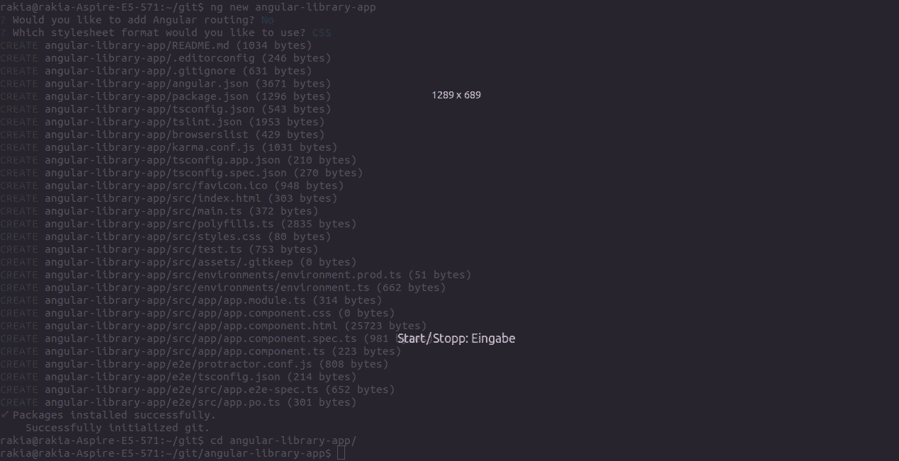
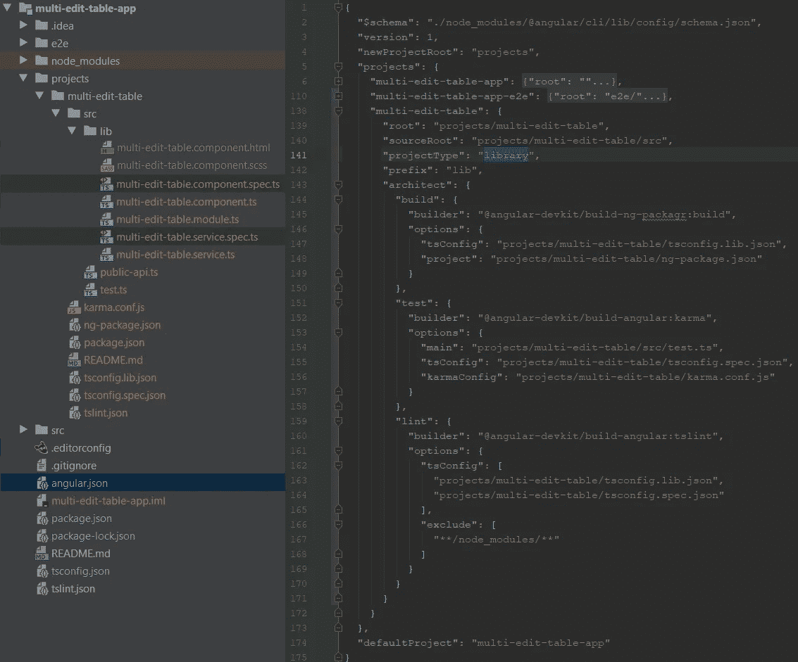
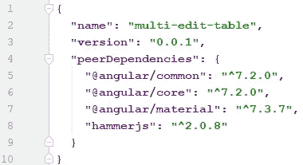
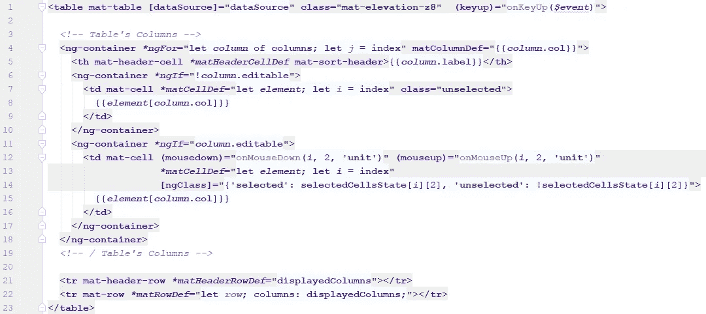
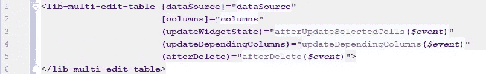
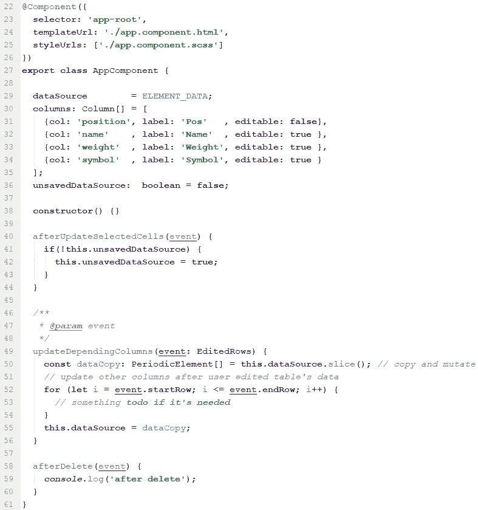
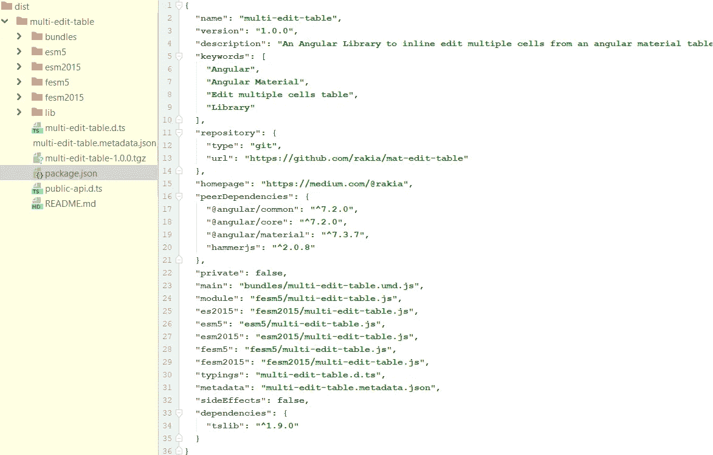
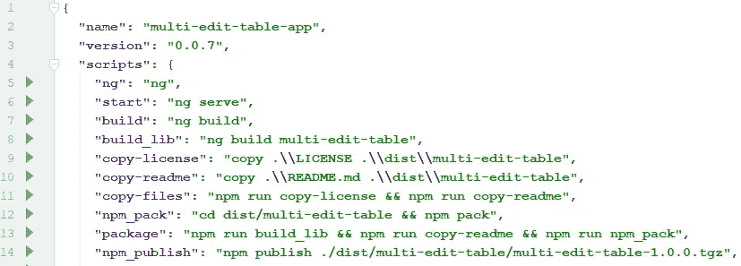
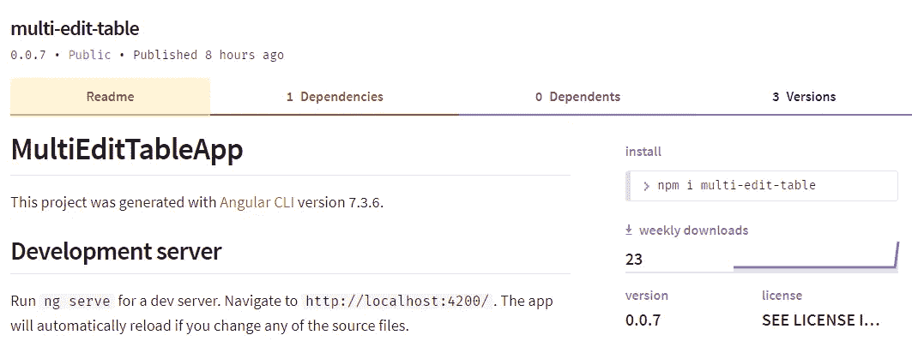

# 如何用 NodeJS 创建角度库

> 原文：<https://levelup.gitconnected.com/multi-edit-table-export-as-an-angular-library-40b37e773fd3>

## [网页开发](https://rakiabensassi.medium.com/list/software-engineering-7a179a23ebfd)

## 使用 npm 发布导出角度材料表


Paul Esch-Laurent 在 [Unsplash](https://unsplash.com?utm_source=medium&utm_medium=referral) 上的照片

*你可以在 Udemy 上查看我的* ***视频课程****:*[*如何识别、诊断、修复 Web Apps 中的内存泄漏*](https://www.udemy.com/course/identify-and-fix-javascript-memory-leaks/) *。*

在上一篇文章中，我已经创建了一个[角度材料表，带有类似 Excel](https://medium.com/javascript-in-plain-english/angular-material-table-with-edit-function-like-excel-7c2c53332553) 的内嵌编辑功能。在这篇文章中，我将用 NodeJS 将它发布为 angular 库，这样就可以像在其他 angular 应用程序中安装任何其他 npm 包一样重用它。这对于避免重复代码和维护代码 n 次非常有帮助。一个典型的用例是[认证层](https://medium.com/swlh/sso-with-spnego-and-kerberos-8794f8ad5162)的实现。不用在不同的 angular 应用程序中复制/粘贴相同的源代码，您只需将 auth-component 和 auth-service 导出为 Angular 库，并像使用其他 npm 包一样重用它。

[](/a-day-in-the-life-of-a-software-engineer-cb817cf13d0) [## 自由软件工程师的一天

### 在家工作和与 scrum 团队合作是什么样子的

levelup.gitconnected.com](/a-day-in-the-life-of-a-software-engineer-cb817cf13d0) 

## 入门指南

让我们创建一个新的角度项目:

```
ng new multi-edit-table-app
cd multi-edit-table-app
```

并使用 Angular CLI 通过以下命令生成新的库框架:

```
ng generate library multi-edit-table
```



生成角度库

这将在我们的工作区中创建`projects/multi-edit-table`文件夹，其中包含 NgModule 中的一个组件和一个服务。工作空间配置文件`angular.json`将被更新为“库”类型的项目。`/src`文件夹下的源代码扮演着托管 angular 应用程序的角色，该应用程序正在使用我们的库。



源代码结构

## 生成库组件

为我们的库生成组件时，我们使用`--project`标志告诉 Angular CLI 我们希望它在我们的库项目中生成组件:

```
ng generate component multi-edit-table --project=multi-edit-table
```

文件`multi-edit-table.comoponent.html, multi-edit-table.comoponent.scss,` `multi-edit-table.comoponent.ts,...`将被添加到`projects/multi-edit-table/src/lib/multi-edit-table`文件夹，但是我把那些文件移到了父文件夹`projects/multi-edit-table/src/lib`，因为它是这个库中唯一的组件。

我们必须替换那些文件的内容 *(*。html，*。scss 和*。ts)* ，内容为`app.comoponent.html`、`app.comoponent.scss` 和`app.comoponent.ts`，来自[最后一个帖子](https://medium.com/@rakia/angular-material-table-with-edit-function-like-excel-7c2c53332553) ( [Github](https://github.com/rakia/mat-edit-table) )。

[](https://medium.com/better-programming/angular-keyboard-listeners-good-practices-b208edc6bf89) [## Angular 中的可访问性——良好实践和缺陷

### 关于键盘监听器的 5 个案例研究

medium.com](https://medium.com/better-programming/angular-keyboard-listeners-good-practices-b208edc6bf89) 

## 将组件添加到条目文件中

正如您所注意到的，我们的库项目有一个**入口文件**，它定义了它的公共 API:
`projects\multi-edit-table\src\public_api.ts`

我们需要在**条目文件**中添加以下几行，告诉[ng-packar](https://github.com/ng-packagr)这个组件类应该向我们库的用户公开(***ng-packar***是一个打包 Angular 库的解决方案，它是 Angular CLI 的一部分):

```
**export** * **from './lib/multi-edit-table.service'**;
**export** * **from './lib/multi-edit-table.component'**;
**export** * **from './lib/multi-edit-table.module'**;
```

然后安装以下依赖项:

```
npm install @angular/material
npm install @angular/cdk
npm install hammerjs
```

[](https://medium.com/better-programming/angular-dynamic-layout-with-ngtemplate-8b6faa995a8f) [## 角度动态模板:如何建立一个有 3 种布局风格的应用

### Angular ngTemplateLayout 的高级用例

medium.com](https://medium.com/better-programming/angular-dynamic-layout-with-ngtemplate-8b6faa995a8f) 

并更新`projects/multi-edit-table/**package.json**:`中的 ***对等依赖***



`projects/multi-edit-table/package.json`

当我们创建一个角度库[时，我们的工作空间中至少有 3 个 **package.json**](https://blog.angularindepth.com/the-angular-library-series-publishing-ce24bb673275) 文件:

*   **Workspace Root package . JSON:**主`package.json`文件在我们的 Workspace 的根目录下。
*   **Library Project package . JSON:**`projects/multi-edit-table`**目录，告诉`**ng-packagr**`我们的库将发布的发行版`package.json` 包含哪些信息。**
*   ****Library Distribution package . JSON:**由`dist/multi-edit-table` 目录下的**ng-packar**生成。我们图书馆出版的是`package.json`。**

**我们现在必须导入 angular 主题，将下面一行添加到`projects/multi-edit-table/src/lib/**multi-edit-table.component.scss**`:**

```
@import “~@angular/material/prebuilt-themes/indigo-pink.css”;
```

**[](https://medium.com/better-programming/typescript-new-release-19f1238c6a68) [## TypeScript 4.1 有什么新功能？

### 递归条件类型、React 的 JSX 工厂以及新的 TypeScript 版本中的更多特性

medium.com](https://medium.com/better-programming/typescript-new-release-19f1238c6a68) 

由于 MultiEditTableComponent 将从组件*(在我们上一个 Angular 应用程序中)*变为库的一部分，我们需要添加`Column` 接口，并且我们必须通过使用`@Input`和`@output`来更改一些属性和方法，以提高其可重用性:

```
**export interface Column** {
  **col**:       **string**;
  **label**:     **string**;
  **editable**?: **boolean**;
}
**export interface** EditedRows {
  **startRow**: **number**;
  **endRow**:   **number**;
}
**export interface** EditedCell {
  **rowId**:     **number**;
  **colId**:     **number**;
  **cellsType**: **string**;
  **newValue**:  **string**;
}@Component({
  **selector**: **'lib-multi-edit-table'**,
  **templateUrl**: **'./multi-edit-table.component.html'**,
  **styleUrls**: [**'./multi-edit-table.component.scss'**]
})
**export class** MultiEditTableComponent **implements OnChanges** {

  @Input() **dataSource**;
  @Input() **columns**: Column[];
  @Output() **updateDependingColumns** = **new** EventEmitter<EditedRows>();
  @Output() **updateCell** = **new** EventEmitter<EditedCell>();
  @Output() **afterDelete** = **new** EventEmitter<**void**>();
  **displayedColumns**: **string**[]; ngOnChanges(changes: SimpleChanges): **void** {
    **if**(changes.columns) {
      **this**.**displayedColumns** = **this**.**columns**.map((column: Column) => column.**col** );
      **this**.**LAST_EDITABLE_COL** = **this**.**displayedColumns**.**length** - 1;
    }
  }
```

[](https://medium.com/better-programming/javascript-history-and-future-71b0ceb737aa) [## JavaScript 的 25 年

### 从简单的脚本语言到每个现代 web 应用程序的基础

medium.com](https://medium.com/better-programming/javascript-history-and-future-71b0ceb737aa) 

更新`multi-edit-table.component.html`:



multi-edit-table.component.html

和`app.component.html`一样如下:



app.component.html

这里是输入和输出——库所要求的——以及在`app.component.ts`中声明的样子:



应用程序组件

现在，我们可以使用 Angular CLI 命令来构建、测试和 lint 项目:

```
ng build multi-edit-table
ng test multi-edit-table
ng lint multi-edit-table
```

构建完库之后，发行版`package.json`如下所示:



分发包. son

## 在 [npm](https://www.npmjs.com/) 上发布我们的 Angular 库

我不打算深入探讨这个问题，但是 Todd Palmer 在这篇不错的文章中解释了关于在 npm 上发布 angular 库的更多细节。

为了能够发布一个包，我们需要为[注册一个 npm 账户](https://www.npmjs.com)。如果您已经有了一个 npm ***企业概要文件*** ，那么您可以为不同的注册表创建第二个概要文件，例如 ***public*** npm 注册表。要为一个 ***开源概要文件*** 设置[公共注册表](https://docs.npmjs.com/configuring-your-registry-settings-as-an-npm-enterprise-user)，需要运行以下命令:

```
npm config set registry https://registry.npmjs.com
```

然后，您可以登录 npm:

```
npm login
```

这将提示我们输入 npm 凭据和电子邮件。最后，我们准备发布我们的库(打包在**中)。tgz** 文件)通过运行 ***包******发布*** 任务:

```
npm run **package**
npm publish ./dist/multi-edit-table/multi-edit-table-1.0.0.tgz
```

***package*** npm 任务是一个定制任务，我们需要将它添加到我们工作区根目录下的主`package.json`文件中:



package.json 中的新任务

Npm 允许我们发布一次特定的**名称和版本**组合。因此，每次我们想要在 npm 上发布库的更新时，我们都需要更改版本。已发布的软件包可通过以下网址在 npm 上获得:
https://www.npmjs.com/package/multi-edit-table



npm 上的多编辑表

如果您想在项目中使用它，只需运行:

```
npm install **multi-edit-table**
```

🧠💡我为一群聪明、好奇的人写关于工程、技术和领导力的文章。 [**加入我的免费电子邮件简讯，独家获取**](https://rakiabensassi.substack.com/) 或在此注册 Medium。

*你可以在 Udemy 上查看我的* ***视频课程****:*[*如何识别、诊断、修复 Web Apps 中的内存泄漏*](https://www.udemy.com/course/identify-and-fix-javascript-memory-leaks/) *。*

[](https://medium.com/javascript-in-plain-english/promise-vs-observable-vs-stream-165a310e886f) [## 承诺、可观察和流之间有什么区别？

### 现代编程中的三种风格](https://medium.com/javascript-in-plain-english/promise-vs-observable-vs-stream-165a310e886f) [](/learning-velocity-and-coding-standards-10952f6c9640) [## 为什么编码标准很重要，以及如何衡量开发速度

### 熟悉一个新项目需要多长时间

levelup.gitconnected.com](/learning-velocity-and-coding-standards-10952f6c9640)**