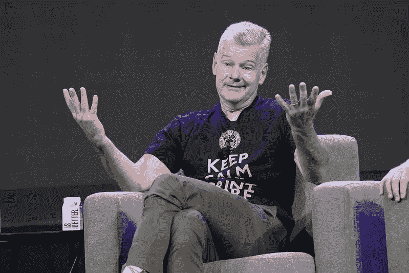

# 一位千万富翁投资者说比特币正在愈合——以下是你应该全押的方式(马克·尤斯科)

> 原文：<https://levelup.gitconnected.com/multi-millionaire-investor-says-bitcoin-is-healing-heres-how-you-should-go-all-in-mark-yusko-26d7f9cfb9a1>

在购买比特币之前，最好考虑使用尤斯科的基金策略。

来源— [马克·尤斯科](https://www.flickr.com/photos/94861732@N04/52195092897/in/photolist-2d3P6W7-23xo6FH-2cKXZBZ-23xo5d2-23xo7q8-2n2HsCR-4xWE2m-2nwiuEM-2nwoJZK-2dpK8SK-2nwq1fP-2nwranq-2nwradh-2nwq1o9-2nwoJEr-2nwq1eb-2nwq1jS-2nwq1cH-2nwiui4-2nwoErE) — Flikr

马克·尤斯科因共同创立摩根克里克资本管理公司而闻名。

Yusko 是一名投资者、对冲基金经理和比特币支持者。他认为，比特币已经并正在取代黄金，是一种更好的价值储存手段。

尤斯科认为，从长远来看，很少有加密资产能够存活下来。

将只有少数协议的空间，但对于每一个成功的硬币，成千上万的将无法生存，他说大多数是完全无用的，像 Dogecoin。

他将这些令牌视为没有潜在价值或用例的实用令牌，并将最终消失。

根据 Yusko 的说法，比特币是加密货币领域的黄金标准和基础。

> 马克·尤斯科:
> 
> “是的，有几个协议存在的空间，但成千上万的硬币和狗币在这一类别中是无用的。”

Yusko 表示，对于早期采用者来说，比特币和区块链将比 Web1 和 Web2 产生更多的财富。这种财富是任何人都没有见过的。

Yusko 表示，对于机构投资者来说，比特币是一种数字形式的黄金，但比顶级贵金属更有用。

他建议客户将投资组合的 1%投资于比特币，3%至 5%投资于使用该技术的区块链初创企业。

他预计比特币在 2023 年的表现将好于其他加密货币，并指出，最重要的财富总是由早期投资者创造的，他们比大众更早相信和理解一些东西。

> 马克·尤斯科
> 
> “最重要的财富是由创新的早期投资者创造的。
> 
> 做这样的投资需要在大多数人理解它之前相信它。
> 
> 你会因为你的非一致行动而被嘲笑、奚落和批评。
> 
> 值得！"

# **你不能禁止比特币**

作为一名基金经理，尤斯科对风险管理有很强的理解，他说你不能禁止比特币。

Yusko 多年来一直说，人们认为政府可以禁止比特币，但他还没有看到这是如何可能的，因为协议是分散和分布式的。

所以完全禁止不太可能。

他表示，这些机构可以通过银行监管和规范交易所，加大进入和离开加密领域的难度。

他用电影《壮志凌云》来解释他的观点。

> 马克·尤斯科:
> 
> “你不能禁止比特币。
> 
> 就像挤压气球里的空气。空气会去别的地方。
> 
> 但监管者可以让入口和出口变得难以驾驭。
> 
> 我是《壮志凌云》的超级粉丝，很棒的电影。
> 
> 你可以派战斧导弹去炸毁机场，对吗？
> 
> 但是马华力找到了在那条短跑道上起飞的方法。
> 
> 我们还是会起飞的。
> 
> 只是银行会轰炸跑道。"

# 你不能一直否认一项不可避免的技术。

马克·尤斯科认为，比特币是一项不可避免的技术，但人们否认这一点，就像他们否认互联网一样。

今天，我们接受互联网是我们日常生活的一部分，但在 2000 年，人们说互联网永远不会比传真机更有用，互联网是一种时尚。

他说，电话公司试图切断互联网，因为他们担心电话会变得免费，从而侵蚀他们的利润。

这就是最终发生的事情。

同样，政府正试图扼杀加密技术，因为比特币攻击了对货币的集中控制。

> 马克·尤斯科:
> 
> “谈到技术，比特币就像互联网一样不可避免
> 
> 我经历了 2000 年和 2001 年，当时每个人都在说，互联网是一个大骗局，它永远不会比传真机更重要。"
> 
> 我听到警报声，“互联网只是一时的时尚，不会存在太久。”
> 
> 我们现在正在使用电话公司试图扼杀的东西(互联网)。
> 
> 就像政府试图通过法规来消灭密码一样。
> 
> 为什么？
> 
> 电话公司不想要竞争。
> 
> 如果你已经在这个空间，你已经赢了。

# 你应该全押比特币，但也许不是一次全押。

尤斯科认为，到 2024 年，比特币可以达到 10 万美元。

他认为，2023 年初，我们将开始看到比特币痊愈。公司破产可能会导致市场的其他崩溃。

没办法知道。

Yusko 说他不是日内交易者，现在也不买比特币。

他的团队一直在问他们什么时候会扣动扳机，但 Yusko 说他会尽可能长时间地克制，看看未来是否会有更多的短期痛苦。

> 马克·尤斯科:
> 
> “我买的是比特币吗？这里的答案是
> 
> 号码
> 
> 我说了很多关于比特币的事情，我每天都会收到团队中其他人的短信。
> 
> 他们问我现在是否可以投资。
> 
> 我的回答；还没有。"

Yusko 说他不是日内交易者，也不指望准确把握市场时机。他说没人能准确把握市场时机。

他说，你应该有耐心，进行更长期的投资，以对冲风险。

Yusko 说，你应该选择一部分你乐意长期投资和购买的收入。

> 马克·尤斯科:
> 
> “我不是日间交易者；我是 DCA 的人。
> 
> 我喜欢平均成本，这个领域的每个人都应该选择一个他们想投资的百分比，1%，2%或 5%，你应该一次只买一些。
> 
> 如果你过一段时间再买的话会有帮助。
> 
> 今天买，明天买，下周买，下个月买，但不要一次买光。"

Yusko 说，他的基金与现代投资组合理论是一致的，在现代投资组合理论中，他只将 20%的资金投资于一个资产类别，投资于一只股票的资金不超过 5%。

他说专注让你富有，但多样化让你富有。

尤斯科建议你遵循他的基金策略来配置你的投资组合。

> 马克·尤斯科:
> 
> “我们基金的运作方式是将 20%的资金投入比特币。
> 
> 我们花了几个月的时间制定了这个计划。
> 
> 我们从 2019 年 3 月开始，到 2019 年 7 月结束，所以我们对比特币的平均入门价格是 4500 美元。
> 
> 我们对每只新基金都遵循同样的策略，并随着时间的推移进行投资。
> 
> 那些基金就是这么运作的，对人们管理风险很有用。

# 最后的想法。

我看到凯文·奥利里在他的投资论文中采用了现代投资组合策略。

在现实中，像马克·尤斯科和奥利里这样的人管理着人们的基金，所以他们必须有卓越的风险管理，并且在市场崩溃的情况下充分分散风险。

对于投资金额较小的小投资者，我认为应该将加密投资集中在几个领域，而不是分散投资。

硬币可以与比特币的表现挂钩，因此如果比特币大幅崩溃，它通常会带走其他较小面值的代币。

尤科斯的建议是永恒的。

他认为比特币是必然的。

就像 2000 年人们争论互联网的用例一样不可避免。

> *如果你想在 Web3 上读到更多我的观点，可以考虑成为会员。你的会员费直接支持你读的作家。如果你用我的链接* [*注册，我会赚一小笔佣金。点击这里*](https://medium.com/@jayden_levitt/membership) *。*

*本文仅供参考；不应将其视为财务、税务或法律建议。在做出任何重大的财务决定之前，你可以咨询财务专家。*