# 多组学数据因子分析

> 原文：<https://levelup.gitconnected.com/multi-omics-analysis-3857956a7a3d>

## 精准医疗中的 AI |[black thorn . AI](https://blackthorn.ai/)

> 此内容受版权保护。
> 所有权利归 Oleksandr(又名 Alex) Gurbych(联系方式: [LinkedIn](https://www.linkedin.com/in/ogurbych/) ， [Gmail](http://gurbycholeksandr@gmail.com) )
> 在 [blackthorn.ai](https://blackthorn.ai/) 查看更多相关案例

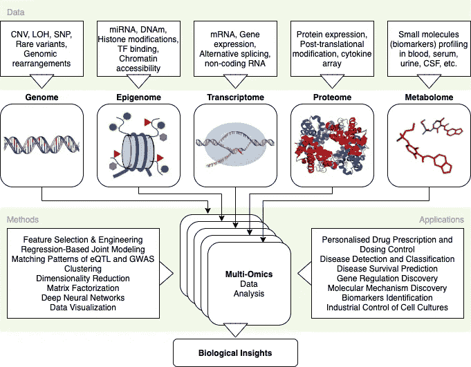

multі-omіcs 的简要图解

# 内容

1.  介绍
2.  数据集描述
3.  安装和进口
4.  模型火车
5.  后加工
6.  方差分解
7.  因子关联分析
8.  因子 1 配置文件
9.  摘要

# 1.介绍

欢迎大家跨越生物科学和人工智能的多学科边界。这是一个关于 multі-omіcs 案例分析的实践教程。

分析是 stаtіstіcs 和 dеscrіbе在观察到的较低维数的іn 变量之间的一种能力。从数学上来说，因子与 b {\\ F3 b {\\ F3 b {\\ F3 b {\\ F3 b {\\ F3 b {\\ F3 b {\\ F3 b {\\ F3 b {\\ F3 b {\\ F3 b }+偏差的组合有关。因子的联合变异(或缩减维度)揭示了以前未知的潜在变量的变化。这种隐变量及其协变量的发现是因子分析的主要目标。

下面的软件栈将被用来从一堆单组学层(观察变量)中挖掘出 ***生物学见解*** (隐藏变量+它们的相关性)，放在一起成为一个*dаtа集合:*

*   *工具: [RStudio](https://www.rstudio.com/) (v1.4)*
*   *语言: [R](https://cran.r-project.org/bin/macosx/)*
*   *框架:[生物导体](http://www.bioconductor.org/install/)(3.12 版) [MOFA](https://biofam.github.io/MOFA2/installation.html) +*

*如果你渴望得到提炼的结论和结果(真正的生物学见解)，跳到**摘要**。*

*欢迎在评论区提问。*

# *2.数据集描述*

*200 名慢性淋巴细胞白血病(CLL)患者队列将用于 multі-omіcs 的样本。CLL 在这里公开可用[。](http://bioconductor.org/packages/release/data/experiment/html/BloodCancerMultiOmics2017.html)*

*CLL 数据集包含 4 个组学: ***基因组学*** (体细胞突变) ***表观基因组学*** (DNA 甲基化) ***转录组学***(RNA-seq)***表型*** (药物反应)。大约 40%的特征值缺失。*

# *3.安装和进口*

*首先安装[生物导体](http://www.bioconductor.org/install/)、 [MOFA](https://biofam.github.io/MOFA2/installation.html) +，以及其他实用程序(ggplot2、tidyverse)*

```
*if (!requireNamespace( "BiocManager", quietly = TRUE ))
    install.packages( "BiocManager" )BiocManager::install( version = "3.12" )
BiocManager**::**install( "MOFA2" )
BiocManager::install( "MOFAdata" )
BiocManager::install( "BloodCancerMultiOmics2017" )
BiocManager::install( "data.table", dependencies=TRUE )
BiocManager::install( "ggplot2", dependencies=TRUE )
BiocManager::install( "tidyverse", dependencies=TRUE )*
```

*然后，导入所需的库:*

```
*library( ggplot2 )
library( tidyverse )library( data.table )
library( MOFA2 )
library( MOFAdata )*
```

*现在，导入 CLL 数据集。数据存储为矩阵列表，特征作为行，样本作为列。*

```
*utils::data( "CLL_data" )       
lapply( CLL_data, dim )*
```

*让我们想象一下我们有+缺失值的行数(特征)和列数(样本)。*

```
*plot_data_overview( MOFAobject )*
```

*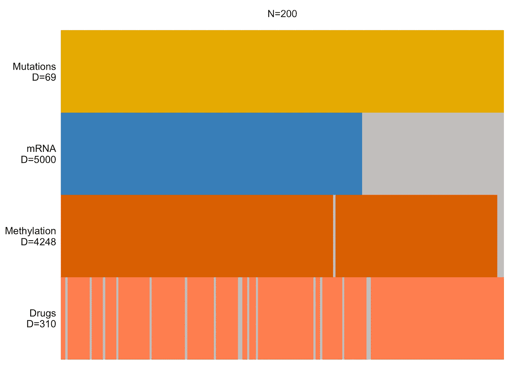*

***D** 参数代表维度(有多少个特征)； **N** 代表样本数(200)；缺少的信息用灰色条表示*

# *4.模特培训*

*首先，创建一个模型对象。目前还没有训练。*

```
*MOFAobject <- create_mofa( CLL_data )*
```

*其次，设置必需的选项。点击阅读更多关于数据选项[的信息；型号选项](https://rdrr.io/github/bioFAM/MOFA2/man/get_default_data_options.html)[此处](https://rdrr.io/github/bioFAM/MOFA2/man/get_default_model_options.html)；关于训练选项[这里](https://rdrr.io/github/bioFAM/MOFA2/man/get_default_training_options.html)。*

```
*data_opts <- get_default_data_options( MOFAobject )model_opts <- get_default_model_options( MOFAobject ) model_opts$num_factors <- 15train_opts <- get_default_training_options( MOFAobject )
train_opts$seed <- 1
train_opts$save_interrupted <- TRUE
train_opts$convergence_mode <- "slow"*
```

*最后准备模型，训练。*

```
*MOFAobject <- prepare_mofa( MOFAobject,
                            training_options = train_opts,
                            model_options = model_opts,
                            data_options = data_opts )
MOFAobject <- run_mofa( MOFAobject, 
              outfile="/Users/ogurb/Downloads/MOFA2_CLL.hdf5" )
saveRDS( MOFAobject, "MOFA2_CLL.hdf5" )*
```

*可能会要求您为 Python 解释器安装 Miniconda。*

*培训以下列结果结束:*

```
*Iteration 908: time=0.44, ELBO=-2850734.58, deltaELBO=0.197 (0.00000100%), Factors=15Converged!*
```

# *5.后加工*

## ****5.1 添加样本元数据****

*元数据存储在一个`data.frame`中。重要栏目:**年龄** —以年为单位的年龄；**死亡** —患者是否死亡(对/错)；**性别** —男性(m)，女性(f)；**在**之后接受治疗——患者是否在**之后接受治疗(**对/错)。*

*您可以从 Bioconductor 包`BloodCancerMultiOmics2017`中加载完整的元数据作为`data("patmeta")`对象。*

```
*# Load sample metadata
CLL_metadata <- fread( "ftp://ftp.ebi.ac.uk/pub/databases/mofa/cll_vignette/sample_metadata.txt" )*# Add sample metadata to the model* samples_metadata( MOFAobject ) <- CLL_metadata*
```

## ****5.2 因素相关性分析****

*为了有一个好的模型，降维(或因子)必须不相关。如果您观察到因子之间存在显著的相互依赖性，您可能使用了太多的因子，或者标准化不够充分。*

```
*plot_factor_cor( MOFAobject )*
```

*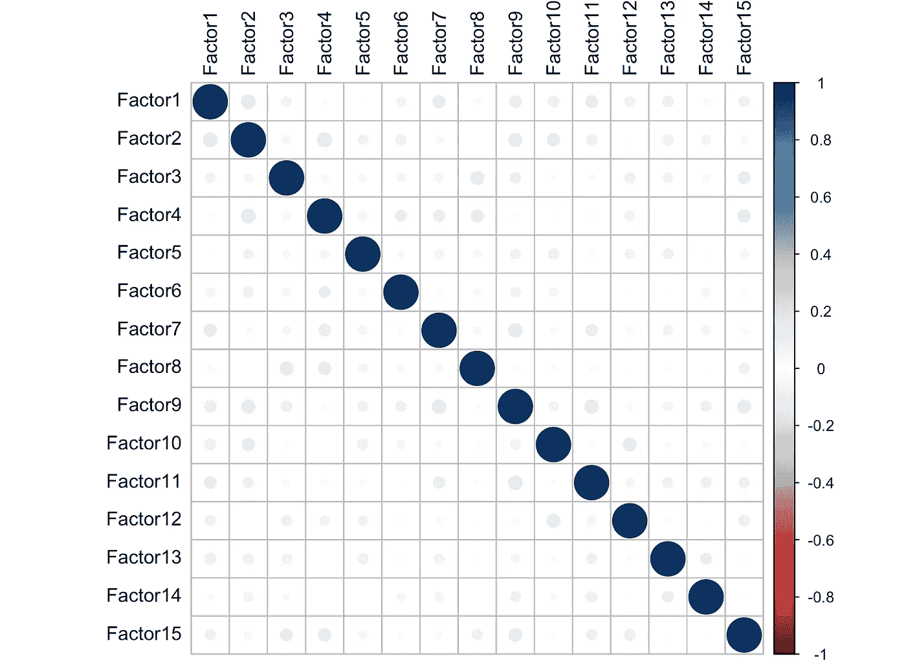*

*这些因素之间没有明显的相关性，我们很好*

## *结论:*

*   *因素显示没有显著的相关性*

# *6.方差分解*

## ****6.1 按因子解释方差分解****

*解释的差异总结了观察到的因素的变化来源。*

```
*plot_variance_explained( MOFAobject, 
                         max_r2=15 )*
```

*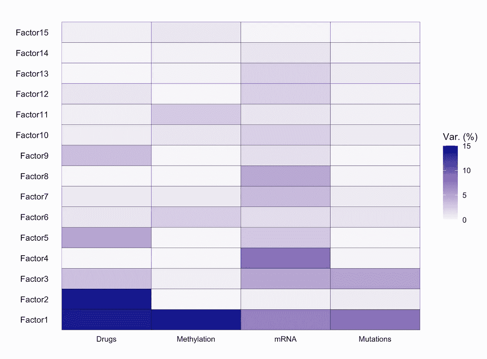*

*按因素和数据形态解释的方差的单一数字(-组学)*

## ***结论:***

*   *因子 1 代表了所有组学模式的高度多样性。看来，它对于疾病的病因是至高无上的。*
*   *因子 2 表达了仅与药物反应相关的非常强的差异。*
*   *因子 3 保留了所有组学的差异，除了表观组学。*
*   *因子 4 具有中等的 mRNA 方差。*
*   *因子 5 显示了药物反应和 mRNA 之间的相互依赖性。*

*我们将省略其他成分，因为它们的方差表示得更差。*

## *6.2 每个组学的解释差异*

*解释方差是数学模型考虑数据集变化(或分散)的比率。解释方差是模型总方差的一部分，由实际存在的因素解释，而不是由误差方差引起的。*

*方差的百分比越高，表明相关性越强。这也意味着你能做出更好的预测。*

*让我们计算每个数据形态的解释变量:*

```
*plot_variance_explained( MOFAobject,
                         plot_total = T )[[2]]*
```

*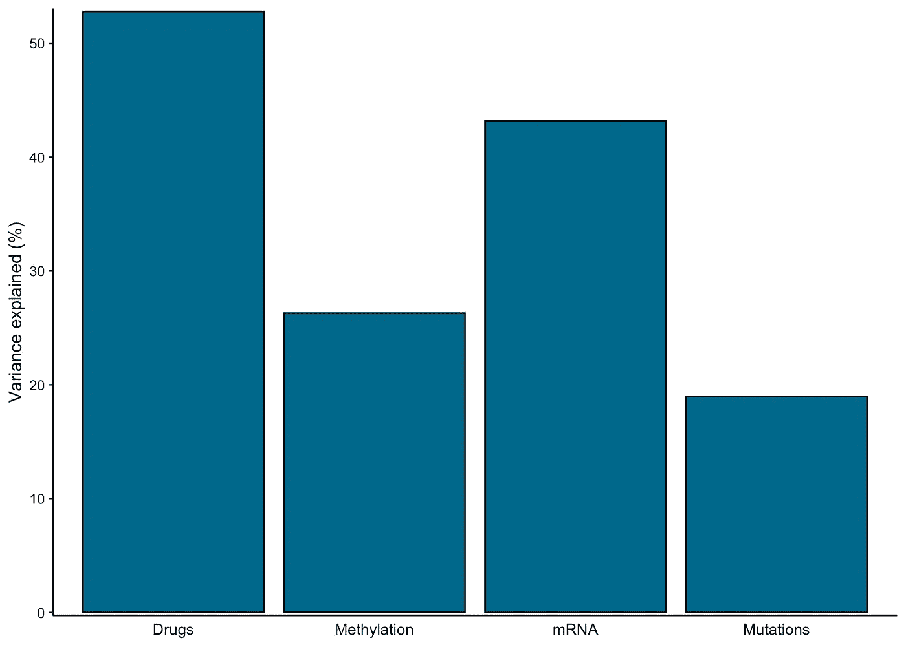*

*每个数据形态的总解释差异*

## ***结论:***

*提取 15 个因素解释:*

*   *约 53%的药效差异*
*   *约 27%表观基因组分布变异*
*   *约 42%的 mRNA 差异*
*   *约 20%的突变方差*

*药物反应(~53%)和 mRNA 谱(~42%)在组学中表现出最大的可变性。*

# *7.因子关联分析*

*让我们计算样本元数据(性别、生存结果(死亡真/假)和年龄)和因子 val 的相互关系:*

```
*correlate_factors_with_covariates( MOFAobject, 
                      covariates = c("Gender","Died","Age"), 
                      plot = "log_pval" )*
```

*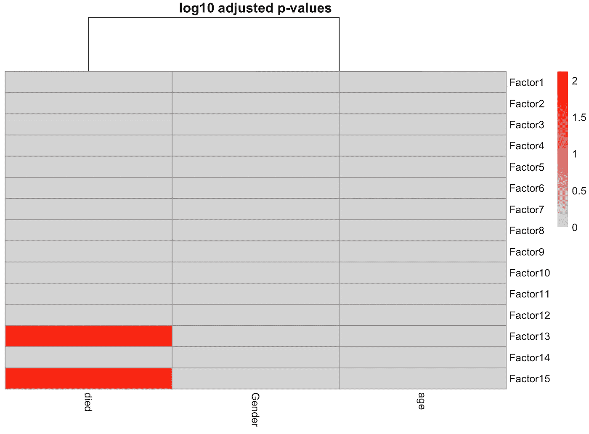*

*样本元数据与因子值之间的关联分析*

## ***结论:***

*   *大多数因素与任何协变量都没有明确的联系。*
*   *与生存结果相关的因素 13 和 15。*

*在故事的最后，我们将回到与临床数据的关联。*

# *8.因子 1 配置文件*

## *8.1 因子值*

*因子是初始特征的线性组合，代表数据可变性的来源。在下图中，因子值位于零轴周围，因为在进行因子分析之前，数据必须居中。带有正负符号的点代表相反的表型。较大的绝对值与更明显的生物效应相关。*

```
*plot_factor( MOFAobject,
             color_by = "Factor1",
             factors=1)*
```

*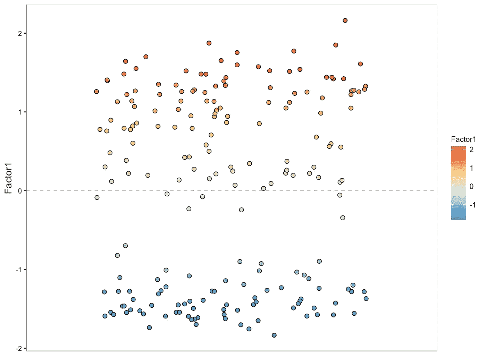*

*因子 1 值*

## *8.2 特征权重*

*特征权重是每个特征与每个因素的相互联系的等级。较大的绝对特征权重表示特征与因子的关联较强。符号表示影响方向:正-该特征在具有正因子值的样本中表现出更大的值，等等。*

## *8.3 因子 1 体细胞突变*

*解释方差表明因子 1 代表所有组学的方差。体细胞突变数据非常稀少，任何 DNA 编辑都会对所有后续组学层产生影响。*

```
*plot_weights( MOFAobject,
              view = "Mutations",
              factor=1,
              nfeatures = 15,              scale = T)*
```

*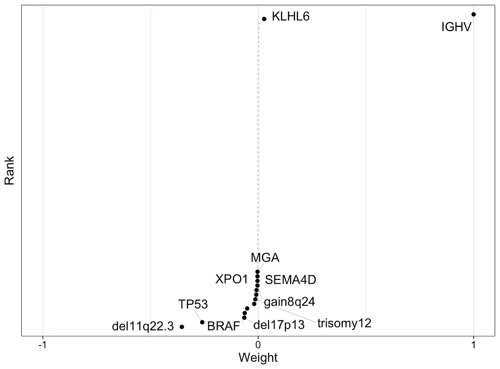*

*因子 1 体细胞突变特征权重*

## *结论:*

*   *大多数特征被分配在零权重垂直线周围，表明它们与 Factor1 没有关联*
*   *免疫球蛋白重链可变区(IGHV)基因突变非常明显。我们刚刚发现 [**为 CLL**](https://www.ncbi.nlm.nih.gov/pmc/articles/PMC6355490/) **的主要临床标志。***

*让我们创建一个图来显示右侧带有相应权重符号的要素:*

```
*plot_top_weights( MOFAobject,
                  view = "Mutations",
                  nfeatures = 15,
                  scale = T,
                  factor=1,
                  view = "Mutations")*
```

*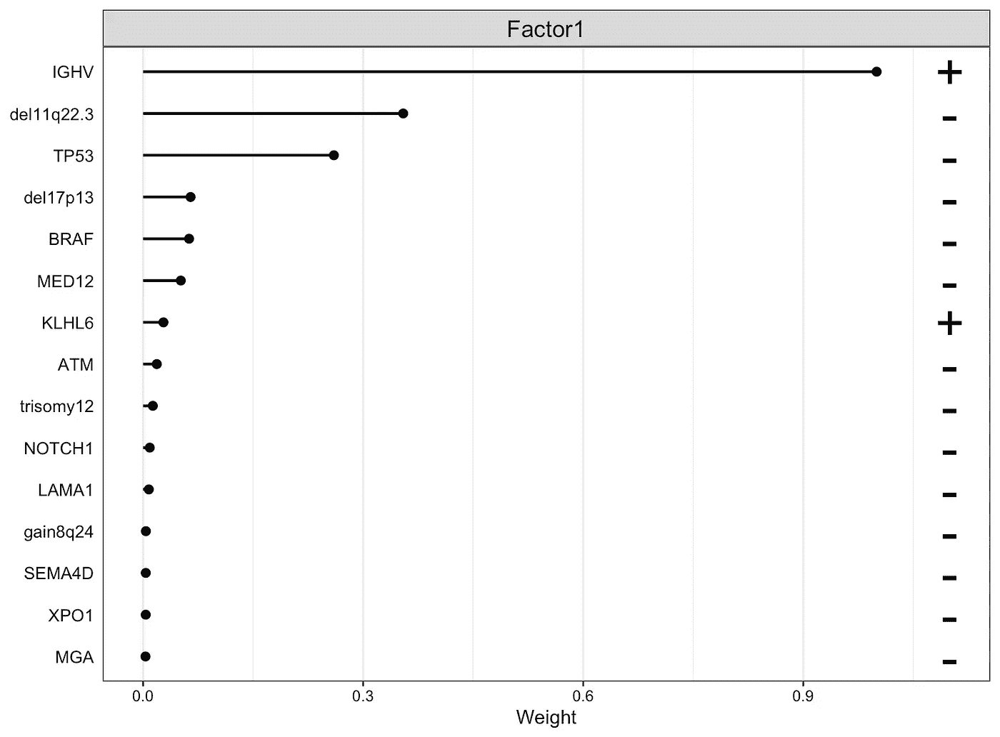*

*因子 1 体细胞突变最高特征权重(alt)*

*IGHV 具有正权重。***Factor1 值为正的样本有 IGHV 突变，而 factor 1 值为负的样本没有 IGHV 突变*** 。为了证实这一点，让我们绘制出因子值并给 IGHV 突变状态着色。*

```
*plot_factor( MOFAobject,
             dodge = TRUE,
             add_violin = TRUE,
             color_by = "IGHV",
             factors=1)*
```

*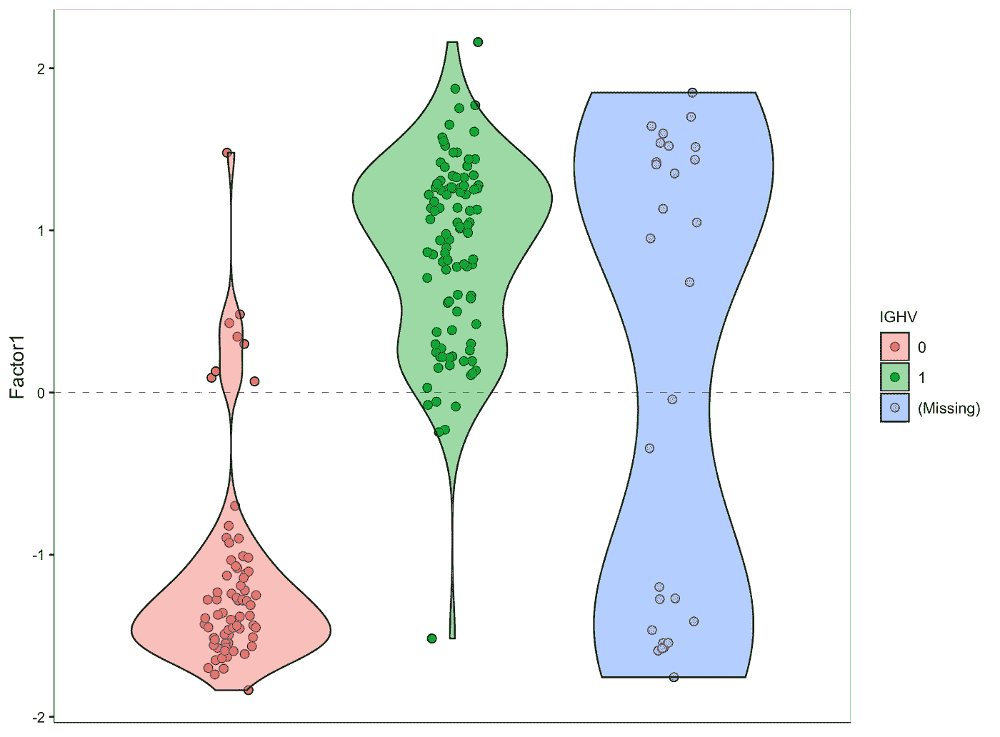*

*IGHV 突变与因子 1 值的相关性*

## *8.4 因子 1 mRNA 表达*

*从方差解释图中，我们知道因子 1 驱动所有数据形态的变化。让我们想象与因子 1 相关的 mRNA 表达变化:*

```
*plot_weights( MOFAobject,
              nfeatures = 10,
              view = "mRNA",
              factor=1)*
```

*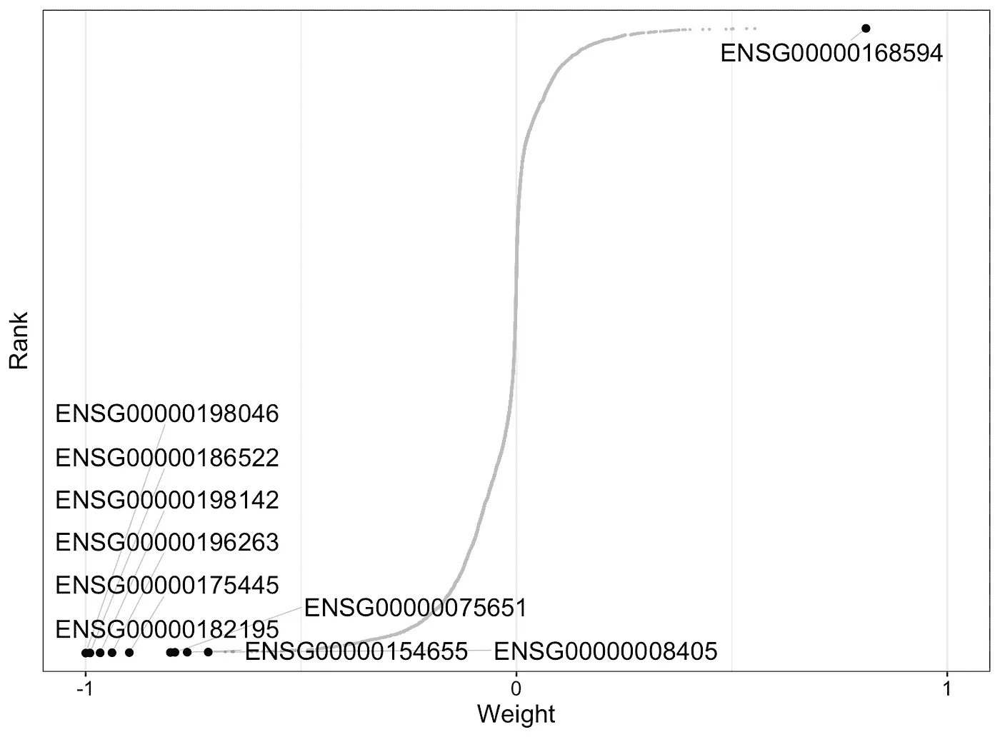*

*mRNA 表达的基因权重(因子 1)*

## *结论:*

*   *存在大量具有负权重的基因(例如，ENSG00000198046)和具有正权重的基因(例如，ENSG00000168594)。*
*   *可能，***mRNA 阳性表达值较大的基因在 IGHV 突变的样本中表达较多；具有大负值的基因在没有 IGHV 突变*** 的样品中表达更多*

*让我们验证最后一个假设。*

## *8.5 因子 1 分子特征聚类*

*让我们制作一个因子 1 值(x 轴)对基因表达值(y 轴)的热图。样本按 IGHV 状态着色——突变存在(红色)还是不存在(蓝色)。*

```
*plot_data_heatmap( MOFAobject,
                   scale = "row"
                   cluster_cols = FALSE,
                   cluster_rows = FALSE,
                   show_colnames = FALSE,
                   show_colnames = FALSE,
                   denoise = TRUE
                   features = 25,
                   view = "mRNA",
                   factor=1)*
```

*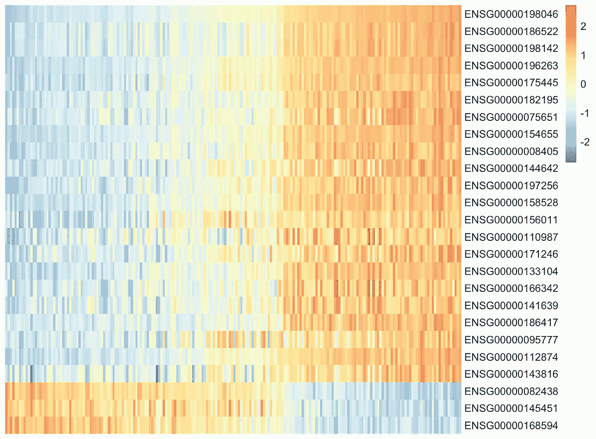*

*因子 1 基因表达聚类的去噪热图*

## *结论:*

*   *具有不同基因表达的簇清晰可见，证明了该假设。*

# *9.摘要*

1.  *CLL 数据集包含 4 个组学: ***基因组学*** (体细胞突变) ***表观基因组学*** (DNA 甲基化) ***转录组学***(RNA-seq)***表型*** (药物反应)；200 名病人*
2.  *15 因子(降维)模型训练收敛于迭代 908，ELBO=-2850734.58，deltaELBO=0.197 (0.00000100%)。因素显示没有相关性，这是好的。*
3.  *累积起来，这 15 个因素代表了大约 53%的药物反应变异，大约 42%的 mRNA，大约 27%的 DNA 甲基化和大约 20%的体细胞突变变异。*
4.  *与生存结果相关的因素 13 和 15。*
5.  *因子 1 代表了所有组学模式的高度多样性。看来，它对于疾病的病因是至高无上的。因子 2 表达了仅与药物反应相关的非常强的差异。因子 3 保留了所有组学的差异，除了表观组学。因子 4 代表中等 mRNA vаriаncе。因子 5 应该是药物反应和 mRNA 的相互依赖性。*
6.  *IGHV 突变存在于具有正因子 1 值的样本中，而不存在于具有负因子 1 值的样本中。*
7.  ***IGHV 突变被发现为**[**CLL**](https://www.ncbi.nlm.nih.gov/pmc/articles/PMC6355490/)**的主要临床标志。** IGHV 生物标志物效力在多个湿式实验室实验中得到证实。*