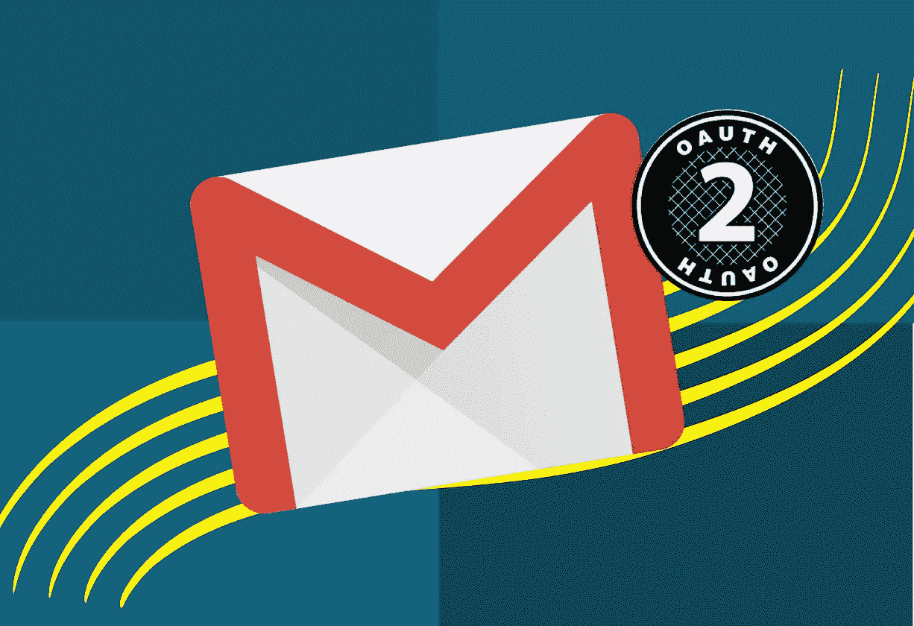
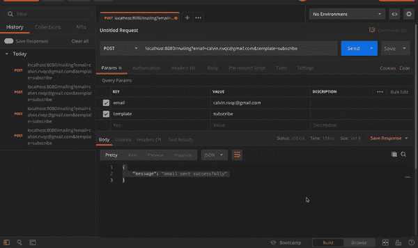
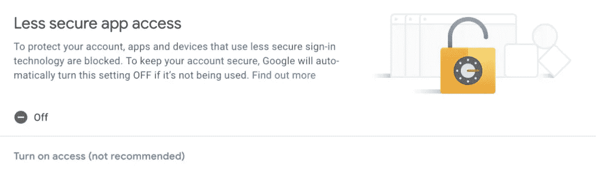
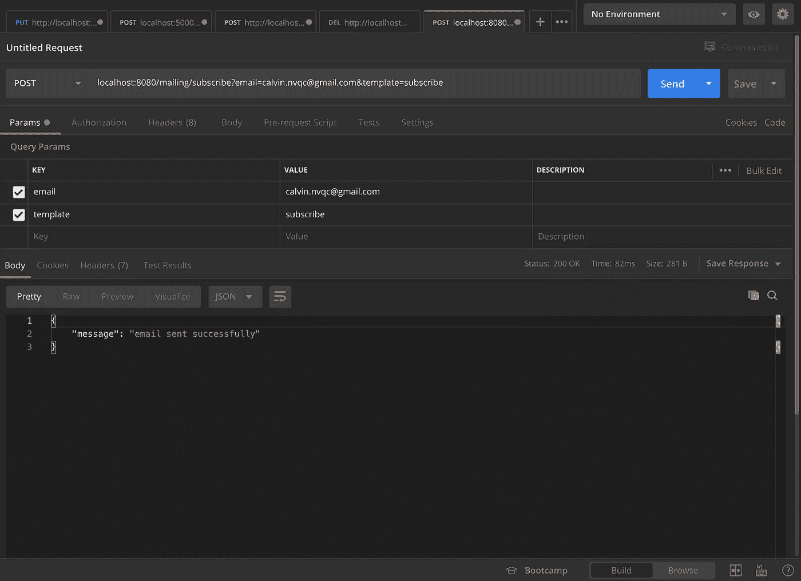
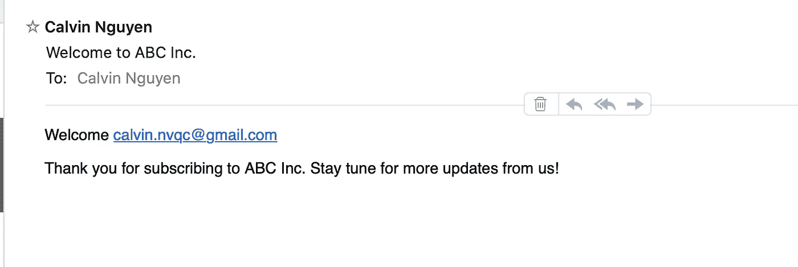

# 使用 Nodemailer、Gmail 和 Google OAuth2 构建您自己的邮件 API

> 原文：<https://levelup.gitconnected.com/multi-purposes-mailing-api-using-nodemailer-gmail-google-oauth-28de49118d77>

## 在 Node.js 应用程序中设置自己的邮件 API 的 5 分钟指南

## 尽管 Gmail 是开始发送电子邮件的最快方式，但它绝不是一个更好的解决方案，除非你使用 OAuth2 认证。

# **作者注**

问候读者，

本文是“*系列文章的一部分，该系列文章由各种软件开发的*技术教程、新闻和技巧*组成:*

1.  *[用 Node.js(第 1 部分)— ES6](https://medium.com/swlh/a-complete-guide-build-a-scalable-3-tier-architecture-with-mern-stack-es6-ca129d7df805) 构建一个结构良好的三层架构*
2.  *[提高团队代码质量的两个简单技巧](https://medium.com/swlh/2-simple-tips-to-increase-your-team-code-quality-143b879ae2f7)*
3.  *[认证的完美结构&用 Node.js 授权你的 API](https://medium.com/swlh/perfect-structure-to-authenticate-authorize-api-with-node-js-and-passport-jwt-d529b1a618ba)*
4.  *[我在一个小时内构建了一个 M.E.R.N 代码库](https://medium.com/swlh/i-built-a-m-e-r-n-codebase-in-an-hour-742acd71ed7e)(第 2 部分)*
5.  *[如何用 Java 构建 REST API&MySQL 使用 Tomcat](https://medium.com/@calvinqc/build-a-simple-rest-apis-with-java-8-tomcat-jsp-mysql-intellij-on-mac-3308f4e59a03)*
6.  ***使用 Nodemailer、Gmail & Google OAuth2** 构建自己的邮件 API*
7.  *[WebRTC——支持 Google Meet、Facebook Messenger 的技术](https://medium.com/swlh/webrtc-the-technology-that-powers-google-meet-hangout-facebook-messenger-and-discord-cb926973d786)*
8.  *[向新的 Github CLIs 问好](https://medium.com/@calvinqc/say-hello-to-the-new-github-clis-7e2612fb3918)*
9.  *[使用 Java、Springboot、Kafka 进行简单设置](/easy-java-springboot-apache-kafka-setup-on-macos-ceb481e167f8)*
10.  *[成功的团队合作需要什么](/what-it-takes-to-have-a-successful-team-cooperation-bc21b82e9f3)*
11.  *[如何使用 Docker、EC2、ECS 和 ECR 将应用程序部署到 AWS](https://medium.com/swlh/how-to-deploy-an-application-to-aws-using-docker-ecs-and-ecr-aa7785fc9667)*
12.  *[通过将我们的客户端托管到云存储，我们节省了 45%的总成本](https://medium.com/@calvinqc/we-cut-down-45-of-our-budget-by-switching-to-google-cloud-storage-7e5a6a10542)*

*感谢访问这个系列，并享受阅读！*

**

*图片来源:[design ink 的数字解决方案](https://www.google.com/url?sa=i&url=https%3A%2F%2Fdesigndigitalsolutions.com%2Fsending-mail-via-nodemailer-using-your-gmail-with-oauth2%2F&psig=AOvVaw3nC4uEl7jozB144ReVTYmH&ust=1583209986948000&source=images&cd=vfe&ved=0CAMQjB1qFwoTCMiN5P36-ucCFQAAAAAdAAAAABAJ)*

*所有在线教程都向你展示了一个很好的结构来设置或处理不同场景的邮件 API，如订阅、忘记密码、电子邮件验证或更改电子邮件模板。我会尽我所能，一步一步地指导你如何在 Node.js 中用 Nodemailer、Gmail、OAuth 客户端设置邮件 API，实现多种用途。*

# *要求*

*   *[Node.js](https://nodejs.org/en/) / [npm 注册表](https://www.npmjs.com/)*
*   *文本编辑器: [VSCode](https://code.visualstudio.com/) 或者你喜欢的*
*   *[Postman](https://www.getpostman.com/) :这将允许你测试你的 API (GET，POST，PUT，DELETE)*
*   *Gmail 帐户*
*   *[谷歌云平台](http://cloud.google.com/)账号*

# *预期结果*

**

# *Google 云平台设置*

*首先，让我们为您的应用程序设置一个 OAuth 客户端 ID。*

1.  *转到 [Google Cloud](https://console.cloud.google.com/) 并创建一个新项目。*
2.  *搜索“API 和服务”*
3.  *点击“凭据”>点击“+创建凭据”>“OAuth 客户端 ID”*

*   *类型:Web 应用程序*
*   *姓名:“输入您的客户姓名”*
*   *授权重定向 https://developers.google.com/oauthplayground[URIs](https://developers.google.com/oauthplayground)*

***4。在便笺中复制客户端 ID 和客户端密码。***

# *谷歌 OAuth 游乐场*

1.  ***转到** [**Oauth 游乐场**](https://developers.google.com/oauthplayground/) **>** 点击右边的设置图标>启用`**Use your own Oauth credentials**` **>** 输入 Oauth 客户端 ID & Oatuh 客户端秘密，您从上面的步骤>关闭*
2.  *在选择和授权 API 中，键入`**https://mail.google.com**` **>** 授权 API>使用您要发送的帐户登录。*
3.  *点击令牌交换授权码>复制**刷新令牌***

*现在，你的笔记里应该有三样东西:*

1.  *客户端 ID*
2.  *客户机密*
3.  *Oauth2 刷新令牌*

# *重要提示:无需配置 Gmail 帐户*

*虽然许多教程告诉你打开*“不太安全的应用程序访问”*以允许 Nodemailer 从你的帐户发送电子邮件。*

*   *我更喜欢*而不是*，因为 ***我们应该在不降低 Gmail 安全性的情况下使用 node mailer****
*   ***如何查看:**启动 Gmail，然后点击右上角的你的个人资料- >管理你的 Google 账户- >安全。您将看到以下设置:*

**

***所以是的，关机，比较安全！***

# *Node.js 结构设置*

1.  *叉 [**本项目**](https://github.com/calvinqc/node-passport-jwt-sample) 作为模板入门或者可以使用自己的后端项目。*
2.  *在根文件夹中创建一个`.env.sh`文件来存储您的秘密环境>用您在上一步中的内容替换高亮部分>运行`**$ source .env.sh**` **>添加这个文件到。gitignore***

```
*# Mailing Serivce
export PROJECT_ID="<Your Project ID>"
export SENDER_EMAIL_ADDRESS="calvin.nvqc@gmail.com"
export MAILING_SERVICE_CLIENT_ID="**<Enter your Client ID>**"
export MAILING_SERVICE_CLIENT_SECRET="**<Enter your Client Secret>**"
export MAILING_SERVICE_REFRESH_TOKEN**="<Refresh Token>"***
```

*3.打开项目并创建`Mailing/`文件夹和相关文件:*

```
*$ mkdir store/Mailing store/Mailing/template 
$ touch store/Mailing/index.js store/Mailing/template/subscribe.ejs* 
```

*4.安装[节点邮件](https://nodemailer.com/about/)，[Google API](https://www.npmjs.com/package/googleapis)，ejs: `$ npm i nodemailer googleapis ejs`*

# *设置节点邮件程序*

1.  *将此代码添加到`index.js`。这段代码将使用 Google Oauth2 客户端初始化一个节点邮件程序。*

```
*import nodemailer from 'nodemailer';
import ejs from 'ejs';const { google } = require('googleapis');const { OAuth2 } = google.auth;const OAUTH_PLAYGROUND = '[https://developers.google.com/oauthplayground'](https://developers.google.com/oauthplayground');const {
  MAILING_SERVICE_CLIENT_ID,
  MAILING_SERVICE_CLIENT_SECRET,
  MAILING_SERVICE_REFRESH_TOKEN,
  SENDER_EMAIL_ADDRESS,
} = process.env;const Mailing = {};const oauth2Client = new OAuth2(
  MAILING_SERVICE_CLIENT_ID,
  MAILING_SERVICE_CLIENT_SECRET,
  OAUTH_PLAYGROUND
);const TEMPLATES = {
  subscribe: {
    fileName: 'subscribe.ejs',
    subject: '[ABC Inc.] Welcome to ABC Inc.',
  },
};/**
 * Send Email
 */
Mailing.sendEmail = data => {
  oauth2Client.setCredentials({
    refresh_token: MAILING_SERVICE_REFRESH_TOKEN,
  }); const accessToken = oauth2Client.getAccessToken();const smtpTransport = nodemailer.createTransport({
    service: 'gmail',
    auth: {
      type: 'OAuth2',
      user: SENDER_EMAIL_ADDRESS,
      clientId: MAILING_SERVICE_CLIENT_ID,
      clientSecret: MAILING_SERVICE_CLIENT_SECRET,
      refreshToken: MAILING_SERVICE_REFRESH_TOKEN,
      accessToken,
    },
  });
  const filePath = `${__dirname}/templates/${TEMPLATES[data.template].fileName}`; ejs.renderFile(filePath, data, {}, (e, content) => {
    if (e) return e;
    const mailOptions = {
      from: SENDER_EMAIL_ADDRESS,
      to: data.email,
      subject: TEMPLATES[data.template].subject,
      html: content,
    }; smtpTransport.sendMail(mailOptions, (err, info) => {
      if (err) return err;
      return info;
    });
  });
};export default Mailing;*
```

*2.添加此`subsribe.ejs`模板*

```
*<p>Welcome <%= email %></p><p>
  Thank you for subscribing to ABC Inc. Stay tune for more updates from us!
  <br />
</p>*
```

# ***创建邮件 API***

1.  *创建邮寄帖子/ API: `$ touch controller/mailing.controller.js`*

```
*import express from 'express';
import Mailing from '../store/Mailing';
import { SOME_THING_WENT_WRONG } from '../store/constant';
import { generateServerErrorCode } from '../store/utils';const mailingController = express.Router();/**
 * POST/ User subscribe to App
 */
mailingController.post('/', (req, res) => {
  try {
    Mailing.sendEmail(req.query);
    res.status(200).json({ message: 'email sent successfully' });
  } catch (e) {
    generateServerErrorCode(res, 500, e, SOME_THING_WENT_WRONG);
  }
});export default mailingController;*
```

*2.修改`controller/index.js`:*

```
*import userController from './user.controller';
**import mailingController from './mailing.controller';**export { userController, **mailingController** };*
```

*3.将邮件控制器添加到 app.js:*

```
*import express from 'express';
import logger from 'winston';
import bodyParser from 'body-parser';
import cors from 'cors';
import passport from 'passport';
import mongoose from 'mongoose';import { config } from './store/config';
import { applyPassportStrategy } from './store/passport';
import { userController, **mailingController** } from './controller';const app = express();// Apply strategy to passport
applyPassportStrategy(passport);app.use(cors());
app.use(bodyParser.urlencoded({ extended: true }));
app.use(bodyParser.json());// API
app.use('/', userController);
**app.use('/mailing', mailingController);**/**
 * Get port from environment and store in Express.
 */
const { port, mongoDBUri, mongoHostName } = config.env;
app.listen(port, () => {
  logger.info(`Started successfully server at port ${port}`);
  mongoose
    .connect(mongoDBUri, { useNewUrlParser: true, useUnifiedTopology: true })
    .then(() => {
      logger.info(`Conneted to mongoDB at ${mongoHostName}`);
    });
});*
```

# *邮递员测试*

*开邮差，如果不知道怎么用的话。请看 [**本教程**](https://www.youtube.com/watch?v=t5n07Ybz7yI) :*

*使用 **POST/** 方法并输入此 URL > Send*

```
*localhost:8080/mailing?email=calvin.nvqc@gmail.com&template=subscribe*
```

*请求成功后，您将收到此消息。*

**

## *现在，检查你的电子邮件，祝贺你！*

**

*有了这个设置，你可以很容易地改变你的电子邮件的内容，你不仅可以发送订阅邮件，还可以注册验证，忘记密码等。*

*最终代码 [**此处**](https://github.com/calvinqc/MERN-template/tree/master/server) **！***

# ***跟进***

*   *如果你喜欢阅读 ***《我与创业公司一起成长*** 》，并希望在未来阅读更多。请在此订阅[。](http://eepurl.com/g5qIBf)*
*   *在 [Github](https://github.com/calvinqc) 、 [LinkedIn](https://www.linkedin.com/in/calvinqc/) 上与我联系*