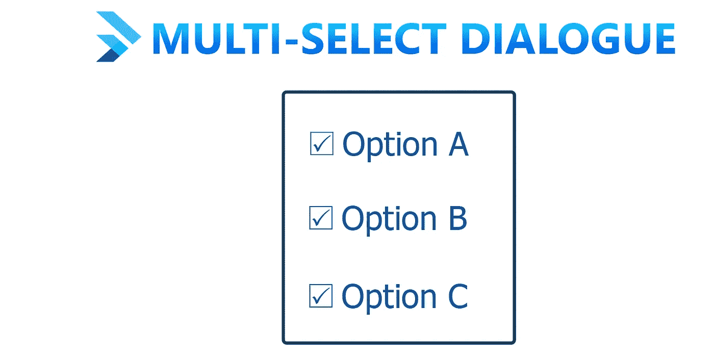
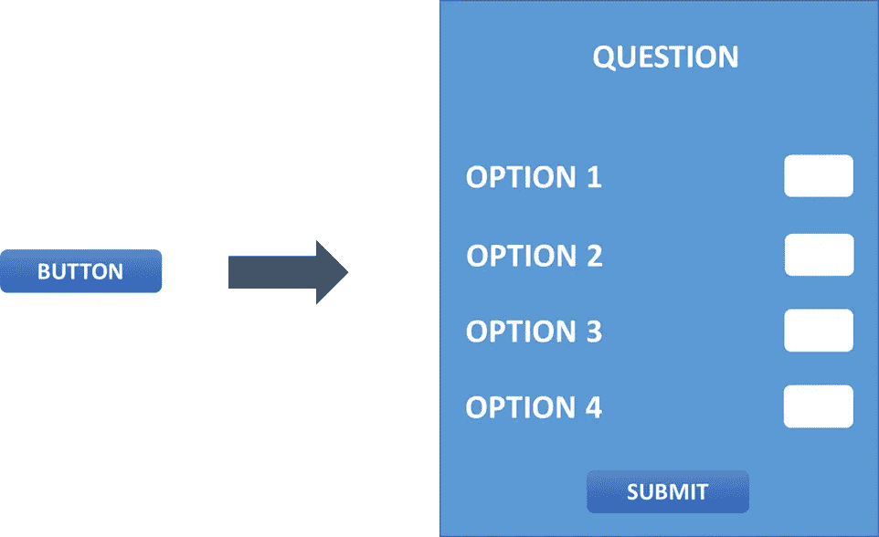
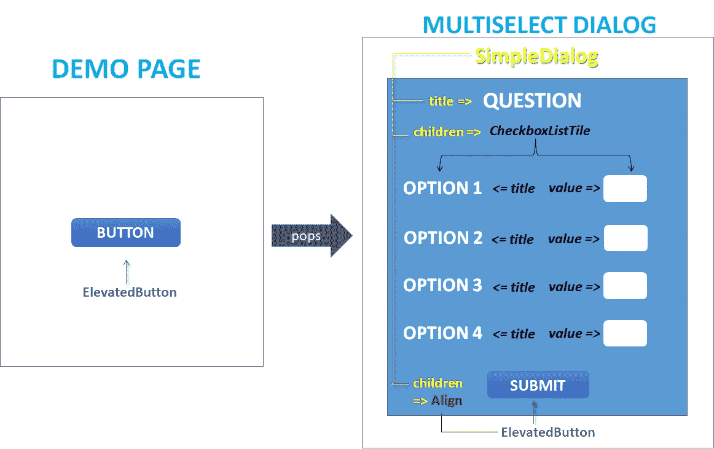
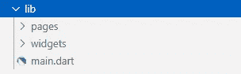
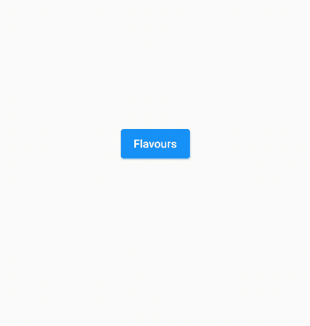
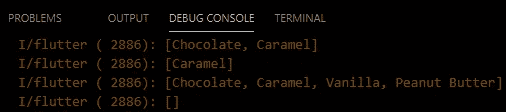
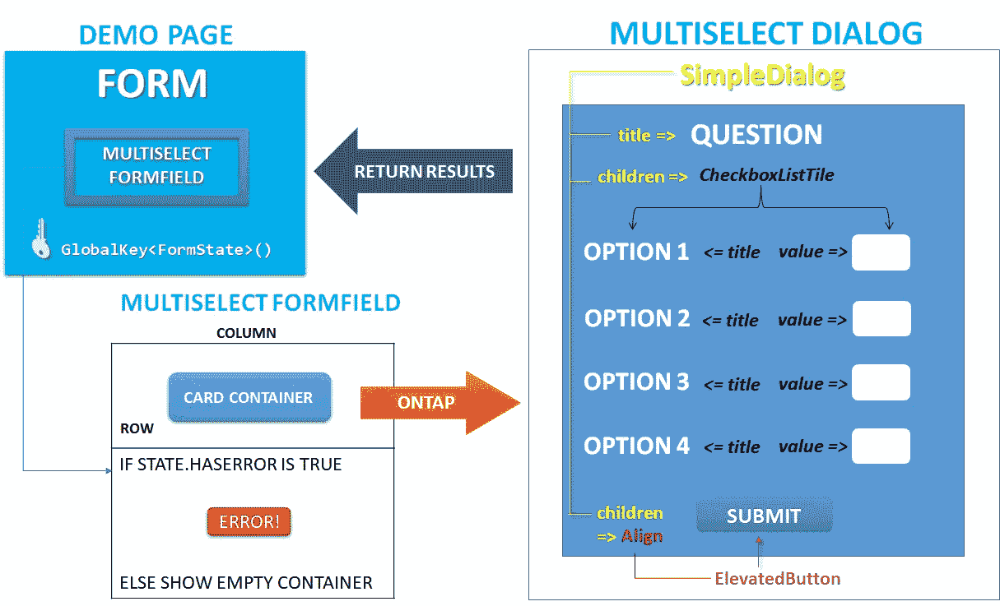
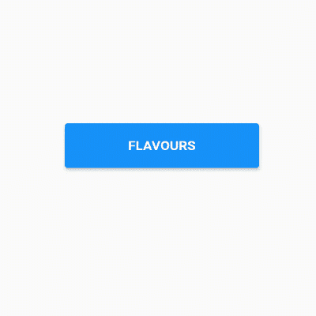
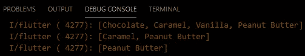

# 颤振中的多选择对话:一种通用的方法

> 原文：<https://levelup.gitconnected.com/multi-select-dialogue-in-flutter-a-versatile-approach-69ea0a598bac>

想象一个人，X 先生，被一家普通饼干制造机构的**研究&开发**部门聘为新手颤振开发者。最终，销售趋势开始每周下降。

为了解决这个问题，**部门负责人**召开了一次会议，并决定在他们现有的应用程序中创建一个调查问卷。**项目经理**将各种任务分配给开发团队，只给 X 先生很短的时间来编写代码，并限制使用任何第三方库，如 **Pubspec 包**。

工作是创建一个按钮，弹出一个简单的对话框，允许用户选择多个选项并点击提交。

照片由[Olav Ahrens rtne](https://unsplash.com/@olav_ahrens?utm_source=medium&utm_medium=referral)在 [Unsplash](https://unsplash.com?utm_source=medium&utm_medium=referral) 上拍摄

那么 X 先生会如何解决这个挑战呢？

# 扑过去救援

Flutter 使得编程不仅简单而且有趣。使用几行 dart 代码就可以轻松映射大量硬编码的字符串，可以克服手动事件处理的缺陷。使用声明式 UI 方法，flutter 有助于在几分钟内高效地编写代码。

经过一番头脑风暴后，X 先生草拟了一个基本的设计方案，它能以一种体面的方式实现所需的功能。下图 1 展示了这样一幅草图。

**图 1:基本用户界面草图**

在观察草图后，他得出结论，在整个场景中将使用以下小部件，如图 2 所示。

**图 2:分成小部件的 UI 组件**

*   *一个自定义的演示页面作为主页面。*
*   *一个* ***高架按钮*** *弹出对话。*
*   *一个* ***简单对话框*** *显示一个问题和选项列表。*
*   *一列****checkboxlisttile⁴****，将在 value 属性中选择的标题属性&选项中的选项文本换行。*
*   一个 ***提升按钮*** *包裹在一个****align⁵****小部件中进行提交。*

# 准备，稳定代码！

**照片由** [**马库斯·斯皮斯克**](https://unsplash.com/@markusspiske?utm_source=medium&utm_medium=referral) **上** [**下**](https://unsplash.com?utm_source=medium&utm_medium=referral)

X 先生使用了**“分割&征服”**的概念，并通过在 **lib** 文件夹中创建 **pages** 和 **widgets** 文件夹开始。

**图 3:编码结构**

在 **widgets** 文件夹中，他创建了一个自定义对话框作为无状态小部件。

***MultiSelectDialog 小部件代码***

*   为了处理大量的文本格式，X 先生将问题声明为一个 ***小部件*** ，而不是一个简单的字符串。
*   为了显示选项，他创建了一个变量 ***answers*** ，该变量将硬编码文本保存为字符串 ***列表*** 。
*   为了跟踪选定的答案，他通过创建一个名为 ***initMap*** 的函数，将列表转换为一个 ***Map < String，bool > mappedItem*** ，该函数将使用 dart 的 **Map.fromIterable⁶** 构造函数返回一个地图。
*   在构建方法内部，他创建了一个简单对话框**，其中有 ***问题*** 作为它的 ***标题*** 和一个列表***CheckboxListTile***，它们被包装在一个使用**的***stateful builder***中****
*   **为了选中或取消选中该框，在 ***OnChanged*** 回调函数中使用了 setState。**
*   **当按下 ***提升按钮****时，对话框仅返回具有真值的项目。***

******演示页面代码******

***在 **pages** 文件夹中，X 先生创建了一个演示页面，它将简单地显示一个 ***被提升的按钮*。**点击该按钮，屏幕上会弹出 ***多选对话框*** 。提交后，选择的口味将被存储在一个**列表<字符串>** **口味**中。为了执行代码，他调用了 main.dart 文件中的演示页面。***

*****main.dart*****

**最终结果可以在下面的图 4 和图 5 中说明。**

****

****图 4:多选对话框执行****

****

****图 5:调试控制台日志****

# **结束了吗？还没有！**

**虽然基本功能已经完成，但 X 先生注意到一些增强功能可以解决以下问题:**

1.  **用户可以在任何情况下不做选择就关闭对话。**
2.  **如果用户没有选择，需要一个验证器来显示错误。**
3.  **应该用一个表单小部件替换**风格**按钮。**
4.  **目前没有办法显示用户选择的口味数量。**

****

****图 6:多选窗体流场****

**为了解决这些问题，X 先生将 **MultiSelectDialog** 包装在 **widgets** 文件夹的自定义表单字段中。**

****多选表单字段代码****

*   **为了创建一个定制的表单域，x 先生扩展了默认由 flutter 提供的 ***表单域* ⁷** 类。**
*   **使用 **super** 关键字调用基本构造函数来获取表单字段的属性和回调函数。**
*   ****on saved**&**validator**是基于表单当前状态触发的两个垫脚石。**
*   *****提升按钮*** 被替换为定制的提升卡片容器，使按钮看起来更大更有吸引力。**
*   **根据表单字段的状态值定义了多个条件，如:
    ★如何避免空状态？
    ★用户选择了多少种口味？
    ★如何根据选择的口味改变按钮文本？**
*   **现在，这些问题和答案将通过 ***MultiSelectFormField 的*** 构造函数转发给***MultipleSelectDialog***，而不是直接处理问题和答案。**
*   **在验证失败的情况下，使用表单字段的***state . haserror***属性可以顺利处理错误。**

****更新了演示页面代码****

*   **为了将更改与演示页面集成在一起，X 先生修改了基本代码，将 ***提升按钮*** 替换为一个表单。**
*   **一个 ***全局键⁸ <表单状态>*** 被用来跟踪表单的状态。**
*   **在 ***验证器*** 回调函数中，检查到用户至少应选择一种口味。**
*   **只有当字段有效时，才会触发 **onSaved** 方法。**

# **剧终**

**执行 main.dart 文件后，所有目标都成功实现了，如图 7 和图 8 所示。**

****

****图 7:最终结果****

****

****图 8:调试控制台日志****

**幸运的是，x 先生已经把完整的源代码放在这里[⁹.](https://github.com/Zujaj/multiple_selection_dialogue_app)**

**注意:如果你有兴趣测试这个应用程序，请点击下面的链接。**

** [## 颤振中的多选择对话:单元试验阶段

### 您是否迷失在寻找测试 flutter 应用程序的方法中？你害怕“测试”这个词吗？你不知道…

levelup.gitconnected.com](/multi-select-dialogue-in-flutter-the-unit-test-phase-1eaa291549ac) 

# 参考

**【1】:*镖包*** [https://pub.dev/](https://pub.dev/)

**【2】:*高架按钮类*** [https://API . flutter . dev/flutter/material/Elevated Button-Class . html](https://api.flutter.dev/flutter/material/ElevatedButton-class.html)

**【3】:*简单对话框类*** [https://API . flutter . dev/flutter/material/Simple Dialog-Class . html](https://api.flutter.dev/flutter/material/SimpleDialog-class.html)

**【4】:*CheckboxListTile 类*** [https://API . flutter . dev/flutter/material/CheckboxListTile-Class . html](https://api.flutter.dev/flutter/material/CheckboxListTile-class.html)

**【5】:*对齐类*** [https://api.flutter.dev/flutter/widgets/Align-class.html](https://api.flutter.dev/flutter/widgets/Align-class.html)

**【6】:*贴图< K，V >。fromIterable 构造函数*** [https://API . dart . dev/stable/2 . 10 . 5/dart-core/Map/Map . from iterable . html](https://api.dart.dev/stable/2.10.5/dart-core/Map/Map.fromIterable.html)

**【7】:*form field<T>Class*** [https://API . flutter . dev/flutter/widgets/form field-Class . html](https://api.flutter.dev/flutter/widgets/FormField-class.html)

**【8】:*global key Class*** [https://API . flutter . dev/flutter/widgets/global key-Class . html](https://api.flutter.dev/flutter/widgets/GlobalKey-class.html)

**【9】:*完整源代码*** [https://github.com/Zujaj/multiple_selection_dialogue_app](https://github.com/Zujaj/multiple_selection_dialogue_app)**