# 颤振中的多选择对话:单元试验阶段

> 原文：<https://levelup.gitconnected.com/multi-select-dialogue-in-flutter-the-unit-test-phase-1eaa291549ac>

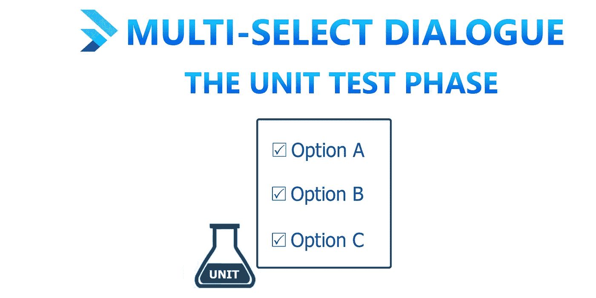

**颤振多选对话:单元测试阶段**

[概述](#dbb1)
[为什么要考试？](#410e)
[单元测试](#3e63)
[测试阶段](#32fc)
[准备起飞](#5689)
[列表测试用例](#cc8f)
∘ [用例 1:列表为空](#46c5)
∘ [用例 2:列表为空](#4a07)
∘ [用例 3:列表不为空](#1d57)
∘ [用例 4:列表共有四种味道](#c38d) 列表的最后一种味道是花生酱
∘ [情况 7:列表有两种味道以字母 C](#c42f)
∘ [情况 8:列表共有十五个元音](#5a7c)
∘ [情况 9:列表共有二十个辅音](#04fc)
∘ [情况 10:列表不相同](#cdd4)
[映射测试情况](#b7ae)
∘ [情况 1:映射不为空](#fbf7)
∘ [案例三:MAP KEY 是一个字符串](#d4a2)
∘ [案例四:MAP VALUE 是一个 BOOL](#fa53)
[函数测试案例](#aae2)
∘ [案例一:convertToMap 需要一个 LIST 参数](#2e37)
∘ [案例二:convertToMap 返回类型是一个 MAP](#ae0c)
∘ [∘](#221a) [案例 2:mapped veil 没有值 0](#77aa)
∘ [案例 3:mapped veil 没有空白条目](#43aa)
[最终结果](#c2af)
[等等还有？](#0bc6)
[参考文献](#e957)

# 概观

您是否迷失在寻找测试 flutter 应用程序的方法中？你害怕“测试”这个词吗？你不知道从哪里开始吗？你正在寻找答案，给你一个鸟瞰？别担心，你降落在正确的地方。

测试一个应用程序可能是一项相当费脑力的工作。这不仅需要大量的时间，还需要你的背景编程经验。从现在开始，我们将探索如何一个接一个地通过这些测试阶段。

在成功贡献给[***Level Up Coding***](https://levelup.gitconnected.com/)**平台之后，我很高兴地学习和探索了更多关于这篇名为**[***的文章。本文是一个重点系列，目标是教授颤振中使用的不同试验方法。***](/multi-select-dialogue-in-flutter-a-versatile-approach-69ea0a598bac)****

# ****为什么要测试？****

****您可能想知道为什么我们甚至需要为应用程序编写测试？测试后我得到了什么满足感？测试对我来说真的很有成效吗？以下是一些主要的好处或许可以解答你的疑问。****

*   ****它有助于清除应用程序内部的错误。****
*   ****这会提高你对客户的信心。****
*   ****它防止应用程序出现意外的崩溃行为。****
*   ****作为一名开发人员，您的代码会不时得到润色。****
*   ****在进入生产阶段之前，安全和性能漏洞被识别出来。****

****根据全球标准，我们通常遵循一个测试范例来划分测试阶段。所以就颤振而言，我们可以说测试可以分为三个阶段，参见 ***图 1*** 。****

*   ****单元测试。****
*   ****小部件测试。****
*   ****集成测试，也称为端到端测试(E2E)。****

****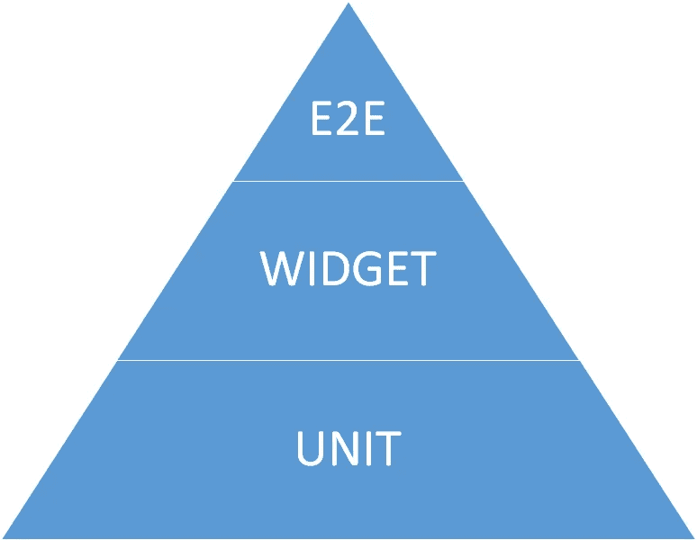****

*******图 1:颤振试验范例*******

****我们会不时地提到这些术语，只要记住它们就行了。****

# ****单元测试****

****术语“单元”可被称为充当应用程序的基本构建块的最小逻辑代码片段。单元测试的范围可以从一行代码到一大堆类对象。Ham Vocke 在下面的陈述中清楚地描述了单元测试的概念。****

> ****如果你使用函数式语言，一个单元很可能是一个函数。您的单元测试将调用具有不同参数的函数，并确保它返回预期的值。在面向对象语言中，一个单元的范围可以从单个方法到整个类。****
> 
> ******实用测试金字塔******

# ****测试阶段****

****让我们以开发人员 x 先生制作的 [***多选对话***](/multi-select-dialogue-in-flutter-a-versatile-approach-69ea0a598bac) 应用程序为例，在对应用程序代码进行仔细检查后，我们得出一个结论:这个应用程序的最小单元是被操作的口味列表。就抽象而言，整个应用程序中执行的每个动作都取决于味道是如何表现的。****

****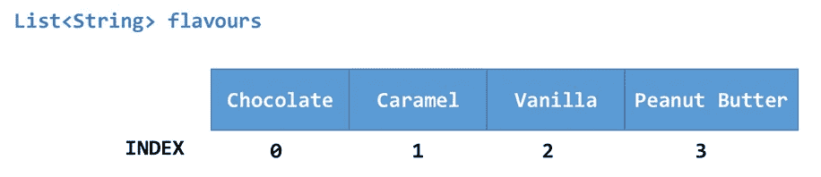****

******图 2:清单<串>味的图示。******

******列表<串串>风味申报******

****最初，它看起来就像一个普通的口味列表，但如果你仔细观察，当对话弹出这些口味时，这个列表被转换成一个映射，不仅包含口味值，还包含其相应的布尔值，如图 ***图 3*** 所示。****

****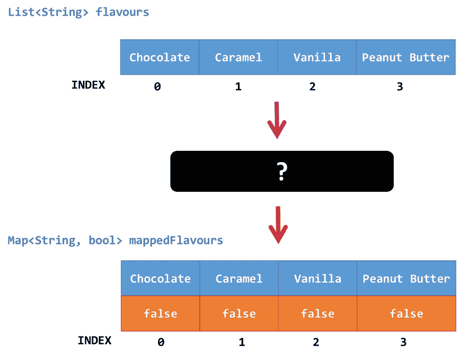****

******图 3:列表<字符串>风味转换示意图。******

******Map < String，bool>mapped flavors 初始化******

****所以现在的问题是，这种转变是如何发生的？嗯，我们定义了一个自定义函数，它将把**列表<字符串>风味**作为必需的参数，对其进行处理并返回一个**映射<字符串，bool >** ，该字符串将被存储在变量**mapped flavors**中，如图 ***图 4* 所示。******

****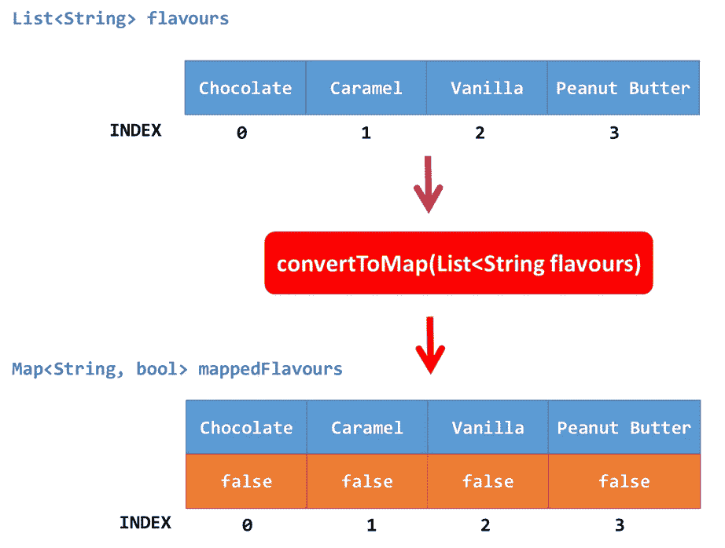****

******图 4:使用 convertToMap 函数将列表转换为地图的图示。******

****为了简单起见，我们将函数签名定义为**convert tomap(List<String>flavors)**。****

******代码将一个列表<字符串>转换成一个映射<字符串，bool>******

# ****准备起飞****

********

****Ashim D'Silva 在 [Unsplash](https://unsplash.com?utm_source=medium&utm_medium=referral) 上拍摄的照片****

****现在开始有趣的部分，对于这三个模块中的每一个，我们都要编写单元测试用例。要编写单元测试，你不需要任何外部的 pubspec 包，flutter 已经在 **pubspec.yaml** 文件中的 **dev_dependencies** 下提供了一个 [**测试包**](https://api.flutter.dev/flutter/flutter_test/flutter_test-library.html) ，以及项目目录中一个名为 **test** 的文件夹。****

****首先在 **test** 文件夹中创建一个 **unit_test.dart** 文件，参见 ***图 5*** 。****

****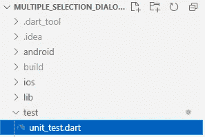****

*******图 5:单元测试目录结构*******

******注:**此时注释掉 **widget_test.dart** 文件。****

****如果实际条件与给定条件相匹配，我们将期待测试用例通过。怎么会？嗯，定义一个测试用例非常简单，我们同样调用**测试 method⁵** 。****

******测试方法语法******

******expect⁶** 是采用两个参数的同步方法。****

*   ******实际**:它的类型是动态的，所以我们可以自由定义任何条件表达式。****
*   ******匹配器**:它的类型也是动态的，它包含不同的匹配常数&函数，这些函数大多是从 **Matcher⁷** 类中派生出来的。像**is lesthan，isGreaterThan，isNull，isNot** ， **isTrue，isFalse，equals** 等匹配器大部分都是自明的。****

****你不仅可以编写单独的测试用例，还可以使用**组 method⁸** 将它们隔离在一起。****

******分组方法语法******

****编写测试的编码结构类似于普通的编码，参见下面的代码片段。****

******单元测试编码结构******

****Visual Studio 代码提供了一个简单的用户界面来运行任何测试，方法是导航到侧菜单，单击测试图标并从各种选项中进行选择，参见 ***图 6*** 。****

****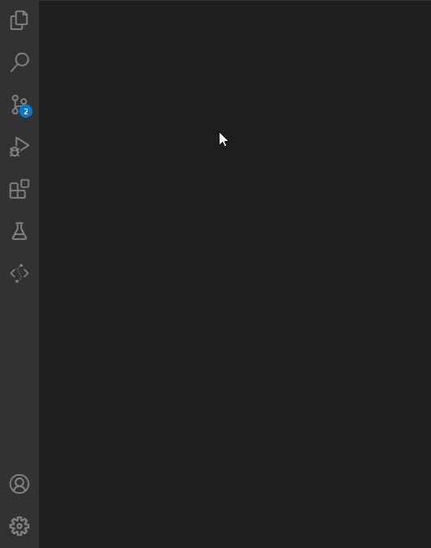****

******图 6:在 VS 代码中运行测试******

# ****列出测试用例****

****下面是一些可视化单元测试概念的测试用例。****

## *****情况 1:列表为空*****

********

****图 7:一个空列表的图示。****

****需要一个空列表。****

****由于我们没有初始化**列表<字符串>风味**，我们期望它为空，如 ***图 7*** 所示。****

## ****情况 2:列表为空****

********

****图 8:一个空列表的图示。****

****期待一个空列表。****

****初始化后，我们期望列表为空，如图 ***图 8*** 所示。****

## ****情况 3:列表不为空****

****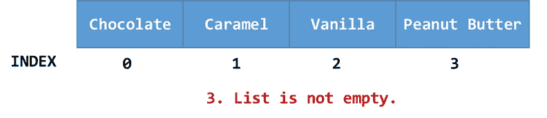****

******图 9:非空列表的图示。******

******期望一个非空列表。******

****通过给列表赋值，我们期望列表不再是空的(参见 ***图 9*** )。****

## ****案例 4:清单总共有四种味道****

****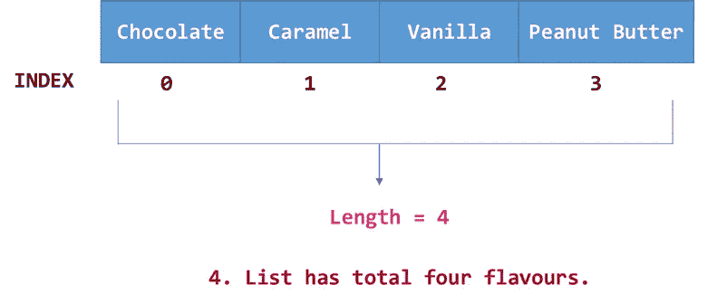****

******图 10:验证列表的长度。******

******列表长度应为四。******

****为了验证列表不超过四种口味，我们检查列表的长度是否> 0 和< 5 as illustrated in ***图 10*** 。****

## ****案例 5:清单上的第一种口味是巧克力****

****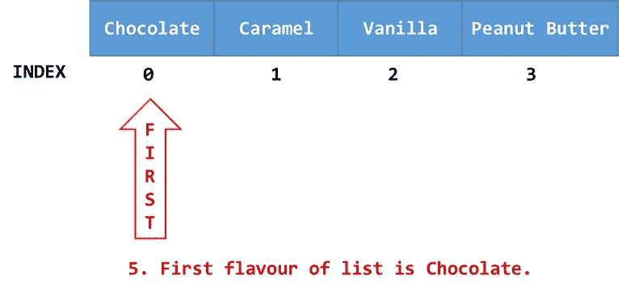****

******图 11:列表中第一种口味的图示。******

****期待巧克力成为清单上的第一种口味。****

****清单的第一种口味应该是**【巧克力】**如图 ***图 11*** 。****

## ****案例 6:单子上的最后一种口味是花生酱****

****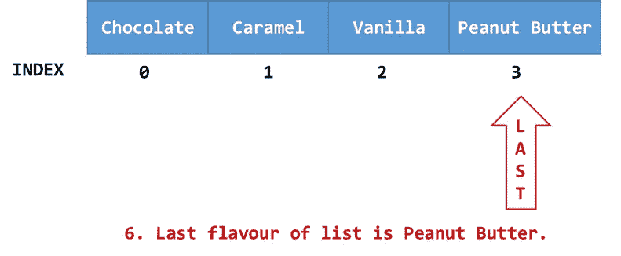****

******图 12:列表中最后一种口味的图示。******

****期待花生酱成为最后一种口味。****

****对于 ***图 12****中给定的情况，我们要求一个不等运算。由于目前不存在这样的方法，我们将**等于**方法包装在 **isNot** 子句中，参见上面的片段。*****

## *****案例 7:列表有两种风格，以字母 C 开头*****

*****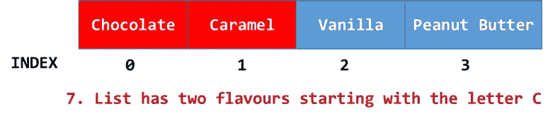*****

*******图 13:列表中带有字母 C 的两种口味的图示*******

*******期待 2 种带有字母 C 的口味*******

*****我们使用列表的 **where** 方法迭代每一种味道，以获得我们想要的结果，然后检查结果的长度是否与 2 完全匹配。(参见 ***图 13*** )*****

## *****情况 8:列表总共有 15 个元音*****

*****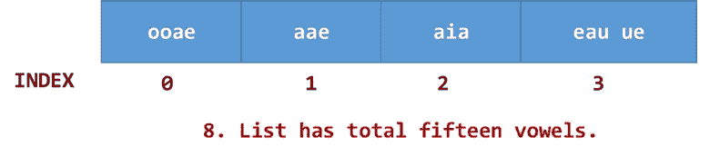*****

*******图 14:列表中十五个元音的图示*******

*******列表中需要 15 个元音字母。*******

*****我们声明一个保存元音的列表，遍历每种味道。使用正则表达式，我们从列表中删除所有辅音，将它们添加到元音列表中，并期望长度正好为 15。(参见至 ***图 14*** )*****

## *****案例 9:列表共有 20 个辅音*****

*****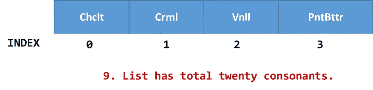*****

*******图 15:列表中二十个辅音的图示*******

*****列表中需要二十个辅音。*****

*****如图 ***图 15*** 所示，我们只需要通过使用相同的先前技术但使用不同的正则表达式去除元音来计数辅音。*****

## *****案例 10:列表不相同*****

*****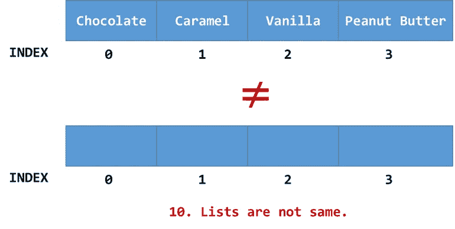*****

*******图 16:不平等列表示意图。*******

*******期待不相等的列表。*******

*****在 ***图 16*** *、*中，似乎很明显，所列的名单并不相同。为了创建测试，我们简单地将 flavours 列表与一个空列表进行比较，并期望它是假的。*****

# *****映射测试用例*****

*****以下是**mapped flavors**变量的测试案例:*****

## *****情况 1:映射不为空*****

*****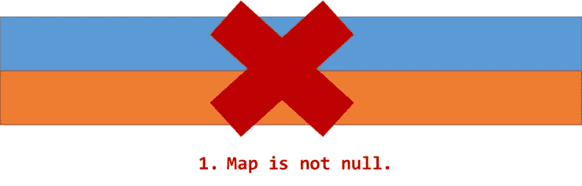*****

*******图 17:非空映射的图示。*******

*******期望一个非空映射*******

*****因为**mapped flavors**是用空条目声明的，所以它不能为空。( ***见图 17*** )*****

## *****情况 2:地图是空的*****

*****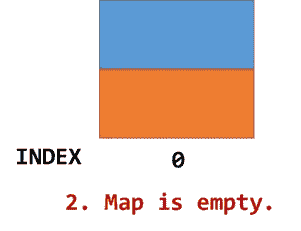*****

*****图 18:一张空地图的插图。*****

*****期待一张空地图。*****

*****要检查地图是否为空(如图 ***图 18*** )，只需调用 **isEmpty** 匹配器。*****

## *****案例 3:映射键是一个字符串*****

*****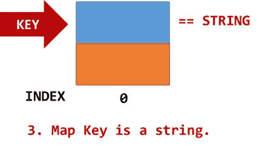*****

*******图 19:地图键的图示。*******

*******预期映射键是字符串。*******

*****为了确认 map 的数据类型是一个字符串，我们比较了键的运行时类型&期望它不匹配其他原始数据类型。(参见 ***图 19*** )*****

## *****案例 4:映射值是布尔值*****

*****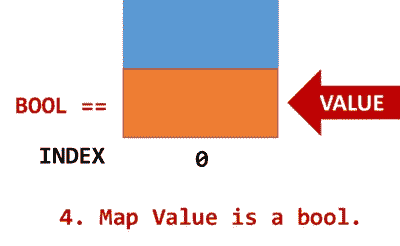*****

*******图 20:地图值图解。*******

*******预期映射值为布尔值。*******

*****在 ***图 20*** 的情况下，应用同样的程序我们也可以检查贴图的值。*****

# *****功能测试案例*****

## *****案例 1: convertToMap 需要一个列表<string>参数</string>*****

*****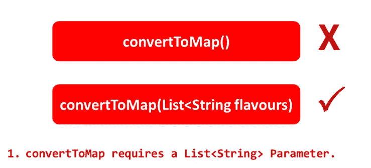*****

*******图 21:所需功能参数的图示。*******

*******需要一个必需的函数参数。*******

*****为了确保函数需要一个参数(如图 ***图 21*** )，我们将它与一个没有参数的自定义函数签名&进行比较，期望它为假。*****

## *****案例 2: convertToMap 返回类型是 MAP*****

*****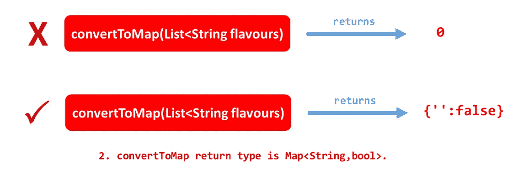*****

*****图 22:有效函数返回类型的图示。*****

*******需要有效的返回类型。*******

*****为了确保函数的返回类型是 **Map < String，bool >** (如 ***figure 22*** )，我们定义了一个具有相同参数签名体的函数。经过比较，我们预计这是真的。*****

## *****案例 3:mapped flavor 不应为空*****

*****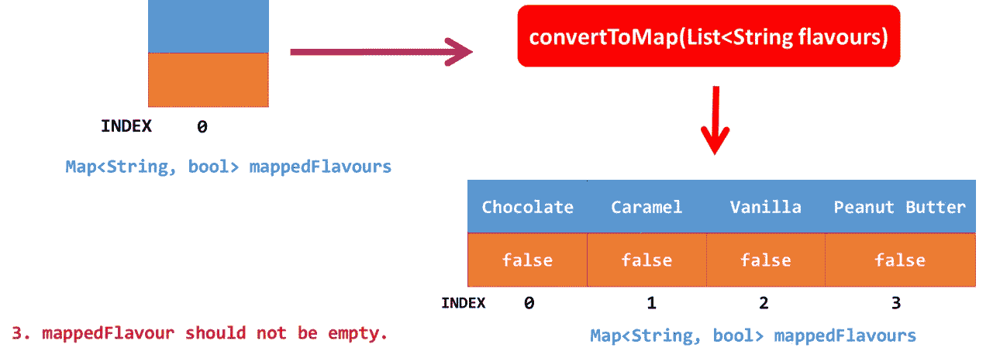*****

*******图 23:函数调用后的地图说明。*******

*******函数调用后需要一个非空的映射。*******

*****在调用 **convertToMap** 函数后，我们期望**mapped flavors**变量不再为空(参见 ***图 23*** )。*****

# *****转换后测试案例*****

*****下面是在调用 **convertToMap** 函数后，对**mapped flavors**进行转换的测试用例。*****

## *****案例 1:mapped flavor 没有樱桃*****

*****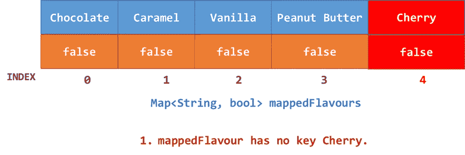*****

*******图 24:无效映射键的图示。*******

*******只需要一个有效的映射键。*******

*****在转换之后，我们期望在映射中不存在无效的键(参见 ***图 24*** *)* )。*****

## *****案例 2:mapped flavor 没有值 0*****

*****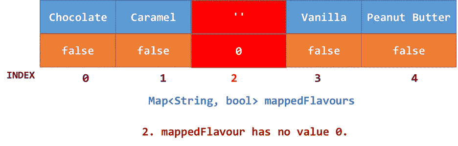*****

*******图 25:无效地图值的图示。*******

*******只需要有效的映射值。*******

*****变换后，我们期望映射中不存在无效值(见 ***图 25*** *)* 。*****

## *****案例 3:mapped flavor 没有空白条目*****

*****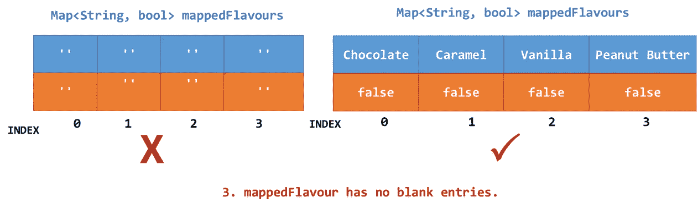*****

*******图 26:无效地图条目的图示。*******

*******需要有效的映射条目。*******

*****在 ***图 26*** 的情况下，我们验证地图的所有条目都不为空。*****

# *****决赛成绩*****

*******完整源代码*******

*****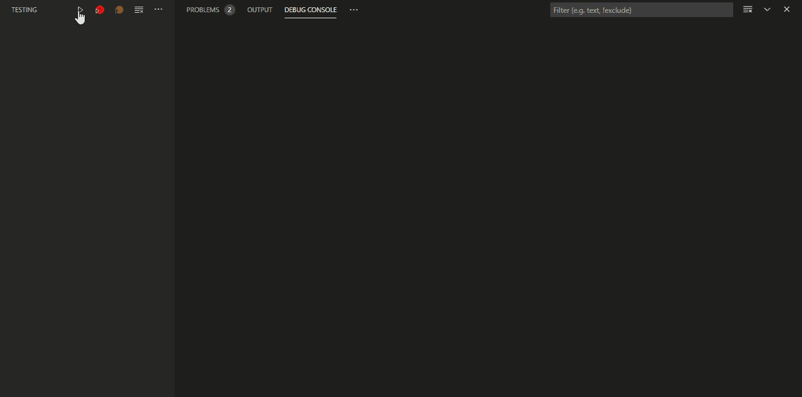*****

*******最终结果*******

# *****等等，还有吗？*****

**********

*****照片由[克莱·勒科尼](https://unsplash.com/@clayleconey?utm_source=medium&utm_medium=referral)在 [Unsplash](https://unsplash.com?utm_source=medium&utm_medium=referral) 上拍摄*****

*****别以为还没完！对于端到端测试部分，我们还有很长的路要走。如果你今天学到了一些东西，那么继续，增强代码，添加更多的测试用例。拉请求在[库](https://github.com/Zujaj/multiple_selection_dialogue_app.git) **⁹** 中最受欢迎。希望不久能在小部件测试阶段见到你…..*****

# *****参考*****

*******【1】:*7 软件测试和质量保证的好处*** [http://www.avantica.com/blog/qa-benefits](http://www.avantica.com/blog/qa-benefits)*****

*******【2】:*实战测试金字塔*** [https://Martin fowler . com/articles/Practical-Test-Pyramid . html](https://martinfowler.com/articles/practical-test-pyramid.html)*****

*******【3】:*Flutter 中的多选对话:一种多才多艺的方法*** [https://level up . git connected . com/Multi-Select-Dialogue-in-Flutter-A-Versatile-Approach](/multi-select-dialogue-in-flutter-a-versatile-approach-69ea0a598bac)*****

*******【4】:*flutter _ test 库—Dart API*** [https://API . flutter . dev/flutter/flutter _ test/flutter _ test-library . html](https://api.flutter.dev/flutter/flutter_test/flutter_test-library.html)*****

*******【5】:*测试函数—颤振 _ 测试库—Dart API*** [https://api.flutter.dev/flutter/flutter_test/test.html](https://api.flutter.dev/flutter/flutter_test/test.html)*****

*******【6】:*期望函数—颤振 _ 测试库—Dart API*** [https://api.flutter.dev/flutter/flutter_test/expect.html](https://api.flutter.dev/flutter/flutter_test/expect.html)*****

*******【7】:*组函数—颤振 _ 测试库—Dart API*** [https://api.flutter.dev/flutter/flutter_test/group.html](https://api.flutter.dev/flutter/flutter_test/group.html)*****

*******【8】:*匹配器库—Dart API*** [https://API . flutter . dev/flutter/package-matcher _ matcher/package-matcher _ matcher-library . html](https://api.flutter.dev/flutter/package-matcher_matcher/package-matcher_matcher-library.html)*****

*******【9】:*多选对话 App Github Repo***
[https://Github . com/Zujaj/Multiple _ Selection _ Dialogue _ App . git](https://github.com/Zujaj/multiple_selection_dialogue_app.git)*****