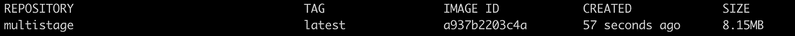
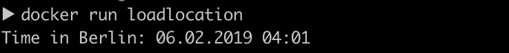

# 使用 Go 模块在 Golang 中构建多级 Docker

> 原文：<https://levelup.gitconnected.com/multi-stage-docker-builds-with-go-modules-df23b7f91a67>

## 一个关于使用 Go 模块构建多阶段 Docker 的教程，以及如何将 Docker 图像大小减少数百兆字节


在本文中，我将向您快速演示如何为使用 Go 模块的 Go 应用程序创建较小的 Docker 映像。您可以在这个[资源库](https://github.com/Niraj-Fonseka/MultiStageDocker)中找到本文的所有代码。

在一个传统的 Docker 构建的 Go 应用程序中，使用 [Golang](https://hub.docker.com/_/golang) 图像是很常见的。虽然这很好，但由于 Golang 图像本身的大小，这些图像往往会非常大。让我们看一个例子，看看我们如何可以减少我们的图像大小数百兆字节。

> 在我的例子中，我将使用 Go 模块进行依赖性管理。如果你对围棋模块不熟悉，可以看看我以前写的关于[围棋模块](https://medium.com/@fonseka.live/getting-started-with-go-modules-b3dac652066d)的文章。

让我们考虑这是我们想要 dockerize 的应用程序。

```
package main

import (
	"fmt"

	randomdata "github.com/Pallinder/go-randomdata"
)

func main() {
	fmt.Println("Running the TestApp")
	fmt.Println(randomdata.SillyName())
}
```

这是我们的文档:

```
FROM golang:1.11.0-stretch 

COPY . /SingleStage 
WORKDIR /SingleStage

ENV GO111MODULE=on

RUN CGO_ENABLED=0 GOOS=linux go build -o SingleStage 

CMD ["./SingleStage"]
```

如您所见，我们使用`golang:1.11`图像作为基础图像来构建我们的应用程序，并且在构建中没有使用`GOPATH`。那是因为 Go 1.11 允许你在`GOPATH`之外构建应用。

现在让我们来构建应用程序。

```
docker build -t singlestagebuild .
```

如果我们运行 docker images 命令并查看图像的大小，我们可以看到，即使是这样一个非常简单的应用程序，大小也接近 800MB。


现在让我们看看如何使用多阶段 Docker 构建来减小图像的大小。在这次演示中，我仍然会使用以前的 Go 应用程序。

这是我们的新文档。

```
#first stage - builderFROM golang:1.11.0-stretch as builderCOPY . /MultiStageWORKDIR /MultiStageENV GO111MODULE=onRUN CGO_ENABLED=0 GOOS=linux go build -o MultiStage#second stageFROM alpine:latestWORKDIR /root/COPY --from=builder /MultiStage .CMD ["./Multistage"]
```

在第一阶段，我们使用的图像与第一个例子中使用的图像相同。唯一的不同是，我没有使用`CMD [“./Multistage”]`，而是使用阿尔卑斯山图像启动第二阶段，并将工作目录设置为`/root/`。然后，我将所有内容从`/MultiStage`目录复制到我们的构建器映像中(多级的二进制文件也在这里)。

我们来搭建一下，看看自己的形象有多大。

```
docker build -t multistage .
```



我们走吧！从 781MB 减少到 8.15MB 是一个巨大的大小差异。

我们用作第二阶段的 Alpine 映像是一个极其轻量级的 Linux 发行版。所以您必须小心，因为您需要确保您的任何 Go 库没有使用任何不包含在 Alpine 映像中的 Linux 内部库/文件，如果使用了，您必须手动添加它们。让我们来看另一个例子，看看它是如何工作的。

在这个例子中，我们试图通过使用时间包中的`LoadLocation()`函数来获得柏林的时间。

```
package main

import (
	"fmt"
	"time"
)

func main() {

	location, err := time.LoadLocation("Europe/Berlin")
	if err != nil {
		fmt.Println(err)
	}

	t := time.Now().In(location)

	fmt.Println("Time in Berlin:", t.Format("02.01.2006 15:04"))
}
```

现在让我们对它进行分类并运行它。

`docker build -t loadlocation .`

```
docker run loadlocation
```

啊哦…


每当我们调用时间包中的`LoadLocation()`函数时，它就会寻找“时区数据库”(`zoneinfo.zip`)，该数据库维护着来自世界各地的时区信息列表。由于 alpine 图像没有这个文件，我们必须手动将它注入到图像中。

```
RUN apk add --no-cache tzdata
```

您可能还需要将 CA 根证书注入到 Alpine 映像中。你可以通过使用`apk`来实现。

```
RUN apk --update add ca-certificates
```

或者从构建器映像复制`ca-certs`(第一阶段)

```
COPY --from=builder /etc/ssl/certs/ca-certificates.crt /etc/ssl/certs/
```

现在我们来看最后的`Dockerfile`。

```
#first stage - builderFROM golang:1.11.0-stretch as builderCOPY . /LoadLocationWORKDIR /LoadLocationENV GO111MODULE=onRUN CGO_ENABLED=0 GOOS=linux go build -o LoadLocation#second stageFROM alpine:latestWORKDIR /root/RUN apk add --no-cache tzdataCOPY --from=builder /etc/ssl/certs/ca-certificates.crt /etc/ssl/certs/COPY --from=builder /LoadLocation .CMD ["./LoadLocation"]
```

最后，让我们构建并运行映像。



完美！

我希望这篇文章能帮助你优化 docker 构建，创建更安全(减少攻击面)、更小(8.15MB 对 781MB)和更干净的映像。

[](https://gitconnected.com/learn/docker) [## 学习 Docker -最佳 Docker 教程(2019) | gitconnected

### 31 大 Docker 教程-免费学习 Docker。课程由开发人员提交并投票，使您能够…

gitconnected.com](https://gitconnected.com/learn/docker) [](https://gitconnected.com/learn/golang) [## 学习围棋-最佳围棋教程(2019) | gitconnected

### 23 大围棋教程-免费学习围棋。课程由开发者提交和投票，使您能够找到…

gitconnected.com](https://gitconnected.com/learn/golang)