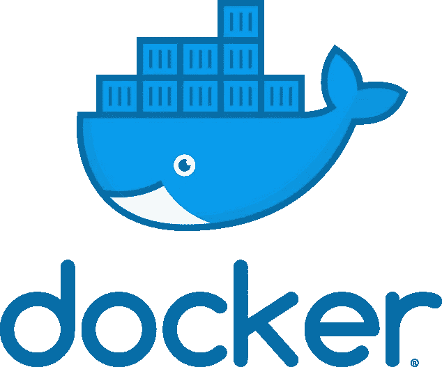
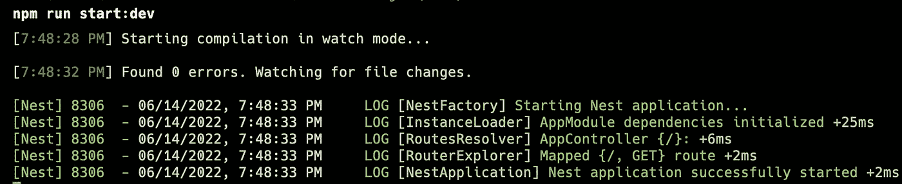
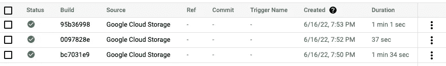
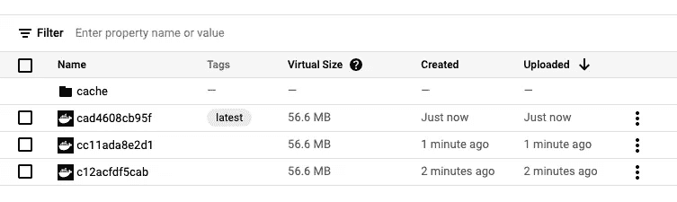
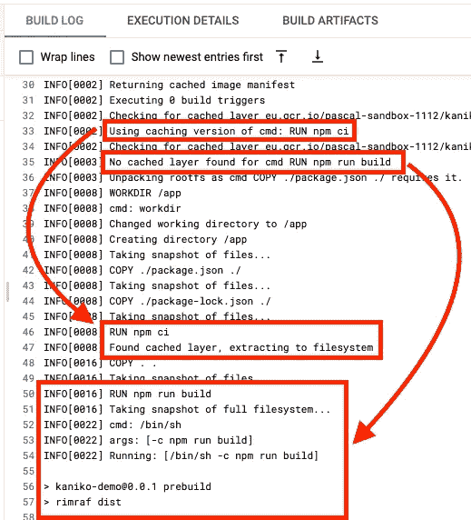

# 使用 Kaniko +云构建的多级 Docker 层缓存

> 原文：<https://levelup.gitconnected.com/multi-stage-docker-layer-caching-using-kaniko-cloud-build-7e46395fb2c2>

简要介绍如何在云构建中使用 Kaniko，并验证多阶段 Docker 映像是否被正确缓存。



# GitHub 知识库

要查看使用的代码，请查看我为本文创建的 [GitHub 库](https://github.com/mr-pascal/medium-cloud-build-kaniko)。

[](https://github.com/mr-pascal/medium-cloud-build-kaniko) [## GitHub-Mr-Pascal/medium-cloud-build-kaniko

### 在 GitHub 上创建一个帐户，为 Mr-Pascal/medium-cloud-build-kaniko 开发做出贡献。

github.com](https://github.com/mr-pascal/medium-cloud-build-kaniko) 

# 设置

如果您想从头开始这个演示，您可以遵循下面的步骤，或者在签出存储库之后直接跳到下面的“构建并运行 Docker 映像”部分。

让我们快速看一下一般的文件结构。对于每一种框架和编程语言，我们需要的通用文件结构看起来都是一样的。

```
|-kaniko-demo
  |- ... // some other files (e.g. src) for the application
  |- Dockerfile
  |- .dockerignore
  |- cloudbuild.yaml
```

*   `kaniko-demo` —应用程序文件夹包含所有源文件、依赖关系定义等。
*   `Dockerfile`—Docker file Docker 和 Kaniko 应该用来构建 Docker 容器
*   `.dockerignore` —该文件定义了在 Docker 构建上下文中要忽略的文件。如果不存在`.gcloudignore`文件，Cloud Build 也会使用该文件来忽略文件。
*   `cloudbuild.yaml` —用于定义云构建应该执行的步骤的 YAML 配置。

让我们从头开始，使用 [Nest.js](https://nestjs.com/) 创建一个新的简单 web 服务器。当然，你可以自由选择任何你想要的编程语言或框架。

```
// Create new Nest.js app
nest new kaniko-demo
```

接下来，通过`npm run start:dev`运行应用程序，以验证它正在工作。它应该在端口 3000 启动一个 web 服务器，并且可以通过`localhost:3000`访问。



npm 运行开始:开发

之后，在 Nest.js `kaniko-demo`文件夹中添加一个`Dockerfile`和`.dockerignore`文件。

`Dockerfile`应该包含一个多阶段构建，以便稍后展示多阶段层缓存正在工作。如果不是使用 Nest.js，必须自带多级 Dockerfile。

## 构建并运行 Docker 映像

您可以使用以下命令在本地机器上构建并运行 Docker 映像。首先，确保您在 docker 文件所在的应用程序文件夹中。

```
# Build "kaniko-demo" app on your local machine
docker build -t kaniko-demo .# Run local container in detached mode
docker run -d -p 3000:3000 kaniko-demo
```

然后，您可以在`localhost:3000`打开您的浏览器，并验证您的服务器已经启动并正在运行，正在为请求提供服务。

## 转向云构建

接下来，让我们在云构建上构建这个 Docker 映像。

首先，您应该通过以下命令在您的计算机上设置默认的 GCP 项目:

```
# Set GCP project
gcloud config set project <project>
```

或者，您可以在实际的`gcloud builds submit`命令上添加`--project <project>`标志，为执行的命令显式地设置项目。

接下来，让我们定义`cloudbuild.yaml`，并将这个文件添加到应用程序文件夹，这样 Cloud Build 就知道它应该在哪个上下文中运行哪个命令。

值得注意的是，默认情况下，Kaniko 会搜索一个用于构建映像的`Dockerfile`文件。如果您的文件命名不同，您需要通过`--dockerfile=Dockerfile`向 Kaniko 容器提供它应该使用的文件。

现在，让我们最后在云构建上运行构建步骤。接下来，您会看到命令的一般签名，以及一些预先填充的有效值。

```
## Build "kaniko-demo" app on Cloud Build# General signature
gcloud builds submit --region <region> \
  --config <path_to_cloudbuild_yaml> \
  <path_to_build_context># Build "kaniko-demo" app on Cloud Build
gcloud builds submit --region europe-west2 \
  --config cloudbuild.yaml \
  .
```

我执行了以下操作来验证多阶段是否按预期进行了缓存。

1.  通过以下方式构建映像→请注意，这花费了大约 1 分 34 秒
2.  重建图像，不做任何改变→时间下降到 37 秒
3.  在`src/app.service.ts`文件中做了一个更改，保存了更改，并第三次构建了映像→注意，现在构建花了 1m 秒。

在下面的两张图片中，您可以看到我刚刚提到的构建的持续时间；推送至 GCR 的 Docker 图像和 Kaniko 存储缓存图层的“缓存”文件夹。



云构建构建时间



Google 容器注册表——内置图像

为了验证云构建不仅仅是因为不同的 CPU 容量或其他原因而有一些快速和慢速的构建，让我们更深入地挖掘上一次构建的构建日志。

我在构建日志中标记了两个重要部分，以显示多阶段缓存是可行的。

第一个是`Using caching version of cmd: RUN npm ci`和`Found cached layer, extracting fo filesystem`。这些行表明 Kaniko 找到了一个用于安装 NPM 依赖项的缓存层并使用了它。

类似，但是另一边也有日志`No cached layer found for cmd RUN npm run build`，我们可以看到日志中执行了`RUN npm run build`语句。

上面提到的代码行验证了 Kaniko 缓存了我们的多阶段 Docker 映像的构建阶段。



云构建日志

## 你想联系吗？

如果你想联系我，请在 LinkedIn 上打电话给我。

另外，请随意查看我的书籍推荐📚。

[](https://mr-pascal.medium.com/my-book-recommendations-4b9f73bf961b) [## 我的书籍推荐

### 在接下来的章节中，你可以找到我对所有日常生活话题的书籍推荐，它们对我帮助很大。

mr-pascal.medium.com](https://mr-pascal.medium.com/my-book-recommendations-4b9f73bf961b) [](https://mr-pascal.medium.com/membership) [## 通过我的推荐链接加入 Medium—Pascal Zwikirsch

### 作为一个媒体会员，你的会员费的一部分会给你阅读的作家，你可以完全接触到每一个故事…

mr-pascal.medium.com](https://mr-pascal.medium.com/membership)